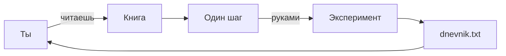
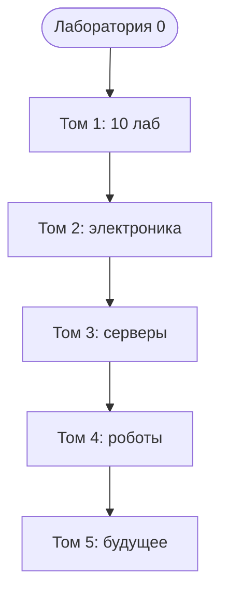

# ENGINEERING ROADMAP
## Том 1 · Лаборатория №0 — Добро пожаловать в инженерную лабораторию

> **Открытие лаборатории** · Миссия дня

---

## 📡 История

Сегодня ты открываешь **пустую комнату** — будущую инженерную лабораторию. Рядом **никого**: ни родителей, ни учителя, ни программиста. Есть **ты**, **экран** и **эта книга**.

Привет. Я — **эта книга**. Не робот и не учитель в классе. Веду **шаг за шагом**, как инженер рядом — только **ты и экран**.

**Если ты никогда не учился инженерии сам — это нормально.** Большинство взрослых тоже не умеют то, что ты сделаешь за год.

---

## 🚀 Миссия

**Научиться учиться как инженер** — и подготовить **Moja_Laboratoria** + **dnevnik** для **всех лабораторий Тома 1** (и дальше — всей академии).

---

## 🎯 Цель

- понять **правила игры**, безопасность и порядок лабораторий;
- создать **dnevnik** и папку проектов;
- сделать **первые эксперименты** — без страха и без взрослых.

**Результат:** папка `Moja_Laboratoria`, файл `dnevnik.txt`, **паспорт** компьютера (CPU + RAM), **карта Wi‑Fi** на бумаге.

---

## ⏱ Время

40–60 минут (можно **2 дня** по 25–30 мин).

---

## 🧰 Что понадобится

- [ ] Ноутбук или ПК (Windows / Mac / Linux)
- [ ] Ручка и бумага для карты Wi‑Fi
- [ ] 15 минут тишины
- [ ] Готовность **писать** в dnevnik, а не «запомнить»

---

## 🤔 Как ты думаешь?

**Не читай ответ сразу.**

1. Зачем инженер NASA пишет отчёты, а не «запоминает в голове»?
2. Кто будет делать проекты — **ты** или книга?
3. Можно ли пропустить dnevnik и «вспомнить потом»?

*(Запиши ответы в dnevnik. Потом сверься.)*

**Настоящее объяснение:** инженер **записывает**, чтобы через месяц **помнить**, как чинил. Книга **объясняет** — **делаешь ты**. Без dnevnik ошибки **повторяются**.

---

## 💡 Аналогия

**Книга** = **GPS для похода**. Без GPS можно заблудиться. С GPS ты **идёшь сам** — но **не теряешься**.

| В жизни | В лаборатории |
|---------|---------------|
| GPS | Эта книга |
| Тропа | Один шаг за раз |
| Дневник похода | `dnevnik.txt` |

**Инженер vs обычный человек:** телефон не заряжается.

| Обычный | Инженер |
|---------|---------|
| «Сломан. Выбросить.» | «Кабель? Разъём? Блок питания?» |
| Сдаётся | **Проверяет по очереди** |

### 😲 ВАУ!

Google **начинался** в гараже — с **записей** и **любопытства**, как твой dnevnik сегодня.

### 😄 Момент улыбки

Книга **не** сделает проект за тебя. Как GPS **не** идёт за тебя по лесу — только **показывает**, куда шаг.

---

## 📷 Иллюстрация

📷 **[Для художника]**

**ID:**  
ILL-T1-L0-01

**Название:**  
Открытие инженерной лаборатории

**Тип иллюстрации:**  
Сюжетная сцена · домашняя лаборатория · establishing shot

**Главная цель иллюстрации:**  
Показать момент «первого дня»: ребёнок один в своей комнате-лаборатории, перед ним — книга EduMost на экране и тетрадь Moja_Laboratoria. Зритель должен понять: инженерный путь начинается **здесь**, в тишине, без класса и без взрослого над плечом.

Что ребёнок должен почувствовать: **спокойное любопытство**, «я могу», тёплую уверенность. Не экзамен, не страх, не хаос.

---

**Описание сцены**

Вечер в **домашней комнате** юного инженера (не школьный класс). За **деревянным столом** сидит главный герой серии Engineering Roadmap. Перед ним **открытый ноутбук**: на экране — стилизованная **цифровая книга** (разворот с заголовком и иконками блоков, **без читаемого текста** — только цветные полосы и пиктограммы).

На столе справа от ноутбука — **тетрадь в мягкой обложке** тёпло-янтарного цвета; на обложке **нет букв** — только простой **символ шестерёнки** или **схематичный блокнот**. Рядом — **ручка** с зелёным корпусом, **лист бумаги** с карандашным наброском **схемы Wi‑Fi** (точки и линии, **без слов**).

На заднем плане — **полка** с несколькими нейтральными предметами (коробка, кабель в мотке, маленькая кактус в горшке). **Окно** слева — вечернее небо **сине-фиолетовое**, **одна** стилизованная крыша соседнего дома (намёк на Европу, **не** узнаваемый Poznań).

**Что делает герой:** смотрит на экран книги, **правая рука** лежит на тетради — готов писать в dnevnik. Поза **собранная**, не напряжённая.

**Что НЕ должно появляться:** родители, учитель, одноклассники, школьная доска, форменная одежда, логотипы брендов, Minecraft, оружие, провода 230V в розетке, месс на столе, телефон с соцсетями.

---

**Главный герой**

- **Возраст:** 11 лет  
- **Внешность:** узнаваемый герой серии — короткие **тёмно-каштановые** волосы, лёгкая **чёлка**, светлая кожа, **веснушки** на носу (фирменная деталь серии)  
- **Одежда:** **тёмно-зелёный** худи без надписей, **серые** джоггеры, носки; **не** школьная форма  
- **Поза:** сидит прямо, слегка наклонён к экрану (~15°)  
- **Выражение лица:** сосредоточенное, **мягкая** улыбка «интересно»  
- **Эмоция:** спокойное ожидание открытия  
- **Взгляд:** на экран ноутбука (книгу), **не** в камеру  

---

**Дополнительные персонажи**

Нет. Комната пуста — по сюжету лаборатории «рядом никого».

---

**Окружение**

- **Тип:** домашняя комната / будущая мастерская  
- **Стены:** светло-серые или тёплый беж  
- **Мебель:** простой стол, стул со спинкой, низкая полка  
- **Детали:** ноутбук (серебристый, тонкий), тетрадь, ручка, бумага, кактус, моток кабеля в коробке  
- **Атмосфера:** уютная европейская квартира, **не** хай-тек лаборатория NASA  

---

**Композиция**

- **Формат кадра:** 16:9, горизонтальный  
- **План:** средний (по пояс героя + стол)  
- **Передний план:** тетрадь и ручка (чуть крупнее, **янтарный** акцент)  
- **Средний план:** лицо героя, ноутбук  
- **Задний план:** полка, окно — **мягкий** blur или упрощённые формы  
- **Линия взгляда читателя:** 1) тетрадь → 2) экран книги → 3) лицо героя  
- **Правило третей:** герой слева, ноутбук по центру, тетрадь на пересечении нижней и правой трети  

---

**Освещение**

- **Тип:** смешанный — тёплый **настольный** свет (лампа за кадром справа) + холодный **от экрана**  
- **Время суток:** ранний вечер (сумерки за окном)  
- **Характер:** тёплый доминирует на коже и столе; экран даёт **мягкий** зеленоватый отблеск  
- **Тени:** мягкие, **не** драматичные; под столом лёгкая тень  

---

**Цветовая палитра**

- **Основные:** `#2D6A4F` (зелёный EduMost), `#F4A261` (янтарь тетради), `#F8F9FA` (светлый фон)  
- **Дополнительные:** `#457B9D` (вечернее окно), `#6C757D` (серый ноутбук)  
- **Настроение:** тёплое, спокойное, **не** кислотное  

---

**Стиль**

Единый стиль **EduMost** · современная европейская детская образовательная книга.  
Уровень визуальной культуры: **DK · Usborne · No Starch Press**.  
Чистая **цифровая векторная** иллюстрация. Мягкие формы, аккуратные контуры 2–3 px.  
**Без:** аниме, манги, Pixar, Disney, фотореализма, 3D-рендера, пластикового глянца, кислотных неонов.

---

**Возрастная адаптация**

- **Возраст читателя:** 11–14 лет  
- **Можно:** один ребёнок, техника «дружелюбная», вечер дома  
- **Нельзя:** опасность, одиночество-тревога, тёмный хоррор, взрослые «контролёры», оружие, кровь, откровенный интернет-контент на экране  

---

**Формат**

- **Файл:** SVG  
- **Соотношение:** 16:9  
- **Детализация:** высокая — читаемо в печати A5 и на Web  
- **Цветовой режим:** RGB для Web; слои для возможной CMYK-печати  

---

**Текст**

На изображении **текста быть НЕ должно**: ни букв, ни цифр, ни логотипов, ни водяных знаков, ни подписей «Moja_Laboratoria» — тетрадь узнаётся **формой и цветом**, не надписью.

---

**Негативный prompt**

водяные знаки · подписи · логотипы · бренды · артефакты AI · лишние руки · лишние пальцы · лишние предметы · взрослые люди · страшные лица · оружие · кровь · хоррор · агрессия · плохая анатомия · размытость · шум · низкое качество · аниме · манга · Pixar · Disney · фотореализм · 3D · неон · школьный класс · форменная одежда

---

**Связь с лабораторией**

Лаборатория №0 — **открытие**: ребёнок встречается с книгой и готовит **Moja_Laboratoria**. Иллюстрация фиксирует этот порог — «я инженер, и мой путь начинается за этим столом».

```
  ТЫ ●────► Лаб.1 ──► Лаб.2 ──► ... ──► Лаб.9 (Minecraft)
              │
              ╳  Том 2 (LED) — РАНО, если не сделан Том 1
```

---

## 📊 Mermaid





---

## 🔬 Эксперимент

**Правило:** минимум **№1, №2 и №3**. Без них лаборатория **не засчитана**.

---

### Эксперимент 1 — «Паспорт компьютера»

**⏱** 10 мин

**Windows:** Win → **Параметры** → **Система** → **О системе** → **Процессор** и **ОЗУ**.

**Mac:**  → **Об этом Mac**.

**Linux:** `Ctrl+Alt+T`:

```bash
lscpu
free -h
```

| Команда | Что делает | Как проверить |
|---------|------------|---------------|
| `lscpu` | Паспорт **CPU** | Видишь модель процессора |
| `free -h` | Сколько **RAM** | Строка с GB |

**Почему?** Компьютер **хранит** данные о себе — OS их **читает**.

**✅ Проверь себя:** в dnevnik есть **CPU** и **RAM (GB)**?

---

### Эксперимент 2 — «Карта Wi‑Fi дома»

**⏱** 15 мин

Нарисуй на бумаге: **роутер** в центре, линии к телефону, ноутбуку, TV, твоему ПК.

**Почему?** В **Лаборатории №7** (сеть) эта карта — половина решения «не коннектится».

**✅ Проверь себя:** на рисунке есть слово **«роутер»**?

---

### Эксперимент 3 — «Папка Moja_Laboratoria»

**⏱** 5 мин

**Windows:** рабочий стол → правая кнопка → **Создать** → **Папку** → `Moja_Laboratoria` → внутри **текстовый документ** → `dnevnik.txt` (проверь: **не** `dnevnik.txt.txt`).

**Mac:** Finder → Рабочий стол → **Новая папка** → TextEdit → **Обычный текст** → `dnevnik.txt`.

**Linux:**

```bash
mkdir -p ~/Moja_Laboratoria
nano ~/Moja_Laboratoria/dnevnik.txt
```

| `mkdir -p` | **Создаёт папку** | `ls ~/Moja_Laboratoria` |
| `nano` | Редактор текста | `Ctrl+O` сохранить, `Ctrl+X` выход |

**Почему?** Все проекты — **в одном месте**, как полка в мастерской.

**✅ Проверь себя:** открыл папку — видишь **dnevnik.txt**?

---

### Эксперимент 4 — «Три вопроса инженера»

**⏱** 10 мин

Напиши в dnevnik **3 вопроса** про технику, например:
1. Чем Linux отличается от Windows?
2. Как друг зайдёт на мой Minecraft-сервер?
3. Почему LED не горит без резистора?

**Почему?** Список неизвестного — привычка NASA перед миссией.

**✅ Проверь себя:** **ровно 3** вопроса, не про «как стать богатым»?

---

### Эксперимент 5 — «Клад для разбора»

**⏱** 15 мин

Найди **безопасный** мёртвый предмет: старый DVD-привод, мёртвая мышь (**не** блок питания принтера, **не** единственный ноутбук).

**Почему?** Позже разберёшь — бесплатная «анатомия» техники.

**✅ Проверь себя:** предмет **не** в розетке 230V?

---

## ⚠ Типичные ошибки

| Проблема | Как исправить |
|----------|---------------|
| «Прочитаю 5 лабораторий, потом начну» | Одна лаборатория → **одно действие** → dnevnik |
| Имя `dnevnik.txt.txt` | Убери лишний `.txt` |
| Пропустить dnevnik | 30 секунд записи **сейчас** |
| Лезть в розетку 230V | **Никогда.** Только 3V/5V из книги |
| LED без резистора (Том 2) | Сначала **закрой Том 1** |
| Разбирать **единственный** рабочий ПК | Только **VirtualBox** или **мёртвая** техника |
| LED **без резистора** | Сгорит за секунду — **только** с 330 Ω (позже) |
| Блок питания **принтера** | **Не трогать** — остаётся заряд |

---

## 🧪 Проверь себя

- [ ] `Moja_Laboratoria` **создана**
- [ ] `dnevnik.txt` **есть** и **≥ 2** записи
- [ ] CPU и RAM **в dnevnik**
- [ ] Карта Wi‑Fi **нарисована**
- [ ] Первый вопрос инженера — **«Почему?»** (не «сломано»)

---

## 📝 Запись в инженерный дневник

```
=== LAB №0 ===
Data: ___
Co zrobiłem:
  - Moja_Laboratoria: TAK/NIE
  - dnevnik.txt: TAK/NIE
  - CPU: ___
  - RAM: ___ GB
  - Mapa Wi-Fi: TAK/NIE
  - 3 pytania: TAK/NIE
Co było trudne:
Co zmieniłbym:
Następny pomysł:
```

---

## 🏆 Что теперь умеешь

- [ ] Объяснить, **зачем** инженерный dnevnik
- [ ] Создать **Moja_Laboratoria** и **dnevnik.txt**
- [ ] Прочитать **паспорт** CPU и RAM
- [ ] Нарисовать **карту Wi‑Fi**
- [ ] Задавать **«Почему?»** вместо «не работает»

---

## ➡ Что дальше

**Следующий файл:** `01_LAB_KOMPUTER.md` — **Лаборатория №1:** что внутри коробки.

**Перед переходом:**

- [ ] Moja_Laboratoria + dnevnik — **обязательно**
- [ ] Паспорт CPU/RAM в dnevnik — **обязательно**
- [ ] Блок **LAB №0** заполнен — **обязательно**
- [ ] Эксп. 4 и 5 — **рекомендуется**

**Если обязательные галочки пустые — не открывай Лабораторию №1.**

### 🔮 Вопрос без ответа

Ты нажал кнопку — экран загорелся. **Как** нажатие превращается в **картинку**? Кто **первый** в цепочке внутри коробки?

**Ответ — в Лаборатории №1.**

---

*Закрой книгу. Открой `dnevnik.txt` — первая запись инженера уже там.*
