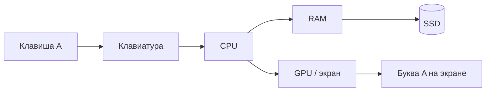

# ENGINEERING ROADMAP
## Том 1 · Лаборатория №1 — Компьютер

> **Внутри коробки** · Миссия дня

---

## 📡 История

В **Лаборатории №0** ты создал dnevnik и нарисовал карту Wi‑Fi. Остался вопрос из интриги: нажал кнопку — **экран загорелся**. **Как**?

Сегодня в лабораторию поступила **коробка с надписью «Компьютер»**. Задача — **разложить** её на части, как инженер, **не ломая** единственный рабочий ноутбук.

---

## 🚀 Миссия

**Разобрать** (на бумаге и в экспериментах) цепочку: **клавиша → процессор → RAM → SSD → экран**.

---

## 🎯 Цель

- понять **4 главные части**: CPU, RAM, SSD, материнская плата;
- нарисовать **цепочку** «буква A на экране»;
- проверить **RAM** и **место на диске** на своём ПК.

**Результат:** схема в dnevnik, паспорт железа дополнен, **≥ 20 GB** свободного места проверено.

---

## ⏱ Время

45–60 минут (можно **2 дня** по 25–30 мин).

---

## 🧰 Что понадобится

- [ ] `Moja_Laboratoria` и `dnevnik.txt` (Лаб. №0)
- [ ] Блок **LAB №0** заполнен
- [ ] Ручка / редактор для схемы
- [ ] **Старый** мёртвый прибор для разбора **или** только рисунок (если нет — нормально)

---

## 🤔 Как ты думаешь?

**Не читай ответ сразу.**

1. Когда ты открываешь Minecraft — данные **сразу** с диска или **сначала** в «быстрой памяти»?
2. Что **быстрее**: SSD или HDD?
3. Процессор — это «мозг» или «руки»?

**Настоящее объяснение:** **CPU** считает. **RAM** — рабочий стол (быстро, но пропадает при выключении). **SSD** — шкаф (медленнее RAM, но **хранит**). **Материнская плата** — дорога между всеми.

---

## 💡 Аналогия

**Кухня:**

| Кухня | Компьютер |
|-------|-----------|
| Повар | **CPU** |
| Разделочный стол | **RAM** |
| Холодильник + шкаф | **SSD / HDD** |
| Стол + плита + розетки | **Материнская плата** |

### 😲 ВАУ!

Первый ENIAC был **слабее** твоего телефона — но **та же** идея: CPU + память + хранение.

### 😄 Момент улыбки

RAM — как **стол**: выключил свет (ПК) — на столе **пусто**. SSD — как **шкаф**: закрыл кухню — **осталось**.

---

## 📷 Иллюстрация

📷 **[Для художника]**

**ID:**  
ILL-T1-L1-01

**Название:**  
Цепочка «буква A»

**Тип иллюстрации:**  
Сюжетная сцена · POV от первого лица · образовательная схема от руки

**Главная цель иллюстрации:**  
Показать **путь одной буквы** от нажатия клавиши до появления на экране — не как абстрактную «магию компьютера», а как **цепочку звеньев**, которую ребёнок сам нарисовал в dnevnik. Зритель должен понять: компьютер — это **последовательность шагов**, а не чёрный ящик.

Что ребёнок должен почувствовать: **«я понимаю, что происходит»**, любопытство к внутренностям, гордость за свою схему.

---

**Описание сцены**

Ракурс **сверху на стол** — **от первого лица** (POV): видны **руки** главного героя, **лист бумаги** формата A4 и **край клавиатуры** ноутбука слева. На листе — **карандашная схема**, нарисованная от руки (стиль «инженерный набросок в тетради»):

- Слева — **стилизованный палец**, нажимающий на **клавишу** (квадрат с **одной** крупной буквой **A** — единственный допустимый символ на схеме, как **результат**, не подпись)
- Стрелки ведут через **иконки-метафоры**: **CPU** — круг с «шестерёнкой» внутри; **RAM** — прямоугольный «стол» с маленькими блоками; **SSD** — «шкаф» с полками; **экран** — маленький прямоугольник с **буквой A**
- Стрелки **чёткие**, карандашные, **без слов** под звеньями — узнаваемость через **форму иконок**, не текст

Справа от листа — **открытая тетрадь** тёпло-янтарного цвета (символ шестерёнки на обложке, **без букв**). **Ручка** с зелёным корпусом в правой руке героя — только что закончил линию стрелки.

На заднем плане (размыто) — **экран ноутбука** с **крупной буквой A** (связь «нарисовал путь → вижу результат»). **Не** показывать весь ноутбук целиком — фокус на **листе и руках**.

**Что делает герой:** рисует последнюю стрелку к «экрану» на схеме; **левая рука** придерживает лист.

**Что НЕ должно появляться:** читаемые подписи CPU/RAM/SSD словами, логотипы Intel/AMD, внутренности ПК «как фото», взрослые, Minecraft, оружие, месс на столе.

---

**Главный герой**

- **Возраст:** 11 лет  
- **Внешность:** узнаваемый герой серии — короткие **тёмно-каштановые** волосы (видны сверху — макушка и прядь), **веснушки** (если виден профиль при наклоне)  
- **Одежда:** рукава **тёмно-зелёного** худи (видны только руки и запястья)  
- **Поза:** наклонён над листом, POV  
- **Выражение лица:** не в кадре (POV) или край профиля — **сосредоточенность**  
- **Эмоция:** «сейчас доделаю схему»  
- **Взгляд:** на лист  

---

**Дополнительные персонажи**

Нет. Только руки героя и стол.

---

**Окружение**

- **Тип:** домашний стол в комнате-лаборатории  
- **Поверхность:** светлое дерево или бежевый стол  
- **Предметы:** лист A4, тетрадь, ручка, край клавиатуры, угол экрана ноутбука  
- **Атмосфера:** дневной свет, учебный момент **без** школы  

---

**Композиция**

- **Формат кадра:** 16:9, горизонтальный  
- **План:** крупный — **вид сверху** на лист (занимает ~60% кадра)  
- **Передний план:** схема на листе, рука с ручкой  
- **Средний план:** тетрадь, клавиатура  
- **Задний план:** размытый экран с буквой A  
- **Линия взгляда читателя:** 1) буква A на «экране» в схеме 2) стрелки 3) тетрадь сбоку  
- **Правило третей:** лист по центру; тетрадь — нижняя правая треть  

---

**Освещение**

- **Тип:** мягкий **дневной** слева (окно за кадром)  
- **Время суток:** послеобеденное  
- **Характер:** равномерный на листе; лёгкая тень от руки  
- **Тени:** мягкие, **не** контрастные  

---

**Цветовая палитра**

- **Основные:** `#F8F9FA` (бумага), `#2D6A4F` (зелёный EduMost — ручка, акценты), `#F4A261` (янтарь тетради)  
- **Дополнительные:** `#6C757D` (карандаш, контуры схемы), `#457B9D` (экран ноутбука)  
- **Настроение:** светлое, **ясное**, «я рисую и понимаю»  

---

**Стиль**

Единый стиль **EduMost** · современная европейская детская образовательная книга.  
Уровень визуальной культуры: **DK · Usborne · No Starch Press**.  
Чистая **цифровая векторная** иллюстрация. Схема на листе — **чуть** «от руки» (неровные линии), остальное — аккуратный вектор.  
**Без:** аниме, манги, Pixar, Disney, фотореализма, 3D-рендера, кислотных неонов.

---

**Возрастная адаптация**

- **Возраст читателя:** 11–14 лет  
- **Можно:** POV, простые иконки-метафоры, одна буква A как результат  
- **Нельзя:** сложные микросхемы «как учебник вуза», страшные провода, взрослые, оружие  

---

**Формат**

- **Файл:** SVG  
- **Соотношение:** 16:9  
- **Детализация:** высокая — схема читаема в печати A5  
- **Цветовой режим:** RGB для Web; слои для CMYK  

---

**Текст**

На изображении **текста быть НЕ должно**: ни подписей «CPU», «RAM», «SSD», ни слов на тетради — только **иконки-метафоры** и **одна буква A** на схеме и экране как **символ результата**, не как типографская подпись блока.

---

**Негативный prompt**

водяные знаки · подписи · логотипы · бренды · Intel · AMD · артефакты AI · лишние руки · лишние пальцы · взрослые · страшные лица · оружие · фотореализм · 3D · аниме · Pixar · неон · читаемый мелкий текст · школьный класс

---

**Связь с лабораторией**

Лаборатория №1 — **компьютер**: ребёнок строит **ментальную модель** «что происходит, когда я нажимаю A». Иллюстрация = его **собственная схема** в dnevnik, мост к Mermaid и экспериментам с клавиатурой.

```
Клавиша → USB → CPU → RAM → SSD → GPU → Экран
   ↑___________________________________|
              (цикл «обновить картинку»)
```

---

## 📊 Mermaid



---

## 🔬 Эксперимент

**Правило:** минимум **№1, №2 и №3**.

---

### Эксперимент 1 — «Цепочка буквы A»

**⏱** 15 мин

Нарисуй **6 стрелок**: палец → клавиатура → CPU → RAM → SSD → экран.

**Почему?** Инженер **не** говорит «магия» — он **рисует путь**.

**✅ Проверь себя:** на схеме **все 6** звеньев подписаны?

---

### Эксперимент 2 — «RAM под нагрузкой»

**⏱** 10 мин

**Windows:** Ctrl+Shift+Esc → **Диспетчер задач** → **Производительность** → **Память**.

**Linux:** `free -h`

| `free -h` | Сколько **RAM** занято / свободно | Строки с `Mem` |

Открой **2–3** вкладки браузера. Снова посмотри RAM.

**Почему?** RAM = **стол** — больше программ = **больше** занято.

**✅ Проверь себя:** записал **до** и **после** в dnevnik?

---

### Эксперимент 3 — «Место на диске»

**⏱** 5 мин

**Windows:** «Этот компьютер» → диск C: → **Свободно ___ GB**.

**Linux:** `df -h /`

**Почему?** Для **Linux-сервера** (Лаб. №3) нужно **≥ 20 GB** свободно.

**✅ Проверь себя:** число **GB** в dnevnik?

---

### Эксперимент 4 — «Карта портов»

**⏱** 10 мин

Найди на ноутбуке: USB, HDMI, разъём питания, (если есть) Ethernet.

**Почему?** Порты = **двери** в коробку — серверу нужен **Ethernet** (Лаб. №7).

**✅ Проверь себя:** нарисовал **≥ 3** порта?

---

### Эксперимент 5 — «Загляни внутрь» (безопасно)

**⏱** 15 мин

Только **мёртвый** DVD/HDD/мышь из Лаб. №0. **Не** единственный ноутбук. **Не** блок питания принтера.

**Почему?** Увидеть **плату** — как анатомию.

**✅ Проверь себя:** предмет **отключён** от 230V?

---

## ⚠ Типичные ошибки

| Проблема | Как исправить |
|----------|---------------|
| Разбирать **единственный** школьный ноутбук | Только **рисунок** или **мёртвая** техника |
| Путать RAM и SSD | RAM = **стол**, SSD = **шкаф** |
| «CPU = видеокарта» | GPU **отдельно** (или внутри CPU на ноутбуке) |

---

## 🧪 Проверь себя

- [ ] Схема «буква A» **в dnevnik**
- [ ] RAM **до/после** записана
- [ ] Свободно на диске **≥ 20 GB** (или знаешь, что мало — план)
- [ ] Могу объяснить **CPU / RAM / SSD** одной фразой каждый

---

## 📝 Запись в инженерный дневник

```
=== LAB №1 ===
Data: ___
Co zrobiłem:
  - Schemat A: TAK/NIE
  - RAM przed/po: ___ / ___
  - Wolne GB na dysku: ___
  - Porty narysowane: TAK/NIE
Co było trudne:
Co zmieniłbym:
Następny pomysł:
```

---

## 🏆 Что теперь умеешь

- [ ] Нарисовать **цепочку** от клавиши до экрана
- [ ] Объяснить **CPU, RAM, SSD, материнскую плату**
- [ ] Проверить **RAM** и **место на диске**
- [ ] **Безопасно** выбрать объект для разбора

---

## ➡ Что дальше

**Следующий файл:** `02_LAB_TERMINAL.md` — **Лаборатория №2:** говорить с компьютером **словами**.

- [ ] Схема + RAM + диск в dnevnik — **обязательно**
- [ ] LAB №1 заполнен — **обязательно**
- [ ] Эксп. 4–5 — **рекомендуется**

### 🔮 Вопрос без ответа

Компьютер понимает **числа**. Как **ты** можешь ему **приказывать словами**?

**Ответ — в Лаборатории №2.**

---

*Закрой крышку «коробки». Завтра — **чёрное окно**, которое не кусается.*
