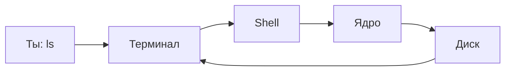

# ENGINEERING ROADMAP
## Том 1 · Лаборатория №2 — Терминал

> **Говори с компьютером словами** · Миссия дня

---

## 📡 История

В **Лаборатории №1** ты разложил коробку на части. Остался вопрос: компьютер понимает **числа** — как **приказывать** ему **словами**?

Сегодня поступило **чёрное окно с курсором**. Так работают Google, NASA и твой будущий **сервер**.

---

## 🚀 Миссия

**Открыть терминал** и **безопасно** выполнить первые команды — `pwd`, `ls`, `cd`, `mkdir` — **без мышки**.

---

## 🎯 Цель

- понять **терминал → shell → ядро**;
- дойти до `Moja_Laboratoria` **текстом**;
- **не бояться** ошибок.

**Результат:** команды в dnevnik, `pwd` и `ls` работают.

---

## ⏱ Время

45–60 мин (можно **2 дня** по 25–30 мин).

---

## 🧰 Что понадобится

- [ ] `Moja_Laboratoria` (Лаб. №0)
- [ ] Linux **или** Windows (есть путь **1W** для Windows)
- [ ] Готовность **копировать** команды **точно**

---

## 🤔 Как ты думаешь?

1. Мышка **слишком медленная** для 1000 файлов?
2. На сервере **нет экрана** — только текст?
3. Короткие **слова** легче **повторять**?

**Настоящее объяснение:** **терминал** показывает текст; **shell** переводит команды; **ядро** выполняет. **SMS другу** точнее, чем «вон там».

---

## 💡 Аналогия

| Жизнь | Компьютер |
|-------|-----------|
| SMS: «Принеси книгу с полки B» | `cd` + `ls` |
| Друг идёт | Shell → ядро |
| Ответ | Текст в терминале |

### 😲 ВАУ!

**Android** и **сервер Google** — родня; инженеры **начинали** с такого же чёрного окна.

### 😄 Момент улыбки

Терминал **не кусается**. Опечатался — **Enter** ещё раз с правильным словом.

---

## 📷 Иллюстрация

📷 **[Для художника]**

**ID:**  
ILL-T1-L2-01

**Название:**  
Первый терминал

**Тип иллюстрации:**  
Сюжетная сцена · over-the-shoulder · «центр управления»

**Главная цель иллюстрации:**  
Показать терминал как **спокойный инструмент**, а не «хакерский хоррор». Ребёнок сидит перед **чёрным окном** с мигающим курсором — это **его** пульт, рядом блокнот с командами. Зритель: терминал = **власть над компьютером через текст**.

Что ребёнок должен почувствовать: **уверенность**, «я управляю», лёгкое напряжение **интереса**, не страх.

---

**Описание сцены**

Ракурс **через плечо** слева-сзади: видны **затылок и плечо** героя, **экран ноутбука** и **блокнот** на столе справа.

**Экран:** крупное окно **тёмного терминала** (фон `#1E1E1E` или глубокий сине-чёрный). **Зелёный** моноширинный текст (2–3 строки **стилизованных** символов — **не читаемые** команды, только намёк на `$` и короткие «полоски»). Внизу строки — **мигающий курсор** (прямоугольник `_` или блок): показать **две** рамки in/out в одном кадре **или** яркий бело-зелёный блок — «ждёт ввода».

**Блокнот:** открыт на столе, **рукописные** короткие строки — **три** горизонтальные «команды» **без читаемых букв** (волнистые линии, намёк на список). Ручка лежит рядом.

**Стол:** тот же домашний, что в Лаб.0; **лампа** даёт тёплый боковой свет. **Не** показывать лица в отражении экрана.

**Что делает герой:** смотрит на терминал, **правая рука** на клавиатуре (пальцы в позе «готов ввести»).

**Что НЕ должно появляться:** Matrix-зелёный дождь, черепа, «ACCESS DENIED» красным, хакер в капюшоне, красный alarm, взрослые, Minecraft.

---

**Главный герой**

- **Возраст:** 11 лет  
- **Внешность:** **тёмно-каштановые** волосы (затылок), **веснушки** на видимой щеке  
- **Одежда:** **тёмно-зелёный** худи  
- **Поза:** сидит прямо, слегка наклонён к экрану  
- **Выражение лица:** **спокойное**, сосредоточенное (видна часть профиля)  
- **Эмоция:** «центр управления — это я»  
- **Взгляд:** на экран терминала  

---

**Дополнительные персонажи**

Нет.

---

**Окружение**

- **Тип:** домашний стол, вечер  
- **Мебель:** ноутбук, блокнот, ручка, настольная лампа (частично)  
- **Детали:** только **одно** окно терминала на экране — **не** IDE с кучей панелей  
- **Атмосфера:** уютная комната, **не** подвал  

---

**Композиция**

- **Формат кадра:** 16:9  
- **План:** средний (плечо + экран + блокнот)  
- **Передний план:** край клавиатуры или блокнот  
- **Средний план:** **терминал** — доминирует  
- **Задний план:** мягкий blur стены  
- **Линия взгляда читателя:** 1) **курсор** 2) блокнот 3) профиль спокойного лица  
- **Правило третей:** экран — правая две трети; герой — левая треть  

---

**Освещение**

- **Тип:** тёплая **настольная лампа** + **холодный отблеск экрана** на лице  
- **Время суток:** вечер  
- **Характер:** экран — главный источник контраста; терминал **светится** мягко  
- **Тени:** мягкие на плече  

---

**Цветовая палитра**

- **Основные:** `#1E1E1E` (терминал), `#4ADE80` или `#00FF41` (текст — **умеренно**, не кислота), `#2D6A4F` (худи)  
- **Дополнительные:** `#F4A261` (блокнот), `#F8F9FA` (стена)  
- **Настроение:** «контроль», **не** horror  

---

**Стиль**

Единый стиль **EduMost** · **DK · Usborne**. Чистый вектор. Терминал — **плоский** UI, без skeuomorphism Windows 95.  
**Без:** аниме, Pixar, 3D, Matrix-пародия, неон-кислота.

---

**Возрастная адаптация**

- **Возраст читателя:** 11–14 лет  
- **Можно:** тёмный экран, зелёный текст, спокойный ребёнок  
- **Нельзя:** хакерские клише, красные ошибки на весь экран, страх, кровь, оружие  

---

**Формат**

- **Файл:** SVG  
- **Соотношение:** 16:9  
- **Детализация:** высокая — курсор читаем как «мигает»  
- **Цветовой режим:** RGB  

---

**Текст**

На изображении **текста быть НЕ должно**: ни `pwd`, `ls`, `cd`, ни читаемых команд — только **стилизованные** строки и **символ приглашения** `$` **опционально** одним знаком, не слова.

---

**Негативный prompt**

Matrix · хакер · череп · красный alarm · ACCESS DENIED · подписи · логотипы · артефакты AI · лишние пальцы · взрослые · страшные лица · оружие · аниме · Pixar · 3D · неон · читаемый код · IDE clutter

---

**Связь с лабораторией**

Лаборатория №2 — **терминал**: первый контакт с Shell. Иллюстрация фиксирует **эмоцию** «я в центре управления» перед экспериментами `pwd`, `ls`, `cd`.

---

## 📊 Mermaid



---

## 🔬 Эксперимент

**Правило:** минимум **№1 и №2** (Linux). Без Linux — **№1W и №2W**.

---

### Эксперимент 1 — «Где я?»

**⏱** 10 мин

```bash
pwd
ls
ls -la
```

| `pwd` | Где **стою** | Путь на экране |
| `ls` | Список **здесь** | Имена файлов |
| `ls -la` | Подробно + **скрытые** | Строки с `.` |

**✅ Проверь себя:** `pwd` **без ошибок**?

---

### Эксперимент 1W — Windows

**⏱** 10 мин

```
cd %USERPROFILE%
dir
```

**✅ Запиши:** «Windows: dir показал … Жду Linux в Лаб. №3».

---

### Эксперимент 2 — «Найди лабораторию»

**⏱** 15 мин

```bash
cd ~
cd Moja_Laboratoria
pwd
cat dnevnik.txt
```

**✅ Проверь себя:** `cat` показал **твой** текст?

---

### Эксперимент 3 — «Новая комната»

**⏱** 10 мин

```bash
cd ~/Moja_Laboratoria
mkdir projekt_terminal_01
echo "LAB 2 OK" > test.txt
cat test.txt
```

| `mkdir` | Новая **папка** | `ls` видит имя |
| `echo >` | **Создать** файл | `cat` показывает текст |

---

### Эксперимент 4 — «Ошибка нарочно»

**⏱** 5 мин

```bash
cd NieIstniejacaPasta
```

**Прочитай** ошибку. **Запиши** в dnevnik. Система **не сломалась**.

---

### Эксперимент 5 — «Справка»

**⏱** 10 мин

```bash
ls --help
```

Или `man ls` → **`q`** выход.

**✅ Проверь себя:** Linux **объясняет** сам себя?

---

## ⚠ Типичные ошибки

| Проблема | Исправление |
|----------|-------------|
| `command not found` | Опечатка или Windows вместо Linux |
| `Lab` ≠ `lab` | **Точное** имя из `ls` |
| «Чёрное окно — сломал» | Закрыл — **всё как было** |

---

## 🧪 Проверь себя

- [ ] Терминал **открывается**
- [ ] `pwd`, `ls`, `cd` **пробовал**
- [ ] Дошёл до **dnevnik** через текст
- [ ] Ошибку **прочитал** и **записал**

---

## 📝 Запись в инженерный дневник

```
=== LAB №2 ===
Data: ___
Co zrobiłem:
  - Terminal: TAK/NIE
  - pwd: ___
  - cd Moja_Laboratoria: TAK/NIE
  - Blad (cytat): ___
Co było trudne:
Następny pomysł:
```

---

## 🏆 Что теперь умеешь

- [ ] Открыть **терминал**
- [ ] Объяснить **терминал / shell / ядро**
- [ ] Выполнить `pwd`, `ls`, `cd`, `mkdir`
- [ ] Читать **ошибку** как подсказку

---

## ➡ Что дальше

**Следующий файл:** `03_LAB_LINUX.md` — **Лаборатория №3:** установить **Linux**.

- [ ] Эксп. 1–2 — **обязательно**
- [ ] LAB №2 — **обязательно**

### 🔮 Вопрос без ответа

Как друг зайдёт на **твой Minecraft**, пока ноутбук **выключен**?

**Ответ — в Лаборатории №3.**

---

*Закрой терминал. Завтра — **сервер**, который не спит.*
