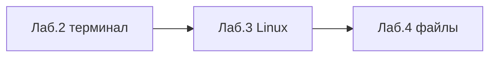
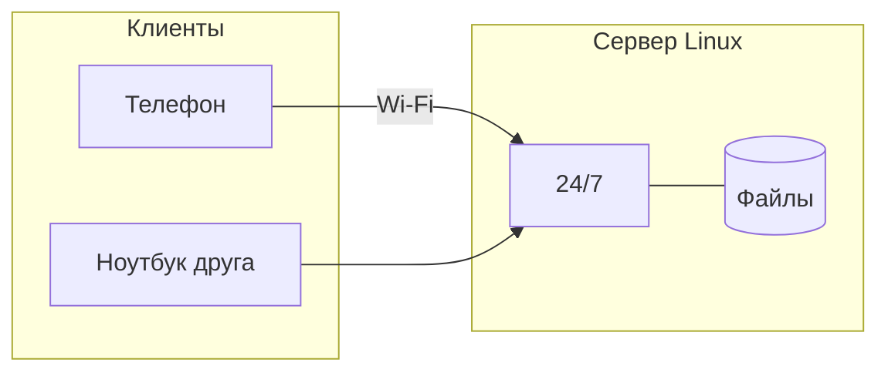
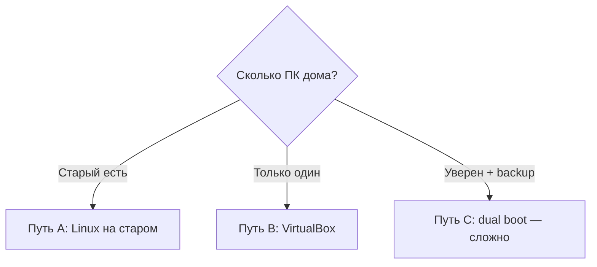

# ENGINEERING ROADMAP
## Том 1 · Лаборатория №3 — Linux

> **Построить дом для сервера** · Миссия дня

---

## 📡 История

В **Лаборатории №2** ты научился **говорить** с компьютером словами — `pwd`, `ls`, `cd`. Остался вопрос из интриги: **как** друг зайдёт на **твой Minecraft-сервер**, пока твой ноутбук **выключен**?

Сегодня в лабораторию поступил **старый ноутбук** (или **VirtualBox** на твоём ПК). Задача — **не «выучить Linux»**, а **построить** дом, где сервер может **жить 24/7**.

**Если Лаб. №2 не сделана — вернись в `02_LAB_TERMINAL.md`.**

---

## 🚀 Миссия

**Построить** дом для сервера — **безопасно** установить Linux и подготовить папку `~/serwer`.

---

## 🎯 Цель

- понять **Linux на сервере** (не «для хакеров», а **для инженера**);
- пройти установку (**Путь A** — старый ПК **или** **Путь B** — VirtualBox);
- выполнить **первые команды** «здоровья» сервера: `uname`, `uptime`, `df -h`.

**Результат:** работающий **Linux**, запись в dnevnik, папка `~/serwer/pliki/test.txt`, пароль **только** в dnevnik.

---

## ⏱ Время

2–4 часа установка (можно **2–3 дня** по 30–45 мин); проверки — 30 мин.

---

## 🧰 Что понадобится

- [ ] Терминал **открывался** (Лаборатория №2)
- [ ] На диске **≥ 20 GB** свободно (Лаборатория №1)
- [ ] **Старый ПК** **или** **VirtualBox** (если дома **один** компьютер)
- [ ] USB **8 GB+** (можно **стереть**) — для Пути A
- [ ] Файл **Ubuntu .iso** · **Etcher** или **Rufus**
- [ ] Ethernet **желательно** (или Wi‑Fi)
- [ ] `dnevnik.txt` — сюда **запишешь пароль** (никому!)

---

## 🤔 Как ты думаешь?

**Не читай ответ сразу.**

1. Мир Minecraft **живёт** только на **твоём** диске?
2. Нужен компьютер, который **всегда включён**?
3. Почему Google ставит **Linux**, а не «обычный» домашний Windows на миллион машин?

*(Запиши в dnevnik. Сверь с картой Wi‑Fi из Лаб. №0.)*

**Настоящее объяснение:** **Сервер** — компьютер или программа, которая **даёт услуги** другим (**клиентам**). **Linux** на сервере — **стабильно**, **бесплатно**, **терминал** — главный инструмент. **Android** — тоже **Linux** внутри.

---

## 💡 Аналогия

**Библиотека:**

| В жизни | На сервере |
|---------|------------|
| Ты просишь книгу | Клиент просит **файл** |
| Библиотекарь находит | **Сервер** отдаёт с **диска** |
| Полки | **Папки** на SSD |

**Minecraft:** пока **твой** ПК держит мир — друзья играют. **Выключил** — мир **пропал**. **Сервер** = компьютер **24/7**.

**VirtualBox:** **квартира внутри квартиры** — Windows **остаётся**, Linux **в окне**.

### 😲 ВАУ!

Твой телефон и **сервер Google** — **родственники** по ядру Linux.

### 😄 Момент улыбки

Сервер — **не** монстр в дата-центре. Это **старый ноутбук** в углу — как ночной свет, только **полезнее**.

---

## 📷 Иллюстрация

📷 **[Для художника]**

**ID:**  
ILL-T1-L3-01

**Название:**  
Сервер в углу комнаты

**Тип иллюстрации:**  
Сюжетная сцена · establishing shot · «работает, пока ты спишь»

**Главная цель иллюстрации:**  
Показать **старый ноутбук** как **домашний сервер** — тихо стоит в углу, **LED горит**, **Ethernet** тянется к роутеру, на экране — намёк на `uptime`. Ребёнок **не обязан** быть в кадре — акцент на **машине, которая живёт 24/7**. Зритель: сервер = **устройство в углу**, не главный ПК на столе.

Что ребёнок должен почувствовать: **удивление** («он работает без меня»), **спокойствие**, «у меня дома есть сервер».

---

**Описание сцены**

Ракурс **из дверного проёма** комнаты — **3/4**, чуть **сверху**: видна **домашняя комната** (та же эстетика, что Лаб.0). В **дальнем углу** (правый задний план) — **низкая полка** или **тумбочка**; на ней **старый ноутбук** (толще современного, **серый** или **тёмно-синий** корпус).

**Ноутбук:** крышка **приоткрыта** или экран под углом ~110°. **Power LED** — маленькая **зелёная** точка **горит**. Экран: **тёмный терминал** с **2–3 строками** зелёноватых «полос» (намёк на uptime — **без читаемого** «30 days»).

**Ethernet:** **оранжевый** или **янтарный** кабель (выделить!) от бокового порта ноутбука → по полу/плинтусу → к **роутеру** на полке (компактный, **2 антенны**, без бренда). **Оранжевая стрелка** или **светящийся контур** кабеля — **главный акцент** после LED.

**Передний план:** **силуэт дверного косяка** слева (лёгкий, не закрывает сцену). **Не** показывать спящего ребёнка в кровати в этом кадре — комната может быть **пустой** (вечер, ребёнок в другой комнате или за кадром).

**Что НЕ должно появляться:** дата-центр, стойки серверов, мигающие RAID-массивы, взрослые IT-админы, провода 230V, Minecraft.

---

**Главный герой**

- **В кадре:** **опционально** — силуэт героя в дверях (спиной), **11 лет**, **тёмно-зелёный** худи — **или** комната **без** человека  
- Если герой есть: **тёмно-каштановые** волосы, **не** лицо в фокусе — акцент на ноутбуке  
- **Эмоция:** тихое наблюдение  

---

**Дополнительные персонажи**

Нет (или только силуэт героя в дверях).

---

**Окружение**

- **Тип:** угол **домашней** комнаты-лаборатории  
- **Стены:** светло-беж / серые  
- **Мебель:** полка, роутер, старый ноутбук, кабель  
- **Детали:** моток лишнего кабеля **аккуратно**, кактус **опционально** на другой полке  
- **Атмосфера:** вечер, **тишина**, **не** NASA  

---

**Композиция**

- **Формат кадра:** 16:9  
- **План:** общий (комната) с **фокусом** на угол  
- **Передний план:** дверной косяк (лёгкий)  
- **Средний план:** ноутбук + LED + экран  
- **Задний план:** стена, полка  
- **Линия взгляда читателя:** 1) **LED** 2) **Ethernet-кабель** (оранжевый) 3) экран  
- **Правило третей:** ноутбук — пересечение правой и нижней трети  

---

**Освещение**

- **Тип:** **сумерки** + **свечение экрана** + **LED**  
- **Время суток:** поздний вечер / ночь  
- **Характер:** комната **приглушённая**; экран и LED — **точки света**  
- **Тени:** мягкие, длинные от полки  

---

**Цветовая палитра**

- **Основные:** `#457B9D` (сумерки), `#2D6A4F` (LED/экран), `#F4A261` (**кабель Ethernet** — акцент)  
- **Дополнительные:** `#6C757D` (старый ноутбук), `#F8F9FA` (стена)  
- **Настроение:** тихое, **ночное**, «живёт сам»  

---

**Стиль**

Единый стиль **EduMost** · **DK · Usborne**. Чистый вектор, **не** фотореализм старого ноутбука.  
**Без:** аниме, Pixar, 3D, дата-центр, неон.

---

**Возрастная адаптация**

- **Возраст читателя:** 11–14 лет  
- **Можно:** ночь, светящийся экран, пустая комната  
- **Нельзя:** хоррор, одиночество-тревога, опасные провода, взрослые  

---

**Формат**

- **Файл:** SVG  
- **Соотношение:** 16:9  
- **Детализация:** LED и кабель читаемы в A5  
- **Цветовой режим:** RGB  

---

**Текст**

На изображении **текста быть НЕ должно**: ни «uptime», ни «работает, пока ты спишь» — смысл через **LED + кабель + тёмный экран**.

---

**Негативный prompt**

дата-центр · стойки · подписи · логотипы · бренды роутера · артефакты AI · взрослые · хоррор · оружие · аниме · Pixar · 3D · читаемый uptime · Minecraft · RGB-gamer chaos

---

**Связь с лабораторией**

Лаборатория №3 — **Linux-сервер**: первый образ «**машина 24/7**» в углу комнаты. Иллюстрация параллельна ASCII-схеме ниже.

📷 **[Для художника]**

**ID:**  
ILL-T1-L3-02

**Название:**  
Windows vs Linux — два подхода к серверу

**Тип иллюстрации:**  
Сравнительная схема · split-screen · инфографика без текста

**Главная цель иллюстрации:**  
Показать **контраст**: слева — «игровой» ПК с отвлекающими иконками; справа — **чёрный терминал** Linux с ощущением стабильности **30 дней uptime**. Ребёнок понимает: сервер — **не** игровая машина с уведомлениями.

Что ребёнок должен почувствовать: «Linux — спокойный и **долго живёт**», без страха «хакерского» терминала.

---

**Описание сцены**

**Два монитора** на одном столе, **разделённый кадр** (вертикальная линия по центру).

**Слева (Windows / игровой):** широкий монитор с **цветными иконками** (стилизованные квадраты и круги — **игры, чат, браузер**), **умеренный** RGB-подсветка корпуса (**не** кислотный gamer-хаос). На столе — игровая мышь, наушники.

**Справа (Linux / сервер):** монитор с **чёрным** фоном терминала; **зелёные** строки — **абстрактные полосы** (имитация `uptime`, **без читаемых букв**). Корпус **простой**, без RGB. Рядом — **маленький** старый ноутбук как «сервер» с **зелёным** LED.

**Герой** — **не обязателен**; если есть — **силуэт сзади** или **рука** указывает на **правый** экран (Linux).

**НЕ должно быть:** читаемый текст `uptime 30 days`, логотип Windows, логотип Linux, устрашающий «хакер» в капюшоне.

---

**Главный герой**

- **Возраст:** 11 лет (если показан)  
- **Внешность:** тот же герой серии — каштановые волосы, веснушки  
- **Одежда:** зелёный худи  
- **Поза:** стоит между мониторами, **жест** «смотри сюда» на правый экран  
- **Эмоция:** понимание, **не** осуждение игр  

*(Допустим вариант без героя — только два экрана.)*

---

**Дополнительные персонажи**

Нет.

---

**Окружение**

- **Тип:** домашний стол / мастерская  
- **Фон:** нейтральная стена, **полка** с роутером (без бренда)  

---

**Композиция**

- **Формат:** 16:9  
- **Split 50/50:** лево — «шумный» десктоп, право — «тихий» сервер  
- **Акцент:** **зелёная рамка** или **свечение** вокруг правого монитора (Primary)  
- **Взгляд читателя:** сначала правый экран (Linux), потом контраст с левым  

---

**Освещение**

- Слева — чуть **холоднее** + RGB отражение  
- Справа — **мягкий** зеленоватый отблеск терминала  
- Общий свет **нейтральный** дневной  

---

**Цветовая палитра**

- Лево: `#6C757D`, `#457B9D`, умеренный `#9D4EDD` (RGB)  
- Право: `#000000` фон терминала, `#40916C` / `#2D6A4F` «зелёный uptime»  
- Акцент рамки: `#2D6A4F`  

---

**Стиль**

EduMost · DK/Usborne · чистый вектор · flat + мягкие тени · **без** 3D · **без** anime  

---

**Возрастная адаптация**

- 11–14: игровой ПК **узнаваем**, но **не** пропаганда; Linux **не** пугает  

---

**Формат**

SVG · 16:9 · печать + Web  

---

**Текст**

**Никаких букв** на экранах — только цветные полосы и иконки.  

---

**Негативный prompt**

читаемый текст · логотипы ОС · водяные знаки · хакер · капюшон · неон-хаос · аниме · Pixar · 3D · взрослые · оружие  

---

**Связь с лабораторией**

Усиливает мысль лаборатории №3: **Linux лучше для сервера**, потому что **стабилен** и **не отвлекается** — визуальный контраст двух «машин».

```
┌──────────────────────┐
│  Старый ноутбук      │  ← экран можно закрыть
│  Ethernet → роутер   │
└──────────────────────┘
   работает тихо, 24/7
```

---

## 📊 Mermaid







---

## 🔬 Эксперимент

**Правило:** минимум **LEGO 1–4** (установка) + **№1, №2, №4** (проверки).  
VirtualBox **считается** — это **тоже** твой Linux.

**Прочти блок «Безопасность» ниже до «Erase disk».**

---

### Безопасность — перед установкой

| Риск | Как избежать |
|------|--------------|
| Стереть Windows с **единственного** ПК | **VirtualBox** или **старый** ПК |
| Потерять фото/школу | **Не трогать** диск с данными |
| Нет интернета дома | Скачай **.iso** в школе / библиотеке |

**⚠** «Поставлю Linux на **единственный** школьный ноутбук сегодня вечером» — **нет.** Только **старый** ПК **или** VirtualBox.

---

### LEGO 1 — Образ на флешку

**⏱** 20–40 мин

1. Скачай **Ubuntu Desktop .iso** (~5 GB).
2. **Etcher:** USB → Select image → Flash → **Finished**.

| **Что делает** | Записывает iso — флешка **загрузочная** |
| **Почему** | ПК **не видит** обычную флешку как установщик |
| **Как проверить** | Etcher: **Finished** без ошибок |
| **Как отменить** | Флешку **отформатировать** позже |

---

### LEGO 2 — Загрузка с USB

**⏱** 10–20 мин

1. Флешка **вставлена**.
2. Включи ПК → **F12** / **F2** / **Esc** (Boot menu).
3. Выбери **USB** → **Try or Install Ubuntu**.

| Проблема | Решение |
|----------|---------|
| Грузится Windows | F12 **раньше** |
| Secure Boot | Отключи в BIOS |

**Успех:** рабочий стол Ubuntu или установщик.

---

### LEGO 3 — Install Ubuntu

**⏱** 20–40 мин

1. **Install Ubuntu** → Keyboard: Polski / English.
2. **Erase disk** — **ТОЛЬКО** старый ПК **без** важных данных!
3. Имя + **пароль** → **ЗАПИШИ В DNEVNIK** (никому!).
4. Restart → **вынь флешку**.

**Путь B — VirtualBox:** [virtualbox.org](https://www.virtualbox.org/) → New → `Ubuntu-Lab` → RAM **4096 MB** → диск **25 GB** → Settings → Storage → **.iso** → Install **внутри** окна.

---

### LEGO 4 — Первый терминал

**⏱** 10 мин

**Ctrl+Alt+T**

```bash
uname -a
uptime
df -h
```

| Команда | Что делает | Проверка |
|---------|------------|----------|
| `uname -a` | Система и **ядро** | Слово `Linux` |
| `uptime` | Время **без** перезагрузки | Строка `up ...` |
| `df -h` | **Место** на диске | Строка `/` с GB |

**Как отменить:** все три **только читают** — ничего не меняют.

---

### LEGO 5 — Обновления

**⏱** 15–30 мин

```bash
sudo apt update
sudo apt upgrade -y
```

| **`sudo`** | Ключ **администратора** |
| **Почему** | Закрыть **дыры** в безопасности |
| **Проверка** | Без `Error` в конце |
| **При наборе** | Пароль **не виден** — **нормально** |

---

### Эксперимент 1 — «Сколько я работаю?»

**⏱** 5 мин

```bash
uptime
```

**Запиши** строку `up ...` в dnevnik.

**✅ Проверь себя:** команда **без ошибок**?

---

### Эксперимент 2 — «Сколько места?»

**⏱** 5 мин

```bash
df -h
```

**Запиши:** свободно на `/` — ___ GB. Хватит для **Minecraft**?

---

### Эксперимент 3 — «Кто я в сети?»

**⏱** 5 мин

```bash
whoami
hostname
```

| `whoami` | **Имя** пользователя |
| `hostname` | **Кличка** машины в сети |

---

### Эксперимент 4 — «Папка сервера»

**⏱** 15 мин

```bash
mkdir -p ~/serwer/pliki
echo "Moj pierwszy plik serwera" > ~/serwer/pliki/test.txt
cat ~/serwer/pliki/test.txt
ls -la ~/serwer/
```

**✅ Проверь себя:** `cat` показал **твой** текст?

---

### Эксперимент 5 — «Службы фоном»

**⏱** 10 мин

```bash
systemctl status
```

Pager: **`q`** — выход. **Ничего не сломал.**

| `systemctl status` | Список **служб** без окошек |

---

## ⚠ Типичные ошибки

| Проблема | Как исправить |
|----------|---------------|
| «Erase disk» на **не том** ПК | **Только** старый без файлов |
| Забыл пароль | Переустанови Ubuntu на **старом** ПК |
| Нет Wi‑Fi | **Ethernet** в роутер |
| «No bootable device» | F12 → **USB** снова |
| `sudo` incorrect password | Caps Lock? Пароль **без** отображения |
| VirtualBox **медленный** | RAM **4 GB** — **нормально** |

---

## 🧪 Проверь себя

- [ ] Linux **загружается** (ПК или VirtualBox)
- [ ] Терминал + `pwd` **работают**
- [ ] `uptime` и `df -h` **в dnevnik**
- [ ] `~/serwer/pliki/test.txt` **создан**
- [ ] Пароль **только** в dnevnik (не на фото!)
- [ ] Могу объяснить **сервер** и **клиент** (библиотека)

---

## 📝 Запись в инженерный дневник

```
=== LAB №3 ===
Data: ___
Ścieżka: A stary PC / B VirtualBox
Co zrobiłem:
  - Ubuntu zainstalowane: TAK/NIE
  - uptime: ___
  - df -h wolne GB: ___
  - ~/serwer/pliki/test.txt: TAK/NIE
  - Hasło w dnevnik (TAK — nie pokazuj!)
Co było trudne:
Co zmieniłbym:
Następny pomysł:
```

**Фото:** экран с `uptime` или VirtualBox (**без** пароля на фото).

---

## 🏆 Что теперь умеешь

- [ ] Объяснить **сервер** и **клиент** (библиотека, Minecraft)
- [ ] Выбрать **безопасный** путь: старый ПК **или** VirtualBox
- [ ] **Установить** Ubuntu (или в VM)
- [ ] Выполнить `uname`, `uptime`, `df -h`, `sudo apt update`
- [ ] Создать **`~/serwer/pliki`** на сервере
- [ ] **Не бояться** Linux — это **инструмент**, не «магия хакеров»

---

## ➡ Что дальше

**Следующий файл:** `04_LAB_FAJLY.md` — **Лаборатория №4:** файлы и папки на сервере.

**Перед переходом:**

- [ ] Linux **загружается** — **обязательно**
- [ ] `uptime` + `df -h` **в dnevnik** — **обязательно**
- [ ] `~/serwer/pliki/test.txt` — **обязательно**
- [ ] Блок **LAB №3** — **обязательно**
- [ ] `sudo apt upgrade` — **рекомендуется**
- [ ] Эксп. 5 `systemctl` — **рекомендуется**

**Если обязательные галочки пустые — не открывай Лабораторию №4.**

### 🔮 Вопрос без ответа

Сервер **хранит** файлы. **Кто** будет **копировать** их каждую ночь?

**Ответ — в Лаборатории №4.** Там **файлы** и **копии** — руками, потом **Bash**.

---

*Закрой крышку ноутбука-сервера. Он **работает**. Завтра — **файлы**.*
