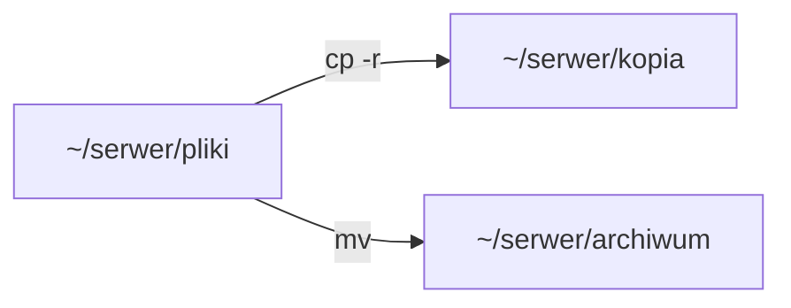

# ENGINEERING ROADMAP
## Том 1 · Лаборатория №4 — Файлы

> **Папки и копии на сервере** · Миссия дня

---

## 📡 История

В **Лаборатории №3** ты установил Linux и создал `~/serwer/pliki/test.txt`. Сервер **хранит** — но **как** управлять **тысячами** файлов **без мышки**?

---

## 🚀 Миссия

**Научить** сервер **копировать, переименовывать и находить** файлы — командами, как инженер.

---

## 🎯 Цель

- понять **путь** = адрес файла;
- освоить `cp`, `mv`, `rm`, `find`;
- сделать **ручной backup** папки `~/serwer`.

**Результат:** `~/serwer/kopia/` с копией, записи в dnevnik.

---

## ⏱ Время

45–60 мин.

---

## 🧰 Что понадобится

- [ ] Linux работает (Лаб. №3)
- [ ] Папка `~/serwer/pliki` **есть**
- [ ] **≥ 5 GB** свободно (`df -h`)

---

## 🤔 Как ты думаешь?

1. `cp` — **копирует** или **перемещает**?
2. `rm` — можно **отменить** как Ctrl+Z?
3. Зачем **две** папки: `pliki` и `kopia`?

**Настоящее объяснение:** `cp` = **копия**, оригинал **остаётся**. `rm` **без корзины** — опасно. Backup = **копия на всякий случай**.

---

## 💡 Аналогия

| Библиотека | Linux |
|------------|-------|
| Полка + номер | **Путь** `/home/...` |
| Снять копию страницы | `cp` |
| Переставить книгу | `mv` |
| Выбросить (осторожно!) | `rm` |

### 😲 ВАУ!

Google **не** хранит один файл — **тысячи копий** на разных дисках. Ты делаешь **мини-Google** дома.

### 😄 Момент улыбки

`rm -rf` — как **выбросить шкаф без спроса**. В этой лаборатории — **только** `rm` **одного** файла из книги.

---

## 📷 Иллюстрация

📷 **[Для художника]**

**ID:**  
ILL-T1-L4-01

**Название:**  
Два шкафа: pliki и kopia

**Тип иллюстрации:**  
Образовательная метафора · front flat · «файлы = шкафы»

**Главная цель иллюстрации:**  
Визуализировать команду **`cp -r`** через **два шкафа**: левый — **оригинал** (pliki), правый — **копия** (kopia). **Толстая янтарная стрелка** между ними + внизу **окно терминала** с намёком на `cp`. Зритель: копирование = **перекладывание** из шкафа в шкаф, **не** магия.

Что ребёнок должен почувствовать: **ясность**, «я понимаю cp», спокойная уверенность.

---

**Описание сцены**

**Flat illustration**, фронтальный вид: **два одинаковых по форме шкафа** стоят **рядом** на нейтральном фоне (светло-серый «пол» и бежевый «фон стены» — **не** реальная комната, **схема в книге**).

**Левый шкаф:** дверцы приоткрыты; внутри **3–4 «папки»** — цветные прямоугольники (синий, зелёный, жёлтый) — **без подписей**. Над шкафом — **иконка папки** (универсальный символ «pliki» — **без букв**).

**Правый шкаф:** та же структура; **те же** цветные блоки (намёк на **идентичную копию**). Иконка — **два** наложенных листа (символ «kopia»).

**Стрелка:** от левого к правому — **толстая**, **янтарная** `#F4A261`, с **двойной** головой или **дуга** «копирование»; рядом маленькая **иконка терминала** (прямоугольник с `$` **один символ** или без).

**Внизу кадра:** **полоска терминала** (широкая, ~15% высоты): тёмный фон, **стилизованная** строка «команды» — **зелёные блоки**, **не читаемый** `cp -r`.

**Опционально:** **руки героя** по краям держат «лист схемы» — или **герой 11 лет** стоит слева, указывает на стрелку (полный рост, **тёмно-зелёный** худи, **веснушки**).

**Что НЕ должно появляться:** реалистичный IKEA-шкаф с текстурой фото, читаемые слова pliki/kopia, Windows Explorer, взрослые.

---

**Главный герой**

- **Возраст:** 11 лет (если в кадре)  
- **Внешность:** **тёмно-каштановые** волосы, **веснушки**, узнаваемый герой  
- **Одежда:** **тёмно-зелёный** худи  
- **Поза:** стоит слева, **рука** указывает на янтарную стрелку  
- **Выражение лица:** **объясняющая** мягкая улыбка  
- **Взгляд:** на правый шкаф (копию)  

*Допустима версия **без** героя — только шкафы и стрелка.*

---

**Дополнительные персонажи**

Нет.

---

**Окружение**

- **Тип:** **схема-метафора** (не фото комнаты)  
- **Фон:** нейтральный образовательный  
- **Детали:** два шкафа, стрелка, терминал-strip  

---

**Композиция**

- **Формат кадра:** 16:9  
- **План:** средний, симметричный  
- **Передний план:** янтарная **стрелка** (самый яркий акцент)  
- **Средний план:** два шкафа  
- **Задний план:** нейтральная стена  
- **Линия взгляда читателя:** 1) **два шкафа** 2) **стрелка** 3) терминал внизу  
- **Правило третей:** шкафы — левая и правая треть; стрелка — центр  

---

**Освещение**

- **Тип:** **равномерное** «книжное» — без драмы  
- **Характер:** flat, лёгкая тень под шкафами  
- **Тени:** минимальные  

---

**Цветовая палитра**

- **Основные:** `#F4A261` (стрелка, акцент), `#457B9D` (левый шкаф/папки), `#2D6A4F` (правый акцент)  
- **Дополнительные:** `#F8F9FA` (фон), `#1E1E1E` (терминал)  
- **Настроение:** **ясное**, учебное  

---

**Стиль**

Единый стиль **EduMost** · **DK · Usborne**. Flat vector, **иконографический**.  
**Без:** 3D, фотореализм, аниме, Pixar, skeuomorphic тени.

---

**Возрастная адаптация**

- **Возраст читателя:** 11–14 лет  
- **Можно:** метафора шкафов, яркая стрелка  
- **Нельзя:** сложный UI Windows, страшные «удалённые файлы», кровь, оружие  

---

**Формат**

- **Файл:** SVG  
- **Соотношение:** 16:9  
- **Детализация:** стрелка и шкафы читаемы в A5  
- **Цветовой режим:** RGB  

---

**Текст**

На изображении **текста быть НЕ должно**: ни «pliki», «kopia», ни `cp -r` — только **иконки** и **цветовое** кодирование лево/право.

---

**Негативный prompt**

подписи · pliki · kopia · cp -r читаемый · Windows Explorer · логотипы · артефакты AI · фотореализм · 3D · аниме · Pixar · взрослые · оружие · лишние предметы

---

**Связь с лабораторией**

Лаборатория №4 — **файлы**: метафора **`cp -r`** перед экспериментами с `~/serwer/pliki` и `kopia`. Параллель Mermaid: pliki → cp → kopia.

---

## 📊 Mermaid



---

## 🔬 Эксперимент

**Правило:** минимум **№1, №2, №4**.

---

### Эксперимент 1 — «Где файл?»

**⏱** 5 мин

```bash
pwd
ls -la ~/serwer/
ls -la ~/serwer/pliki/
```

| `ls -la` | Список + **права** | Видишь `test.txt` |

---

### Эксперимент 2 — «Копия»

**⏱** 10 мин

```bash
mkdir -p ~/serwer/kopia
cp ~/serwer/pliki/test.txt ~/serwer/kopia/test.txt
cat ~/serwer/kopia/test.txt
```

| `cp` | **Копирует** | Оба файла **существуют** |
| **Отменить** | `rm ~/serwer/kopia/test.txt` | Только **копию** |

**✅ Проверь себя:** тексты **одинаковые**?

---

### Эксперимент 3 — «Переименовать»

**⏱** 5 мин

```bash
mv ~/serwer/pliki/test.txt ~/serwer/pliki/pierwszy.txt
ls ~/serwer/pliki/
```

| `mv` | **Переместить/переименовать** | Старого имени **нет** |

---

### Эксперимент 4 — «Backup папки»

**⏱** 15 мин

```bash
cp -r ~/serwer/pliki ~/serwer/kopia/pliki_backup
ls -la ~/serwer/kopia/
```

| `cp -r` | Копия **всей папки** | Внутри **те же** файлы |

**✅ Проверь себя:** backup **на месте**?

---

### Эксперимент 5 — «Найти»

**⏱** 10 мин

```bash
find ~/serwer -name "*.txt"
```

| `find` | **Ищет** по имени | Список путей |

---

## ⚠ Типичные ошибки

| Проблема | Исправление |
|----------|-------------|
| `rm` не тот файл | Сначала `ls` — **точное** имя |
| `cp` без пути | Укажи **откуда** и **куда** |
| Нет места | `df -h` **перед** большим `cp` |

---

## 🧪 Проверь себя

- [ ] `cp` и `mv` **различаю**
- [ ] Backup `pliki` **создан**
- [ ] **Не** использовал `rm -rf`

---

## 📝 Запись в инженерный дневник

```
=== LAB №4 ===
Data: ___
Co zrobiłem:
  - cp test.txt: TAK/NIE
  - backup pliki: TAK/NIE
  - find .txt: ___
Co było trudne:
Następny pomysł:
```

---

## 🏆 Что теперь умеешь

- [ ] Объяснить **путь** к файлу
- [ ] Копировать **`cp` / `cp -r`**
- [ ] Переименовать **`mv`**
- [ ] Сделать **ручной backup**

---

## ➡ Что дальше

**Следующий файл:** `05_LAB_BASH.md` — **одна команда** копирует **всё каждую ночь**.

- [ ] Backup в `~/serwer/kopia` — **обязательно**

### 🔮 Вопрос без ответа

**Кто** будет запускать `cp` **каждую ночь**, пока ты спишь?

**Ответ — в Лаборатории №5 (Bash).**

---

*Закрой терминал. Завтра — **рецепт** для компьютера.*
