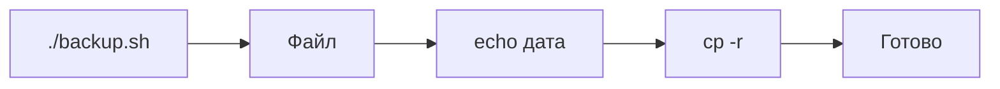

# ENGINEERING ROADMAP
## Том 1 · Лаборатория №5 — Bash

> **Ночной инженер** · Миссия дня

---

## 📡 История

В **Лаборатории №4** ты копировал файлы **руками**. Каждый вечер — **одни и те же** команды. Как **научить компьютер** делать это **самому**?

---

## 🚀 Миссия

**Написать** первый скрипт `backup.sh`, который **копирует** `~/serwer/pliki` **одной** командой.

---

## 🎯 Цель

- понять **скрипт = рецепт** команд;
- создать `backup.sh`, сделать **исполняемым**, **запустить**;
- проверить **копию** в `~/backup`.

**Результат:** работающий backup-скрипт + запись в dnevnik.

---

## ⏱ Время

40–50 мин.

---

## 🧰 Что понадобится

- [ ] Linux + `~/serwer/pliki` (Лаб. №3–4)
- [ ] Терминал (Лаб. №2)
- [ ] `nano` или любой редактор

---

## 🤔 Как ты думаешь?

1. Зачем **сохранять** команды в **файл**?
2. Что значит `#!/bin/bash` в первой строке?
3. Почему `chmod +x`?

**Настоящее объяснение:** **Bash** читает файл **строка за строкой**, как ты в терминале. `#!/bin/bash` — «готовь bash». `chmod +x` — «разреши **запуск**».

---

## 💡 Аналогия

**Рецепт пирога:** один раз записал — **повторяешь** без выдумывания.  
**backup.sh** — рецепт для **копирования**.

### 😲 ВАУ!

Google **деploy** — миллионы **скриптов** bash. Твой — **мини-версия**.

### 😄 Момент улыбки

Скрипт **не устаёт** в 3 ночи. Ты — **устаёшь**. Скрипт — **нет**.

---

## 📷 Иллюстрация

📷 **[Для художника]**

**ID:**  
ILL-T1-L5-01

**Название:**  
Ночной backup

**Тип иллюстрации:**  
Сюжетная сцена · top-down · «скрипт работает, ребёнок спит»

**Главная цель иллюстрации:**  
Показать **`backup.sh`** как **ночного помощника**: на столе — **лист со скриптом** (светящийся контур), **стрелки** к папкам, **часы 03:00**; за окном — **тёмная** комната, **silhouette кровати** (ребёнок **спит**, **без лица**). Монитор **светится**. Зритель: bash-скрипт = **работа, пока ты спишь**.

Что ребёнок должен почувствовать: **удивление и облегчение** («компьютер работает за меня»), **не** страх ночи.

---

**Описание сцены**

Ракурс **сверху на стол** (top-down, ~80% кадра — стол).

**Центр:** лист бумаги или **открытая тетрадь** с **набросом скрипта** — **3–4 строки** «кода» (**без читаемых** символов — только цветные полоски: зелёная, белая). Вокруг листа — **мягкое свечение** (контур `#4ADE80` или янтарный `#F4A261`) — **backup.sh «живой»**.

**Стрелки:** от листа **вверх и вправо** к **двум иконкам папок** (исходная / архив) — **янтарные** или зелёные, **толстые**.

**Часы:** **настенные** или **на столе** — **стрелки** показывают **3:00** (**без цифр** на циферблате **или** циферблат **стилизован** без читаемых numerals — только положение стрелок). **Акцент** — часы **крупнее** обычного.

**Монитор:** верхний край кадра — **светящаяся** полоска экрана (зеленоватый отблеск на стол).

**Фон / окно:** верх кадра — **окно** в **ночь** (`#1D3557`); в **глубине** комнаты — **silhouette кровати** и **одно одеяло** — **никакого лица**, только форма «ребёнок спит».

**Что НЕ должно появляться:** монстр под кроватью, красный alarm, взрослый в комнате, читаемый код, Minecraft.

---

**Главный герой**

- **В кадре:** **спит** — только **silhouette** под одеялом в **дальнем** плане через окно/дверной проём  
- **11 лет**, **тёмно-каштановые** волосы **не видны** (лицо скрыто)  
- **Эмоция:** покой (снаружи сцены — **скрипт работает**)  

---

**Дополнительные персонажи**

Нет.

---

**Окружение**

- **Тип:** стол в **ночной** комнате  
- **Предметы:** тетрадь/лист, стрелки, папки-иконки, часы, монитор  
- **Атмосфера:** **03:00**, тишина, **автоматизация**  

---

**Композиция**

- **Формат кадра:** 16:9  
- **План:** top-down + **глубина** через окно  
- **Передний план:** **светящийся** лист backup  
- **Средний план:** стрелки, папки, часы  
- **Задний план:** окно, silhouette кровати  
- **Линия взгляда читателя:** 1) **часы 3:00** 2) **backup.sh** (свет) 3) **стрелки**  
- **Правило третей:** лист — центр; часы — верхняя левая треть  

---

**Освещение**

- **Тип:** **ночь** + **свечение монитора** + **свечение скрипта**  
- **Время суток:** 03:00  
- **Характер:** стол **освещён** экраном; комната **тёмная**  
- **Тени:** длинные, мягкие от предметов на столе  

---

**Цветовая палитра**

- **Основные:** `#1D3557` (ночь), `#F4A261` (стрелки/свечение скрипта), `#2D6A4F` (монитор)  
- **Дополнительные:** `#F8F9FA` (лист), `#6C757D` (часы)  
- **Настроение:** **ночное**, но **безопасное**  

---

**Стиль**

Единый стиль **EduMost** · **DK · Usborne**. Вектор; свечение — **мягкое**, не неон.  
**Без:** хоррор, аниме, Pixar, 3D, читаемый код.

---

**Возрастная адаптация**

- **Возраст читателя:** 11–14 лет  
- **Можно:** ночь, спящий силуэт **без лица**, свет монитора  
- **Нельзя:** хоррор, монстры, тревога, взрослые в комнате, оружие  

---

**Формат**

- **Файл:** SVG  
- **Соотношение:** 16:9  
- **Детализация:** часы и свечение скрипта читаемы  
- **Цветовой режим:** RGB  

---

**Текст**

На изображении **текста быть НЕ должно**: ни «backup.sh», ни «03:00» цифрами, ни «скрипт работает, ребёнок спит» — только **стрелки часов** и **светящийся** лист.

---

**Негативный prompt**

хоррор · монстр · подписи · backup.sh читаемый · логотипы · артефакты AI · лицо спящего крупно · взрослые · оружие · аниме · Pixar · 3D · красный alarm · неон

---

**Связь с лабораторией**

Лаборатория №5 — **Bash**: **`backup.sh`** и cron-мысль «**ночью само**». Иллюстрация перед экспериментами `./backup.sh` и Mermaid цепочки команд.

---

## 📊 Mermaid



---

## 🔬 Эксперимент

**Правило:** минимум **№1–4**.

---

### Эксперимент 1 — «Ручной backup»

**⏱** 10 мин

```bash
cp -r ~/serwer/pliki ~/backup_reczny
ls ~/backup_reczny
```

**Запиши** в dnevnik: «Backup ręczny OK».

---

### Эксперимент 2 — «Создай скрипт»

**⏱** 15 мин

```bash
nano ~/backup.sh
```

Вставь:

```bash
#!/bin/bash
echo "Start backup $(date)"
mkdir -p ~/backup_auto
cp -r ~/serwer/pliki ~/backup_auto/
echo "Koniec backup!"
```

| Строка | Зачем |
|--------|-------|
| `#!/bin/bash` | Какой **переводчик** |
| `echo` | **Сообщение** в лог |
| `cp -r` | **Копия** папки |

Сохрани: `Ctrl+O`, `Ctrl+X`.

---

### Эксперимент 3 — «Сделай исполняемым»

**⏱** 5 мин

```bash
chmod +x ~/backup.sh
ls -l ~/backup.sh
```

| `chmod +x` | **Право запуска** | В `ls -l` буква **`x`** |

---

### Эксперимент 4 — «Запуск»

**⏱** 5 мин

```bash
~/backup.sh
ls ~/backup_auto
```

**✅ Проверь себя:** копия **на месте**?

---

### Эксперимент 5 — «Cron — заглянуть»

**⏱** 10 мин

```bash
crontab -l
```

Если «no crontab» — **нормально**. Запиши: «Cron — позже, для ночного запуска».

---

## ⚠ Типичные ошибки

| Проблема | Исправление |
|----------|-------------|
| `Permission denied` | `chmod +x ~/backup.sh` |
| `bad interpreter` | Первая строка **точно** `#!/bin/bash` |
| Пустой backup | Путь `~/serwer/pliki` **существует**? |

---

## 🧪 Проверь себя

- [ ] `backup.sh` **запускается**
- [ ] Копия в `~/backup_auto`
- [ ] **Понимаю** `#!/bin/bash` и `chmod +x`

---

## 📝 Запись в инженерный дневник

```
=== LAB №5 ===
Data: ___
Co zrobiłem:
  - backup.sh: TAK/NIE
  - chmod +x: TAK/NIE
  - backup_auto: TAK/NIE
Co było trudne:
Następny pomysł:
```

---

## 🏆 Что теперь умеешь

- [ ] Написать **bash-скрипт**
- [ ] Сделать файл **исполняемым**
- [ ] **Автоматизировать** backup **одной** командой

---

## ➡ Что дальше

**Следующий файл:** `06_LAB_SERVER.md` — **сервис** на Linux 24/7.

- [ ] `backup.sh` работает — **обязательно**

### 🔮 Вопрос без ответа

Скрипт копирует файлы — но **кто** держит **Minecraft** включённым для друзей?

**Ответ — в Лаборатории №6.**

---

*Сохрани backup.sh. Это **первый** твой ночной инженер.*
