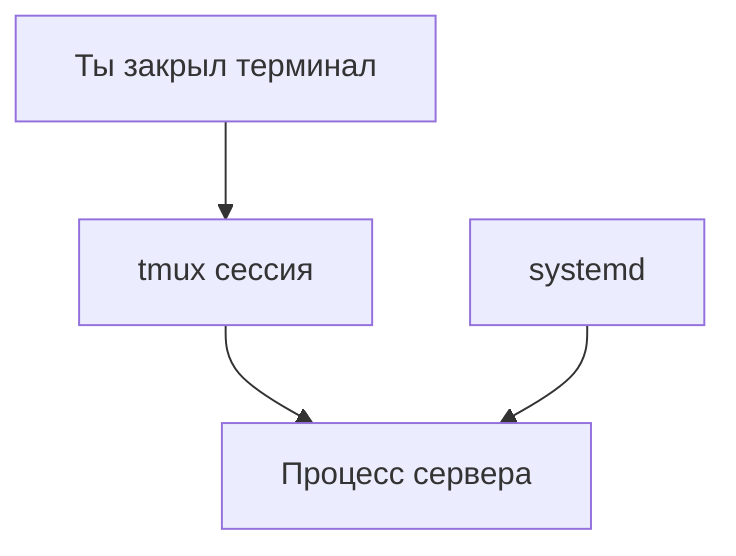

# ENGINEERING ROADMAP
## Том 1 · Лаборатория №6 — Сервер

> **Служба 24/7** · Миссия дня

---

## 📡 История

Linux **установлен**, backup **скрипт** готов. Но **файлы** — не **Minecraft**. Нужна **служба**, которая **работает**, пока ты **спишь**.

---

## 🚀 Миссия

**Запустить** первую **службу** на Linux и понять **systemd** — «диспетчер» программ без окошек.

---

## 🎯 Цель

- понять **сервис = программа 24/7**;
- создать **простую** службу или **screen/tmux** сессию;
- проверить **`systemctl status`**.

**Результат:** процесс **живёт** после закрытия терминала (или в **tmux**).

---

## ⏱ Время

50–60 мин.

---

## 🧰 Что понадобится

- [ ] Linux (Лаб. №3)
- [ ] `~/serwer` **существует**
- [ ] Права `sudo`

---

## 🤔 Как ты думаешь?

1. Почему программа **закрывается**, когда закрываешь терминал?
2. Кто **перезапускает** сервер Google после сбоя?
3. Что такое **демон** (daemon)?

**Настоящее объяснение:** **systemd** — «менеджер смен». **tmux** — «комната», где программа **живёт**, даже если ты **ушёл**.

---

## 💡 Аналогия

**Ресторан:** повара (программы) работают **без** того, чтобы ты **смотрел** на кухню. **systemd** — **шеф**, который **включает** смены.

### 😲 ВАУ!

`uptime` **30 days** — обычный **показатель** сервера, не рекord.

### 😄 Момент улыбки

Закрыл терминал — сервер **не обязан** умирать. Научим его **жить** в **tmux**.

---

## 📷 Иллюстрация

📷 **[Для художника]**

**ID:**  
ILL-T1-L6-01

**Название:**  
tmux живёт

**Тип иллюстрации:**  
Сюжетная сцена · 3/4 на стол · «сервер не умирает с терминалом»

**Главная цель иллюстрации:**  
Показать **монитор с tmux**: **зелёная status bar** внизу окна, внутри — **сессия сервера** (стилизованный текст «живёт»). Ракурс **3/4 на стол**; **ноутбук-сервер** на полке **или** крышка **приподнята**. Зритель: **tmux** = процесс **остаётся**, когда ты ушёл.

Что ребёнок должен почувствовать: **облегчение**, «мой сервер не пропадёт», **контроль**.

---

**Описание сцены**

**3/4** слева: **домашний стол**; на **полке сзади** или **сбоку** — **серый старый ноутбук** (тот же тип, что Лаб.3) с **приоткрытой** крышкой. **Кабель Ethernet** к роутеру (тонкий, **не** главный акцент).

**Экран (главный объект):** окно **tmux** — **чёрный** фон, **несколько** «панелей» (тонкая **горизонтальная** линия делит экран **опционально**). **Status bar** внизу — **полоса `#2D6A4F`** (зелёная EduMost), **без читаемого** «tmux: serwer» — только **цветные сегменты** (зелёный = активная сессия, серый = фон).

В **основной панели** — **зелёноватые** строки «лога» (полоски, **не слова**); одна строка **ярче** — намёк на «serwer zyje» **без букв**.

**Передний план:** **стул пустой** или **отодвинут** — ребёнок **ушёл** (как в «работает, пока ты спишь»). **Опционально:** герой **11 лет** стоит **сбоку**, смотрит на экран — **тёмно-зелёный** худи, **веснушки**, **удовлетворённая** улыбка.

**Что НЕ должно появляться:** читаемый tmux UI с мелким текстом, красные ERROR на весь экран, дата-центр, взрослые.

---

**Главный герой**

- **Возраст:** 11 лет (если в кадре)  
- **Внешность:** **тёмно-каштановые** волосы, **веснушки**  
- **Одежда:** **тёмно-зелёный** худи  
- **Поза:** стоит **сбоку** от экрана, руки в карманах или скрещены **спокойно**  
- **Выражение лица:** **лёгкая улыбка** «работает»  
- **Взгляд:** на status bar tmux  

*Допустима версия **без** героя — пустой стул.*

---

**Дополнительные персонажи**

Нет.

---

**Окружение**

- **Тип:** домашняя **лаборатория**, вечер  
- **Мебель:** стол, стул, полка с ноутбуком-сервером  
- **Детали:** роутер вдалеке, **не** clutter  

---

**Композиция**

- **Формат кадра:** 16:9  
- **План:** средний, **3/4**  
- **Передний план:** край стола / стул  
- **Средний план:** **экран tmux** — **крупно**  
- **Задний план:** полка, стена  
- **Линия взгляда читателя:** 1) **status bar tmux** (зелёная) 2) «живой» лог 3) пустой стул / герой  
- **Правило третей:** экран — правая две трети  

---

**Освещение**

- **Тип:** вечер + **свечение экрана**  
- **Время суток:** вечер  
- **Характер:** status bar **светится**; комната **приглушённая**  
- **Тени:** мягкие  

---

**Цветовая палитра**

- **Основные:** `#2D6A4F` (status tmux), `#1E1E1E` (терминал), `#F8F9FA` (стена)  
- **Дополнительные:** `#6C757D` (ноутбук), `#4ADE80` (лог)  
- **Настроение:** **спокойное**, «живёт»  

---

**Стиль**

Единый стиль **EduMost** · **DK · Usborne**. Вектор; tmux — **упрощённая** схема, не скриншот.  
**Без:** аниме, Pixar, 3D, фотореализм, читаемый мелкий UI.

---

**Возрастная адаптация**

- **Возраст читателя:** 11–14 лет  
- **Можно:** пустой стул, зелёная полоса status  
- **Нельзя:** паника, красные ошибки, хоррор, взрослые  

---

**Формат**

- **Файл:** SVG  
- **Соотношение:** 16:9  
- **Детализация:** status bar узнаваем  
- **Цветовой режим:** RGB  

---

**Текст**

На изображении **текста быть НЕ должно**: ни «tmux», «serwer», «zyje» — только **зелёная полоса** и **стилизованный** лог.

---

**Негативный prompt**

подписи · tmux читаемый · ERROR красный · логотипы · артефакты AI · дата-центр · взрослые · оружие · аниме · Pixar · 3D · неон · мелкий нечитаемый clutter text

---

**Связь с лабораторией**

Лаборатория №6 — **сервер + tmux**: процесс **переживает** закрытие терминала. Иллюстрация к Mermaid «Ты закрыл терминал → tmux → процесс».

---

## 📊 Mermaid



---

## 🔬 Эксперимент

**Правило:** минимум **№1–3**.

---

### Эксперимент 1 — «uptime и службы»

**⏱** 10 мин

```bash
uptime
systemctl status
```

(Pager: **`q`**.) Запиши `up ...` в dnevnik.

---

### Эксперимент 2 — «tmux — живая сессия»

**⏱** 15 мин

```bash
sudo apt install -y tmux
tmux new -s serwer
echo "Moj serwer zyje" > ~/serwer/zyje.txt
```

**Ctrl+B**, затем **D** — **отсоединиться**. Закрой терминал. Открой снова:

```bash
tmux attach -t serwer
```

| `tmux new` | Новая **сессия** | Видишь shell |
| `Ctrl+B D` | **Отсоединиться** | Сессия **жива** |

**✅ Проверь себя:** после `attach` файл **создан**?

---

### Эксперимент 3 — «Простой HTTP (опционально)»

**⏱** 15 мин

```bash
cd ~/serwer/pliki
python3 -m http.server 8080
```

В браузере **на этом же ПК:** `http://localhost:8080` — видишь **список файлов**.

**Ctrl+C** — остановить.

---

### Эксперимент 4 — «Проверка порта»

**⏱** 5 мин

```bash
ss -tlnp | head
```

**Запиши:** что такое **порт** — «номер двери» программы.

---

### Эксперимент 5 — «Лог»

**⏱** 10 мин

```bash
journalctl --no-pager | tail -20
```

**Почему?** Сервер **пишет** что случилось — как **чёрный ящик**.

---

## ⚠ Типичные ошибки

| Проблема | Исправление |
|----------|-------------|
| Сервер умер с терминалом | Используй **tmux** |
| Порт занят | Другой порт: `8081` |
| `python3` нет | `sudo apt install python3` |

---

## 🧪 Проверь себя

- [ ] **tmux** attach работает
- [ ] Понимаю **службу vs ручная программа**
- [ ] `uptime` в dnevnik

---

## 📝 Запись в инженерный дневник

```
=== LAB №6 ===
Data: ___
Co zrobiłem:
  - tmux serwer: TAK/NIE
  - http.server: TAK/NIE
  - uptime: ___
Co było trudne:
Następny pomysł:
```

---

## 🏆 Что теперь умеешь

- [ ] Держать процесс в **tmux**
- [ ] Читать **`systemctl status`**
- [ ] Запустить **простой** файловый сервер

---

## ➡ Что дальше

**Следующий файл:** `07_LAB_SET.md` — **сеть**: почему друг **не коннектится**.

- [ ] tmux сессия — **обязательно**

### 🔮 Вопрос без ответа

Друг **в той же Wi‑Fi** — но **не заходит**. **Почему**?

**Ответ — в Лаборатории №7.**

---

*Оставь tmux **живым**. Сервер **не спит**.*
