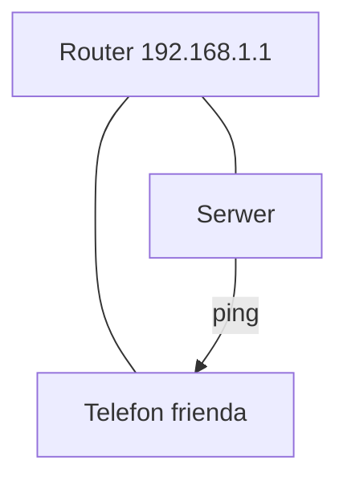

# ENGINEERING ROADMAP
## Том 1 · Лаборатория №7 — Сеть

> **Карта дома** · Миссия дня

---

## 📡 История

Сервер **работает** в tmux — но друг пишет: «**Не коннектится**». Карта Wi‑Fi из **Лаб. №0** — пора **оживить** цифрами.

---

## 🚀 Миссия

**Понять IP, роутер и ping** — и **проверить**, видят ли два устройства **друг друга** в одной сети.

---

## 🎯 Цель

- прочитать **свой IP**;
- **ping** роутера и второго устройства;
- связать с **Minecraft** (порт + IP).

**Результат:** IP и ping в dnevnik, схема «кто к кому».

---

## ⏱ Время

45–60 мин.

---

## 🧰 Что понадобится

- [ ] Linux-сервер + второе устройство (телефон/ноут) в **той же Wi‑Fi**
- [ ] Карта Wi‑Fi (Лаб. №0)
- [ ] Ethernet **желательно** для сервера

---

## 🤔 Как ты думаешь?

1. Зачем **адрес** квартиры в большом доме?
2. **Роутер** — это интернет или **раздаёт адреса**?
3. `ping` — **звонок** «ты жив?»

**Настоящее объяснение:** **IP** = номер квартиры. **Роутер** = консьерж. **ping** = проверка **дороги**.

---

## 💡 Аналогия

```
ИНТЕРНЕТ (улица)
      │
   [РОУТER]
    /  |  \
 тел. ноут сервер
```

### 😲 ВАУ!

В доме **десятки** IP — роутер **раздаёт** их **автоматически** (DHCP).

### 😄 Момент улыбки

«Не коннектится» часто = **разный Wi‑Fi** или **не тот IP**. Не **магия лагов**.

---

## 📷 Иллюстрация

📷 **[Для художника]**

**ID:**  
ILL-T1-L7-01

**Название:**  
Карта Wi‑Fi с IP

**Тип иллюстрации:**  
Образовательная диаграмма · top-down · «как на бумаге ребёнка»

**Главная цель иллюстрации:**  
**Роутер** в **центре** (с **антеннами**); **линии** к **телефону**, **ноутбуку**, **серверу**, **TV**. У **сервера** — **крупно** визуальный **IP** (четыре блока `192.168.x.x` **без читаемых цифр** — **4 цветных квадрата** в ряд, **сервер** выделен). Ракурс **top-down**, как **рисунок на листе** в dnevnik.

Что ребёнок должен почувствовать: **«я вижу свою сеть»**, порядок, **не** страх хакеров.

---

**Описание сцены**

**Вид сверху** на **лист бумаги** (или **разворот тетради**), лежащий на **деревянном столе**. На листе — **схема сети**, нарисованная **аккуратным вектором** (стиль «чистая схема в тетради», **не** хаотичный карандаш).

**Центр:** **роутер** — плоский прямоугольник с **2 антеннами** (вертикальные палочки), **светло-серый** с **зелёным** LED. **Самый крупный** узел **после** сервера.

**Устройства по кругу** (соединены **прямыми** линиями):
- **Смартфон** — маленький прямоугольник  
- **Ноутбук** — раскрытый  
- **Сервер** — **старый ноутбук** icon (как Лаб.3) — **обведён** **янтарной** рамкой `#F4A261`  
- **TV** — плоский экран  

У **сервера** рядом — **4 квадрата** в ряд (символ IP: **блок-блок-блок-блок**) — **крупнее**, чем у других; **без цифр** — разные **оттенки синего/зелёного**.

**Wi‑Fi волны:** **опционально** — **3 дуги** от роутера ( **светло-голубые**, **не** перегружать).

**Герой:** **руки** с **зелёной** ручкой внизу кадра **или** герой **11 лет** сидит, **тёмно-каштановые** волосы, **веснушки**, **тёмно-зелёный** худи — **смотрит** на схему **сверху** (POV hybrid).

**Что НЕ должно появляться:** читаемые IP, логотипы провайдера, «хакер с ноутбуком», взрослые, карта мира.

---

**Главный герой**

- **Возраст:** 11 лет  
- **Внешность:** **тёмно-каштановые** волосы, **веснушки**  
- **Одежда:** **тёмно-зелёный** худи  
- **Поза:** сидит за столом, **наклон** к листу  
- **Выражение лица:** **сосредоточенное**, лёгкая улыбка  
- **Взгляд:** на **сервер** и **IP-блоки**  

---

**Дополнительные персонажи**

Нет.

---

**Окружение**

- **Тип:** стол + **лист-схема**  
- **Детали:** тетрадь янтарная сбоку, ручка  
- **Атмосфера:** день, домашняя лаборатория  

---

**Композиция**

- **Формат кадра:** 16:9  
- **План:** top-down на лист (~70% кадра)  
- **Передний план:** руки / ручка  
- **Средний план:** **роутер** + линии  
- **Акцент:** **сервер** + **4 блока IP**  
- **Линия взгляда читателя:** 1) **роутер** 2) **IP сервера** 3) остальные устройства  
- **Правило третей:** роутер — **центр**; сервер — **нижняя правая** треть  

---

**Освещение**

- **Тип:** **дневной** равномерный  
- **Характер:** лист **яркий**, тени **лёгкие** от рук  
- **Тени:** мягкие  

---

**Цветовая палитра**

- **Основные:** `#2D6A4F` (роутер LED, линии), `#F4A261` (рамка сервера, IP-блоки), `#457B9D` (Wi‑Fi дуги)  
- **Дополнительные:** `#F8F9FA` (лист), `#6C757D` (устройства)  
- **Настроение:** **ясная** карта  

---

**Стиль**

Единый стиль **EduMost** · **DK · Usborne**. Диаграмма — **flat vector** на листе.  
**Без:** 3D isometric clutter, аниме, Pixar, фотореализм, читаемые цифры IP.

---

**Возрастная адаптация**

- **Возраст читателя:** 11–14 лет  
- **Можно:** простая топология, 4–5 устройств  
- **Нельзя:** «взлом сети», страшные хакеры, взрослые, оружие  

---

**Формат**

- **Файл:** SVG  
- **Соотношение:** 16:9  
- **Детализация:** роутер и сервер читаемы в A5  
- **Цветовой режим:** RGB  

---

**Текст**

На изображении **текста быть НЕ должно**: ни `192.168.1.1`, ни подписей устройств — **иконки** + **4 блока** без цифр.

---

**Негативный prompt**

читаемый IP · подписи · логотипы ISP · хакер · артефакты AI · карта мира · взрослые · оружие · аниме · Pixar · 3D · неон · clutter

---

**Связь с лабораторией**

Лаборатория №7 — **сеть**: `ip a`, ping, **карта дома**. Иллюстрация = **рисунок в dnevnik** перед экспериментами с router и serwer IP.

---

## 📊 Mermaid



---

## 🔬 Эксперимент

**Правило:** минимум **№1–3**.

---

### Эксперимент 1 — «Мой IP»

**⏱** 10 мин

```bash
ip a
hostname -I
```

| `ip a` | Все **адреса** | Строка `inet 192.168...` |

**Запиши IP** сервера в dnevnik.

---

### Эксперимент 2 — «Ping роутера»

**⏱** 5 мин

```bash
ping -c 4 192.168.1.1
```

(Если другой шлюз — смотри **настройки роутера** или `ip route`.)

| `ping` | **Проверка** связи | `4 packets transmitted` |

---

### Эксперимент 3 — «Ping телефона»

**⏱** 15 мин

На **телефоне** (Wi‑Fi): настройки → IP (например `192.168.1.23`).

На сервере:

```bash
ping -c 4 192.168.1.23
```

**✅ Проверь себя:** ping **доходит**?

---

### Эксперимент 4 — «Порт Minecraft»

**⏱** 10 мин

Запиши: «Minecraft Java **25565**». Проверь **firewall** позже — сейчас **запомни номер двери**.

---

### Эксперiment 5 — «Таблица устройств»

**⏱** 10 мин

Обнови **карту Wi‑Fi**: подпиши **IP** каждого устройства.

---

## ⚠ Типичные ошибки

| Проблема | Исправление |
|----------|-------------|
| Разные Wi‑Fi | Один **SSID** |
| Guest network | Гостевая сеть **изолирована** |
| Неверный IP | `ip a` **заново** |

---

## 🧪 Проверь себя

- [ ] IP сервера **записан**
- [ ] ping роутера **OK**
- [ ] Карта + IP **обновлены**

---

## 📝 Запись в инженерный дневник

```
=== LAB №7 ===
Data: ___
Co zrobiłem:
  - IP serwera: ___
  - ping router: TAK/NIE
  - ping telefon: TAK/NIE
Co było trudne:
Następny pomysł:
```

---

## 🏆 Что теперь умеешь

- [ ] Прочитать **IP**
- [ ] **ping** для диагностики
- [ ] Объяснить **роутер** и **порт**

---

## ➡ Что дальше

**Следующий файл:** `08_LAB_INTERNET.md` — **за пределами** дома.

- [ ] IP + ping — **обязательно**

### 🔮 Вопрос без ответа

Как **один клик** в Poznań доходит до **сервера в USA**?

**Ответ — в Лаборатории №8.**

---

*Нарисуй IP на карте. **Сеть** — уже не абстракция.*
