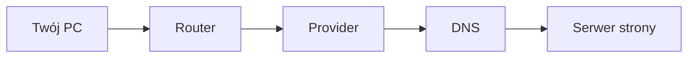

# ENGINEERING ROADMAP
## Том 1 · Лаборатория №8 — Интернет

> **За пределами роутера** · Миссия дня

---

## 📡 История

**Ping** внутри дома **работает**. Но YouTube **не** живёт на роутере. Как **пакет** выходит **в мир**?

---

## 🚀 Миссия

**Проследить путь** запроса: дом → провайдер → DNS → сайт.

---

## 🎯 Цель

- понять **DNS = телефонная книга**;
- выполнить `curl` и `nslookup`/`dig`;
- нарисовать **цепочку** до сайта.

**Результат:** успешный `curl` + схема в dnevnik.

---

## ⏱ Время

40–50 мин.

---

## 🧰 Что понадобится

- [ ] Интернет дома или в школе
- [ ] Linux с терминалом

---

## 🤔 Как ты думаешь?

1. Браузер **знает** IP Google **наизусть**?
2. Кто **переводит** `google.com` → числа?
3. `curl` — **браузер** без картинок?

**Настоящее объяснение:** **DNS** отвечает «какой IP у имени». **curl** — **текстовый** запрос HTTP.

---

## 💡 Аналогия

| Жизнь | Интернет |
|-------|----------|
| Имя в телефоне | **DNS** |
| Набрать номер | **IP** |
| Разговор | **HTTP** |

### 😲 ВАУ!

Запрос из Poznań может **обогнуть** Европу за **миллисекунды**.

### 😄 Момент улыбки

«Интернет не работает» часто = **DNS** или **Wi‑Fi**, не «сломался весь мир».

---

## 📷 Иллюстрация

📷 **[Для художника]**

**ID:**  
ILL-T1-L8-01

**Название:**  
Путь в интернет

**Тип иллюстрации:**  
Образовательная схема · side view · «труба от дома к облаку»

**Главная цель иллюстрации:**  
**Side view**, слева направо: **дом (PC)** → **Router** → **ISP** → **DNS** → **Server/облако**. Визуальная **«труба»** или **туннель** соединяет станции. **DNS** — **фиолетовая** «телефонная книга» (иконка **книги** + **лупа**) — **главный акцент** после дома. Зритель: интернет = **цепочка станций**, не «магия Wi‑Fi».

Что ребёнок должен почувствовать: **любопытство**, «я знаю, куда идёт запрос», **масштаб** без страха.

---

**Описание сцены**

**Горизонтальная** схема на **светлом фоне** (страница книги или **лист на столе**). **Слева** — **силуэт дома** (простой, европейский, **2 окна**, **не** детализированный город); **внутри** или **перед** домом — **иконка PC** (монитор).

**Труба/туннель:** **полупрозрачная** **голубая** «труба» или **лента-путь** тянется **вправо**, соединяя **станции** — **5 остановок**:

1. **PC** — монитор (в доме)  
2. **Router** — с **2 антеннами**  
3. **ISP** — **здание** с **антенной** / **башня** (провайдер — **нейтральное**, без логотипа)  
4. **DNS** — **фиолетовая** `#7B2CBF` **книга** с **лупой** — **крупнее** других иконок, **подсвечена**  
5. **Server / облако** — **стилизованное облако** с **серверной** иконкой внутри (**справа**, финал пути)

Под каждой станцией — **НЕТ текста**; станции различимы **формой иконок**.

**Герой:** **11 лет** **сидит слева внизу** (мини-фигура) или **рука с ручкой** — **тёмно-зелёный** худи, **веснушки**, **указывает** на **DNS** (фиолетовую книгу).

**Что НЕ должно появляться:** читаемые подписи DNS/ISP, логотипы Google/Cloudflare, карта мира, кабели под водой «как фото», взрослые, оружие.

---

**Главный герой**

- **Возраст:** 11 лет (мини-фигура или POV)  
- **Внешность:** **тёмно-каштановые** волосы, **веснушки**  
- **Одежда:** **тёмно-зелёный** худи  
- **Поза:** указывает на **DNS**  
- **Выражение лица:** **«ага!»** — лёгкое озарение  
- **Взгляд:** на фиолетовую книгу DNS  

---

**Дополнительные персонажи**

Нет.

---

**Окружение**

- **Тип:** **схема на листе** / полоса книги  
- **Фон:** `#F8F9FA` или беж  
- **Детали:** труба-путь, 5 иконок  

---

**Композиция**

- **Формат кадра:** 16:9  
- **План:** **panorama** left → right  
- **Передний план:** DNS (фиолетовый акцент)  
- **Средний план:** труба + станции  
- **Задний план:** небо/градиент **светлый**  
- **Линия взгляда читателя:** 1) **дом** 2) **DNS** (фиолетовый акцент) 3) **облако**  
- **Правило третей:** дом — левая треть; облако — правая; DNS — **центр** или **центр-право**  

---

**Освещение**

- **Тип:** **равномерное** «книжное»  
- **Характер:** DNS **слегка** светится фиолетовым  
- **Тени:** flat, минимальные  

---

**Цветовая палитра**

- **Основные:** `#7B2CBF` (DNS — **акцент**), `#457B9D` (труба/ISP), `#2D6A4F` (router/PC)  
- **Дополнительные:** `#F4A261` (дом), `#E9ECEF` (облако)  
- **Настроение:** **образовательное**, **не** кислотное  

---

**Стиль**

Единый стиль **EduMost** · **DK · Usborne**. Горизонтальная **infographic** vector.  
**Без:** аниме, Pixar, 3D, фотореализм, подписи под станциями.

---

**Возрастная адаптация**

- **Возраст читателя:** 11–14 лет  
- **Можно:** метафора трубы, фиолетовая «книга» DNS  
- **Нельзя:** «опасный интернет», хакеры, кровь, взрослые  

---

**Формат**

- **Файл:** SVG  
- **Соотношение:** 16:9  
- **Детализация:** 5 станций различимы в A5  
- **Цветовой режим:** RGB  

---

**Текст**

На изображении **текста быть НЕ должно**: ни «DNS», «ISP», «Server» — только **иконки** и **цвет** DNS.

---

**Негативный prompt**

подписи · логотипы Google · Cloudflare · читаемый текст · артефакты AI · карта мира · взрослые · оружие · аниме · Pixar · 3D · неон · хакер

---

**Связь с лабораторией**

Лаборатория №8 — **интернет**: путь **PC → Router → ISP → DNS → Web**. Иллюстрация к Mermaid и экспериментам `curl`, `dig`.

---

## 📊 Mermaid



---

## 🔬 Эксперимент

**Правило:** минимум **№1–3**.

---

### Эксперимент 1 — «curl»

**⏱** 10 мин

```bash
curl -I https://example.com
```

| `curl -I` | **Заголовки** ответа | Строка `HTTP/2 200` |

---

### Эксперимент 2 — «DNS»

**⏱** 10 мин

```bash
nslookup google.com
```

Или: `dig google.com +short`

**Запиши** один IP из ответа.

---

### Экспeriment 3 — «Traceroute (кратко)»

**⏱** 15 мин

```bash
traceroute -m 8 google.com
```

**Почему?** Видишь **хопы** — «станции» пути. (Может быть медленно — **подожди**.)

---

### Эксперимент 4 — «Схема в dnevnik»

**⏱** 10 мин

Нарисуй: PC → router → ISP → DNS → site.

---

### Эксперимент 5 — «curl localhost»

**⏱** 5 мин

```bash
curl -I http://localhost:8080
```

(Если сервер из Лаб. №6 **не** запущен — запиши «brak — OK».)

---

## ⚠ Типичные ошибки

| Проблема | Исправление |
|----------|-------------|
| `Could not resolve host` | Проверь **DNS / Wi‑Fi** |
| `curl` долго | **Таймаут** — попробуй `example.com` |
| traceroute `* * *` | **Нормально** — некоторые узлы **молчат** |

---

## 🧪 Проверь себя

- [ ] `curl` **200** или **понятная** ошибка
- [ ] DNS **даёт IP**
- [ ] Схема **в dnevnik**

---

## 📝 Запись в инженерный дневник

```
=== LAB №8 ===
Data: ___
Co zrobiłem:
  - curl example.com: ___
  - nslookup IP: ___
  - schemat: TAK/NIE
Co było trudne:
Następny pomysł:
```

---

## 🏆 Что теперь умеешь

- [ ] Объяснить **DNS**
- [ ] Использовать **curl**
- [ ] Нарисовать **путь в интернет**

---

## ➡ Что дальше

**Следующий файл:** `09_LAB_MINECRAFT_PROEKT.md` — **большой проект** тома 1.

- [ ] curl + DNS — **обязательно**

### 🔮 Вопрос без ответа

Все **готово** — **как** запустить **Minecraft**, чтобы **друг зашёл**?

**Ответ — в Лаборатории №9.**

---

*Интернет — **не облако**. Это **цепочка** машин. Ты её **увидел**.*
