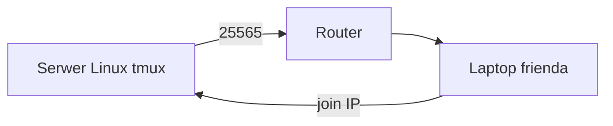

# ENGINEERING ROADMAP
## Том 1 · Лаборатория №9 — Первый большой проект: Minecraft

> **🟢 Проект уровня 1** · Миссия дня

---

## 📡 История

**10 лабораторий** позади: Linux, файлы, bash, сеть, интернет. Пора **собрать** всё в **один** проект — **сервер Minecraft**, куда **зайдёт друг**.

---

## 🚀 Миссия

**Запустить** Minecraft Java-сервер на **своём Linux**, проверить **вход с другого устройства** в **той же Wi‑Fi**.

---

## 🎯 Цель

- скачать / подготовить **server.jar** (или Paper);
- запустить в **tmux** на порту **25565**;
- друг **подключается** по **IP сервера**.

**Результат:** работающий мир + запись в dnevnik + **скрин** (без паролей).

---

## ⏱ Время

2–4 часа (можно **3 дня** по 45 мин). **Не спеши.**

---

## 🧰 Что понадобится

- [ ] Linux-сервер (Лаб. №3–6)
- [ ] **≥ 4 GB RAM** свободно для Minecraft
- [ ] Java: `sudo apt install -y openjdk-17-jre-headless`
- [ ] IP сервера (Лаб. №7)
- [ ] **EULA** — примешь в `eula.txt` (только для **личного** сервера)

---

## 🤔 Как ты думаешь?

1. Сервер и **клиент** — **одна** программа?
2. Зачем **tmux**, если уже есть скрипт backup?
3. Почему порт **25565**?

**Настоящее объяснение:** **server.jar** = **мир 24/7**. Клиенты **подключаются** по **IP:порт**. **tmux** держит мир **живым**.

---

## 💡 Аналогия

**Minecraft-сервер** = **дом**, где **все** строят. **Клиент** = **гость с ключом** (IP).

### 😲 ВАУ!

Первый **Hypixel** начинался с **одного** jar на **одном** ПК — как **твой**.

### 😄 Момент улыбки

«Не заходит» = **90%** сеть, **10%** магия. У тебя уже есть **ping** и **IP**.

---

## 📷 Иллюстрация

📷 **[Для художника]**

**ID:**  
ILL-T1-L9-01

**Название:**  
Друг заходит на сервер

**Тип иллюстрации:**  
Сюжетная сцена · два ноутбука face-to-face · финал Тома 1

**Главная цель иллюстрации:**  
**Два ноутбука** друг напротив друга (**чуть сверху**): **левый** — **сервер** (tmux, **консоль** minecraft — **стилизованные** строки, **не** логотип Mojang); **правый** — **Minecraft** «Multiplayer» / **загрузка мира** ( **блочный** ландшафт, **2 маленьких** игрока-skin **без** текста). Между ними — **Wi‑Fi волны** + **4 блока IP** (**без цифр**). **Радость** — на **правом** экране (яркий мир) и **опционально** у **второго** ребёнка за правым ноутбуком.

Что ребёнок должен почувствовать: **торжество**, «**я сделал сервер, друг зашёл**», **дружба**, **не** одержимость играми.

---

**Описание сцены**

**Чуть сверху** (~30°): **два ноутбука** на **одном столе** (или **два стола** напротив) — **face-to-face**, экраны **к читателю**.

**Левый ноутбук (хост / сервер):**
- **Старый** серый корпус (как Лаб.3/6)  
- Экран: **tmux** — **верхняя** половина **чёрный** терминал с **зелёными** полосками; **нижняя** — **консоль** игрового сервера (**оранжевые/белые** полоски лога — **не читаемые**, **не** слово «minecraft» крупно)  
- **Ethernet** к роутеру (фон)

**Правый ноутбук (друг):**
- **Современнее**, тоньше  
- Экран: **Minecraft**-стиль **блочный** мир ( **зелёная** трава, **коричневое** дерево) — **стилизованный**, **не** скриншот Mojang; меню **Multiplayer** — **3–4** прямоугольные **кнопки** **без букв** (серые блоки); **2 pixel-фигурки** игроков на экране  

**Между ноутбуками:** **3 дуги Wi‑Fi** (`#457B9D`) + **4 квадрата** (IP) **янтарные** — **без numerals**.

**Персонажи:**
- **Герой серии** (11 лет, **тёмно-каштановые** волосы, **веснушки**, **тёмно-зелёный** худи) — **слева**, **спокойная** улыбка, **смотрит** на **оба** экрана  
- **Друг** ( **другая** причёска — **русые** короткие волосы, **синий** худи **без** надписей) — **справа**, **радость**, руки на клавиатуре  

**Что НЕ должно появляться:** логотип Minecraft/Mojang, читаемый IP, «Twój serwer», насилие в игре, взрослые, Discord/Twitch UI.

---

**Главный герой**

- **Возраст:** 11 лет  
- **Внешность:** **тёмно-каштановые** волосы, **веснушки** — узнаваемый герой серии  
- **Одежда:** **тёмно-зелёный** худи  
- **Поза:** сидит слева, **наклон** к серверному экрану  
- **Выражение лица:** **гордая** мягкая улыбка  
- **Эмоция:** «получилось»  
- **Взгляд:** на **правый** экран (мир загружается)  

---

**Дополнительные персонажи**

- **Друг** (~11–12 лет): **русые** волосы, **синий** худи, **радостное** лицо — **не** клон героя  

---

**Окружение**

- **Тип:** **два** места за столом **или** одна комната + **комната друга** (разделить **мягкой** вертикальной линией **опционально**)  
- **Детали:** роутер на заднем плане, **дневной** свет  
- **Атмосфера:** **праздник** завершения проекта  

---

**Композиция**

- **Формат кадра:** 16:9  
- **План:** средний, **два экрана** симметрично  
- **Передний план:** Wi‑Fi + IP-блоки **между** ноутбуками  
- **Средний план:** **оба экрана**  
- **Задний план:** герой и друг  
- **Линия взгляда читателя:** 1) **два игрока** на правом экране 2) **Wi‑Fi** 3) **улыбка** друга  
- **Правило третей:** левый ноутбук — левая треть; правый — правая  

---

**Освещение**

- **Тип:** **дневной** + **свечение экранов**  
- **Характер:** правый экран **ярче** (радость, мир)  
- **Тени:** мягкие  

---

**Цветовая палитра**

- **Основные:** `#2D6A4F` (герой, grass blocks), `#457B9D` (Wi‑Fi), `#F4A261` (IP-блоки)  
- **Дополнительные:** `#1E1E1E` (tmux), `#6C757D` (серверный ноутбук), `#3B82F6` (худи друга)  
- **Настроение:** **радостное**, **теплое**  

---

**Стиль**

Единый стиль **EduMost** · **DK · Usborne**. Minecraft — **stylized blocks**, **не** официальный asset pack.  
**Без:** Mojang logo, аниме, Pixar, 3D render Minecraft, читаемый UI, неон.

---

**Возрастная адаптация**

- **Возраст читателя:** 11–14 лет  
- **Можно:** два ребёнка, блочная игра **стилизованно**  
- **Нельзя:** логотипы, токсичный chat, violence, взрослые, оружие вне игры  

---

**Формат**

- **Файл:** SVG  
- **Соотношение:** 16:9  
- **Детализация:** оба экрана различимы  
- **Цветовой режим:** RGB  

---

**Текст**

На изображении **текста быть НЕ должно**: ни «Multiplayer», «Twój serwer», ни IP цифрами, ни Mojang — **иконки** и **блоки**.

---

**Негативный prompt**

Mojang · Minecraft logo · читаемый IP · Multiplayer текст · Discord · Twitch · подписи · артефакты AI · взрослые · оружие · кровь · аниме · Pixar · 3D render · неон · официальный скриншот игры

---

**Связь с лабораторией**

Лаборатория №9 — **Minecraft-проект**: **финал Тома 1** — друг **заходит** на **свой** Linux-сервер. Иллюстрация к Mermaid Serwer → Router → Friend и badge ILL-T1-L9-02 (отдельно).

---

## 📊 Mermaid



---

## 🔬 Эксперимент

**Правило:** **все** эксперименты — это **шаги проекта**.

---

### Эксперимент 1 — «Java»

**⏱** 15 мин

```bash
java -version
mkdir -p ~/minecraft
cd ~/minecraft
```

| `java -version` | **JRE** установлена | Версия **17+** |

---

### Эксперiment 2 — «Скачай server.jar»

**⏱** 20 мин

На [minecraft.net](https://www.minecraft.net/en-us/download/server) скачай **server.jar** в `~/minecraft/` (или Paper — по желанию родителей).

**Проверка:** `ls -la ~/minecraft/*.jar`

---

### Эксперiment 3 — «Первый запуск и EULA»

**⏱** 20 мин

```bash
cd ~/minecraft
java -Xmx2G -Xms1G -jar server.jar nogui
```

Останови **Ctrl+C**. Открой `eula.txt`, измени `eula=false` → **`eula=true`**.  
**Только** для **домашнего** некomмерческого сервера.

---

### Эксперiment 4 — «tmux + сервер»

**⏱** 30 мин

```bash
tmux new -s minecraft
cd ~/minecraft
java -Xmx2G -Xms1G -jar server.jar nogui
```

**Ctrl+B**, **D** — отсоединиться. Сервер **работает**.

| tmux | Сервер **жив** после закрытия терминала |

---

### Эксперiment 5 — «Друг заходит»

**⏱** 30 мин

На **другом** ПК (та же Wi‑Fi): Minecraft → **Multiplayer** → **Add Server** → IP: `192.168.x.x` (твой сервер).

**✅ Проверь себя:** друг **в мире**?

**Если нет:** `ping`, firewall (`sudo ufw allow 25565/tcp` — **осторожно**, только если понимаешь).

---

## ⚠ Типичные ошибки

| Проблема | Исправление |
|----------|-------------|
| `Unable to access jarfile` | `cd ~/minecraft`, имя jar **точное** |
| Out of memory | `-Xmx2G` или меньше мир |
| Friend timeout | **Один Wi‑Fi**, верный **IP**, порт **25565** |
| EULA false | `eula=true` **осознанно** |

---

## 🧪 Проверь себя

- [ ] Сервер в **tmux** **online**
- [ ] **Ты** зашёл с основного ПК
- [ ] **Друг** зашёл **или** второй профиль / телефон (Bedrock — **другой** протокол, запиши «Java only»)
- [ ] **LAB №9** + **фото** экрана

---

## 📝 Запись в инженерный дневник

```
=== LAB №9 — PROJEKT MINECRAFT ===
Data: ___
Co zrobiłem:
  - server.jar: TAK/NIE
  - tmux minecraft: TAK/NIE
  - IP serwera: ___
  - Friend joined: TAK/NIE
  - backup.sh nadal dziala: TAK/NIE
Co było trudne:
Co zmieniłbym:
Następny pomysł (Tom 2):
```

---

## 🏆 Что теперь умеешь

- [ ] **Запустить** игровой **сервер**
- [ ] Держать его в **tmux**
- [ ] **Диагностировать** «не коннектится»
- [ ] **Завершить** **уровень 1 — Исследователь**

---

## ➡ Что дальше

**🎉 Том 1 завершён.**

**Том 2** — **Raspberry Pi** и **LED** (🔵 Конструктор, книга `engineering-roadmap-tom-02`).

- [ ] Minecraft **работает** — **обязательно**
- [ ] backup + сервер **не конфликтуют** — **обязательно**

### 🔮 Вопрос без ответа

Сервер **цифровой**. А **свет** на столе — **физический**. Как **один GPIO-пин** включает **LED**?

**Ответ — в Томе 2:** Лаборатория №4 — LED.

---

*Выключи монитор. Сервер **играет** без тебя. **Ты — инженер уровня 1.***
