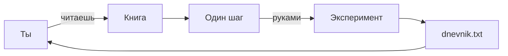
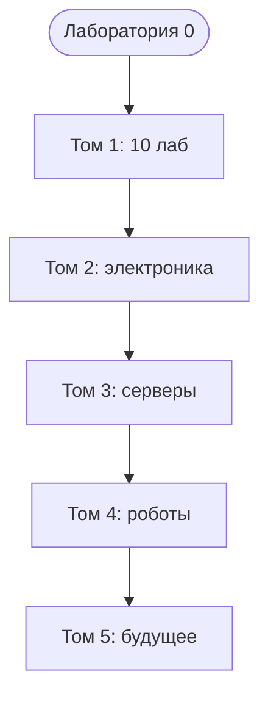

# ENGINEERING ROADMAP
## Том 1 · Лаборатория №0 — Добро пожаловать в инженерную лабораторию

> **Открытие лаборатории** · Миссия дня

---

## 📡 История

Сегодня ты открываешь **пустую комнату** — будущую инженерную лабораторию. Рядом **никого**: ни родителей, ни учителя, ни программиста. Есть **ты**, **экран** и **эта книга**.

Привет. Я — **эта книга**. Не робот и не учитель в классе. Веду **шаг за шагом**, как инженер рядом — только **ты и экран**.

**Если ты никогда не учился инженерии сам — это нормально.** Большинство взрослых тоже не умеют то, что ты сделаешь за год.

---

## 🚀 Миссия

**Научиться учиться как инженер** — и подготовить **Moja_Laboratoria** + **dnevnik** для **всех лабораторий Тома 1** (и дальше — всей академии).

---

## 🎯 Цель

- понять **правила игры**, безопасность и порядок лабораторий;
- создать **dnevnik** и папку проектов;
- сделать **первые эксперименты** — без страха и без взрослых.

**Результат:** папка `Moja_Laboratoria`, файл `dnevnik.txt`, **паспорт** компьютера (CPU + RAM), **карта Wi‑Fi** на бумаге.

---

## ⏱ Время

40–60 минут (можно **2 дня** по 25–30 мин).

---

## 🧰 Что понадобится

- [ ] Ноутбук или ПК (Windows / Mac / Linux)
- [ ] Ручка и бумага для карты Wi‑Fi
- [ ] 15 минут тишины
- [ ] Готовность **писать** в dnevnik, а не «запомнить»

---

## 🤔 Как ты думаешь?

**Не читай ответ сразу.**

1. Зачем инженер NASA пишет отчёты, а не «запоминает в голове»?
2. Кто будет делать проекты — **ты** или книга?
3. Можно ли пропустить dnevnik и «вспомнить потом»?

*(Запиши ответы в dnevnik. Потом сверься.)*

**Настоящее объяснение:** инженер **записывает**, чтобы через месяц **помнить**, как чинил. Книга **объясняет** — **делаешь ты**. Без dnevnik ошибки **повторяются**.

---

## 💡 Аналогия

**Книга** = **GPS для похода**. Без GPS можно заблудиться. С GPS ты **идёшь сам** — но **не теряешься**.

| В жизни | В лаборатории |
|---------|---------------|
| GPS | Эта книга |
| Тропа | Один шаг за раз |
| Дневник похода | `dnevnik.txt` |

**Инженер vs обычный человек:** телефон не заряжается.

| Обычный | Инженер |
|---------|---------|
| «Сломан. Выбросить.» | «Кабель? Разъём? Блок питания?» |
| Сдаётся | **Проверяет по очереди** |

### 😲 ВАУ!

Google **начинался** в гараже — с **записей** и **любопытства**, как твой dnevnik сегодня.

### 😄 Момент улыбки

Книга **не** сделает проект за тебя. Как GPS **не** идёт за тебя по лесу — только **показывает**, куда шаг.

---

## 📷 Иллюстрация

:::illustration
ILL-T1-L0-01
:::

```
  ТЫ ●────► Лаб.1 ──► Лаб.2 ──► ... ──► Лаб.9 (Minecraft)
              │
              ╳  Том 2 (LED) — РАНО, если не сделан Том 1
```

---

## 📊 Mermaid





---

## 🔬 Эксперимент

**Правило:** минимум **№1, №2 и №3**. Без них лаборатория **не засчитана**.

---

### Эксперимент 1 — «Паспорт компьютера»

**⏱** 10 мин

**Windows:** Win → **Параметры** → **Система** → **О системе** → **Процессор** и **ОЗУ**.

**Mac:**  → **Об этом Mac**.

**Linux:** `Ctrl+Alt+T`:

```bash
lscpu
free -h
```

| Команда | Что делает | Как проверить |
|---------|------------|---------------|
| `lscpu` | Паспорт **CPU** | Видишь модель процессора |
| `free -h` | Сколько **RAM** | Строка с GB |

**Почему?** Компьютер **хранит** данные о себе — OS их **читает**.

**✅ Проверь себя:** в dnevnik есть **CPU** и **RAM (GB)**?

---

### Эксперимент 2 — «Карта Wi‑Fi дома»

**⏱** 15 мин

Нарисуй на бумаге: **роутер** в центре, линии к телефону, ноутбуку, TV, твоему ПК.

**Почему?** В **Лаборатории №7** (сеть) эта карта — половина решения «не коннектится».

**✅ Проверь себя:** на рисунке есть слово **«роутер»**?

---

### Эксперимент 3 — «Папка Moja_Laboratoria»

**⏱** 5 мин

**Windows:** рабочий стол → правая кнопка → **Создать** → **Папку** → `Moja_Laboratoria` → внутри **текстовый документ** → `dnevnik.txt` (проверь: **не** `dnevnik.txt.txt`).

**Mac:** Finder → Рабочий стол → **Новая папка** → TextEdit → **Обычный текст** → `dnevnik.txt`.

**Linux:**

```bash
mkdir -p ~/Moja_Laboratoria
nano ~/Moja_Laboratoria/dnevnik.txt
```

| `mkdir -p` | **Создаёт папку** | `ls ~/Moja_Laboratoria` |
| `nano` | Редактор текста | `Ctrl+O` сохранить, `Ctrl+X` выход |

**Почему?** Все проекты — **в одном месте**, как полка в мастерской.

**✅ Проверь себя:** открыл папку — видишь **dnevnik.txt**?

---

### Эксперимент 4 — «Три вопроса инженера»

**⏱** 10 мин

Напиши в dnevnik **3 вопроса** про технику, например:
1. Чем Linux отличается от Windows?
2. Как друг зайдёт на мой Minecraft-сервер?
3. Почему LED не горит без резистора?

**Почему?** Список неизвестного — привычка NASA перед миссией.

**✅ Проверь себя:** **ровно 3** вопроса, не про «как стать богатым»?

---

### Эксперимент 5 — «Клад для разбора»

**⏱** 15 мин

Найди **безопасный** мёртвый предмет: старый DVD-привод, мёртвая мышь (**не** блок питания принтера, **не** единственный ноутбук).

**Почему?** Позже разберёшь — бесплатная «анатомия» техники.

**✅ Проверь себя:** предмет **не** в розетке 230V?

---

## ⚠ Типичные ошибки

| Проблема | Как исправить |
|----------|---------------|
| «Прочитаю 5 лабораторий, потом начну» | Одна лаборатория → **одно действие** → dnevnik |
| Имя `dnevnik.txt.txt` | Убери лишний `.txt` |
| Пропустить dnevnik | 30 секунд записи **сейчас** |
| Лезть в розетку 230V | **Никогда.** Только 3V/5V из книги |
| LED без резистора (Том 2) | Сначала **закрой Том 1** |
| Разбирать **единственный** рабочий ПК | Только **VirtualBox** или **мёртвая** техника |
| LED **без резистора** | Сгорит за секунду — **только** с 330 Ω (позже) |
| Блок питания **принтера** | **Не трогать** — остаётся заряд |

---

## 🧪 Проверь себя

- [ ] `Moja_Laboratoria` **создана**
- [ ] `dnevnik.txt` **есть** и **≥ 2** записи
- [ ] CPU и RAM **в dnevnik**
- [ ] Карта Wi‑Fi **нарисована**
- [ ] Первый вопрос инженера — **«Почему?»** (не «сломано»)

---

## 📝 Запись в инженерный дневник

```
=== LAB №0 ===
Data: ___
Co zrobiłem:
  - Moja_Laboratoria: TAK/NIE
  - dnevnik.txt: TAK/NIE
  - CPU: ___
  - RAM: ___ GB
  - Mapa Wi-Fi: TAK/NIE
  - 3 pytania: TAK/NIE
Co było trudne:
Co zmieniłbym:
Następny pomysł:
```

---

## 🏆 Что теперь умеешь

- [ ] Объяснить, **зачем** инженерный dnevnik
- [ ] Создать **Moja_Laboratoria** и **dnevnik.txt**
- [ ] Прочитать **паспорт** CPU и RAM
- [ ] Нарисовать **карту Wi‑Fi**
- [ ] Задавать **«Почему?»** вместо «не работает»

---

## ➡ Что дальше

**Следующий файл:** `01_LAB_KOMPUTER.md` — **Лаборатория №1:** что внутри коробки.

**Перед переходом:**

- [ ] Moja_Laboratoria + dnevnik — **обязательно**
- [ ] Паспорт CPU/RAM в dnevnik — **обязательно**
- [ ] Блок **LAB №0** заполнен — **обязательно**
- [ ] Эксп. 4 и 5 — **рекомендуется**

**Если обязательные галочки пустые — не открывай Лабораторию №1.**

### 🔮 Вопрос без ответа

Ты нажал кнопку — экран загорелся. **Как** нажатие превращается в **картинку**? Кто **первый** в цепочке внутри коробки?

**Ответ — в Лаборатории №1.**

---

*Закрой книгу. Открой `dnevnik.txt` — первая запись инженера уже там.*
