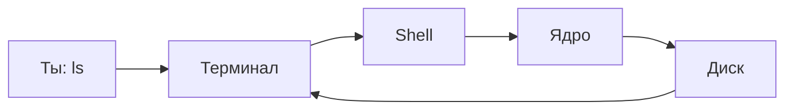

# ENGINEERING ROADMAP
## Том 1 · Лаборатория №2 — Терминал

> **Говори с компьютером словами** · Миссия дня

---

## 📡 История

В **Лаборатории №1** ты разложил коробку на части. Остался вопрос: компьютер понимает **числа** — как **приказывать** ему **словами**?

Сегодня поступило **чёрное окно с курсором**. Так работают Google, NASA и твой будущий **сервер**.

---

## 🚀 Миссия

**Открыть терминал** и **безопасно** выполнить первые команды — `pwd`, `ls`, `cd`, `mkdir` — **без мышки**.

---

## 🎯 Цель

- понять **терминал → shell → ядро**;
- дойти до `Moja_Laboratoria` **текстом**;
- **не бояться** ошибок.

**Результат:** команды в dnevnik, `pwd` и `ls` работают.

---

## ⏱ Время

45–60 мин (можно **2 дня** по 25–30 мин).

---

## 🧰 Что понадобится

- [ ] `Moja_Laboratoria` (Лаб. №0)
- [ ] Linux **или** Windows (есть путь **1W** для Windows)
- [ ] Готовность **копировать** команды **точно**

---

## 🤔 Как ты думаешь?

1. Мышка **слишком медленная** для 1000 файлов?
2. На сервере **нет экрана** — только текст?
3. Короткие **слова** легче **повторять**?

**Настоящее объяснение:** **терминал** показывает текст; **shell** переводит команды; **ядро** выполняет. **SMS другу** точнее, чем «вон там».

---

## 💡 Аналогия

| Жизнь | Компьютер |
|-------|-----------|
| SMS: «Принеси книгу с полки B» | `cd` + `ls` |
| Друг идёт | Shell → ядро |
| Ответ | Текст в терминале |

### 😲 ВАУ!

**Android** и **сервер Google** — родня; инженеры **начинали** с такого же чёрного окна.

### 😄 Момент улыбки

Терминал **не кусается**. Опечатался — **Enter** ещё раз с правильным словом.

---

## 📷 Иллюстрация

📷 **[Для художника]** Ребёнок перед тёмным терминалом; зелёный текст; блокнот с командами; «центр управления», не страшилка.

---

## 📊 Mermaid



---

## 🔬 Эксперимент

**Правило:** минимум **№1 и №2** (Linux). Без Linux — **№1W и №2W**.

---

### Эксперимент 1 — «Где я?»

**⏱** 10 мин

```bash
pwd
ls
ls -la
```

| `pwd` | Где **стою** | Путь на экране |
| `ls` | Список **здесь** | Имена файлов |
| `ls -la` | Подробно + **скрытые** | Строки с `.` |

**✅ Проверь себя:** `pwd` **без ошибок**?

---

### Эксперимент 1W — Windows

**⏱** 10 мин

```
cd %USERPROFILE%
dir
```

**✅ Запиши:** «Windows: dir показал … Жду Linux в Лаб. №3».

---

### Эксперимент 2 — «Найди лабораторию»

**⏱** 15 мин

```bash
cd ~
cd Moja_Laboratoria
pwd
cat dnevnik.txt
```

**✅ Проверь себя:** `cat` показал **твой** текст?

---

### Эксперимент 3 — «Новая комната»

**⏱** 10 мин

```bash
cd ~/Moja_Laboratoria
mkdir projekt_terminal_01
echo "LAB 2 OK" > test.txt
cat test.txt
```

| `mkdir` | Новая **папка** | `ls` видит имя |
| `echo >` | **Создать** файл | `cat` показывает текст |

---

### Эксперимент 4 — «Ошибка нарочно»

**⏱** 5 мин

```bash
cd NieIstniejacaPasta
```

**Прочитай** ошибку. **Запиши** в dnevnik. Система **не сломалась**.

---

### Эксперимент 5 — «Справка»

**⏱** 10 мин

```bash
ls --help
```

Или `man ls` → **`q`** выход.

**✅ Проверь себя:** Linux **объясняет** сам себя?

---

## ⚠ Типичные ошибки

| Проблема | Исправление |
|----------|-------------|
| `command not found` | Опечатка или Windows вместо Linux |
| `Lab` ≠ `lab` | **Точное** имя из `ls` |
| «Чёрное окно — сломал» | Закрыл — **всё как было** |

---

## 🧪 Проверь себя

- [ ] Терминал **открывается**
- [ ] `pwd`, `ls`, `cd` **пробовал**
- [ ] Дошёл до **dnevnik** через текст
- [ ] Ошибку **прочитал** и **записал**

---

## 📝 Запись в инженерный дневник

```
=== LAB №2 ===
Data: ___
Co zrobiłem:
  - Terminal: TAK/NIE
  - pwd: ___
  - cd Moja_Laboratoria: TAK/NIE
  - Blad (cytat): ___
Co było trudne:
Następny pomysł:
```

---

## 🏆 Что теперь умеешь

- [ ] Открыть **терминал**
- [ ] Объяснить **терминал / shell / ядро**
- [ ] Выполнить `pwd`, `ls`, `cd`, `mkdir`
- [ ] Читать **ошибку** как подсказку

---

## ➡ Что дальше

**Следующий файл:** `03_LAB_LINUX.md` — **Лаборатория №3:** установить **Linux**.

- [ ] Эксп. 1–2 — **обязательно**
- [ ] LAB №2 — **обязательно**

### 🔮 Вопрос без ответа

Как друг зайдёт на **твой Minecraft**, пока ноутбук **выключен**?

**Ответ — в Лаборатории №3.**

---

*Закрой терминал. Завтра — **сервер**, который не спит.*
