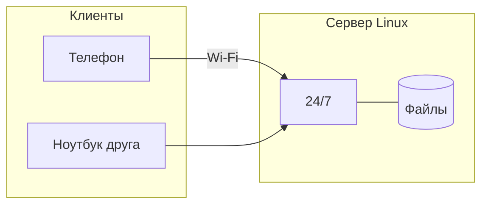
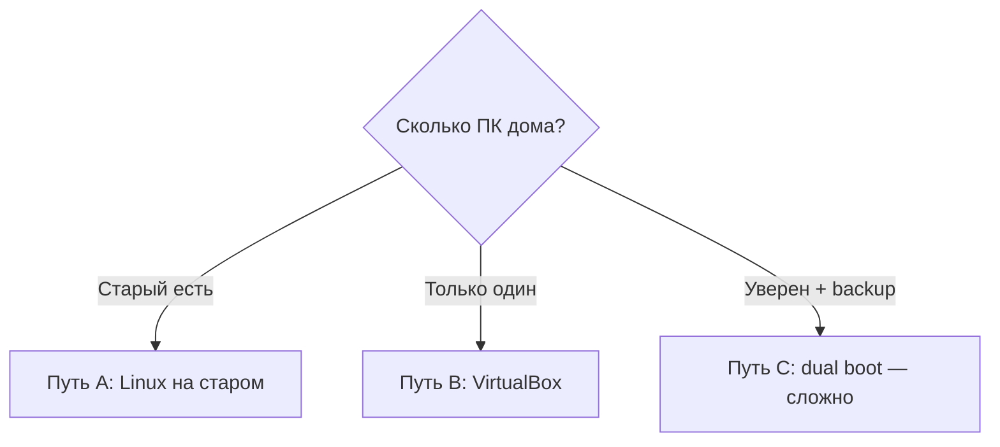

# ENGINEERING ROADMAP
## Том 1 · Лаборатория №3 — Linux

> **Построить дом для сервера** · Миссия дня

---

## 📡 История

В **Лаборатории №2** ты научился **говорить** с компьютером словами — `pwd`, `ls`, `cd`. Остался вопрос из интриги: **как** друг зайдёт на **твой Minecraft-сервер**, пока твой ноутбук **выключен**?

Сегодня в лабораторию поступил **старый ноутбук** (или **VirtualBox** на твоём ПК). Задача — **не «выучить Linux»**, а **построить** дом, где сервер может **жить 24/7**.

**Если Лаб. №2 не сделана — вернись в `02_LAB_TERMINAL.md`.**

---

## 🚀 Миссия

**Построить** дом для сервера — **безопасно** установить Linux и подготовить папку `~/serwer`.

---

## 🎯 Цель

- понять **Linux на сервере** (не «для хакеров», а **для инженера**);
- пройти установку (**Путь A** — старый ПК **или** **Путь B** — VirtualBox);
- выполнить **первые команды** «здоровья» сервера: `uname`, `uptime`, `df -h`.

**Результат:** работающий **Linux**, запись в dnevnik, папка `~/serwer/pliki/test.txt`, пароль **только** в dnevnik.

---

## ⏱ Время

2–4 часа установка (можно **2–3 дня** по 30–45 мин); проверки — 30 мин.

---

## 🧰 Что понадобится

- [ ] Терминал **открывался** (Лаборатория №2)
- [ ] На диске **≥ 20 GB** свободно (Лаборатория №1)
- [ ] **Старый ПК** **или** **VirtualBox** (если дома **один** компьютер)
- [ ] USB **8 GB+** (можно **стереть**) — для Пути A
- [ ] Файл **Ubuntu .iso** · **Etcher** или **Rufus**
- [ ] Ethernet **желательно** (или Wi‑Fi)
- [ ] `dnevnik.txt` — сюда **запишешь пароль** (никому!)

---

## 🤔 Как ты думаешь?

**Не читай ответ сразу.**

1. Мир Minecraft **живёт** только на **твоём** диске?
2. Нужен компьютер, который **всегда включён**?
3. Почему Google ставит **Linux**, а не «обычный» домашний Windows на миллион машин?

*(Запиши в dnevnik. Сверь с картой Wi‑Fi из Лаб. №0.)*

**Настоящее объяснение:** **Сервер** — компьютер или программа, которая **даёт услуги** другим (**клиентам**). **Linux** на сервере — **стабильно**, **бесплатно**, **терминал** — главный инструмент. **Android** — тоже **Linux** внутри.

---

## 💡 Аналогия

**Библиотека:**

| В жизни | На сервере |
|---------|------------|
| Ты просишь книгу | Клиент просит **файл** |
| Библиотекарь находит | **Сервер** отдаёт с **диска** |
| Полки | **Папки** на SSD |

**Minecraft:** пока **твой** ПК держит мир — друзья играют. **Выключил** — мир **пропал**. **Сервер** = компьютер **24/7**.

**VirtualBox:** **квартира внутри квартиры** — Windows **остаётся**, Linux **в окне**.

### 😲 ВАУ!

Твой телефон и **сервер Google** — **родственники** по ядру Linux.

### 😄 Момент улыбки

Сервер — **не** монстр в дата-центре. Это **старый ноутбук** в углу — как ночной свет, только **полезнее**.

---

## 📷 Иллюстрация

:::illustration
ILL-T1-L3-01
:::

:::illustration
ILL-T1-L3-02
:::

```
┌──────────────────────┐
│  Старый ноутбук      │  ← экран можно закрыть
│  Ethernet → роутер   │
└──────────────────────┘
   работает тихо, 24/7
```

---

## 📊 Mermaid






---

## 🔬 Эксперимент

**Правило:** минимум **LEGO 1–4** (установка) + **№1, №2, №4** (проверки).  
VirtualBox **считается** — это **тоже** твой Linux.

**Прочти блок «Безопасность» ниже до «Erase disk».**

---

### Безопасность — перед установкой

| Риск | Как избежать |
|------|--------------|
| Стереть Windows с **единственного** ПК | **VirtualBox** или **старый** ПК |
| Потерять фото/школу | **Не трогать** диск с данными |
| Нет интернета дома | Скачай **.iso** в школе / библиотеке |

**⚠** «Поставлю Linux на **единственный** школьный ноутбук сегодня вечером» — **нет.** Только **старый** ПК **или** VirtualBox.

---

### LEGO 1 — Образ на флешку

**⏱** 20–40 мин

1. Скачай **Ubuntu Desktop .iso** (~5 GB).
2. **Etcher:** USB → Select image → Flash → **Finished**.

| **Что делает** | Записывает iso — флешка **загрузочная** |
| **Почему** | ПК **не видит** обычную флешку как установщик |
| **Как проверить** | Etcher: **Finished** без ошибок |
| **Как отменить** | Флешку **отформатировать** позже |

---

### LEGO 2 — Загрузка с USB

**⏱** 10–20 мин

1. Флешка **вставлена**.
2. Включи ПК → **F12** / **F2** / **Esc** (Boot menu).
3. Выбери **USB** → **Try or Install Ubuntu**.

| Проблема | Решение |
|----------|---------|
| Грузится Windows | F12 **раньше** |
| Secure Boot | Отключи в BIOS |

**Успех:** рабочий стол Ubuntu или установщик.

---

### LEGO 3 — Install Ubuntu

**⏱** 20–40 мин

1. **Install Ubuntu** → Keyboard: Polski / English.
2. **Erase disk** — **ТОЛЬКО** старый ПК **без** важных данных!
3. Имя + **пароль** → **ЗАПИШИ В DNEVNIK** (никому!).
4. Restart → **вынь флешку**.

**Путь B — VirtualBox:** [virtualbox.org](https://www.virtualbox.org/) → New → `Ubuntu-Lab` → RAM **4096 MB** → диск **25 GB** → Settings → Storage → **.iso** → Install **внутри** окна.

---

### LEGO 4 — Первый терминал

**⏱** 10 мин

**Ctrl+Alt+T**

```bash
uname -a
uptime
df -h
```

| Команда | Что делает | Проверка |
|---------|------------|----------|
| `uname -a` | Система и **ядро** | Слово `Linux` |
| `uptime` | Время **без** перезагрузки | Строка `up ...` |
| `df -h` | **Место** на диске | Строка `/` с GB |

**Как отменить:** все три **только читают** — ничего не меняют.

---

### LEGO 5 — Обновления

**⏱** 15–30 мин

```bash
sudo apt update
sudo apt upgrade -y
```

| **`sudo`** | Ключ **администратора** |
| **Почему** | Закрыть **дыры** в безопасности |
| **Проверка** | Без `Error` в конце |
| **При наборе** | Пароль **не виден** — **нормально** |

---

### Эксперимент 1 — «Сколько я работаю?»

**⏱** 5 мин

```bash
uptime
```

**Запиши** строку `up ...` в dnevnik.

**✅ Проверь себя:** команда **без ошибок**?

---

### Эксперимент 2 — «Сколько места?»

**⏱** 5 мин

```bash
df -h
```

**Запиши:** свободно на `/` — ___ GB. Хватит для **Minecraft**?

---

### Эксперимент 3 — «Кто я в сети?»

**⏱** 5 мин

```bash
whoami
hostname
```

| `whoami` | **Имя** пользователя |
| `hostname` | **Кличка** машины в сети |

---

### Эксперимент 4 — «Папка сервера»

**⏱** 15 мин

```bash
mkdir -p ~/serwer/pliki
echo "Moj pierwszy plik serwera" > ~/serwer/pliki/test.txt
cat ~/serwer/pliki/test.txt
ls -la ~/serwer/
```

**✅ Проверь себя:** `cat` показал **твой** текст?

---

### Эксперимент 5 — «Службы фоном»

**⏱** 10 мин

```bash
systemctl status
```

Pager: **`q`** — выход. **Ничего не сломал.**

| `systemctl status` | Список **служб** без окошек |

---

## ⚠ Типичные ошибки

| Проблема | Как исправить |
|----------|---------------|
| «Erase disk» на **не том** ПК | **Только** старый без файлов |
| Забыл пароль | Переустанови Ubuntu на **старом** ПК |
| Нет Wi‑Fi | **Ethernet** в роутер |
| «No bootable device» | F12 → **USB** снова |
| `sudo` incorrect password | Caps Lock? Пароль **без** отображения |
| VirtualBox **медленный** | RAM **4 GB** — **нормально** |

---

## 🧪 Проверь себя

- [ ] Linux **загружается** (ПК или VirtualBox)
- [ ] Терминал + `pwd` **работают**
- [ ] `uptime` и `df -h` **в dnevnik**
- [ ] `~/serwer/pliki/test.txt` **создан**
- [ ] Пароль **только** в dnevnik (не на фото!)
- [ ] Могу объяснить **сервер** и **клиент** (библиотека)

---

## 📝 Запись в инженерный дневник

```
=== LAB №3 ===
Data: ___
Ścieżka: A stary PC / B VirtualBox
Co zrobiłem:
  - Ubuntu zainstalowane: TAK/NIE
  - uptime: ___
  - df -h wolne GB: ___
  - ~/serwer/pliki/test.txt: TAK/NIE
  - Hasło w dnevnik (TAK — nie pokazuj!)
Co było trudne:
Co zmieniłbym:
Następny pomysł:
```

**Фото:** экран с `uptime` или VirtualBox (**без** пароля на фото).

---

## 🏆 Что теперь умеешь

- [ ] Объяснить **сервер** и **клиент** (библиотека, Minecraft)
- [ ] Выбрать **безопасный** путь: старый ПК **или** VirtualBox
- [ ] **Установить** Ubuntu (или в VM)
- [ ] Выполнить `uname`, `uptime`, `df -h`, `sudo apt update`
- [ ] Создать **`~/serwer/pliki`** на сервере
- [ ] **Не бояться** Linux — это **инструмент**, не «магия хакеров»

---

## ➡ Что дальше

**Следующий файл:** `04_LAB_FAJLY.md` — **Лаборатория №4:** файлы и папки на сервере.

**Перед переходом:**

- [ ] Linux **загружается** — **обязательно**
- [ ] `uptime` + `df -h` **в dnevnik** — **обязательно**
- [ ] `~/serwer/pliki/test.txt` — **обязательно**
- [ ] Блок **LAB №3** — **обязательно**
- [ ] `sudo apt upgrade` — **рекомендуется**
- [ ] Эксп. 5 `systemctl` — **рекомендуется**

**Если обязательные галочки пустые — не открывай Лабораторию №4.**

### 🔮 Вопрос без ответа

Сервер **хранит** файлы. **Кто** будет **копировать** их каждую ночь?

**Ответ — в Лаборатории №4.** Там **файлы** и **копии** — руками, потом **Bash**.

---

*Закрой крышку ноутбука-сервера. Он **работает**. Завтра — **файлы**.*
