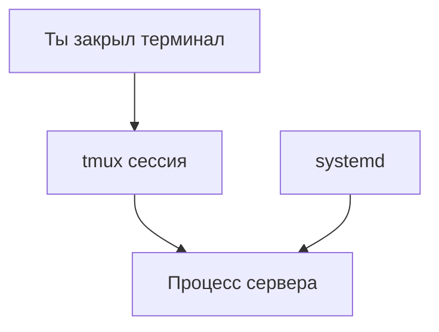

# ENGINEERING ROADMAP
## Том 1 · Лаборатория №6 — Сервер

> **Служба 24/7** · Миссия дня

---

## 📡 История

Linux **установлен**, backup **скрипт** готов. Но **файлы** — не **Minecraft**. Нужна **служба**, которая **работает**, пока ты **спишь**.

---

## 🚀 Миссия

**Запустить** первую **службу** на Linux и понять **systemd** — «диспетчер» программ без окошек.

---

## 🎯 Цель

- понять **сервис = программа 24/7**;
- создать **простую** службу или **screen/tmux** сессию;
- проверить **`systemctl status`**.

**Результат:** процесс **живёт** после закрытия терминала (или в **tmux**).

---

## ⏱ Время

50–60 мин.

---

## 🧰 Что понадобится

- [ ] Linux (Лаб. №3)
- [ ] `~/serwer` **существует**
- [ ] Права `sudo`

---

## 🤔 Как ты думаешь?

1. Почему программа **закрывается**, когда закрываешь терминал?
2. Кто **перезапускает** сервер Google после сбоя?
3. Что такое **демон** (daemon)?

**Настоящее объяснение:** **systemd** — «менеджер смен». **tmux** — «комната», где программа **живёт**, даже если ты **ушёл**.

---

## 💡 Аналогия

**Ресторан:** повара (программы) работают **без** того, чтобы ты **смотрел** на кухню. **systemd** — **шеф**, который **включает** смены.

### 😲 ВАУ!

`uptime` **30 days** — обычный **показатель** сервера, не рекord.

### 😄 Момент улыбки

Закрыл терминал — сервер **не обязан** умирать. Научим его **жить** в **tmux**.

---

## 📷 Иллюстрация

:::illustration
ILL-T1-L6-01
:::

## 📊 Mermaid



---

## 🔬 Эксперимент

**Правило:** минимум **№1–3**.

---

### Эксперимент 1 — «uptime и службы»

**⏱** 10 мин

```bash
uptime
systemctl status
```

(Pager: **`q`**.) Запиши `up ...` в dnevnik.

---

### Эксперимент 2 — «tmux — живая сессия»

**⏱** 15 мин

```bash
sudo apt install -y tmux
tmux new -s serwer
echo "Moj serwer zyje" > ~/serwer/zyje.txt
```

**Ctrl+B**, затем **D** — **отсоединиться**. Закрой терминал. Открой снова:

```bash
tmux attach -t serwer
```

| `tmux new` | Новая **сессия** | Видишь shell |
| `Ctrl+B D` | **Отсоединиться** | Сессия **жива** |

**✅ Проверь себя:** после `attach` файл **создан**?

---

### Эксперимент 3 — «Простой HTTP (опционально)»

**⏱** 15 мин

```bash
cd ~/serwer/pliki
python3 -m http.server 8080
```

В браузере **на этом же ПК:** `http://localhost:8080` — видишь **список файлов**.

**Ctrl+C** — остановить.

---

### Эксперимент 4 — «Проверка порта»

**⏱** 5 мин

```bash
ss -tlnp | head
```

**Запиши:** что такое **порт** — «номер двери» программы.

---

### Эксперимент 5 — «Лог»

**⏱** 10 мин

```bash
journalctl --no-pager | tail -20
```

**Почему?** Сервер **пишет** что случилось — как **чёрный ящик**.

---

## ⚠ Типичные ошибки

| Проблема | Исправление |
|----------|-------------|
| Сервер умер с терминалом | Используй **tmux** |
| Порт занят | Другой порт: `8081` |
| `python3` нет | `sudo apt install python3` |

---

## 🧪 Проверь себя

- [ ] **tmux** attach работает
- [ ] Понимаю **службу vs ручная программа**
- [ ] `uptime` в dnevnik

---

## 📝 Запись в инженерный дневник

```
=== LAB №6 ===
Data: ___
Co zrobiłem:
  - tmux serwer: TAK/NIE
  - http.server: TAK/NIE
  - uptime: ___
Co było trudne:
Następny pomysł:
```

---

## 🏆 Что теперь умеешь

- [ ] Держать процесс в **tmux**
- [ ] Читать **`systemctl status`**
- [ ] Запустить **простой** файловый сервер

---

## ➡ Что дальше

**Следующий файл:** `07_LAB_SET.md` — **сеть**: почему друг **не коннектится**.

- [ ] tmux сессия — **обязательно**

### 🔮 Вопрос без ответа

Друг **в той же Wi‑Fi** — но **не заходит**. **Почему**?

**Ответ — в Лаборатории №7.**

---

*Оставь tmux **живым**. Сервер **не спит**.*
