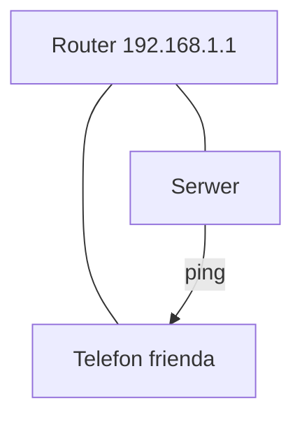

# ENGINEERING ROADMAP
## Том 1 · Лаборатория №7 — Сеть

> **Карта дома** · Миссия дня

---

## 📡 История

Сервер **работает** в tmux — но друг пишет: «**Не коннектится**». Карта Wi‑Fi из **Лаб. №0** — пора **оживить** цифрами.

---

## 🚀 Миссия

**Понять IP, роутер и ping** — и **проверить**, видят ли два устройства **друг друга** в одной сети.

---

## 🎯 Цель

- прочитать **свой IP**;
- **ping** роутера и второго устройства;
- связать с **Minecraft** (порт + IP).

**Результат:** IP и ping в dnevnik, схема «кто к кому».

---

## ⏱ Время

45–60 мин.

---

## 🧰 Что понадобится

- [ ] Linux-сервер + второе устройство (телефон/ноут) в **той же Wi‑Fi**
- [ ] Карта Wi‑Fi (Лаб. №0)
- [ ] Ethernet **желательно** для сервера

---

## 🤔 Как ты думаешь?

1. Зачем **адрес** квартиры в большом доме?
2. **Роутер** — это интернет или **раздаёт адреса**?
3. `ping` — **звонок** «ты жив?»

**Настоящее объяснение:** **IP** = номер квартиры. **Роутер** = консьерж. **ping** = проверка **дороги**.

---

## 💡 Аналогия

```
ИНТЕРНЕТ (улица)
      │
   [РОУТER]
    /  |  \
 тел. ноут сервер
```

### 😲 ВАУ!

В доме **десятки** IP — роутер **раздаёт** их **автоматически** (DHCP).

### 😄 Момент улыбки

«Не коннектится» часто = **разный Wi‑Fi** или **не тот IP**. Не **магия лагов**.

---

## 📷 Иллюстрация

:::illustration
ILL-T1-L7-01
:::

## 📊 Mermaid



---

## 🔬 Эксперимент

**Правило:** минимум **№1–3**.

---

### Эксперимент 1 — «Мой IP»

**⏱** 10 мин

```bash
ip a
hostname -I
```

| `ip a` | Все **адреса** | Строка `inet 192.168...` |

**Запиши IP** сервера в dnevnik.

---

### Эксперимент 2 — «Ping роутера»

**⏱** 5 мин

```bash
ping -c 4 192.168.1.1
```

(Если другой шлюз — смотри **настройки роутера** или `ip route`.)

| `ping` | **Проверка** связи | `4 packets transmitted` |

---

### Эксперимент 3 — «Ping телефона»

**⏱** 15 мин

На **телефоне** (Wi‑Fi): настройки → IP (например `192.168.1.23`).

На сервере:

```bash
ping -c 4 192.168.1.23
```

**✅ Проверь себя:** ping **доходит**?

---

### Эксперимент 4 — «Порт Minecraft»

**⏱** 10 мин

Запиши: «Minecraft Java **25565**». Проверь **firewall** позже — сейчас **запомни номер двери**.

---

### Эксперiment 5 — «Таблица устройств»

**⏱** 10 мин

Обнови **карту Wi‑Fi**: подпиши **IP** каждого устройства.

---

## ⚠ Типичные ошибки

| Проблема | Исправление |
|----------|-------------|
| Разные Wi‑Fi | Один **SSID** |
| Guest network | Гостевая сеть **изолирована** |
| Неверный IP | `ip a` **заново** |

---

## 🧪 Проверь себя

- [ ] IP сервера **записан**
- [ ] ping роутера **OK**
- [ ] Карта + IP **обновлены**

---

## 📝 Запись в инженерный дневник

```
=== LAB №7 ===
Data: ___
Co zrobiłem:
  - IP serwera: ___
  - ping router: TAK/NIE
  - ping telefon: TAK/NIE
Co było trudne:
Następny pomysł:
```

---

## 🏆 Что теперь умеешь

- [ ] Прочитать **IP**
- [ ] **ping** для диагностики
- [ ] Объяснить **роутер** и **порт**

---

## ➡ Что дальше

**Следующий файл:** `08_LAB_INTERNET.md` — **за пределами** дома.

- [ ] IP + ping — **обязательно**

### 🔮 Вопрос без ответа

Как **один клик** в Poznań доходит до **сервера в USA**?

**Ответ — в Лаборатории №8.**

---

*Нарисуй IP на карте. **Сеть** — уже не абстракция.*
