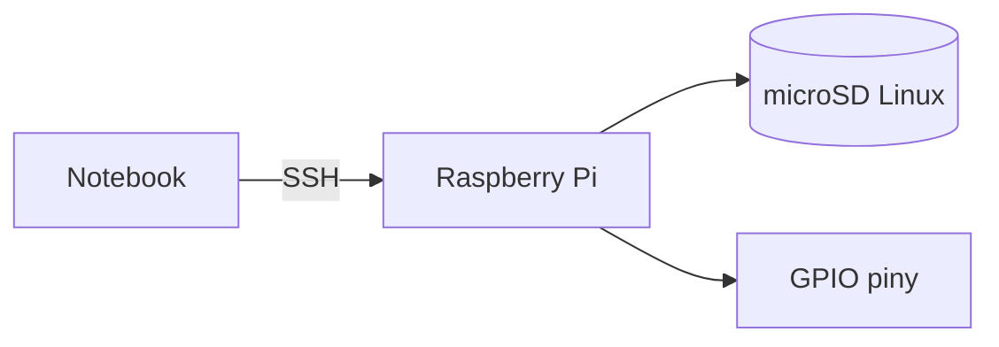

# ENGINEERING ROADMAP
## Том 2 · Лаборатория №0 — Raspberry Pi

> **Настоящий компьютер в ладони** · Миссия дня

---

## 📡 История

**Том 1** завершён: Linux, сеть, **Minecraft**. Цифровой сервер **есть**. Теперь — **компьютер**, который **управляет проводами** на столе.

---

## 🚀 Миссия

**Подготовить Raspberry Pi** — загрузка с SD, первый вход, **SSH** с ноутбука.

---

## 🎯 Цель

- записать **образ** на microSD;
- **первый boot** и настройка;
- зайти по **SSH** из терминала Tom 1.

**Результат:** Pi **online**, IP в dnevnik, `ssh pi@...` работает.

---

## ⏱ Время

60–90 мин (можно **2 дня**).

---

## 🧰 Что понadobится

- [ ] Raspberry Pi 4 (или 3B+) + **блок питания 5V 3A**
- [ ] microSD **16 GB+**
- [ ] Кабель HDMI (первый раз) или **headless** + Wi‑Fi
- [ ] Ноутбук с **Raspberry Pi Imager**

---

## 🤔 Как ты dуmaешь?

1. Pi — **игрушка** или **настоящий** Linux-компьютер?
2. Зачем **SD-карта** вместо SSD?
3. SSH — **удалённый** терминал?

**Настоящее объяснение:** Pi = **полноценный** Linux. SD = **диск**. SSH = терминал **через сеть** (навык из Tom 1).

---

## 💡 Аналогия

Pi — **комната** в доме (сеть). Твой ноутбук — **другая комната**. **SSH** — **дверь** между ними **без** монитора у Pi.

### 😲 ВАУ!

Pi **4** ≈ ПК 2012 года — но **GPIO** делает его **инженерным**, не офисным.

### 😄 Момент улыбки

Pi **не** переживёт падение на пол — **бережно**, как стакан с водой.

---

## 📷 Иллюстрация

:::illustration
ILL-T2-L0-01
:::

## 📊 Mermaid



---

## 🔬 Эксперимент

**Правило:** минимум **№1–4**.

---

### Эксперiment 1 — «Imager»

**⏱** 30 мин

**Raspberry Pi Imager** → OS **Raspberry Pi OS (64-bit)** → запись на SD → вставь в Pi → питание.

---

### Эксперiment 2 — «Первый вход»

**⏱** 15 мин

Локально (HDMI) **или** headless: пользователь `pi` / пароль → **в dnevnik** (никому!).

```bash
hostname -I
```

---

### Эксперiment 3 — «SSH с ноутбука»

**⏱** 15 мин

```bash
ssh pi@192.168.x.x
uname -a
```

| `ssh` | **Удалённый** shell | Приглашение `pi@...` |

---

### Эксперiment 4 — «Обновления»

**⏱** 20 мин

```bash
sudo apt update && sudo apt upgrade -y
```

---

### Эксперiment 5 — «GPIO preview»

**⏱** 5 мин

```bash
pinout
```

**Запиши:** сколько **пинов** — «розетки» для проводов (Лаб. №1).

---

## ⚠ Типичные ошибки

| Проблема | Исправление |
|----------|-------------|
| Мигание без boot | SD **перезапиши**, питание **3A** |
| SSH refused | `sudo raspi-config` → SSH **on** |
| Неверный IP | `hostname -I` **на Pi** |

---

## 🧪 Проверь себя

- [ ] Pi **грузится**
- [ ] **SSH** с ноутбука
- [ ] IP в **dnevnik**

---

## 📝 Запись в инженерный dневnik

```
=== TOM2 LAB №0 ===
Data: ___
Co zrobiłem:
  - SD flash: TAK/NIE
  - SSH: TAK/NIE
  - IP Pi: ___
Co było trudne:
Następny pomysł:
```

---

## 🏆 Что теперь uмеешь

- [ ] Записать **образ** на SD
- [ ] **SSH** на Pi
- [ ] Обновить Pi как **сервер**

---

## ➡ Что dальше

**Следующий:** `01_LAB_GPIO.md`

- [ ] SSH — **обязательно**

### 🔮 Вопрос без ответа

Как **один пин** включит **свет**?

**Ответ — Лаборатория №1 (GPIO).**

---

*Pi **жив**. Завтра — **пины**.*
