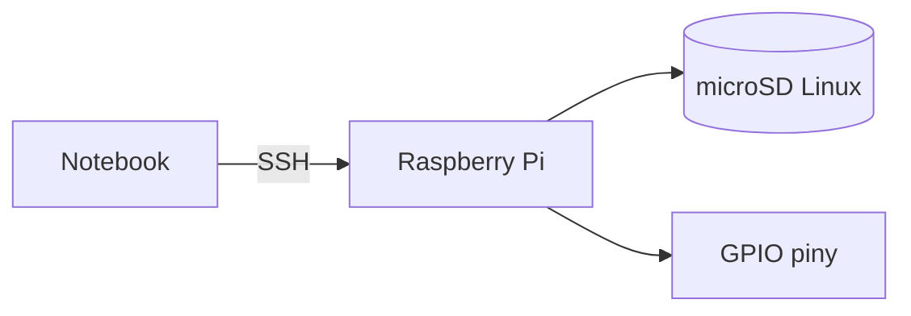

# ENGINEERING ROADMAP
## Том 2 · Лаборатория №0 — Raspberry Pi

> **Настоящий компьютер в ладони** · Миссия дня

---

## 📡 История

**Том 1** завершён: Linux, сеть, **Minecraft**. Цифровой сервер **есть**. Теперь — **компьютер**, который **управляет проводами** на столе.

---

## 🚀 Миссия

**Подготовить Raspberry Pi** — загрузка с SD, первый вход, **SSH** с ноутбука.

---

## 🎯 Цель

- записать **образ** на microSD;
- **первый boot** и настройка;
- зайти по **SSH** из терминала Tom 1.

**Результат:** Pi **online**, IP в dnevnik, `ssh pi@...` работает.

---

## ⏱ Время

60–90 мин (можно **2 дня**).

---

## 🧰 Что понadobится

- [ ] Raspberry Pi 4 (или 3B+) + **блок питания 5V 3A**
- [ ] microSD **16 GB+**
- [ ] Кабель HDMI (первый раз) или **headless** + Wi‑Fi
- [ ] Ноутбук с **Raspberry Pi Imager**

---

## 🤔 Как ты dуmaешь?

1. Pi — **игрушка** или **настоящий** Linux-компьютер?
2. Зачем **SD-карта** вместо SSD?
3. SSH — **удалённый** терминал?

**Настоящее объяснение:** Pi = **полноценный** Linux. SD = **диск**. SSH = терминал **через сеть** (навык из Tom 1).

---

## 💡 Аналогия

Pi — **комната** в доме (сеть). Твой ноутбук — **другая комната**. **SSH** — **дверь** между ними **без** монитора у Pi.

### 😲 ВАУ!

Pi **4** ≈ ПК 2012 года — но **GPIO** делает его **инженерным**, не офисным.

### 😄 Момент улыбки

Pi **не** переживёт падение на пол — **бережно**, как стакан с водой.

---

## 📷 Иллюстрация

📷 **[Для художника]**

**ID:**  
ILL-T2-L0-01

**Название:**  
Raspberry Pi — первый запуск и SSH

**Тип иллюстрации:**  
Сюжетная сцена · домашняя электронная лаборатория · establishing shot

**Главная цель иллюстрации:**  
Показать порог **Тома 2**: ребёнок-конструктор впервые держит в руках **настоящий Linux-компьютер** размером с ладонь и **подключается** к нему с ноутбука **без монитора у Pi**. Зритель должен понять: Pi — **не игрушка**, а **инженерный мозг** на столе; SSH — **дверь** между двумя машинами.

Что ребёнок должен почувствовать: **тихое восхищение**, «это **реальный** компьютер», уверенность «я **управляю** им сам».

---

**Описание сцены**

Вечер в **домашней комнате-лаборатории** (европейская квартира, **не** школьный класс). За **деревянным столом** сидит главный герой серии Engineering Roadmap — **уровень Tom 2 🔵 Constructor**.

**В центре стола** — **Raspberry Pi 4** на **чёрных** ножках-стойках (или лежит на **зелёной** антистатической коврике). Плата **видна сверху под углом ~30°**: зелёная PCB, **золотистый** разъём **GPIO** (40 пинов) **обращён к зрителю**, **HDMI** и **USB** по бокам, **маленький** чип в центре. Рядом с Pi — **microSD-карта** (красная или чёрная, **без** читаемой маркировки) и **блок питания 5V** с **толстым** USB-C кабелем (**не** в розетку 230V — вилка **за кадром** или **отключена**).

Слева от Pi — **открытый ноутбук**: на экране — **стилизованный терминал** (тёмный фон, **зелёные** и **белые** горизонтальные полосы строк, **без читаемых букв и цифр** — только цветовые блоки, намёк на SSH-сессию). **Тонкий** Ethernet-кабель или **Wi‑Fi** (без иконок брендов) связывает Pi и ноутбук **визуально** пунктирной линией или общим светом экрана.

**Что делает герой:** **левая рука** осторожно держит край Pi (бережно, как стакан), **правая** на клавиатуре ноутбука — только что ввёл команду. Взгляд — **с Pi на экран** и обратно.

**За окном** слева — **вечернее** небо сине-фиолетовое, **стилизованные** крыши европейского города (намёк на Познань, **не** узнаваемый панорамный вид). На полке — **моток** проводов, **коробка** с breadboard (ещё **закрыта** — впереди лаборатории).

**Что НЕ должно появляться:** родители, учитель, розетка 230V крупным планом, искры, дым, пайка с дымом, Minecraft на экране, логотипы Raspberry Pi Foundation крупно, бренды ноутбуков, оружие, LED на breadboard (ещё рано).

---

**Главный герой**

- **Возраст:** 12 лет  
- **Уровень:** Tom 2 🔵 Constructor  
- **Внешность:** узнаваемый герой серии — короткие **тёмно-каштановые** волосы, лёгкая **чёлка**, светлая кожа, **веснушки** на носу и щеках (фирменная деталь серии)  
- **Одежда:** **тёмно-зелёный** худи без надписей, **серые** джоггеры; **не** школьная форма  
- **Поза:** сидит прямо, корпус слегка наклонён к Pi (~20°)  
- **Выражение лица:** сосредоточенное, **мягкая** улыбка «получилось»  
- **Эмоция:** спокойная гордость первого boot  
- **Взгляд:** на плату Pi и экран терминала, **не** в камеру  

---

**Дополнительные персонажи**

Нет. Комната пуста — инженер **один** с Pi и книгой.

---

**Окружение**

- **Тип:** домашняя комната / начало электронной мастерской  
- **Стены:** светло-серые или тёплый беж  
- **Мебель:** простой стол, стул, низкая полка с коробкой компонентов  
- **Детали:** Pi 4, microSD, блок питания 5V, ноутбук, антистатический коврик (опционально), кабели  
- **Атмосфера:** уютная европейская квартира, **не** серверная и **не** fab-лаборатория  

---

**Композиция**

- **Формат кадра:** 16:9, горизонтальный  
- **План:** средний (по пояс героя + стол)  
- **Передний план:** Raspberry Pi и microSD (чуть крупнее, **зелёный** акцент PCB)  
- **Средний план:** лицо героя, ноутбук с терминалом  
- **Задний план:** окно, полка — **мягкий** blur  
- **Линия взгляда читателя:** 1) GPIO Pi → 2) microSD → 3) экран терминала → 4) лицо героя  
- **Правило третей:** Pi на пересечении нижней и левой трети, герой справа, ноутбук по центру  

---

**Освещение**

- **Тип:** смешанный — тёплый **настольный** свет + холодный **от экрана**  
- **Время суток:** ранний вечер (сумерки за окном)  
- **Характер:** тёплый на коже и столе; экран даёт **мягкий** зеленоватый отблеск на лицо  
- **Тени:** мягкие; под Pi — лёгкая тень от ножек  

---

**Цветовая палитра**

- **Основные:** `#2D6A4F` (зелёный EduMost / худи), `#1B4332` (зелёная PCB Pi), `#F8F9FA` (светлый фон)  
- **Дополнительные:** `#457B9D` (вечернее окно), `#D4A373` (деревянный стол), `#212529` (экран терминала)  
- **Настроение:** тёплое, техническое, **спокойное**  

---

**Стиль**

Единый стиль **EduMost** · современная европейская детская образовательная книга.  
Уровень визуальной культуры: **DK · Usborne · No Starch Press**.  
Чистая **цифровая векторная** иллюстрация. Мягкие формы, аккуратные контуры 2–3 px.  
**Без:** аниме, манги, Pixar, Disney, фотореализма, 3D-рендера, пластикового глянца, кислотных неонов.

---

**Возрастная адаптация**

- **Возраст читателя:** 11–14 лет (Tom 2)  
- **Можно:** один ребёнок, Pi как «серьёзная» техника, вечер дома, осторожное обращение с платой  
- **Нельзя:** 230V, искры, ожоги, дым, страх поломки, взрослые «контролёры», оружие, кровь, читаемый пароль на экране  

---

**Формат**

- **Файл:** SVG  
- **Соотношение:** 16:9  
- **Детализация:** высокая — GPIO-пины читаемы как **ряд**, не как мелкий текст  
- **Цветовой режим:** RGB для Web; слои для возможной CMYK-печати  

---

**Текст**

На изображении **текста быть НЕ должно**: ни букв, ни цифр, ни логотипов, ни водяных знаков, ни подписей «SSH», «pi@», «Raspberry Pi» — Pi узнаётся **формой платы и GPIO**, терминал — **цветными полосами**, не строками.

---

**Негативный prompt**

водяные знаки · подписи · логотипы · бренды · артефакты AI · лишние руки · лишние пальцы · лишние предметы · взрослые люди · страшные лица · оружие · кровь · хоррор · агрессия · плохая анатомия · размытость · шум · низкое качество · аниме · манга · Pixar · Disney · фотореализм · 3D · неон · розетка 230V · искры · дым · читаемый текст на экране

---

**Связь с лабораторией**

Лаборатория №0 Тома 2 — **подготовка Pi**: образ на SD, первый boot, **SSH** с ноутбука. Иллюстрация фиксирует момент «**настоящий** Linux в ладони» — фундамент для **всех** GPIO-лабораторий впереди.

---

## 📊 Mermaid



---

## 🔬 Эксперимент

**Правило:** минимум **№1–4**.

---

### Эксперiment 1 — «Imager»

**⏱** 30 мин

**Raspberry Pi Imager** → OS **Raspberry Pi OS (64-bit)** → запись на SD → вставь в Pi → питание.

---

### Эксперiment 2 — «Первый вход»

**⏱** 15 мин

Локально (HDMI) **или** headless: пользователь `pi` / пароль → **в dnevnik** (никому!).

```bash
hostname -I
```

---

### Эксперiment 3 — «SSH с ноутбука»

**⏱** 15 мин

```bash
ssh pi@192.168.x.x
uname -a
```

| `ssh` | **Удалённый** shell | Приглашение `pi@...` |

---

### Эксперiment 4 — «Обновления»

**⏱** 20 мин

```bash
sudo apt update && sudo apt upgrade -y
```

---

### Эксперiment 5 — «GPIO preview»

**⏱** 5 мин

```bash
pinout
```

**Запиши:** сколько **пинов** — «розетки» для проводов (Лаб. №1).

---

## ⚠ Типичные ошибки

| Проблема | Исправление |
|----------|-------------|
| Мигание без boot | SD **перезапиши**, питание **3A** |
| SSH refused | `sudo raspi-config` → SSH **on** |
| Неверный IP | `hostname -I` **на Pi** |

---

## 🧪 Проверь себя

- [ ] Pi **грузится**
- [ ] **SSH** с ноутбука
- [ ] IP в **dnevnik**

---

## 📝 Запись в инженерный dневnik

```
=== TOM2 LAB №0 ===
Data: ___
Co zrobiłem:
  - SD flash: TAK/NIE
  - SSH: TAK/NIE
  - IP Pi: ___
Co było trudne:
Następny pomysł:
```

---

## 🏆 Что теперь uмеешь

- [ ] Записать **образ** на SD
- [ ] **SSH** на Pi
- [ ] Обновить Pi как **сервер**

---

## ➡ Что dальше

**Следующий:** `01_LAB_GPIO.md`

- [ ] SSH — **обязательно**

### 🔮 Вопрос без ответа

Как **один пин** включит **свет**?

**Ответ — Лаборатория №1 (GPIO).**

---

*Pi **жив**. Завтра — **пины**.*
