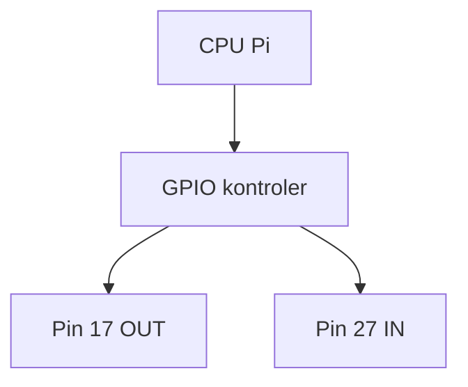

# ENGINEERING ROADMAP
## Том 2 · Лаборатория №1 — GPIO

> **Розетки Pi** · Миссия дня

---

## 📡 История

Pi **работает** по SSH. На плате — **40 пинов**. Это **руки** Pi в **физический** мир.

---

## 🚀 Миссия

**Понять GPIO**, **BCM vs BOARD**, безопасно включить **один** выход **3.3V**.

---

## 🎯 Цель

- прочитать `pinout`;
- включить LED **без** кода — **не надо** — только **схема** на бумаге;
- **gpio readall** / `raspi-gpio`.

**Результат:** таблица «пин → функция» в dnevnik.

---

## ⏱ Время

40 мин.

---

## 🧰 Что понadobится

- [ ] Pi + SSH
- [ ] Распечатка / сайт **pinout.xyz**

---

## 🤔 Как ты dуmaешz?

1. GPIO = **только** свет?
2. **3.3V** и **5V** — одинаково?
3. **GND** — «минус»?

**Настоящее объяснение:** GPIO = **вход/выход** цифровой. **3.3V** логика Pi. **5V** — **питание**, не для **прямого** LED без схемы.

---

## 💡 Аналогия

GPIO — **выключатели** на **щитке**: каждый pin — **лампочка** или **кнопка**.

### 😲 ВАУ!

**40** пинов — **40** возможных **датчиков** (не все свободны).

### 😄 Момент улыбки

Перепутать **BCM 17** и **физический 11** — классика. **Всегда** пиши **BCM** в коде.

---

## 📷 Иллюстрация

:::illustration
ILL-T2-L1-01
:::

## 📊 Mermaid



---

## 🔬 Эксперимент

### 1 — `pinout` (5 мин)
### 2 — Таблица 5 пинов в dnevnik (10 мин)
### 3 — `gpioinfo` / `raspi-gpio get` (10 мин)
### 4 — Нарисуй **OUT** vs **IN** (10 мин)
### 5 — **Не** подключай мотор **напрямую** — запиши правило (5 мин)

---

## ⚠ Типичные ошибки

| 5V на GPIO | **Запрещено** на вход без защиты |
| BOARD vs BCM | Один стандарт в **проекте** |

---

## 🧪 Проверь себя

- [ ] `pinout` **пробовал**
- [ ] **5** пинов **в таблице**

---

## 📝 Запись в инженерный dневnik

```
=== TOM2 LAB №1 ===
Piny BCM: 17=OUT plan, 27=IN plan, ...
```

---

## 🏆 Что теперь uмеешь

- [ ] Читать **pinout**
- [ ] Различать **3.3V / GND / GPIO**

---

## ➡ Что dальше

**Следующий:** `02_LAB_ELEKTRICHESTVO.md` · 🔮 **Сколько ампер** в LED?

---

*Pi **готов** к проводам.*
