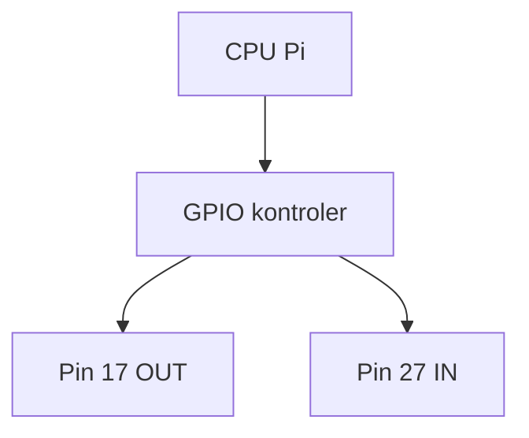

# ENGINEERING ROADMAP
## Том 2 · Лаборатория №1 — GPIO

> **Розетки Pi** · Миссия дня

---

## 📡 История

Pi **работает** по SSH. На плате — **40 пинов**. Это **руки** Pi в **физический** мир.

---

## 🚀 Миссия

**Понять GPIO**, **BCM vs BOARD**, безопасно включить **один** выход **3.3V**.

---

## 🎯 Цель

- прочитать `pinout`;
- включить LED **без** кода — **не надо** — только **схема** на бумаге;
- **gpio readall** / `raspi-gpio`.

**Результат:** таблица «пин → функция» в dnevnik.

---

## ⏱ Время

40 мин.

---

## 🧰 Что понadobится

- [ ] Pi + SSH
- [ ] Распечатка / сайт **pinout.xyz**

---

## 🤔 Как ты dуmaешz?

1. GPIO = **только** свет?
2. **3.3V** и **5V** — одинаково?
3. **GND** — «минус»?

**Настоящее объяснение:** GPIO = **вход/выход** цифровой. **3.3V** логика Pi. **5V** — **питание**, не для **прямого** LED без схемы.

---

## 💡 Аналогия

GPIO — **выключатели** на **щитке**: каждый pin — **лампочка** или **кнопка**.

### 😲 ВАУ!

**40** пинов — **40** возможных **датчиков** (не все свободны).

### 😄 Момент улыбки

Перепутать **BCM 17** и **физический 11** — классика. **Всегда** пиши **BCM** в коде.

---

## 📷 Иллюстрация

📷 **[Для художника]**

**ID:**  
ILL-T2-L1-01

**Название:**  
GPIO — розетки Pi в физический мир

**Тип иллюстрации:**  
Техническая сцена · вид сверху · educational diagram-as-story

**Главная цель иллюстрации:**  
Показать, что **40 пинов GPIO** — это **руки** Raspberry Pi: каждый pin — **вход** или **выход** **3.3V**. Зритель должен **визуально** отличить **питание**, **GND** и **сигнальный** pin (на примере **BCM 17**), **без** путаницы с **5V** и **230V**.

Что ребёнок должен почувствовать: «я **вижу** карту платы», «каждый pin — **имеет роль**», спокойную готовность к **первой** схеме.

---

**Описание сцены**

**Вид сверху** (~60°) на **Raspberry Pi 4**, лежащую на **зелёном** антистатическом коврике на **деревянном столе**. **GPIO-разъём** (40 пинов) **обращён к зрителю** и занимает **нижнюю треть** кадра.

Пины показаны как **ряд золотистых** контактов. **Три группы** выделены **цветом** (не подписями!):
- **Красновато-оранжевый** мягкий ореол — pin **3.3V** (power)  
- **Синий** ореол — **GND** (несколько пинов по краям)  
- **Ярко-зелёный** (#2D6A4F) **толстая стрелка** указывает на **один** конкретный pin в ряду — **BCM GPIO17** (планируемый **OUT** для LED в Lab 4)

Рядом на столе — **распечатанная схема pinout** (**без читаемого текста**): только **цветные** полосы и **пиктограммы** (молния = power, стрелка вниз = GND, кружок = GPIO). **Карандаш** и **янтарная** тетрадь с **наброском** таблицы (**клетки** и **цветные точки**, **без** букв).

**Слева в кадре** — **руки** героя (12 лет): **указательный палец** **не касается** пинов, а **парит** над GPIO17 на расстоянии ~2 см (правило: **сначала схема**, потом провод).

**Что НЕ должно появляться:** провода в breadboard, LED, мотор, мультиметр в розетке, цифры BCM/BOARD на изображении, читаемые подписи pinout.xyz, 230V, искры.

---

**Главный герой**

- **Возраст:** 12 лет  
- **Уровень:** Tom 2 🔵 Constructor  
- **Внешность:** тёмно-каштановые волосы, **веснушки**, зелёный худи (видны **рукава** и **край** капюшона)  
- **Одежда:** тёмно-зелёный худи, серые джоггеры  
- **Поза:** стоит/наклонён над столом, видны **предплечья** и **руки**  
- **Выражение лица:** сосредоточенное (если видно частично)  
- **Эмоция:** «изучаю карту»  
- **Взгляд:** на GPIO и pinout, **не** в камеру  

---

**Дополнительные персонажи**

Нет (только **руки** героя).

---

**Окружение**

- **Тип:** стол домашней лаборатории  
- **Поверхность:** дерево + зелёный антистатический коврик  
- **Детали:** Pi 4 сверху, pinout-распечатка, тетрадь, карандаш  
- **Атмосфера:** тихая, **учебная**, без пайки и дыма  

---

**Композиция**

- **Формат кадра:** 16:9, горизонтальный  
- **План:** крупный сверху (GPIO + Pi занимают ~50% кадра)  
- **Передний план:** GPIO-разъём и **зелёная стрелка** к pin 17  
- **Средний план:** остальная плата Pi, руки героя  
- **Задний план:** край тетради, мягкий blur стола  
- **Линия взгляда:** 1) зелёная стрелка GPIO17 → 2) красный 3.3V → 3) синий GND → 4) pinout на бумаге  
- **Правило третей:** GPIO по нижней линии, стрелка на пересечении левой и нижней трети  

---

**Освещение**

- **Тип:** мягкий **рассеянный** дневной свет сверху-слева  
- **Время суток:** день (окно за кадром)  
- **Характер:** ровный, **без** жёстких бликов на металле пинов  
- **Тени:** лёгкие под Pi от ножек  

---

**Цветовая палитра**

- **Основные:** `#2D6A4F` (GPIO-акцент / худи), `#1B4332` (PCB), `#E76F51` (3.3V ореол)  
- **Дополнительные:** `#457B9D` (GND), `#F4A261` (тетрадь), `#F8F9FA` (фон)  
- **Настроение:** ясное, **структурированное**  

---

**Стиль**

Единый стиль **EduMost** · современная европейская детская образовательная книга.  
Уровень: **DK · Usborne · No Starch Press**.  
Чистая **цифровая векторная** иллюстрация; пины **стилизованы**, не фото.  
**Без:** аниме, манги, Pixar, Disney, фотореализма, 3D, неона.

---

**Возрастная адаптация**

- **Возраст читателя:** 11–14 лет  
- **Можно:** цветовое кодирование пинов, стрелки, pinout на бумаге  
- **Нельзя:** 5V на GPIO крупным планом как «можно», мотор на pin, читаемые номера пинов, 230V  

---

**Формат**

- **Файл:** SVG  
- **Соотношение:** 16:9  
- **Детализация:** высокая — **40 пинов** читаемы как ряд; **3.3V / GND / GPIO17** различимы **цветом**  
- **Цветовой режим:** RGB; слои для печати  

---

**Текст**

На изображении **текста быть НЕ должно**: ни «GPIO17», ни «BCM», ни «3.3V», ни «pinout.xyz» — только **цвет**, **стрелки** и **пиктограммы**.

---

**Негативный prompt**

водяные знаки · подписи · цифры на пинах · логотипы · бренды · артефакты AI · лишние руки · плохая анатомия · breadboard с LED · мотор · 230V · искры · аниме · манга · Pixar · Disney · фотореализм · 3D · неон · читаемый текст

---

**Связь с лабораторией**

Лаборатория №1 — **понять GPIO** до первого провода: **3.3V**, **GND**, **BCM 17** как **OUT**. Иллюстрация = **карта местности** перед breadboard в Lab 3–4.

---

## 📊 Mermaid



---

## 🔬 Эксперимент

### 1 — `pinout` (5 мин)
### 2 — Таблица 5 пинов в dnevnik (10 мин)
### 3 — `gpioinfo` / `raspi-gpio get` (10 мин)
### 4 — Нарисуй **OUT** vs **IN** (10 мин)
### 5 — **Не** подключай мотор **напрямую** — запиши правило (5 мин)

---

## ⚠ Типичные ошибки

| 5V на GPIO | **Запрещено** на вход без защиты |
| BOARD vs BCM | Один стандарт в **проекте** |

---

## 🧪 Проверь себя

- [ ] `pinout` **пробовал**
- [ ] **5** пинов **в таблице**

---

## 📝 Запись в инженерный dневnik

```
=== TOM2 LAB №1 ===
Piny BCM: 17=OUT plan, 27=IN plan, ...
```

---

## 🏆 Что теперь uмеешь

- [ ] Читать **pinout**
- [ ] Различать **3.3V / GND / GPIO**

---

## ➡ Что dальше

**Следующий:** `02_LAB_ELEKTRICHESTVO.md` · 🔮 **Сколько ампер** в LED?

---

*Pi **готов** к проводам.*
