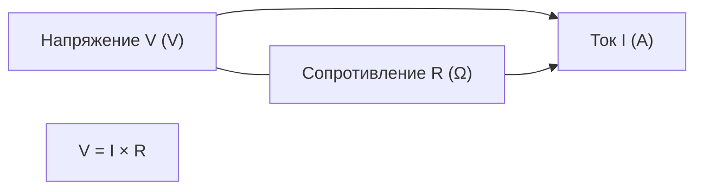

# ENGINEERING ROADMAP
## Том 2 · Лаборатория №2 — Электричество

> **Ток под контролем** · Миссия дня

---

## 📡 История

GPIO **прочитан**, **3.3V** и **GND** **названы**. Но **сколько ампер** в пине? **Почему** LED **сгорит** без резистора? Сначала — **закон**, потом — **провода**.

---

## 🚀 Миссия

**Понять напряжение, ток и сопротивление** — на **бумаге** и **мульtimetrem**, **до** breadboard и LED.

---

## 🎯 Цель

- записать **закон Ома** и **посчитать** ток для LED;
- **прочитать** полоски на резисторе **330 Ω**;
- **безопасно** измерить **3.3V** на Pi (**не** 230V!).

**Результат:** формула **V = I × R** и расчёт «3.3V + 330Ω» в **dnevnik**.

---

## ⏱ Время

45–60 мин (можно **2 дня** по 25 мин).

---

## 🧰 Что понadobится

- [ ] Raspberry Pi (**SSH**, **включён** только для **одного** эксперимента с мультиметром)
- [ ] Резисторы **330 Ω** и **1 kΩ** (или картинка цветовых полос)
- [ ] **Мультиметр** (режим DC V и Ω) — **если нет**, пропусти измерения, **не** пропускай **расчёты**
- [ ] Тетрадь, карандаш, **линейка** для схем
- [ ] **Только 3.3V GPIO** — **НЕ** розетка **230V**!

---

## 🤔 Как ты dуmaешь?

1. **Напряжение** — это «сколько **хочет** толкнуть» или «сколько **течёт**»?
2. Резистор **330 Ω** — **ускоряет** или **тормозит** ток?
3. Pi **3.3V** на GPIO — **сколько вольт** на **GND**?

*(Запиши ответы в dnevnik **до** чтения ниже.)*

**Настоящее объяснение:** **V** (вольт) = «напор» — **разница** между **+** и **−**. **I** (ампер) = **сколько** заряда **течёт** в секунду. **R** (ом) = **сопротивление**. **GND** = **0 V** — «уровень земли». **Закон Ома:** **V = I × R** (или **I = V / R**).

---

## 💡 Аналогия

**Вода в шланге:**

| В жизни | В схеме |
|---------|---------|
| Насос **давит** | **Напряжение V** |
| Вода **течёт** | **Ток I** |
| **Узкая** труба | **Резистор R** |
| **Сток** в землю | **GND** |

### 😲 ВАУ!

В **LED-фонарике** тот же **закон Ома** — только батарейка **1.5V**, а Pi даёт **3.3V**. Поэтому **резистор обязателен**.

### 😄 Момент улыбки

«Подключу LED **напрямую**, он же **маленький**» — Pi **не** спрашивает разрешения. **Дым** — **не** шутка.

---

## 📷 Иллюстрация

📷 **[Для художника]**

**ID:**  
ILL-T2-L2-01

**Название:**  
Электричество — понял, прежде чем жечь

**Тип иллюстрации:**  
Сюжетная сцена · учебный стол · still life + герой

**Главная цель иллюстрации:**  
Закрепить идею **Тома 2**: **сначала закон Ома на бумаге**, **потом** провода. Показать **резистор 330 Ω** (цветовые полосы), **мультиметр** на **3.3V** Pi и **спокойную** уверенность — **без** розетки **230V** и **без** дыма от сгоревшего LED.

Что ребёнок должен почувствовать: «я **контролирую** ток», «резистор — **тормоз**», **уважение** к цифрам **до** щелчка.

---

**Описание сцены**

Домашний **деревянный стол** инженера 12 лет. **В центре** — **открытая** янтарная тетрадь: на развороте — **схематический треугольник закона Ома** (три вершины соединены линиями, **без букв V, I, R** — только **иконки**: батарейка-напор, волна-ток, узкая труба-сопротивление) и **простая** цепь: блок «+» → прямоугольник-резистор → символ LED → блок «−».

**Крупным планом** рядом — **резистор** с чёткими цветовыми кольцами: **оранжевый · оранжевый · коричневый · золотой** (330 Ω + допуск) — полосы **слева направо**, **без** цифр под ними.

**Мультиметр** (жёлто-чёрный корпус, **без** бренда) лежит **щупами** к **красному** и **чёрному** проводу от Pi: дисплей показывает **три цветных сегмента** (стилизованное «3.3» как **полоски**, **не** читаемые цифры). Режим **DC V** — **пиктограмма** постоянного тока.

На **заднем плане** (мягкий blur) — **Raspberry Pi** на коврике, **один** провод M-F к **3.3V** pin — **без** LED, **без** breadboard. **Розетки 230V нет** в кадре.

**Герой** (12 лет, зелёный худи, веснушки) **сидит** слева: **правая рука** держит **карандаш** над тетрадью, **левая** — на столе у мультиметра. Лицо — **сосредоточенное**, лёгкая улыбка «**понял**».

**Что НЕ должно появляться:** горящий/дымящий LED, розетка 230V, искры, breadboard со схемой, формула «V=IR» буквами, взрослые, школьный класс.

---

**Главный герой**

- **Возраст:** 12 лет  
- **Уровень:** Tom 2 🔵 Constructor  
- **Внешность:** тёмно-каштановые волосы, **веснушки**, зелёный худи  
- **Поза:** сидит за столом, наклон ~15° к тетради  
- **Выражение:** «понял, прежде чем жечь» — спокойная уверенность  
- **Взгляд:** на тетрадь и резистор, **не** в камеру  

---

**Дополнительные персонажи**

Нет.

---

**Окружение**

- **Тип:** домашний учебный стол  
- **Детали:** тетрадь, карандаш, резистор, мультиметр, Pi на фоне  
- **Атмосфера:** тихая лаборатория, **безопасное** 3.3V  

---

**Композиция**

- **Формат:** 16:9  
- **План:** средний (стол + пояс героя)  
- **Передний план:** резистор с полосами + треугольник Ома в тетради  
- **Средний план:** мультиметр, руки героя  
- **Задний план:** Pi blur  
- **Линия взгляда:** резистор → тетрадь → мультиметр → Pi  
- **Правило третей:** резистор на пересечении правой и нижней трети  

---

**Освещение**

- **Тип:** мягкий дневной с окна слева  
- **Характер:** тёплый на дереве и тетради, нейтральный на металле щупов  
- **Тени:** мягкие под резистором и тетрадью  

---

**Цветовая палитра**

- **Основные:** `#F4A261` (тетрадь), `#E76F51` (оранжевые полосы резистора), `#2D6A4F` (худи)  
- **Дополнительные:** `#F1C40F` (мультиметр), `#1B4332` (Pi), `#F8F9FA` (фон)  
- **Настроение:** тёплое, **рассудительное**  

---

**Стиль**

EduMost · DK · Usborne · No Starch. Вектор, мягкие контуры 2–3 px.  
**Без:** аниме, Pixar, Disney, фотореализм, 3D, неон.

---

**Возрастная адаптация**

- **Возраст:** 11–14 лет  
- **Можно:** мультиметр, цветные полосы, схемы-пиктограммы  
- **Нельзя:** 230V, дым, сгоревший LED, паника, читаемые формулы  

---

**Формат**

- **Файл:** SVG · **16:9** · высокая детализация полос резистора  
- **RGB** + слои CMYK  

---

**Текст**

**Никакого текста** на изображении: ни «V=IR», ни «330», ни «3.3V» — только **цвет**, **иконки**, **полосы**.

---

**Негативный prompt**

текст · цифры · 230V · дым · горящий LED · искры · breadboard · логотипы · аниме · Pixar · Disney · фотореализм · 3D · взрослые · артефакты AI

---

**Связь с лабораторией**

Лаборатория №2 — **закон Ома до breadboard**: расчёт **3.3V / 330Ω ≈ 10 mA**. Иллюстрация = «**понял, прежде чем жечь**».

```
     +3.3V ────► [ R ] ────► ───► GND
                  ↑
              «тормоз»
     I = V / R  →  I = 3.3 / 330 ≈ 0.01 A (10 mA)
```

---

## 📊 Mermaid



---

## 🔬 Эксперимент

**Правило:** **все 5** — **расчёт** важнее **щелчка**. **230V** — **вне** книги.

**Обязательные:** 1, 2, 3, 5 · **Рекомендуемые:** 4 (если есть мультиметр).

---

### Эксперiment 1 — «Полоски резистора»

**⏱** 10 мин

Найди резистор **330 Ω**. Кольца (слева направо, близко к телу):

| Цвет | Цифра |
|------|-------|
| Оранжевый | 3 |
| Оранжевый | 3 |
| Коричневый | ×10 |
| Золотой | ±5% |

**330 × 10 = 3300?** **Нет:** 33 × 10 = **330 Ω**. Запиши в dnevnik.

**✅ Проверь себя:** можешь **назвать** 330 Ω **по цветам**?

---

### Эксперiment 2 — «Закон Ома на бумаге»

**⏱** 10 мин

Pi даёт **3.3 V**. Резистор **330 Ω**. LED **позже** — считаем **только** резистор:

**I = V / R = 3.3 / 330 = 0.01 A = 10 mA**

Запиши **V**, **R**, **I** в dnevnik. **10 mA** — **норма** для GPIO с резистором.

---

### Эксперiment 3 — «Символы схемы»

**⏱** 10 мин

Нарисуй **без** Pi:

```
  ────[ R ]────   резистор (зигзаг или прямоугольник)
  ────|>|────    LED (стрелка + линия) — **пока** только нарисуй
  ────⊥────      GND (земля)
```

Подпиши: **V**, **I**, **R**, **GND**.

**✅ Провerь себя:** **3** символа **узнаёшь** на чужой схеме?

---

### Эксперiment 4 — «3.3V мультиметром» *(рекомендуемый)*

**⏱** 15 мин

**Pi включён.** Мультиметр: **DC V**, **20 V** диапазон.

| «Нет магии» | Что | Почему | Проверка | Отмена |
|-------------|-----|--------|----------|--------|
| Красный щуп | **GPIO 3.3V** (физ. pin **1**) | Измеряем **напор** | ~**3.2–3.4 V** | Выключи Pi |
| Чёрный щуп | **GND** (pin **6**) | **0 V** — опора | **0 V** на GND | — |

**⚠** **Не** тыкай в **230V** розетку. **Только** Pi.

**✅ Проверь себя:** показания **близки** к **3.3 V**?

---

### Эксперiment 5 — «Dnevnik: формула + расчёт LED»

**⏱** 10 мин

Запиши:

```
V = I × R
I = V / R
3.3 V / 330 Ω = 10 mA  ← для LED в Lab 4
```

**Вопрос:** если **R = 1000 Ω (1 kΩ)**, **I = ?**  
**Ответ:** 3.3 / 1000 = **3.3 mA** — LED **может** быть **тусклым**.

**✅ Проверь себя:** **1 kΩ** даёт **больше** или **меньше** тока, чем **330 Ω**?

---

## ⚠ Типичные ошибки

| Ошибка | Исправление |
|--------|-------------|
| Путаешь **V** и **I** | **V** — **вольты** на источнике; **I** — **амперы** в проводе |
| «Ом = вольты» | **Ом (Ω)** — только **R** |
| LED **без** R «на пробу» | **Не включай** — сначала **Lab 4** с **330 Ω** |
| Мультиметр в **A** на GPIO | Режим **V DC**, **не** амперы на пин |

---

## 🧪 Проверь себя

- [ ] **V = I × R** **писал** рукой
- [ ] **330 Ω** **прочитал** по полоскам
- [ ] **10 mA** **посчитал** для 3.3V + 330Ω
- [ ] **Не** лез в **230V**

---

## 📝 Запись в инженерный dневnik

```
=== TOM2 LAB №2 ===
Data: ___
Co zrobiłem:
  - V=IR w dnevnik: TAK/NIE
  - 330 Ohm kolory: TAK/NIE
  - obliczenie 10 mA: TAK/NIE
  - multimetr 3.3V: TAK/NIE / brak
Co było trudne:
Następny pomysł: breadboard — jak łączy bez lutowania?
```

---

## 🏆 Что теперь uмеешь

- [ ] **Объяснить** напряжение, ток, сопротивление **своими словами**
- [ ] **Посчитать** **I = V/R** для **3.3V**
- [ ] **Прочитать** **330 Ω** на резисторе
- [ ] **Выбрать** **безопасный** режим мультиметра на Pi

---

## ➡ Что dальше

**Следующий:** `03_LAB_BREADBOARD.md`

**Обязательно перед переходом:**

- [ ] Формула **V = I × R** и расчёт **10 mA** в dnevnik

### 🔮 Вопрос без ответа

Как **соединить** резистор и провода **без пайки**?

**Ответ — Лаборатория №3.**

---

*Закон Ома **старше** Raspberry Pi. **Ты** его **уже** знаешь.*
