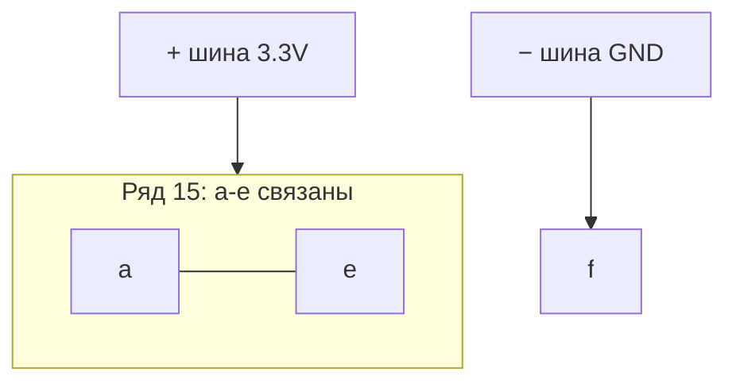

# ENGINEERING ROADMAP
## Том 2 · Лаборатория №3 — Breadboard

> **Макетная плата без пайки** · Миссия дня

---

## 📡 История

**Закон Ома** в dnevnik, **330 Ω** **прочитан**, **10 mA** **посчитан**. GPIO **ждёт** проводов — но **куда** втыкать, чтобы **не** коротить **+** и **−**?

---

## 🚀 Миссия

**Освоить breadboard** — **шины**, **ряды**, **первые** соединения **без LED**, только **питание** и **проверка**.

---

## 🎯 Цель

- **понять**, какие **дырки** соединены **внутри**;
- подать **3.3V** и **GND** на **шины** breadboard;
- **проверить** мультиметром или **логикой** «ряд = одна линия».

**Результат:** breadboard с **красной/синей** шиной и **записью** «a–e в одном ряду = связаны» в dnevnik.

---

## ⏱ Время

40–55 мин.

---

## 🧰 Что понadobится

- [ ] Raspberry Pi (**SSH**)
- [ ] Breadboard (**400** или **830** точек)
- [ ] Провода **male-female** (минимум **4**)
- [ ] Мультиметр *(рекомендуется)*
- [ ] **Без LED** на этом занятии — **свет** в **Lab 4**
- [ ] **Только 3.3V GPIO** — **НЕ** 230V!

---

## 🤔 Как ты dуmaeshь?

1. Дырки **a** и **e** в **одном** номере ряда — **соединены** или **нет**?
2. **Красная** шина сверху — для **+** или **−**?
3. Можно ли **воткнуть** два провода в **одну** дырку?

*(Ответы — после экспериментов.)*

**Настоящее объяснение:** Breadboard — **скрытые** металлические **полоски**. Ряд **1–30**: **a–e** — **одна** линия, **f–j** — **другая** (между **e** и **f** — **разрыв**). **Шины** `+` / `−` — **длинные** линии по **краям**. Провод **вдавливает** металл — **контакт** без **пайки**.

---

## 💡 Аналогия

**Школьная скамья в автобусе:**

| В жизни | На breadboard |
|---------|---------------|
| **Один ряд** сидят вместе | **a–e** (или **f–j**) — **электрически** одно |
| **Проход** между рядами | Между **e** и **f** — **нет** связи |
| **Длинный коридор** у окна | **Шина +** или **−** вдоль края |

### 😲 ВАУ!

Один breadboard держит **сотни** соединений — **Mars rover** на столе **начинался** с такой же **макетки**.

### 😄 Момент улыбки

«Воткну **+** и **−** в **соседние** дырки одного ряда» — Pi **перезагрузится** или **обидится**. **Короткое** — **не** эксперимент.

---

## 📷 Иллюстрация

:::illustration
ILL-T2-L3-01
:::

```
        + шина ───────────────── (все дырки шины связаны)
        a  b  c  d  e | f  g  h  i  j
   15   ●──●──●──●──●   ●  ●  ●  ●  ●
        └─ один ряд a-e ─┘   └─ f-j отдельно ─┘
        − шина ─────────────────
```

---

## 📊 Mermaid



---

## 🔬 Эксперимент

**Правило:** Pi **выключен** при **сборке**. **Включай** только когда **+** и **−** **не** соседи в **одном** ряду.

**Обязательные:** 1, 2, 4, 5 · **Рекомендуемые:** 3 (мультиметр).

---

### Эксперiment 1 — «Карта breadboard»

**⏱** 10 мин

**Pi выключен.** Карандашом на бумаге:

1. Нарисуй **5** рядов и буквы **a–j**.
2. Обведи **a–e** одним цветом, **f–j** — другим.
3. Подпиши **+** и **−** шины.

**✅ Проверь себя:** **e** и **f** в одном номере — **связаны**? (**Нет.**)

---

### Эксперiment 2 — «Мостик без Pi»

**⏱** 10 мин

**Один** короткий **jumper** (male-male или обрезок) в **ряд 10**: **a10 → e10**.

| Действие | Зачем |
|----------|-------|
| Воткни **оба** конца в **a10** и **e10** | Проверка: **один** ряд = **одна** линия |
| Мультиметр **Ω** (звонок) **a10–e10** | Должен **пищать** / **0 Ω** |
| **a10–f10** | **Нет** звука — **разрыв** |

**✅ Проверь себя:** **a–e** **соединены**, **e–f** — **нет**?

---

### Эксперiment 3 — «Шины питания» *(рекомендуемый)*

**⏱** 15 мин

**Pi выключен.**

| Провод | От | К |
|--------|-----|---|
| Красный M-F | Pi **3.3V** (pin **1**) | **+** шина breadboard |
| Чёрный M-F | Pi **GND** (pin **6**) | **−** шина breadboard |

**Включи** Pi. Мультиметр: **+** шина vs **−** шина ≈ **3.3 V**.

| «Нет магии» | Проверка | Отмена |
|-------------|----------|--------|
| **3.3 V** на шинах | Любая **+** дырка шины ≈ **+** | **Ctrl+C** не нужен — **выключи** Pi |
| **GND** = 0 | **−** шина | — |

**✅ Проверь себя:** **красная** шина **не** на **5V** pin — только **3.3V**!

---

### Эксперiment 4 — «Тестовый ряд без LED»

**⏱** 10 мин

**Pi выключен.** От **+** шины: провод в **c20**. От **−** шины: провод в **c25** (**другой** ряд!).

**Между c20 и c25** — **ничего**. Это **разомкнутая** цепь — **тока нет**. Запиши: «**нет** замыкания = **нет** тока».

**Не** соединяй **+** и **−** **одним** рядом!

**✅ Проверь себя:** можешь **объяснить**, почему **свет** не нужен для **этого** теста?

---

### Экспeriment 5 — «Место под LED (пусто)»

**⏱** 10 мин

На бумаге нарисуй **будущую** схему Lab 4:

```
+ шина → [330Ω] → (место LED) → − шина
         ряд 12    ряд 12
```

**Физически** воткни **только** резистор **330 Ω** в **ряд 12** (**a12–e12** — **один** конец в **a12**, второй в **e12**). **LED не вставляй.** Pi **выключен**.

**✅ Провerь себя:** резистор **лежит** в **одном** ряду — **оба** вывода **электрически** на **одной** линии?

---

## ⚠ Типичные ошибки

| Проблема | Исправление |
|----------|-------------|
| **+** и **−** в **одном** ряду | **Разные** ряды или через **компонент** |
| Путаешь **шину** и **ряд** | **Шина** — весь **край**; **ряд** — **a–e** |
| LED **рано** | **Lab 4** — после **этой** записи |
| **5V** pin вместо **3.3V** | Pin **1** = **3.3V** по pinout |

---

## 🧪 Проверь себя

- [ ] **a–e** **одного** ряда — **связаны**
- [ ] **+** и **GND** на **шинах** (**если** делал exp. 3)
- [ ] **Нет** короткого **+−** в одном ряду
- [ ] **Схема** LED+резистор **нарисована** на бумаге

---

## 📝 Запись в инженерный dневnik

```
=== TOM2 LAB №3 ===
Data: ___
Co zrobiłem:
  - mapa breadboard: TAK/NIE
  - szyny 3.3V/GND: TAK/NIE
  - test rząd a-e: TAK/NIE
  - 330 Ohm bez LED: TAK/NIE
Co było trudne:
Następny pomysł: LED w rząd 12 — Lab 4
```

---

## 🏆 Что теперь uмеешь

- [ ] **Объяснить** breadboard **без** пайки
- [ ] **Подключить** **3.3V** и **GND** к **шинам**
- [ ] **Проверить** связь **a–e** мультиметром или **логикой**
- [ ] **Подготовить** место под **LED** **безопасно**

---

## ➡ Что dальше

**Следующий:** `04_LAB_LED.md`

**Обязательно:**

- [ ] **+** / **−** шины или **схема** на бумаге
- [ ] **330 Ω** **без** LED

### 🔮 Вопрос без ответа

Почему **длинная** ножка LED — **+**, и **хватит** ли **10 mA**?

**Ответ — Лаборатория №4.**

---

*Breadboard **прощает** ошибки **лучше**, чем паяльник. **Ты** готов к **свету**.*
