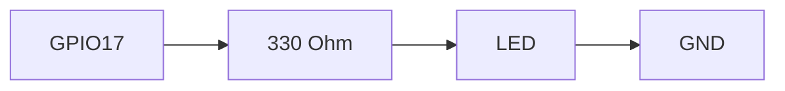

# ENGINEERING ROADMAP
## Том 2 · Лаборатория №4 — LED

> **Первый свет** · Миссия дня

---

## 📡 История

GPIO **изучен**, breadboard **освоен**, **закон Ома** в dnevnik. Пора **увидеть** результат — **свет**.

---

## 🚀 Миссия

**Зажечь LED** через **резистор 330 Ω** от GPIO Pi — **без пайки**, **без** розетки 230V.

---

## 🎯 Цель

- собрать схему **LED + резистор + GPIO + GND**;
- включить **Python или gpio** (gpiozero);
- **погасить** и **записать**.

**Результат:** LED **горит** по команде, фото схемы в dnevnik.

---

## ⏱ Время

45–60 мин.

---

## 🧰 Что понadobится

- [ ] Raspberry Pi (**SSH**)
- [ ] Breadboard, **LED**, резистор **330 Ω**, провода **male-female**
- [ ] **Только 3.3V GPIO** — **НЕ** 230V!

---

## 🤔 Как ты dуmaешь?

1. Длинная ножка LED — **+** или **−**?
2. Зачем **резистор**?
3. GPIO **3.3V** — сколько **ампер** без резистора?

**Настоящее объяснение:** LED **односторонний**. Резистор = **тормоз**. Без него — **мертвый LED** и запах.

---

## 💡 Аналогия

**Вода:** напор (V) → узкая труба (R) → **не** разорвёт шланг (LED).

### 😲 ВАУ!

Mars rover **индикаторы** — те же **LED**, только **дороже**.

### 😄 Момент улыбки

LED **не** прощает «подключу без резистора на секунду». **Секунды хватит**.

---

## 📷 Иллюстрация

📷 **[Для художника]**

**ID:**  
ILL-T2-L4-01

**Название:**  
Первый свет — LED горит по команде

**Тип иллюстрации:**  
Сюжетная сцена · кульминация Tom 2 (ранняя) · close-medium shot

**Главная цель иллюстрации:**  
Зафиксировать **первый физический результат** Тома 2: LED **светится** через **резистор 330 Ω** от GPIO Pi. Эмоция «**ура, свет!**» — но схема **правильная** (резистор **обязателен**). Зритель видит **breadboard + Pi + радость** героя.

Что ребёнок должен почувствовать: **восторг**, «я **создал** свет», «резистор **спас** LED».

---

**Описание сцены**

Домашний стол, **вечер**. **Breadboard** в центре: **красный** и **зелёный** LED (оба в схеме — **красный горит** ярко с **мягким** ореолом, **зелёный** тусклее или выключен — **контраст**). Между GPIO-проводом и длинной ножкой LED — **резистор** с **оранжево-оранжево-коричневыми** полосами. Провода **M-F** к **Pi** на **заднем плане** (зелёная плата, мягкий blur).

**Герой** 12 лет (тёмно-каштановые волосы, **веснушки**, **зелёный** худи) **сидит** за столом: **обе руки** на краях стола, корпус слегка **откинут** назад от **удивления-радости**. **Широкая** улыбка, глаза **прищурены** от света LED (мягко, **не** больно). **Взгляд** — на **горящий** красный LED.

**На столе** — янтарная тетрадь (закрыта), **без** читаемых записей. **Розетки 230V нет**.

**Свечение LED:** тёпло-красный ореол на пальцах и лице героя — **единственный** драматический свет в сцене.

**Что НЕ должно появляться:** дым, сгоревший LED, схема без резистора, мотор, 230V, терминал с кодом, взрослые.

---

**Главный герой**

- **Возраст:** 12 лет · Tom 2 🔵 Constructor  
- **Внешность:** тёмно-каштановые волосы, веснушки, зелёный худи  
- **Поза:** сидит, откинулся, руки на столе  
- **Выражение:** «ура, свет!» — радость, **не** крик  
- **Взгляд:** на LED, **не** в камеру  

---

**Дополнительные персонажи**

Нет.

---

**Окружение**

- **Тип:** домашняя лаборатория, вечер  
- **Детали:** breadboard, 2 LED, резистор, Pi, тетрадь  
- **Атмосфера:** тёплая, **праздничная** (маленький успех)  

---

**Композиция**

- **Формат:** 16:9  
- **План:** средний (лицо + breadboard)  
- **Передний план:** горящий красный LED + резистор  
- **Средний план:** лицо героя с ореолом от LED  
- **Задний план:** Pi blur  
- **Линия взгляда:** LED → резистор → breadboard → Pi  
- **Правило третей:** LED на пересечении левой и нижней трети, лицо справа  

---

**Освещение**

- **Тип:** тёплый настольный свет + **доминирующий** свет от LED (красноватый ореол)  
- **Время:** вечер  
- **Тени:** мягкие; ореол LED на щеке героя  

---

**Цветовая палитра**

- **Основные:** `#E63946` (LED + ореол), `#2D6A4F` (худи), `#F4A261` (тетрадь)  
- **Дополнительные:** `#1B4332` (Pi), `#F8F9FA` (breadboard), `#95D5B2` (зелёный LED выкл.)  
- **Настроение:** тёплое, **радостное**  

---

**Стиль**

EduMost · вектор · DK/Usborne. Мягкий ореол LED **стилизован**, не lens flare.  
**Без:** аниме, Pixar, Disney, фотореализм, 3D, неон-кислота.

---

**Возрастная адаптация**

- **11–14 лет:** радость, безопасная 3.3V схема  
- **Нельзя:** дым, ожог, LED без резистора как «норма», 230V  

---

**Формат**

- **SVG · 16:9** · LED-ореол отдельным слоем  

---

**Текст**

**Нет текста** — ни «gpiozero», ни «330Ω» на изображении.

---

**Негативный prompt**

текст · дым · сгоревший LED · без резистора · 230V · мотор · аниме · Pixar · фотореализм · 3D · взрослые · логотипы

---

**Связь с лабораторией**

Лаборатория №4 — **первый свет**: LED + **330 Ω** + GPIO17 + gpiozero. Иллюстрация = эмоциональная **награда** за Labs 1–3.

```
     +3.3V (GPIO17) ──[330Ω]──►|>── LED ──► GND
```

---

## 📊 Mermaid



---

## 🔬 Эксперимент

**Правило:** **все 5** — безопасность **прежде всего**.

---

### Эксперiment 1 — «Сборка без питания»

**⏱** 15 мин

Собери схему **выключенным** Pi. **Длинная** ножка LED → к резистору → GPIO17. Короткая → **GND**.

---

### Эксперiment 2 — «gpiozero»

**⏱** 15 мин

```bash
sudo apt install -y python3-gpiozero
python3
```

```python
from gpiozero import LED
from time import sleep
led = LED(17)
led.on()
sleep(2)
led.off()
```

| `LED(17)` | Пин **BCM 17** | LED **горит** |

---

### Эксперiment 3 — «Мигание»

**⏱** 10 мин

```python
while True:
    led.toggle()
    sleep(0.5)
```

**Ctrl+C** — стоп. **Обязательно** погаси LED.

---

### Эксперiment 4 — «Проверка рукой»

**⏱** 5 мин

LED **слегка** тёплый? **Нет** — хорошо. **Горячий** — **выключи**, проверь резистор.

---

### Экспeriment 5 — «Фото + dnevnik»

**⏱** 10 мин

Фото схемы **сверху**. Запись: «LED dziala, pin 17, 330 Ohm».

---

## ⚠ Типичные ошибки

| Проблема | Исправление |
|----------|-------------|
| LED не горит | **Полярность**, **GND**, номер пина **BCM** |
| Перепутал 5V | Используй **3.3V GPIO** по книге |
| Нет резистора | **Не включай** — возьми 330 Ω |

---

## 🧪 Проверь себя

- [ ] LED **горит** и **гаснет** по коду
- [ ] Резистор **в цепи**
- [ ] **Не** 230V

---

## 📝 Запись в инженерный dневnik

```
=== TOM2 LAB №4 ===
Data: ___
Co zrobiłem:
  - LED GPIO17: TAK/NIE
  - 330 Ohm: TAK/NIE
  - foto: TAK/NIE
Co było trudne:
Następny pomysł:
```

---

## 🏆 Что теперь uмеешь

- [ ] Собрать **LED** на breadboard
- [ ] Управлять **gpiozero**
- [ ] **Безопасно** питать LED

---

## ➡ Что dальше

**Следующий:** `05_LAB_KNOPKI.md`

- [ ] LED on/off — **обязательно**

### 🔮 Вопрос без ответа

Как **кнопка** **скажет** Pi «включи свет»?

**Ответ — Лаборатория №5.**

---

*Погаси LED. **Ты зажёг** настоящий свет.*
