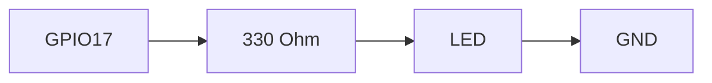

# ENGINEERING ROADMAP
## Том 2 · Лаборатория №4 — LED

> **Первый свет** · Миссия дня

---

## 📡 История

GPIO **изучен**, breadboard **освоен**, **закон Ома** в dnevnik. Пора **увидеть** результат — **свет**.

---

## 🚀 Миссия

**Зажечь LED** через **резистор 330 Ω** от GPIO Pi — **без пайки**, **без** розетки 230V.

---

## 🎯 Цель

- собрать схему **LED + резистор + GPIO + GND**;
- включить **Python или gpio** (gpiozero);
- **погасить** и **записать**.

**Результат:** LED **горит** по команде, фото схемы в dnevnik.

---

## ⏱ Время

45–60 мин.

---

## 🧰 Что понadobится

- [ ] Raspberry Pi (**SSH**)
- [ ] Breadboard, **LED**, резистор **330 Ω**, провода **male-female**
- [ ] **Только 3.3V GPIO** — **НЕ** 230V!

---

## 🤔 Как ты dуmaешь?

1. Длинная ножка LED — **+** или **−**?
2. Зачем **резистор**?
3. GPIO **3.3V** — сколько **ампер** без резистора?

**Настоящее объяснение:** LED **односторонний**. Резистор = **тормоз**. Без него — **мертвый LED** и запах.

---

## 💡 Аналогия

**Вода:** напор (V) → узкая труба (R) → **не** разорвёт шланг (LED).

### 😲 ВАУ!

Mars rover **индикаторы** — те же **LED**, только **дороже**.

### 😄 Момент улыбки

LED **не** прощает «подключу без резистора на секунду». **Секунды хватит**.

---

## 📷 Иллюстрация

:::illustration
ILL-T2-L4-01
:::

```
     +3.3V (GPIO17) ──[330Ω]──►|>── LED ──► GND
```

---

## 📊 Mermaid



---

## 🔬 Эксперимент

**Правило:** **все 5** — безопасность **прежде всего**.

---

### Эксперiment 1 — «Сборка без питания»

**⏱** 15 мин

Собери схему **выключенным** Pi. **Длинная** ножка LED → к резистору → GPIO17. Короткая → **GND**.

---

### Эксперiment 2 — «gpiozero»

**⏱** 15 мин

```bash
sudo apt install -y python3-gpiozero
python3
```

```python
from gpiozero import LED
from time import sleep
led = LED(17)
led.on()
sleep(2)
led.off()
```

| `LED(17)` | Пин **BCM 17** | LED **горит** |

---

### Эксперiment 3 — «Мигание»

**⏱** 10 мин

```python
while True:
    led.toggle()
    sleep(0.5)
```

**Ctrl+C** — стоп. **Обязательно** погаси LED.

---

### Эксперiment 4 — «Проверка рукой»

**⏱** 5 мин

LED **слегка** тёплый? **Нет** — хорошо. **Горячий** — **выключи**, проверь резистор.

---

### Экспeriment 5 — «Фото + dnevnik»

**⏱** 10 мин

Фото схемы **сверху**. Запись: «LED dziala, pin 17, 330 Ohm».

---

## ⚠ Типичные ошибки

| Проблема | Исправление |
|----------|-------------|
| LED не горит | **Полярность**, **GND**, номер пина **BCM** |
| Перепутал 5V | Используй **3.3V GPIO** по книге |
| Нет резистора | **Не включай** — возьми 330 Ω |

---

## 🧪 Проверь себя

- [ ] LED **горит** и **гаснет** по коду
- [ ] Резистор **в цепи**
- [ ] **Не** 230V

---

## 📝 Запись в инженерный dневnik

```
=== TOM2 LAB №4 ===
Data: ___
Co zrobiłem:
  - LED GPIO17: TAK/NIE
  - 330 Ohm: TAK/NIE
  - foto: TAK/NIE
Co było trudne:
Następny pomysł:
```

---

## 🏆 Что теперь uмеешь

- [ ] Собрать **LED** на breadboard
- [ ] Управлять **gpiozero**
- [ ] **Безопасно** питать LED

---

## ➡ Что dальше

**Следующий:** `05_LAB_KNOPKI.md`

- [ ] LED on/off — **обязательно**

### 🔮 Вопрос без ответа

Как **кнопка** **скажет** Pi «включи свет»?

**Ответ — Лаборатория №5.**

---

*Погаси LED. **Ты зажёг** настоящий свет.*
