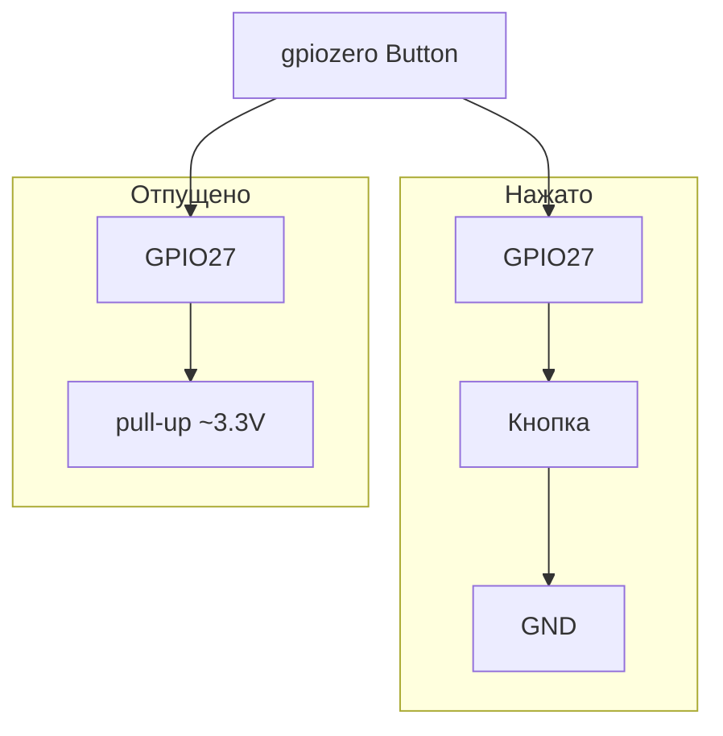

# ENGINEERING ROADMAP
## Том 2 · Лаборатория №5 — Кнопки

> **Вход в мир** · Миссия дня

---

## 📡 История

LED **горит** по **gpiozero**, **закон Ома** и **breadboard** — **за плечами**. Pi **умеет** **выдавать** свет. Но **кто** **скажет** «включи»? Нужен **вход** — **кнопка**.

---

## 🚀 Миссия

**Подключить тактовую кнопку** к GPIO, понять **pull-up**, читать нажатие через **gpiozero Button** — **без** 230V, **только 3.3V**.

---

## 🎯 Цель

- собрать **кнопка + GND** на **входном** GPIO (**BCM 27**);
- **увидеть** в терминале: **нажато** / **отпущено**;
- **(бонус)** **зажечь** LED (**Lab 4**) **по** нажатию.

**Результат:** кнопка **работает**, запись «pull-up + BCM 27» в dnevnik.

---

## ⏱ Время

50–65 мин.

---

## 🧰 Что понadobится

- [ ] Raspberry Pi (**SSH**)
- [ ] Breadboard, провода **M-F**
- [ ] **Тактовая** кнопка (4 ножки — **2** пары **соединены**)
- [ ] LED + **330 Ω** *(если делаешь бонус с LED)*
- [ ] `python3-gpiozero` *(Lab 4)*

---

## 🤔 Как ты dуmaешь?

1. GPIO как **вход** — Pi **«слушает»** или **«кричит»**?
2. Когда кнопка **не** нажата — pin **«висит»** в воздухе. **Что** прочитает Pi — **0** или **1**?
3. **Pull-up** — **подтяжка** к **+** или к **−**?

*(Запиши **до** сборки.)*

**Настоящее объяснение:** **Вход** = Pi **читает** HIGH (**1**, ~3.3V) или LOW (**0**, GND). **Кнопка** замыкает pin на **GND**. **Pull-up** (внутри Pi или резистором) держит pin **HIGH**, пока **не** нажал — тогда **LOW**. **gpiozero Button** включает pull-up **сам**.

---

## 💡 Аналогия

**Дверной звонок:**

| В жизни | В схеме |
|---------|---------|
| Кнопка у двери | **GPIO вход** |
| Провод до квартиры | **Провод** на breadboard |
| «Жду звонка» | **Pull-up** — pin **готов** |
| Нажал — **замкнул** цепь | Pin → **GND** = **LOW** |

### 😲 ВАУ!

**Клавиатура** — **десятки** таких же кнопок; каждая — **вход** с **debounce** (Pi **ждёт**, пока **дребезг** утихнет).

### 😄 Момент улыбки

Кнопка **4 ножки** — **2** пара **дубликаты**. Воткнул **поперёк** ряда — **всегда** нажата. **Схема** важнее **силы**.

---

## 📷 Иллюстрация

📷 **ILL-T2-L5-01** · **[Для художника]** Breadboard: кнопка в **ряду 8**, провода к **GPIO27** и **GND**; LED **горит** на **17**; экран терминала «**button is pressed**»; Pi на фоне; **нет** 230V.

```
  GPIO27 (BCM) ──── кнопка ──── GND
       ↑ pull-up внутри Pi
  (не нажато = HIGH, нажато = LOW)

  GPIO17 ──[330Ω]── LED ── GND   ← бонус: свет по кнопке
```

---

## 📊 Mermaid



---

## 🔬 Эксперимент

**Правило:** **GPIO27** — **вход**. **Не** подключай **+3.3V** **напрямую** к pin **без** нагрузки через кнопку.

**Обязательные:** 1, 2, 3, 5 · **Рекомендуемые:** 4 (LED по кнопке).

---

### Эксперiment 1 — «Кнопка на breadboard»

**⏱** 15 мин

**Pi выключен.**

| Провод | От | К |
|--------|-----|---|
| Жёлтый M-F | Pi **GPIO27** (BCM, физ. **13**) | **a8** |
| Чёрный M-F | Pi **GND** | **−** шина |
| Jumper | **c8** | **−** шина *(вторая сторона кнопки)* |
| Кнопка | ножки в **b8** и **d8** *(одна пара)* | замыкает **a8–c8** при нажатии |

**Проверка без Pi:** мультиметр **Ω** — **нажато** ≈ **0 Ω** между **GPIO** линией и **GND**.

**✅ Проверь себя:** **отпущено** — **разомкнуто**?

---

### Эксперiment 2 — «gpiozero Button: чтение»

**⏱** 15 мин

**Pi включён.**

```bash
python3
```

```python
from gpiozero import Button
from time import sleep

btn = Button(27, pull_up=True)
print("Naciśnij — Ctrl+C stop")
while True:
    if btn.is_pressed:
        print("WCISNIĘTE!")
    else:
        print("...")
    sleep(0.2)
```

| «Нет магии» | Что | Почему | Проверка | Отмена |
|-------------|-----|--------|----------|--------|
| `Button(27)` | BCM **27** | Как в Lab 1 | Нажатие → **WCISNIĘTE** | **Ctrl+C** |
| `pull_up=True` | Pin **HIGH** в покое | **Не** «висит» | Отпустил → **...** | — |

**✅ Провerь себя:** **5** нажатий — **5** сообщений **WCISNIĘTE**?

---

### Экспeriment 3 — «Событие when_pressed»

**⏱** 10 мин

```python
from gpiozero import Button
from signal import pause

btn = Button(27, pull_up=True, bounce_time=0.05)
btn.when_pressed = lambda: print("KLIK!")
print("Czekam... Ctrl+C stop")
pause()
```

`bounce_time=0.05` — **один** KLIK на **одно** нажатие (без **дребезга**).

**✅ Проверь себя:** **одно** нажатие = **один** KLIK?

---

### Экспeriment 4 — «Кнопка + LED» *(рекомендуемый бонус)*

**⏱** 15 мин

Схема LED — **Lab 4** (**GPIO17**). Кнопка — **GPIO27**.

```python
from gpiozero import LED, Button

led = LED(17)
btn = Button(27, pull_up=True)

def toggle():
    led.toggle()

btn.when_pressed = toggle
print("Klik = LED toggle. Ctrl+C koniec.")
from signal import pause
pause()
```

**✅ Проверь себя:** LED **мигает** **только** от **кнопки**, не **сам**?

---

### Экспeriment 5 — «Dnevnik + фото»

**⏱** 10 мин

Фото сверху: **кнопка**, **провода**, **номера** рядов. Запись:

```
pull-up: wewnątrz Pi (gpiozero)
BCM 27 = IN, przycisk do GND
LED opcjonalnie BCM 17
```

**✅ Проверь себя:** можешь **объяснить** pull-up **другу** за **30 секунд**?

---

## ⚠ Типичные ошибки

| Проблема | Исправление |
|----------|-------------|
| **Всегда** pressed | Кнопка **поперёк** ряда — **переставь** |
| **Ничего** не читает | **GND** кнопки, **BCM 27**, не **17** |
| **Дребезг** — 10 KLIK | `bounce_time=0.05` |
| **5V** на GPIO | **Только 3.3V** логика Pi |

---

## 🧪 Проверь себя

- [ ] Кнопка **нажата** → **LOW** / **is_pressed True**
- [ ] **Pull-up** **понятен**
- [ ] **Ctrl+C** **останавливает** скрипт
- [ ] **Не** 230V

---

## 📝 Запись в инженерный dневnik

```
=== TOM2 LAB №5 ===
Data: ___
Co zrobiłem:
  - przycisk GPIO27: TAK/NIE
  - pull-up rozumiem: TAK/NIE
  - when_pressed: TAK/NIE
  - LED toggle bonus: TAK/NIE
Co było trudne:
Następny pomysł: czujnik — kto powie "goraco"?
```

---

## 🏆 Что теперь uмеешь

- [ ] **Собрать** кнопку на **breadboard**
- [ ] **Объяснить** **pull-up** и **GND** при нажатии
- [ ] **Читать** **Button** в **gpiozero**
- [ ] **Связать** **вход** (кнопка) и **выход** (LED)

---

## ➡ Что dальше

**Следующий:** `06_LAB_DATCHIKI.md`

**Обязательно:**

- [ ] Кнопка **работает**, **BCM 27** в dnevnik

### 🔮 Вопрос без ответа

Как **датчик** **сам** скажет «**жарко**» **без** нажатия?

**Ответ — Лаборатория №6.**

---

*Pi **слушает** тебя. **Следующий** шаг — **мир** шлёт **данные**.*
