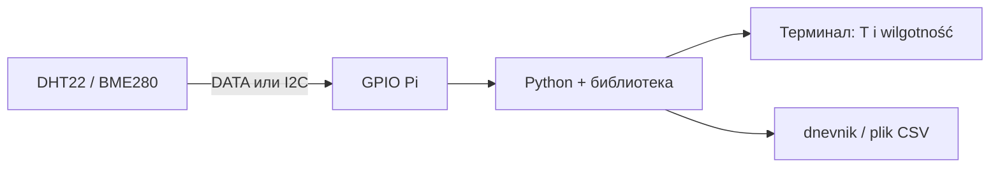

# ENGINEERING ROADMAP
## Том 2 · Лаборатория №6 — Датчики

> **Мир говорит цифрами** · Миссия дня

---

## 📡 История

LED **горит**, кнопка **нажимается**, Pi **слушает** GPIO. Но комната **не** рассказывает сама: **жарко** или **холодно**, **сухо** или **влажно**? Пора подключить **датчик** — «глаз» Pi на **физический мир**.

---

## 🚀 Миссия

**Подключить** датчик **DHT22** (или **BME280**) к Raspberry Pi и **прочитать** температуру и влажность **Python-кодом** — **без** розетки 230V.

---

## 🎯 Цель

- понять, **что такое датчик** и **цифровой сигнал** на одном проводе;
- собрать схему **3.3V + GND + DATA** на breadboard;
- установить библиотеку и **вывести** °C и % на экран.

**Результат:** в терминале **живые цифры** температуры и влажности, фото схемы и запись в dnevnik.

---

## ⏱ Время

60–90 мин (можно **2 дня** по 30–45 мин).

---

## 🧰 Что понadobится

- [ ] Raspberry Pi (**SSH**, Лаб. №0–1)
- [ ] Breadboard и провода **male-female** (Лаб. №3)
- [ ] Датчик **DHT22** *или* **BME280** (I2C) — **один** на выбор
- [ ] Резистор **10 kΩ** (для DHT22 — **pull-up** на линии DATA)
- [ ] **Только 3.3V GPIO** — **НЕ** 230V, **НЕ** 5V на DATA без проверки датасheet

---

## 🤔 Как ты dуmaешь?

**Не читай ответ сразу.**

1. LED **светит** или **нет** — это **аналог** или **цифра**?
2. Как **один** провод DATA может передать **и** температуру, **и** влажность?
3. Зачем резистор **10 kΩ** между DATA и **3.3V**?

*(Запиши ответы в dnevnik. Потом сверься.)*

**Настоящее объяснение:** датчик **измеряет** физику (тепло, воду в воздухе) и **переводит** в **числа**. DHT22 **сам** формирует **цифровой** протокол на DATA — Pi **не** меряет аналог, а **читает пакет**. Резистор pull-up **подтягивает** линию к «1», чтобы сигнал **не** «плавал» в воздухе.

---

## 💡 Аналогия

**Термометр на окне:** стрелка (аналог) vs **электронный** дисплей (цифра). DHT22 — как **ученик**, который **сам** пишет в тетрадь: «23.4°C, 51%» — Pi **только читает** тетрадь.

| В жизни | В технике |
|---------|-----------|
| Термометр | Датчик температуры |
| «Жарко на кухне» | Число **°C** |
| Открытое окно | Рост **влажности %** |
| Запись в блокнот | Строка в **dnevnik.txt** |

### 😲 ВАУ!

Международная космическая станция **не** держит термометр на стекле — там **тысячи датчиков**, как твой, только **с калибровкой NASA**.

### 😄 Момент улыбки

Датчик **не** знает, что ты **задуваешь** на него «проверить влажность». Он **честно** пишет: «ты дышишь — стало мокрее». Спасибо, капитан Очевидность.

---

## 📷 Иллюстрация

:::illustration
ILL-T2-L6-01
:::

```
     3.3V ──[10kΩ]──┬── DATA (GPIO4)
                     │
                  [DHT22]
                     │
                    GND
```

---

## 📊 Mermaid



---

## 🔬 Эксперимент

**Правило:** **безопасность прежде всего** — Pi **выключен** при **первой** сборке.  
**Минимум для зачёта:** **№1, №2, №3, №5**. **Рекомендуется:** все **6**.

---

### Эксперимент 1 — «Сборка без питания»

**⏱** 15 мин

**Pi выключен.** Собери на breadboard:

**DHT22 (4 пина):** VCC → **3.3V**, GND → **GND**, DATA → **GPIO4 (BCM)**, NC — не трогай. Между **DATA** и **3.3V** — резистор **10 kΩ**.

**BME280 (I2C):** VCC → **3.3V**, GND → **GND**, SDA → **GPIO2**, SCL → **GPIO3**.

| Провод | Зачем | Что будет, если перепутать |
|--------|-------|----------------------------|
| 3.3V | Питание датчика | **Не** подключай к **5V** без датасheet |
| GND | Общая «земля» | Без GND — **нет** чтения |
| DATA / SDA | Данные | Неверный пин — библиотека **не** найдёт датчик |

**✅ Проверь себя:** схема **совпадает** с рисунком, **нет** проводов в **230V**.

---

### Эксперимент 2 — «Библиотека и первое чтение»

**⏱** 20 мин

Включи Pi. По **SSH**:

```bash
sudo apt update
sudo apt install -y python3-pip
pip3 install --break-system-packages adafruit-circuitpython-dht
```

*(Для BME280: `pip3 install --break-system-packages adafruit-circuitpython-bme280`.)*

```python
import time
import board
import adafruit_dht

dht = adafruit_dht.DHT22(board.D4)

while True:
    try:
        t = dht.temperature
        h = dht.humidity
        print(f"T={t:.1f}°C  H={h:.1f}%")
    except RuntimeError as e:
        print("Czytam...", e)
    time.sleep(2)
```

| `board.D4` | Пин **BCM 4** | Должны появиться **цифры** |
| `RuntimeError` | Датчик **занят** | **Нормально** — повтор через 2 с |
| **Ctrl+C** | Остановка | **Обязательно** останови перед следующим экспериментом |

**✅ Проверь себя:** видишь **хотя бы одну** строку с **T** и **H**?

---

### Эксперимент 3 — «Проверка руками»

**⏱** 10 мин

1. Запиши **комнатную** температуру.
2. **Подыши** на датчик 5 секунд — влажность **должна вырасти**.
3. **Приложи** (не касаясь мокрыми руками!) тыльную сторону пальца на 10 с — температура **чуть** изменится.

| Действие | Ожидание | Если не так |
|----------|----------|-------------|
| Дыхание | **H** ↑ | Проверь DATA и **3.3V** |
| Палец | **T** ↑ на 0.5–2°C | Подожди **2–3** цикла чтения |

**✅ Проверь себя:** **два** изменения **записаны** в dnevnik (до / после).

---

### Эксперимент 4 — «Запись в файл»

**⏱** 15 мин

Сохрани **10** измерений в CSV:

```python
import time, csv, board, adafruit_dht
from datetime import datetime

dht = adafruit_dht.DHT22(board.D4)
with open("/home/pi/pomiary.csv", "w", newline="") as f:
    w = csv.writer(f)
    w.writerow(["czas", "temp_C", "wilg_%"])
    for i in range(10):
        try:
            w.writerow([datetime.now().isoformat(timespec="seconds"),
                        dht.temperature, dht.humidity])
            print("Zapisano", i + 1)
        except RuntimeError:
            pass
        time.sleep(3)
```

| `open(..., "w")` | **Создаёт/перезаписывает** файл | Проверка: `cat ~/pomiary.csv` |
| `csv.writer` | Таблица **для графика** позже | **11** строк (заголовок + 10) |

**✅ Проверь себя:** файл **существует**, внутри **числа**, не «Czytam...».

---

### Эксперимент 5 — «Порог и предупреждение»

**⏱** 10 мин

**Обязательный для зачёта.** Добавь **условие**:

```python
if h is not None and h > 70:
    print("UWAGA: wilgotno!")
if t is not None and t > 28:
    print("UWAGA: goraco!")
```

Подыши на датчик — должно появиться **UWAGA: wilgotno!**

| `if h > 70` | **Порог** — правило инженера | Меняй **70** на своё |
| `print` | **Сигнал** без LED | В Лаб. №9 добавим **график** |

**✅ Проверь себя:** **хотя бы одно** предупреждение **сработало**.

---

### Эксперимент 6 — «Фото + dnevnik»

**⏱** 10 мин

**Рекомендуется.** Фото схемы **сверху**. Запись: модель датчика, пин DATA, **min/max** T и H за сессию.

**✅ Проверь себя:** фото **читаемое**, провода **видны**.

---

## ⚠ Типичные ошибки

| Проблема | Как исправить |
|----------|---------------|
| `Unable to set line` / вечно «Czytam...» | **Pull-up 10k**, правильный **BCM-пин**, **3.3V** |
| Всегда `None` | **GND** не общий, **перепутаны** VCC и DATA |
| Датчик **горячий** | **Немедленно выключи** — проверь **короткое** на 3.3V |
| `ModuleNotFoundError` | Переустанови **pip** пакет для **твоей** модели |
| Читаешь **раз в 0.1 с** | DHT22 **не** успевает — интервал **≥ 2 с** |

---

## 🧪 Проверь себя

- [ ] Схема **3.3V + GND + DATA** (или I2C) **без** 230V
- [ ] В терминале **T** и **H** **обновляются**
- [ ] Файл **pomiary.csv** или запись в dnevnik **есть**
- [ ] Понимаю: датчик → **число** → **Python** → **файл**
- [ ] **Ctrl+C** умею останавливать скрипт

---

## 📝 Запись в инженерный dnevnik

```
=== TOM2 LAB №6 ===
Data: ___
Co zrobiłem:
  - DHT22 / BME280: ___
  - Pin DATA (BCM): ___
  - Pull-up 10k: TAK/NIE
  - pomiary.csv: TAK/NIE
  - foto: TAK/NIE
Min T: ___  Max T: ___
Min H: ___  Max H: ___
Co było trudne:
Następny pomysł:
```

---

## 🏆 Что теперь uмеешь

- [ ] **Объяснить**, зачем датчику **GND** и **DATA**
- [ ] **Собрать** DHT22/BME280 на breadboard **безопасно**
- [ ] **Прочитать** температуру и влажность **Python**
- [ ] **Записать** измерения в **CSV** для будущего **графика**
- [ ] **Выбрать** интервал опроса (**не** слишком часто)

---

## ➡ Что dальше

**Следующий файл:** `07_LAB_DVIGATELI.md` — **мотор** и **H-мост**: движение **силой**, не только **светом**.

**Перед переходом:**

- [ ] Датчик **стабильно** читает **≥ 5** раз подряд — **обязательно**
- [ ] CSV или dnevnik с **цифрами** — **обязательно**
- [ ] Фото схемы — **рекомендуется**
- [ ] Эксперимент с **порогом** UWAGA — **рекомендуется**

**Если обязательные галочки пустые — не открывай следующую лабораторию.**

### 🔮 Вопрос без ответа

LED **светит** от **миллиампер**. Мотор **крутит** от **сотен миллиампер**. Что будет, если **подключить мотор прямо к GPIO**?

**Ответ — в Лаборатории №7.**

---

*Закрой терминал. Комната **всё ещё** 23.4°C — но теперь ты **это знаешь**.*
