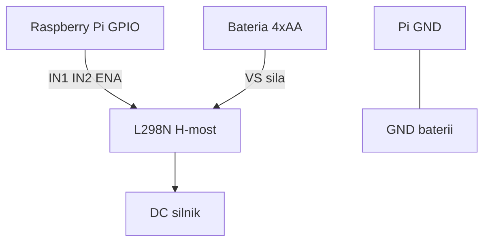

# ENGINEERING ROADMAP
## Том 2 · Лаборатория №7 — Двигатели

> **Сила в движении** · Миссия дня

---

## 📡 История

LED **светит**, датчик **меряет**, кнопка **управляет**. Но **колёса** робота **сами** не крутятся — нужен **двигатель**. GPIO Pi **слабый** «мышца»; мотор **жадный**. Сегодня — **H-мост** и **правила безопасности**.

---

## 🚀 Миссия

**Запустить** маленький **DC-мотор** через модуль **L298N** (или аналог H-моста) от **отдельного** блока питания — Pi **только командует**, **не** кормит мотор.

---

## 🎯 Цель

- понять, **почему GPIO нельзя** вешать на мотор **напрямую**;
- собрать схему **Pi → L298N → мотор → батарея**;
- **крутить**, **останавливать** и **менять направление** кодом.

**Результат:** мотор **крутится** по команде, **стоп** работает, схема и правила безопасности в dnevnik.

---

## ⏱ Время

75–90 мин (можно **2–3 дня** по 25–30 мин).

---

## 🧰 Что понadobится

- [ ] Raspberry Pi (**SSH**, GPIO — Лаб. №1)
- [ ] Breadboard, провода **male-female**
- [ ] Маленький **DC-мотор** 3–6 V (из набора «Arduino» / робототехника)
- [ ] Модуль **L298N** (или готовый **H-bridge** на 2 канала)
- [ ] Блок питания **4×AA** (≈6 V) **или** аккумулятор **7.4 V** через **регулятор** — **согласованный** с мотором
- [ ] **Общий GND** Pi и блока питания мотора
- [ ] Кнопка (Лаб. №5) — **опционально** для «стоп рукой»
- [ ] **НЕ** 230V · **НЕ** мотор от **розетки** · **НЕ** GPIO → мотор **напрямую**

---

## 🤔 Как ты dуmaешь?

**Не читай ответ сразу.**

1. GPIO Pi выдаёт **~16 mA** на пин. Мотор хочет **200–500 mA**. Что случится?
2. Зачем **два** провода на мотор, если **направление** тока **меняет** вращение?
3. Почему **GND Pi** и **GND батареи** должны быть **соединены**?

*(Запиши в dnevnik. Потом сверься.)*

**Настоящее объяснение:** GPIO **управляет** (слабый сигнал), L298N **усиливает** (сильный ток). **H-мост** — **четыре «крана»**: меняешь, **куда** течёт ток через мотор → **вперёд** или **назад**. Без **общего GND** Pi **не понимает**, что «0V» у батареи — это **тот же** «0V», что у Pi.

---

## 💡 Аналогия

**Велосипед:** ты **крутишь** педали (GPIO), но **едет** колесо (мотор). Между ними — **цепь и передачи** (L298N). **Не** пинай ногой **напрямую** в спицу — **сломаешь** и ногу, и колесо.

| В жизни | В технике |
|---------|-----------|
| Педаль | Сигнал **GPIO** |
| Цепь | **H-мост / L298N** |
| Колесо | **DC-мотор** |
| Тормоз | **LOW** на оба IN или **ENABLE=0** |

### 😲 ВАУ!

Электромобиль Tesla — **те же идеи**: слабая **команда** → мощный **инвертор** → **мотор**. Только **400 вольт**, не **6**.

### 😄 Момент улыбки

Мотор **не** знает слово «аккуратно». Если дать **полный газ** без **стопа** — он **убежит** с breadboard, как **хомяк** с колеса.

---

## 📷 Иллюстрация

📷 **[Для художника]** **ILL-T2-L7-01 · Мотор под командой Pi**

| | |
|--|--|
| **Главный объект** | L298N на breadboard, **маленький мотор** с **пропеллером из бумаги** (безопасно!) |
| **Ракурс** | Сбоку — видны **батарейный отсек 4×AA**, **Pi** на фоне, **красные/чёрные** силовые провода |
| **Выделить** | **Жирная** линия: батарея → L298N → мотор; **тонкая** пунктир: GPIO → IN1/IN2 |
| **Настроение** | «Я **командую** силой!» — но на столе **наклейка STOP** |
| **Подпись** | «Pi **командует** · Батарея **кормит**» |

```
  [4×AA 6V] ──► L298N (VS) ──► MOT ──► L298N ──► GND батареи
                    ▲
  Pi GPIO17 ── IN1    Pi GPIO27 ── IN2
  Pi GND ──────────── GND (ОБЩИЙ!)
```

---

## 📊 Mermaid



---

## 🔬 Эксперимент

**Правило:** **мотор всегда** можно **остановить** — **Ctrl+C**, кнопка или **снятие ENABLE**.  
**Минимум для зачёта:** **№1, №2, №4, №5**. **Рекомендуется:** все **6**.

---

### Эксперимент 1 — «Почему не напрямую» (на бумаге)

**⏱** 10 мин

**Pi выключен.** Нарисуй **две** схемы в dnevnik:

1. ❌ GPIO → мотор → GND (**запрещено**)
2. ✅ GPIO → L298N → мотор ← батарея

Подпиши: «GPIO max **~16 mA**», «Мотор **~300 mA**».

| Схема | Риск | Вывод |
|-------|------|-------|
| Напрямую | **Сгорит** пин или Pi | **Только** через драйвер |
| L298N | Батарея **отдельно** | Pi **командует** |

**✅ Проверь себя:** **обе** схемы нарисованы, **крестик** на первой.

---

### Эксперимент 2 — «Сборка без питания мотора»

**⏱** 20 мин

**Батарея отключена.** Подключи:

| L298N | Куда |
|-------|------|
| **IN1** | GPIO **17** (BCM) |
| **IN2** | GPIO **27** (BCM) |
| **ENA** | GPIO **22** *(или перемычка ENA на модуле — см. инструкцию)* |
| **GND** | **GND Pi** |
| **OUT1, OUT2** | К **мотору** (полярность пока **любая**) |
| **+VS** | К **+** батареи *(пока **не** подключай минус батареи к VS)* |

| `IN1/IN2` | **Направление** логики | Мотор **ещё** не крутится без VS |
| **Общий GND** | **Обязателен** | Без него — **случайное** поведение |

**✅ Проверь себя:** **нет** провода GPIO → мотор **минуя** L298N.

---

### Эксперимент 3 — «Первый запуск — только вперёд»

**⏱** 15 мин

**Крепление:** мотор **приклеен** или **зажат** — **не** держи пальцами, **не** ставь пропеллер металлический.

Подключи **батарею** к **VS** и **GND** L298N. Код:

```bash
sudo apt install -y python3-gpiozero
python3
```

```python
from gpiozero import OutputDevice
from time import sleep

in1 = OutputDevice(17)
in2 = OutputDevice(27)
ena = OutputDevice(22)

def stop():
    in1.off(); in2.off(); ena.off()

def forward():
    stop()
    in1.on(); in2.off(); ena.on()

forward()
sleep(2)
stop()
```

| `forward()` | IN1=1, IN2=0 | Мотор **крутится** ~2 с |
| `stop()` | Всё **OFF** | **Тишина** — обязательная привычка |
| **Ctrl+C** | Аварийный стоп | Потом вызови **`stop()`** вручную |

**✅ Проверь себя:** мотор **остановился** после `stop()`.

---

### Эксперимент 4 — «Назад и PWM (медленно)»

**⏱** 15 мин

**Обязательный для зачёта.**

```python
def backward():
    stop()
    in1.off(); in2.on(); ena.on()

def slow_forward():
    from gpiozero import PWMOutputDevice
    global ena
    stop()
    in1.on(); in2.off()
    ena = PWMOutputDevice(22)
    ena.value = 0.4  # 40% mocy

backward()
sleep(2)
stop()
slow_forward()
sleep(3)
stop()
```

| `backward()` | Меняем **IN1/IN2** | Мотор **в другую** сторону |
| `PWM 0.4` | **Не** полный газ | Меньше **рывок**, меньше **убегает** |

**✅ Проверь себя:** **два** направления **работают**, после каждого — **stop**.

---

### Эксперимент 5 — «Кнопка СТОП»

**⏱** 15 мин

**Обязательный для зачёта.** Кнопка между **GPIO23** и **GND** (pull-up в коде):

```python
from gpiozero import Button, OutputDevice
from signal import pause

in1 = OutputDevice(17)
in2 = OutputDevice(27)
ena = OutputDevice(22)
btn = Button(23, pull_up=True)

def forward():
    in1.on(); in2.off(); ena.on()

def stop():
    in1.off(); in2.off(); ena.off()

btn.when_pressed = stop
forward()
print("Jedzie... Nacisnij STOP")
pause()
```

| Кнопка | **Прерывает** мотор | Как **красная** кнопка на станке |
| `pause()` | Ждёт событие | **Ctrl+C** всё ещё работает |

**✅ Проверь себя:** нажал — мотор **сразу** стоп.

---

### Эксперимент 6 — «Журнал безопасности»

**⏱** 10 мин

**Рекомендуется.** В dnevnik — **5 правил** мотора:

1. **Не** GPIO → мотор напрямую  
2. **Общий GND** Pi и батареи  
3. **stop()** после каждого теста  
4. Мотор **закреплён**  
5. **Нет** 230V  

Фото схемы **с подписанными** IN1, IN2, VS, GND.

**✅ Проверь себя:** **5 правил** записаны **своими** словами.

---

## ⚠ Типичные ошибки

| Проблема | Как исправить |
|----------|---------------|
| Мотор **не** крутится | **VS** батареи, **ENA** включён, **общий GND** |
| Pi **перезагружается** | Мотор **с GPIO** — **немедленно** отключи, только **L298N** |
| Мотор **жужжит**, не крутит | **Низкое** напряжение или **PWM** слишком слабый |
| **Искры** на L298N | **Стоп**, проверь **короткое** на OUT, **полярность** VS |
| Крутится **всегда** | Забыл **`stop()`** — добавь в **`finally`** |

---

## 🧪 Проверь себя

- [ ] **Нет** провода GPIO → мотор **напрямую**
- [ ] **Общий GND** Pi и батареи
- [ ] **forward**, **backward**, **stop** — **все три** работают
- [ ] Кнопка или **stop()** — **мгновенная** остановка
- [ ] **5 правил** безопасности в dnevnik
- [ ] **Не** 230V

---

## 📝 Запись в инженерный dnevnik

```
=== TOM2 LAB №7 ===
Data: ___
Co zrobiłem:
  - L298N: TAK/NIE
  - Bateria (V): ___
  - forward / backward / stop: TAK/NIE
  - przycisk STOP: TAK/NIE
  - foto: TAK/NIE
5 zasad bezpieczeństwa (skrót):
Co było trudne:
Następny pomysł:
```

---

## 🏆 Что теперь uмеешь

- [ ] **Объяснить**, зачем **H-мост** и **отдельное** питание
- [ ] **Собрать** Pi → L298N → мотор **безопасно**
- [ ] **Менять направление** и **скорость** (PWM)
- [ ] **Остановить** мотор **кодом** и **кнопкой**
- [ ] **Выбрать**: слабый сигнал **управляет**, сильный ток **исполняет**

---

## ➡ Что dальше

**Следующий файл:** `08_LAB_ESP32.md` — **второй мозг**: Wi‑Fi **на чипе**, без **целого** Linux.

**Перед переходом:**

- [ ] **stop()** после **каждого** теста — **обязательно**
- [ ] **forward + backward** — **обязательно**
- [ ] **5 правил** безопасности — **обязательно**
- [ ] Кнопка СТОП — **рекомендуется**
- [ ] PWM «медленно» — **рекомендуется**

**Если обязательные галочки пустые — не открывай следующую лабораторию.**

### 🔮 Вопрос без ответа

Pi **умный**, но **тяжёлый**. А если нужен **датчик на окне** с **Wi‑Fi**, который **спит** и **шлёт** температуру? Хватит ли **Arduino-размера**?

**Ответ — в Лаборатории №8.**

---

*Выключи батарею. Мотор **спит**. Ты — **нет** — ты уже **инженер движения**.*
