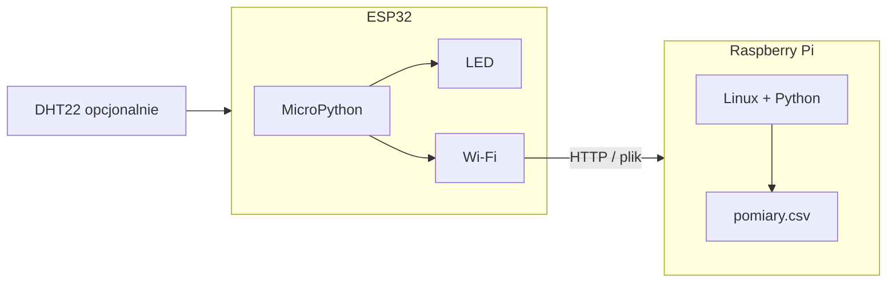

# ENGINEERING ROADMAP
## Том 2 · Лаборатория №8 — ESP32

> **Маленький мозг с Wi‑Fi** · Миссия дня

---

## 📡 История

Pi **меряет** датчики, **крутит** моторы через драйверы, **живёт** в Linux. Но на **окне**, **в теплице** или **на дроне** нужен **крошечный** компьютер с **Wi‑Fi внутри** — **ESP32**. Сегодня — **второй** тип «мозга» в твоей лаборатории.

---

## 🚀 Миссия

**Запустить** ESP32: **мигание LED**, **скан Wi‑Fi**, **отправка** одного числа (температура **или** «жив») — и понять **когда Pi**, **когда ESP32**.

---

## 🎯 Цель

- сравнить **Pi vs ESP32** (Linux vs микроконтроллер);
- прошить **MicroPython** *(или использовать готовую)* и **мигнуть** встроенным LED;
- **подключиться** к Wi‑Fi и **отправить** данные на Pi или в **файл**.

**Результат:** ESP32 **мигает**, **видит** сети Wi‑Fi, **одна** строка данных **улетела** — запись в dnevnik.

---

## ⏱ Время

90–120 мин (можно **3 дня** по 30 мин — первая прошивка **может** занять время).

---

## 🧰 Что понadobится

- [ ] Плата **ESP32** (DevKit — **USB** на борту)
- [ ] Кабель **USB** (data, не «только зарядка»)
- [ ] ПК или Pi с **Thonny** / **esptool** / **ampy**
- [ ] Wi‑Fi **дома** (SSID и пароль — **знаешь**)
- [ ] Опционально: DHT22 с Лаб. №6 — **один** провод DATA на **GPIO4**
- [ ] **НЕ** 230V · **не** мочить плату · **не** коротить **3.3V** на **GND**

---

## 🤔 Как ты dуmaешь?

**Не читай ответ сразу.**

1. У Pi **4 GB RAM**, у ESP32 **520 KB**. Зачем тогда ESP32?
2. Wi‑Fi в **ESP32** — это **отдельная** микросхема или **часть** одного камня?
3. Можно ли на ESP32 **полный** Minecraft-сервер?

*(Запиши в dnevnik. Потом сверься.)*

**Настоящее объяснение:** ESP32 — **микроконтроллер**: **одна** программа, **мгновенный** старт, **мало** ест. Wi‑Fi и Bluetooth **внутри** чипа — **не** нужен USB‑dongle. Pi — **компьютер**: Linux, браузер, **много** задач. Minecraft на ESP32 — **нет**, мигание LED и **отправка** температуры — **да**.

---

## 💡 Аналогия

**Pi** — **ноутбук** в классе: тяжёлый, **всё умеет**. **ESP32** — **умные часы**: **лёгкий**, **одна** главная задача, **Wi‑Fi** для **коротких** сообщений.

| В жизни | Pi | ESP32 |
|---------|-----|-------|
| Роль | **Учитель / сервер** | **Датчик на окне** |
| ОС | **Linux** | **MicroPython / прошивка** |
| Wi‑Fi | Через **адаптер** | **Внутри** |
| Старт | **~30 с** | **~1 с** |
| GPIO | **Много**, **3.3V** | **Много**, **3.3V** |

### 😲 ВАУ!

В **одном** чипе ESP32 — **два** ядра CPU **и** радио Wi‑Fi. Размер — **меньше** жвачки.

### 😄 Момент улыбки

ESP32 **настолько** мал, что **легко** теряется на столе. Правило: **всегда** клади на **конtrastную** коврик — «чёрная дыра для плат».

---

## 📷 Иллюстрация

📷 **[Для художника]**

**ID:**  
ILL-T2-L8-01

**Название:**  
ESP32 и Wi‑Fi — маленький, но в сети

**Тип иллюстрации:**  
Сюжетная сцена · 3/4 сверху · scale contrast (Pi vs ESP32)

**Главная цель иллюстрации:**  
Представить **второй мозг** лаборатории: **ESP32 DevKit** (крошечная плата, **USB** слева), **встроенный синий LED** мигает. **Стилизованные волны Wi‑Fi** от чипа. **Ноутбук** справа с **списком сетей** (**без читаемых имён** — цветные полоски). **Pi** на заднем плане **серым** blur («большой брат»). Эмоция: «**маленький**, но **в сети**!»

Что ребёнок должен почувствовать: **любопытство**, «ESP32 ≠ Pi», «Wi‑Fi **внутри** чипа».

---

**Описание сцены**

Стол, **день**. Ракурс **3/4 сверху**: **ESP32 DevKit** (чёрная PCB ~7 см, **две** ряды пинов, **металлический** экран антенны на плате) **в центре** на **контрастном** синем/фиолетовом коврике (чтобы **не потерять** плату — шутка Lab 8).

**Синий LED** на плате (**GPIO2**) — **яркая** точка с **мягким** ореолом + **вторая** призрачная точка (мигание). От модуля Wi‑Fi — **3–4** концентрические **дуги** (стилизованный сигнал, **не** реалистичное фото).

**USB-кабель** уходит **влево** к ноутбуку (частично в кадре). **Экран ноутбука** справа: **5** горизонтальных **полос** разной длины (сети Wi‑Fi) + **иконка** «замок» у одной — **без** «WiFi: 5 sieci» текстом.

**Raspberry Pi** на заднем плане — **крупнее**, **приглушённый** серо-зелёный, **blur** — визуальный контраст «**ноутбук vs умные часы**».

**Герой** 12 лет (веснушки, зелёный худи): **обе руки** осторожно **не касаются** платы — **щипком** держит **край коврика** или **рука** у клавиатуры. Лицо — **удивление** размером. **Взгляд** — на ESP32.

**Что НЕ должно появляться:** 230V, мокрая плата, короткое 3.3V-GND искрами, читаемые SSID, Minecraft на Pi, дрон в полёте.

---

**Главный герой**

- **Возраст:** 12 лет · Tom 2 🔵 Constructor  
- **Внешность:** веснушки, зелёный худи, тёмно-каштановые волосы  
- **Поза:** наклонён к столу, осторожные руки  
- **Выражение:** «он **меньше** жвачки!»  
- **Взгляд:** ESP32, **не** в камеру  

---

**Дополнительные персонажи**

Нет.

---

**Окружение**

- **Стол:** дерево, контрастный коврик, ESP32, ноутбук, Pi на фоне  
- **Атмосфера:** «**второй** тип мозга»  

---

**Композиция**

- **Формат:** 16:9  
- **План:** средний 3/4 сверху  
- **Передний план:** ESP32 + синий LED + Wi‑Fi дуги  
- **Средний план:** USB, экран с полосками сетей  
- **Задний план:** Pi blur  
- **Линия взгляда:** ESP32 → LED → Wi‑Fi дуги → экран  
- **Правило третей:** ESP32 на пересечении центра  

---

**Освещение**

- **Дневной** мягкий свет  
- **Синий** отблеск от LED на коврике  
- **Тени:** короткая под ESP32  

---

**Цветовая палитра**

- **Основные:** `#4361EE` (LED + Wi‑Fi), `#2D6A4F` (худи), `#212529` (ESP32 PCB)  
- **Дополнительные:** `#7B2CBF` (коврик), `#6C757D` (Pi фон), `#F8F9FA` (экран)  
- **Настроение:** технологичное, **лёгкое**  

---

**Стиль**

EduMost · вектор · scale contrast без фотореализма.  
**Без:** аниме, Pixar, фотореализм, 3D, неон, читаемые SSID.

---

**Возрастная адаптация**

- **11–14 лет:** маленькая плата, Wi‑Fi волны абстрактно  
- **Нельзя:** 230V, мокрая электроника, потерянная плата как «смешно опасно»  

---

**Формат**

- **SVG · 16:9** · ESP32 и Pi **в масштабе** друг относительно друга  

---

**Текст**

**Нет текста** — ни «ESP32», ни «WiFi», ни «5 sieci», ни «w środku».

---

**Негативный prompt**

текст · SSID · цифры · 230V · искры · мокрая плата · аниме · Pixar · фотореализм · 3D · логотипы Espressif крупно

---

**Связь с лабораторией**

Лаборатория №8 — **ESP32**, MicroPython, мигание LED, **скан Wi‑Fi**, отправка данных. Иллюстрация = **Pi vs ESP32** и «**Wi‑Fi внутри**».

```
  [USB] ── ESP32 ── GPIO2 ── (wbudowany LED)
              │
              └── antena Wi-Fi (na plytce)
```

---

## 📊 Mermaid



---

## 🔬 Эксперимент

**Правило:** **USB только** от ПК/Pi — **не** зарядка **от стены** без проверки **5V**.  
**Минимум для зачёта:** **№1, №2, №3, №5**. **Рекомендуется:** все **6**.

---

### Эксперимент 1 — «Паспорт платы»

**⏱** 15 мин

**Без** подключения к **230V**. Осмотри ESP32:

1. Найди **USB**, кнопку **BOOT**, **EN** (reset).
2. Запиши модель (например **ESP32‑WROOM‑32**).
3. Таблица в dnevnik: **3.3V**, **GND**, **GPIO2** (часто **встроенный LED**).

| Элемент | Зачем | Ошибка |
|---------|-------|--------|
| **3.3V** | Питание **логики** | **Не** 5V на **входы** без level shifter |
| **BOOT** | Режим **прошивки** | Зажат при **Upload** |
| **EN** | **Перезагрузка** | Как **Reset** |

**✅ Проверь себя:** **3** подписи на **фото** или **рисунке** платы.

---

### Эксперимент 2 — «MicroPython и первый blink»

**⏱** 25 мин

Установи **Thonny** на ПК *(или Pi)*. Прошивка MicroPython *(один раз)*:

```bash
pip install esptool
esptool.py chip_id
# Oficjalny firmware: micropython.org/download/ESP32_GENERIC/
esptool.py --port /dev/ttyUSB0 erase_flash
esptool.py --port /dev/ttyUSB0 write_flash -z 0x1000 ESP32_GENERIC-*.bin
```

*(Windows: порт `COM3` и т.д. — смотри в Thonny.)*

В **Thonny** → **MicroPython (ESP32)**:

```python
from machine import Pin
from time import sleep

led = Pin(2, Pin.OUT)  # wbudowany LED na wielu DevKit

for i in range(10):
    led.value(1)
    sleep(0.3)
    led.value(0)
    sleep(0.3)
print("Blink OK")
```

| `Pin(2, OUT)` | **Выход** на GPIO2 | LED **мигает** |
| `led.value(1)` | **3.3V** на пине | Как **gpiozero** на Pi |
| `print` | В **Shell Thonny** | Видишь `Blink OK` |

**✅ Проверь себя:** **10** миганий **без** ошибки.

---

### Эксперимент 3 — «Скан Wi‑Fi»

**⏱** 15 мин

```python
import network

wlan = network.WLAN(network.STA_IF)
wlan.active(True)
nets = wlan.scan()
for n in nets:
    print(n[0].decode(), "RSSI:", n[3])
print("Sieci:", len(nets))
```

| `scan()` | **Список** сетей | **Не** подключается ещё |
| `RSSI` | **Сила** сигнала | Ближе к **0** = сильнее *(−40 лучше −80)* |

**✅ Проверь себя:** видишь **свой** SSID дома в списке?

---

### Эксперимент 4 — «Подключение к Wi‑Fi»

**⏱** 20 мин

**Не пиши пароль в dnevnik на фото!** Используй **`secrets.py`**:

```python
# secrets.py — NIE commituj, NIE fotografuj
WIFI_SSID = "twoja_siec"
WIFI_PASS = "twoje_haslo"
```

```python
import network, time
from secrets import WIFI_SSID, WIFI_PASS

wlan = network.WLAN(network.STA_IF)
wlan.active(True)
wlan.connect(WIFI_SSID, WIFI_PASS)
for i in range(20):
    if wlan.isconnected():
        break
    time.sleep(1)
if wlan.isconnected():
    print("IP:", wlan.ifconfig()[0])
else:
    print("Blad WiFi")
```

| `connect` | **Логин** в сеть | До **20 с** ожидания |
| `ifconfig()[0]` | **IP** ESP32 | Запиши **только** IP в dnevnik |

**✅ Проверь себя:** `IP: 192.168...` **напечатан**.

---

### Эксперимент 5 — «Отправка на Pi»

**⏱** 20 мин

**Обязательный для зачёта.** На **Pi** *(заранее)*:

```bash
mkdir -p ~/esp32_in
nano ~/esp32_server.py
```

```python
# ~/esp32_server.py na Pi
from http.server import HTTPServer, BaseHTTPRequestHandler
class H(BaseHTTPRequestHandler):
    def do_GET(self):
        if self.path.startswith("/temp?"):
            with open("/home/pi/esp32_in/last.txt", "w") as f:
                f.write(self.path)
            self.send_response(200); self.end_headers()
            self.wfile.write(b"OK")
        else:
            self.send_response(404); self.end_headers()
HTTPServer(("0.0.0.0", 8080), H).serve_forever()
```

Запусти на Pi: `python3 ~/esp32_server.py` *(в tmux — Лаб. №1 Tom 1)*.

На **ESP32**:

```python
import urequests
IP_PI = "192.168.1.10"  # IP twojego Pi w LAN
t = 23.5  # pozniej: odczyt DHT22
r = urequests.get(f"http://{IP_PI}:8080/temp?val={t}")
print(r.text)
r.close()
```

| Pi **сервер** | **Принимает** GET | Файл **last.txt** |
| ESP32 **клиент** | **Шлёт** число | **Мост** между платами |

**✅ Проверь себя:** на Pi `cat ~/esp32_in/last.txt` — **есть** строка с **val=**.

---

### Эксперимент 6 — «Pi czy ESP32?»

**⏱** 10 мин

**Рекомендуется.** Таблица **в dnevnik** — **3 задачи**, что выбрать:

| Задача | Pi | ESP32 | Почему |
|--------|-----|-------|--------|
| Метеостанция **дома** с графиком | ✅ | | Linux, **диск**, Python |
| Датчик **на балконе** | | ✅ | **Мало** питания, Wi‑Fi |
| Minecraft сервер | ✅ | ❌ | **RAM** |

**✅ Проверь себя:** **3** строки **заполнены** **своими** словами.

---

## ⚠ Типичные ошибки

| Проблема | Как исправить |
|----------|---------------|
| Thonny **не видит** порт | Кабель **data**, драйвер **CP210x/CH340**, **Linux**: права `dialout` |
| `WiFi fail` | SSID/пароль, **2.4 GHz** *(многие ESP **не** 5 GHz)* |
| LED **не** мигает | Другой пин — на DevKit часто **GPIO2**, проверь **схему** платы |
| Pi **не** получает | **Firewall**, неверный **IP Pi**, сервер **не** запущен |
| Пароль **утёк** | Смени Wi‑Fi пароль, **не** фотографируй **secrets.py** |

---

## 🧪 Проверь себя

- [ ] ESP32 **мигает** LED (**MicroPython**)
- [ ] **Скан** Wi‑Fi показывает **≥ 1** сеть
- [ ] ESP32 **получил IP** в LAN
- [ ] **Одна** строка данных **до Pi** (или в файл на ESP)
- [ ] Таблица **Pi vs ESP32** в dnevnik
- [ ] **Нет** пароля Wi‑Fi в **открытых** записях

---

## 📝 Запись в инженерный dnevnik

```
=== TOM2 LAB №8 ===
Data: ___
Co zrobiłem:
  - Model ESP32: ___
  - Blink GPIO___: TAK/NIE
  - WiFi IP: ___
  - Wysłano na Pi: TAK/NIE
  - Tabela Pi vs ESP32: TAK/NIE
Co było trudne:
Następny pomysł:
```

---

## 🏆 Что теперь uмеешь

- [ ] **Объяснить** разницу **Pi** и **ESP32**
- [ ] **Прошить** и **запустить** MicroPython
- [ ] **Мигать** GPIO и **сканировать** Wi‑Fi
- [ ] **Подключить** ESP32 к **домашней** сети
- [ ] **Отправить** данные на **Pi** по **HTTP**
- [ ] **Выбрать** плату под **задачу**

---

## ➡ Что dальше

**Следующий файл:** `09_LAB_METEOSTANCJA.md` — **большой проект**: датчик + **лог** + **график** + всё, что ты **собрал** в Томе 2.

**Перед переходом:**

- [ ] Blink **10×** — **обязательно**
- [ ] Wi‑Fi **IP** получен — **обязательно**
- [ ] Данные **на Pi** или в файл — **обязательно**
- [ ] Таблица Pi vs ESP32 — **рекомендуется**
- [ ] DHT22 на ESP32 — **рекомендуется** *(если есть второй датчик)*

**Если обязательные галочки пустые — не открывай следующую лабораторию.**

### 🔮 Вопрос без ответа

Что если **Pi** **рисует график** каждого дня, а **ESP32** на окне **шлёт** только **цифры**? Как **склеить** это в **одну** метеостанцию?

**Ответ — финальный проект Тома 2.**

---

*Отключи USB. ESP32 **спит**. Но ты уже знаешь: **маленький** ≠ **слабый**.*
