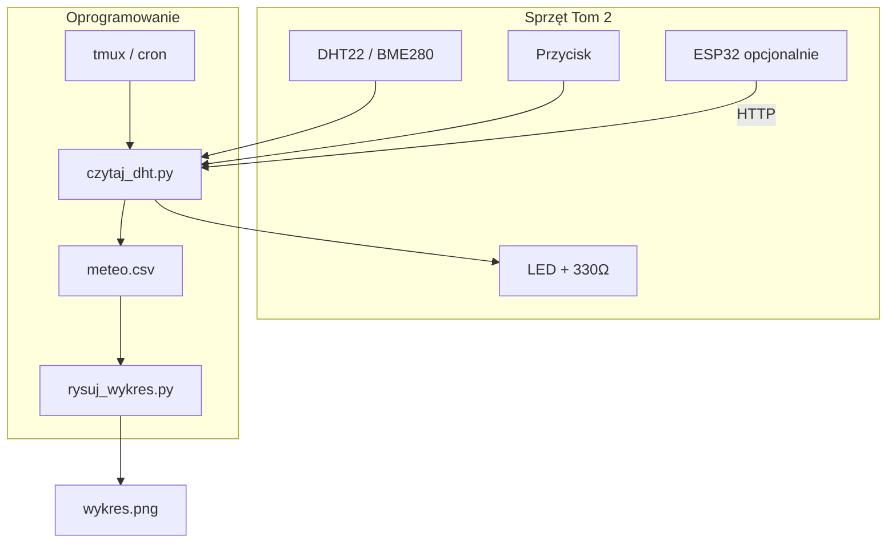

# ENGINEERING ROADMAP
## Том 2 · Лаборатория №9 — Домашняя метеостанция

> **Большой проект уровня 2** · Миссия дня

---

## 📡 История

Ты прошёл **весь** путь Тома 2: **Pi** и **SSH** (№0), **GPIO** (№1), **электричество** и **закон Ома** (№2), **breadboard** (№3), **LED** (№4), **кнопки** (№5), **датчики** (№6), **моторы** (№7), **ESP32** (№8). Каждая лаборатория — **кирпичик**. Сегодня **склеиваешь** их в **одну систему**: **домашняя метеостанция**, которая **меряет**, **записывает** и **показывает график**.

---

## 🚀 Миссия

**Построить** метеостанцию: **DHT22/BME280** → **лог CSV** → **график** на Pi → *(опционально)* **ESP32** шлёт данные **по Wi‑Fi** → **кнопка** «снимок сейчас» и **LED** «идёт запись».

---

## 🎯 Цель

- **собрать** аппаратную часть **безопасно** (3.3V, резисторы, **общий GND**);
- **автоматически** писать **T** и **H** каждые N минут;
- **нарисовать** график за **день** (Python + matplotlib);
- **объединить** навыки: GPIO, датчик, файл, *(опционально)* ESP32 и **tmux**-служба.

**Результат:** папка `~/meteo/` с **CSV**, **PNG-графиком**, **фото** установки и **запись** в dnevnik — **как у настоящего** инженера.

---

## ⏱ Время

**4–6 часов** суммарно ( **большой проект** — разбей на **5–7 дней** по 30–45 мин).

| День | Фокус |
|------|-------|
| 1 | Схема + первый лог |
| 2 | Автозапись + tmux |
| 3 | График |
| 4 | LED + кнопка |
| 5 | ESP32 *(опционально)* |
| 6 | Установка «на месте» + фото |
| 7 | Презентация + dnevnik |

---

## 🧰 Что понadobится

**Из прошлых лабораторий:**

- [ ] Raspberry Pi + **SSH** (№0)
- [ ] Breadboard, провода, **330 Ω**, **10 kΩ** (№2–4, №6)
- [ ] **DHT22** или **BME280** (№6)
- [ ] **LED** + резистор (№4)
- [ ] **Кнопка** (№5)
- [ ] Знание **tmux** или **cron** (Том 1, №6)
- [ ] Опционально: **ESP32** + Wi‑Fi (№8)
- [ ] Опционально: **L298N** — **не** для метео, но можешь **микровентилятор** *(только с взрослым и **стоп**)*

**Новое:**

- [ ] `python3-matplotlib` на Pi
- [ ] Папка `~/meteo/`
- [ ] **Только** безопасное питание — **НЕ** 230V на столе

---

## 🤔 Как ты dуmaешь?

**Не читай ответ сразу.**

1. Зачем **CSV**, если можно **смотреть** цифры в терминале?
2. Где **лучше** повесить датчик — **у окна**, **на столе**, **на Pi**? Что **испортит** показания?
3. Если Pi **перезагрузится** — как **не потерять** запись?

*(Запиши в dnevnik. Потом сверься.)*

**Настоящее объяснение:** CSV — **чёрный ящик** для **графика** и **истории**. Датчик **не** должен **греться** от Pi и **не** должен **светить** на солнце — иначе **врёт**. **tmux** или **systemd** / **cron** — **служба**, которая **пишет**, пока ты **в школе**.

---

## 💡 Аналогия

**Метеостанция** — как **дневник погоды** в школе, только **Pi** **сам** пишет **каждые 5 минут** и **рисует** кривую. ESP32 на окне — **корреспондент** с **балкона**, Pi — **редактор** в **редакции**.

| В жизни | В проекте |
|---------|-----------|
| Термометр на стене | **DHT22** |
| Запись в тетрадь | **meteo.csv** |
| График в тетради | **wykres.png** |
| «Сейчас сфотографируй» | **Кнопка** snapshot |
| «Идёт запись» | **LED** мигает |

### 😲 ВАУ!

Met Office (UK) **миллиарды** точек — **та же** идея: **датчик → файл → модель**. Твой `~/meteo/` — **микро‑Met Office**.

### 😄 Момент улыбки

Если повесить датчик **над** чайником — график покажет **«извержение чайника»**, не **климат Земли**. Наука **честная**, кухня **тоже**.

---

## 📷 Иллюстрация

:::illustration
ILL-T2-L9-01
:::

```
  [DHT22] --DATA--> Pi GPIO4
  [LED]   <--GPIO17--  (REC)
  [BTN]   --> GPIO23   (SNAPSHOT)
       |
       v
  ~/meteo/meteo.csv  -->  wykres.png
       ^
  [ESP32 okno] --WiFi--> (opcja)
```

---

## 📊 Mermaid



---

## 🔬 Эксперимент

**Правило:** **большой проект** — **каждый** эксперiment **заканчивается** рабочим **кусочком**.  
**Минимум для зачёта:** **№1–5**. **Рекомендуется:** все **7** + ESP32.

---

### Эксперимент 1 — «Папка проекта и эталонная схема»

**⏱** 30 мин

**Pi выключен.** Собери **финальную** схему на breadboard:

| Компонент | Подключение |
|-----------|-------------|
| DHT22 VCC | **3.3V** |
| DHT22 GND | **GND** |
| DHT22 DATA | **GPIO4** + **10k** pull-up |
| LED | **GPIO17** → **330Ω** → LED → **GND** |
| Кнопка | **GPIO23** — другой ногой **GND** *(pull-up в коде)* |

```bash
mkdir -p ~/meteo
nano ~/meteo/README.txt
```

Запиши **BCM-пины** и **дату** сборки.

| `~/meteo/` | **Один дом** для проекта | Как `Moja_Laboratoria` в Томе 1 |
| Фото | **До** включения | dnevnik **№9** |

**✅ Проверь себя:** **3.3V**, **GND**, **10k**, **330Ω** — **на месте**.

---

### Эксперимент 2 — «Скрипт чтения + LED REC»

**⏱** 45 мин

`~/meteo/czytaj_dht.py`:

```python
#!/usr/bin/env python3
import csv, time, board, adafruit_dht
from datetime import datetime
from gpiozero import LED

CSV = "/home/pi/meteo/meteo.csv"
dht = adafruit_dht.DHT22(board.D4)
rec = LED(17)

def odczyt():
    rec.on()
    try:
        t = dht.temperature
        h = dht.humidity
    except RuntimeError:
        t = h = None
    rec.off()
    return t, h

def zapisz(t, h):
    now = datetime.now().isoformat(timespec="seconds")
    header = not __import__("os").path.exists(CSV)
    with open(CSV, "a", newline="") as f:
        w = csv.writer(f)
        if header:
            w.writerow(["czas", "temp_C", "wilg_%"])
        w.writerow([now, t, h])
    print(now, t, h)

if __name__ == "__main__":
    t, h = odczyt()
    zapisz(t, h)
```

```bash
chmod +x ~/meteo/czytaj_dht.py
python3 ~/meteo/czytaj_dht.py
cat ~/meteo/meteo.csv
```

| LED **ON** | Идёт **опрос** датчика | Как **лампочка REC** на камере |
| CSV **append** | **Не** затирает старое | Каждая строка — **точка** графика |

**✅ Проверь себя:** в CSV **≥ 2** строки данных, LED **мигнул**.

---

### Эксперимент 3 — «Автозапись в tmux»

**⏱** 30 мин

`~/meteo/petla.py`:

```python
#!/usr/bin/env python3
import time, subprocess
while True:
    subprocess.run(["/usr/bin/python3", "/home/pi/meteo/czytaj_dht.py"])
    time.sleep(300)  # co 5 minut
```

```bash
tmux new -s meteo
python3 ~/meteo/petla.py
# Ctrl+B, D — odłącz
```

| **300 s** | Интервал **5 мин** | DHT22 **не** любит **частый** опрос |
| **tmux** | Работает **без** открытого SSH | Навык **Том 1, №6** |

**✅ Проверь себя:** через **15 мин** в CSV **≥ 4** строки *(если не было ошибок)*.

---

### Эксперимент 4 — «График дня»

**⏱** 45 мин

```bash
sudo apt install -y python3-matplotlib
nano ~/meteo/rysuj_wykres.py
```

```python
#!/usr/bin/env python3
import csv
from datetime import datetime
import matplotlib.pyplot as plt

rows = []
with open("/home/pi/meteo/meteo.csv") as f:
    for r in csv.DictReader(f):
        if r["temp_C"] and r["wilg_%"]:
            rows.append((
                datetime.fromisoformat(r["czas"]),
                float(r["temp_C"]),
                float(r["wilg_%"]),
            ))
if not rows:
    raise SystemExit("Brak danych")

t = [x[0] for x in rows]
temp = [x[1] for x in rows]
wilg = [x[2] for x in rows]

fig, ax1 = plt.subplots(figsize=(10, 4))
ax1.plot(t, temp, "r-", label="Temp °C")
ax1.set_ylabel("Temp °C")
ax2 = ax1.twinx()
ax2.plot(t, wilg, "b-", label="Wilg %")
ax2.set_ylabel("Wilg %")
fig.autofmt_xdate()
plt.title("Moja stacja meteo — Tom 2")
plt.tight_layout()
plt.savefig("/home/pi/meteo/wykres.png")
print("Zapisano wykres.png")
```

```bash
python3 ~/meteo/rysuj_wykres.py
```

| **2 оси** | T **красная**, H **синяя** | Разные **единицы** |
| **PNG** | Картинка для **dnevnik** | `scp` на ПК — **опционально** |

**✅ Проверь себя:** файл **wykres.png** **существует**, **≥ 3** точки на графике.

---

### Эксперимент 5 — «Кнопка SNAPSHOT»

**⏱** 30 мин

**Обязательный для зачёта.** `~/meteo/snapshot.py`:

```python
#!/usr/bin/env python3
from gpiozero import Button
import subprocess

btn = Button(23, pull_up=True)

def snap():
    subprocess.run(["/usr/bin/python3", "/home/pi/meteo/czytaj_dht.py"])
    subprocess.run(["/usr/bin/python3", "/home/pi/meteo/rysuj_wykres.py"])
    print("SNAPSHOT OK")

btn.when_pressed = snap
print("Czekam na przycisk...")
from signal import pause
pause()
```

| Кнопка | **Вне** цикла 5 мин | «**Сейчас**» — для **экспериментов** |
| **2 скрипта** | CSV + **график** сразу | Навык **№5** + **№6** |

**✅ Проверь себя:** нажал — **новая** строка в CSV и **обновился** PNG.

---

### Эксперимент 6 — «ESP32 как удалённый датчик» *(рекомендуется)*

**⏱** 60 мин

Если есть **ESP32** (№8): повесь **второй** DHT22 *(или шли **заглушку**)* на окне. Раз в **10 мин** — **GET** на Pi:

```python
# fragment main.py na ESP32 — po polaczeniu WiFi
import urequests
t, h = 22.0, 55.0  # podmien na odczyt DHT
IP = "192.168.1.10"
urequests.get(f"http://{IP}:8080/meteo?esp=1&t={t}&h={h}")
```

На Pi расширь сервер или добавь в **`czytaj_dht.py`** режим **«только append из HTTP»** — **отдельный** файл `meteo_esp.csv`.

| **2 CSV** | Комната vs **окно** | **Сравни** графики |
| Wi‑Fi | **Навык №8** | **Не** храни пароль в **фото** |

**✅ Проверь себя:** **две** кривые **или** два файла — **объясни** разницу в dnevnik.

---

### Эксперимент 7 — «Презентация инженера»

**⏱** 30 мин

**Рекомендуется — финал Тома 2.** Одна страница в dnevnik:

1. **Схема** (ASCII или фото)  
2. **Таблица навыков** — галочки **№0–8**  
3. **Скрин/распечатка** `wykres.png`  
4. **Один** вывод: «Ночью **холоднее**», «У окна **влажнее**» — **твои** данные  
5. **Что бы улучшил** в **Томе 3**

**Чек-лист навыков Тома 2:**

| Лаб | Навык | Использован в №9 |
|-----|-------|------------------|
| 0 | SSH, Pi | ✅ |
| 1 | GPIO, BCM | ✅ |
| 2 | 3.3V, Ом | ✅ резисторы |
| 3 | Breadboard | ✅ |
| 4 | LED gpiozero | ✅ REC |
| 5 | Кнопка | ✅ SNAPSHOT |
| 6 | DHT22, CSV | ✅ |
| 7 | Безопасность силы | ✅ *(не питай датчик от мотора!)* |
| 8 | ESP32, Wi‑Fi | опционально |

**✅ Проверь себя:** **таблица** заполнена, **вывод** — **одно** предложение с **цифрами**.

---

## ⚠ Типичные ошибки

| Проблема | Как исправить |
|----------|---------------|
| Пустой график | Мало строк в CSV — подожди **tmux** или нажми **SNAPSHOT** |
| «Пила» на графике | Датчик **у Pi** — **вынеси** на **30 cm** провода |
| tmux **умер** | `tmux attach -t meteo` — перезапусти **petla.py** |
| LED **всегда** горит | **rec.off()** в **`finally`** |
| ESP32 **не** шлёт | IP Pi, **8080**, **2.4 GHz** Wi‑Fi |
| **230V** «для вентилятора» | **Запрещено** в этом проекте |

---

## 🧪 Проверь себя

- [ ] `~/meteo/meteo.csv` — **≥ 10** измерений
- [ ] `~/meteo/wykres.png` — **график** T и H
- [ ] LED **REC** + кнопка **SNAPSHOT** работают
- [ ] **tmux** или **cron** — запись **без** твоего SSH
- [ ] Схема **безопасна** — **3.3V**, **не** 230V
- [ ] Презентация **№7** или страница dnevnik — **готова**
- [ ] Можешь **объяснить** другу **весь** путь данных: датчик → файл → график

---

## 📝 Запись в инженерный dnevnik

```
=== TOM2 LAB №9 — PROJEKT METEO ===
Data start: ___  Data koniec: ___
Co zrobiłem:
  - meteo.csv (ile wierszy): ___
  - wykres.png: TAK/NIE
  - tmux meteo: TAK/NIE
  - przycisk SNAPSHOT: TAK/NIE
  - ESP32 (opcja): TAK/NIE
Mój wniosek (1 zdanie z liczbami):
Co było trudne:
Co zmieniłbym w Tom 3:
Następny pomysł (Tom 3):
```

---

## 🏆 Что теперь uмеешь

- [ ] **Спроектировать** систему из **нескольких** лабораторий
- [ ] **Логировать** физику в **CSV** автоматически
- [ ] **Строить** графики **matplotlib**
- [ ] **Связать** датчик, **LED**, **кнопку** в **один** проект
- [ ] **Держать** службу в **tmux**
- [ ] *(Опционально)* **Объединить** Pi и **ESP32** по **Wi‑Fi**
- [ ] **Презентовать** результат **как инженер**

---

## ➡ Что dальше

**Следующий том:** **Tom 3 · Серверы и сети** (`engineering-roadmap-tom-03`) — **системный инженер**: сети, **Docker**, **мониторинг**, **настоящие** сервисы.

**Перед переходом в Том 3:**

- [ ] **meteo.csv** ≥ 10 строк — **обязательно**
- [ ] **wykres.png** — **обязательно**
- [ ] **Автозапись** (tmux/cron) — **обязательно**
- [ ] Кнопка **SNAPSHOT** — **обязательно**
- [ ] Презентация / страница dnevnik — **рекомендуется**
- [ ] ESP32 канал — **рекомендуется**

**Если обязательные галочки пустые — Том 2 **не** закрыт.**

### 🔮 Вопрос без ответа

Метеостанция **дома** — **одна**. А как **сто** датчиков в **городе** **без** хаоса? Кто **собирает** все CSV в **одно** место?

**Ответ — в Томе 3: системы, сети и сервисы.**

---

*Закрой крышку Pi. График **остался**. Ты **не** просто прошёл 10 лабораторий — ты **построил** систему. **Добро пожаловать** в Том 3.*
