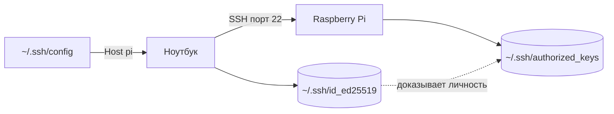
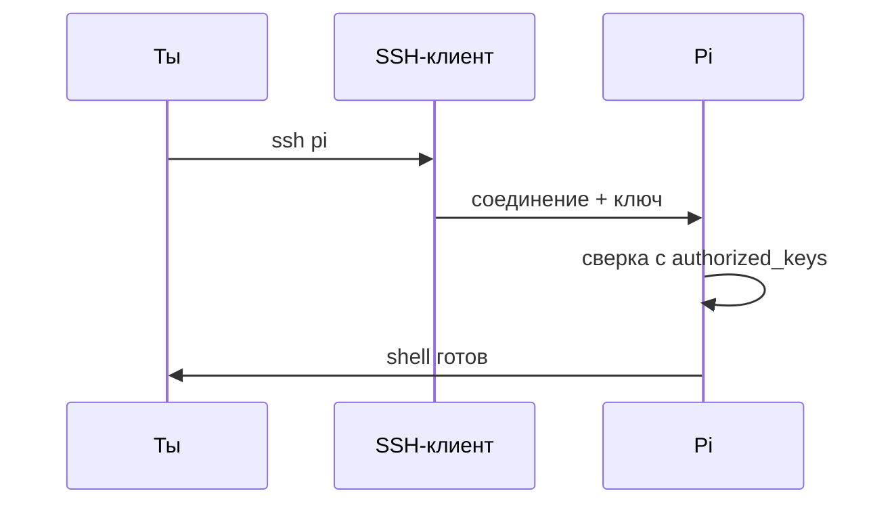

# ENGINEERING ROADMAP
## Том 3 · Лаборатория №0 — SSH: глубокое погружение

> **Ключ от дома без пароля** · Миссия дня

---

## 📡 История

**Том 1** дал терминал, Linux, сеть и сервер в **tmux**. **Том 2** — Raspberry Pi: ты уже заходил **`ssh pi@192.168.x.x`** с ноутбука. Но **пароль каждый раз** — медленно и небезопасно. Остался вопрос: как сделать **настоящий** удалённый доступ — с **ключами**, **алиасами** и **config**, как у взрослых инженеров?

Сегодня ты **не учишь SSH с нуля** — ты **укрепляешь фундамент** из Tom 1 и Pi.

**Если Pi ещё не настроен — вернись в Том 2 · Лаборатория №0 (Raspberry Pi)** в книге `engineering-roadmap-tom-02`.

---

## 🚀 Миссия

**Настроить SSH-ключи и `~/.ssh/config`**, чтобы заходить на Pi и Linux-сервер **без пароля** — быстро, безопасно и по короткому имени.

---

## 🎯 Цель

- понять **пара ключей** (публичный / приватный) и **зачем** пароль больше не нужен каждый раз;
- создать ключ, скопировать на Pi, проверить вход;
- написать **`~/.ssh/config`** с алиасом `pi` или `serwer`.

**Результат:** команда `ssh pi` (или `ssh serwer`) работает **без запроса пароля**; ключи и config записаны в dnevnik.

---

## ⏱ Время

60–75 мин (можно **2 дня** по 30–35 мин).

---

## 🧰 Что понадобится

- [ ] Raspberry Pi **online** (Tom 2, Лаб. №0) **или** Linux-сервер (Tom 1, Лаб. №3)
- [ ] Ноутбук с **Linux**, **macOS** или **Windows + WSL**
- [ ] Рабочий **`ssh user@IP`** по паролю (хотя бы один раз)
- [ ] IP Pi/сервера в **dnevnik**
- [ ] Права **`sudo`** на удалённой машине (для настройки)

---

## 🤔 Как ты думаешь?

**Не читай ответ сразу.**

1. Почему **пароль по сети** хуже, чем **ключ**?
2. Если **публичный** ключ лежит на Pi — может ли им **взломать** твой ноутбук?
3. Зачем файл **`config`**, если можно каждый раз писать `ssh pi@192.168.1.47`?

*(Запиши ответы в dnevnik.)*

**Настоящее объяснение:** **SSH** — зашифрованный «туннель» для терминала (Tom 1: сеть, Tom 2: первый вход). **Ключи** — как **замок + свой ключ**: на Pi лежит **замок** (публичный), у тебя — **единственная копия ключа** (приватный). **`config`** — **закладки** с полным адресом и именем пользователя.

---

## 💡 Аналогия

**Квартира с домофоном:**

| В жизни | В SSH |
|---------|-------|
| Код от подъезда каждый раз | Пароль при каждом `ssh` |
| Свой ключ от двери | **Приватный** ключ на ноутбуке |
| Замок на двери | **Публичный** ключ в `~/.ssh/authorized_keys` на Pi |
| «Квартира бабушки» в телефоне | Алиас **`Host pi`** в `config` |

### 😲 ВАУ!

Один ключ **Ed25519** ≈ число с **77 нулями** вариантов — перебрать **физически невозможно** за жизнь Вселенной.

### 😄 Момент улыбки

«Забыл пароль» на SSH — **не** «сбросить через почту». Зато ключ **не забудешь**, если не удалишь файл (не удаляй!).

---

## 📷 Иллюстрация

📷 **[Для художника]**

**ID:**  
ILL-T3-L0-01

**Название:**  
Ключ и туннель SSH

**Тип иллюстрации:**  
Сюжетная сцена · домашняя мастерская · метафора «дверь без монитора»

**Главная цель иллюстрации:**  
Показать SSH как **зашифрованный туннель** между ноутбуком и Raspberry Pi — и **пару ключей** (приватный у героя, публичный «замок» на Pi). Зритель понимает: это **инженерный доступ**, не «взлом» и не хакерский неон.

Что подросток должен почувствовать: **спокойная уверенность** — «я открываю свою машину ключом, как взрослый инженер».

---

**Описание сцены**

Вечер в **домашней комнате-мастерской** (продолжение лаборатории из Томов 1–2, но зрелее). За столом сидит герой с **ноутбуком** слева и **Raspberry Pi 4** справа на маленькой подставке (зелёная плата, красные/синие светодиоды — **без брендов**).

На экране ноутбука — **терминал**: тёмный фон, **цветные полосы** и **мигающий курсор** — **без читаемых команд** (никаких `ssh pi` буквами).

Между ноутбуком и Pi — **светящийся полупрозрачный туннель** (янтарно-оранжевый градиент 🟡→🟠), **не** физические провода. У Pi — стилизованная **дверь** с **замком** (иконка); у героя в **правой руке** — стилизованный **ключ** (Ed25519 как форма, **без надписей**).

На полке за Pi — моток кабеля, блокнот **без текста** (только линии схемы). Окно — сумерки.

**Что делает герой:** левая рука на клавиатуре, правая с ключом чуть приподнята — жест «у меня есть доступ».

**Что НЕ должно появляться:** хакер в капюшоне, Matrix-зелень, пароли на экране, родители, школьный класс, оружие, провода 230V в розетке.

---

**Главный герой**

- **Возраст:** 13–14 лет (на 2–3 года старше героя Тома 1 — тот же персонаж, чуть выше, увереннее в позе)
- **Внешность:** узнаваемый герой серии Engineering Roadmap — короткие **тёмно-каштановые** волосы, лёгкая **чёлка**, светлая кожа, **веснушки** на носу (фирменная деталь серии)
- **Одежда:** **тёмно-серый** или **тёмно-синий** худи **без надписей**; на груди — круглый значок уровня **🟡/🟠** (градиент янтарь → оранжевый, **без букв**); **чёрные** джоггеры; носки; **не** школьная форма
- **Поза:** сидит за столом, корпус слегка к Pi (~20°), правая рука с ключом
- **Выражение лица:** сосредоточенное, лёгкая уверенная улыбка
- **Эмоция:** «я инженер, не хакер»
- **Взгляд:** на Raspberry Pi и туннель, **не** в камеру

---

**Дополнительные персонажи**

Нет. Только герой и техника.

---

**Окружение**

- **Тип:** домашняя комната / серверный уголок подростка
- **Стены:** тёплый беж или светло-серый
- **Мебель:** стол, стул, низкая полка с Pi
- **Детали:** ноутбук, Pi 4, USB-кабель, блокнот со схемой (без слов), лампа за кадром
- **Атмосфера:** уютная европейская квартира, **инженерная**, не дата-центр NASA

---

**Композиция**

- **Формат кадра:** 16:9, горизонтальный
- **План:** средний (по пояс + стол с Pi)
- **Передний план:** ключ в руке, свечение туннеля
- **Средний план:** лицо героя, ноутбук, Pi
- **Задний план:** полка, окно — мягкий blur
- **Линия взгляда:** ключ → туннель → замок на Pi → лицо героя
- **Правило третей:** герой слева, Pi справа, туннель по диагонали центра

---

**Освещение**

- **Тип:** смешанный — тёплый настольный + холодный от экрана + мягкое свечение туннеля (🟡/🟠)
- **Время суток:** ранний вечер
- **Характер:** тёплый на коже; туннель — **мягкий** янтарный, не неон
- **Тени:** мягкие, не драматичные

---

**Цветовая палитра**

- **Основные:** `#E76F51` (оранжевый 🟠 Том 3), `#E9C46A` (янтарь 🟡), `#2D6A4F` (зелёный EduMost — преемственность серии)
- **Дополнительные:** `#457B9D` (сеть/вечер), `#6C757D` (железо Pi), `#F8F9FA` (светлый фон)
- **Настроение:** спокойное, **инженерное**, тёплое домашнее — **не** киберпанк

---

**Стиль**

Единый стиль **EduMost** · современная европейская подростковая образовательная книга.
Уровень визуальной культуры: **DK · Usborne · No Starch Press**.
Чистая **цифровая векторная** иллюстрация. Мягкие формы, аккуратные контуры 2–3 px.
Акценты Тома 3: **🟡/🟠** (системный инженер) — в палитре и значке героя, **не** кислотный неон.
**Без:** аниме, манги, Pixar, Disney, фотореализма, 3D-рендера, пластикового глянца, хакерского неона, «чёрного терминала с зелёным Matrix-текстом».

---

**Возрастная адаптация**

- **Возраст читателя:** 13–15 лет
- **Можно:** домашняя лаборатория, серверы, сеть, спокойная уверенность «я инженер»
- **Нельзя:** опасность 230V, открытые порты «на весь мир», хакерский неон, страх, кровь, оружие, читаемые пароли/ключи на экране, соцсети на телефоне

---

**Формат**

- **Файл:** SVG
- **Соотношение:** 16:9
- **Детализация:** высокая — читаемо в печати A5 и на Web
- **Цветовой режим:** RGB для Web; слои для возможной CMYK-печати

---

**Текст**

На изображении **текста быть НЕ должно**: ни букв, ни цифр, ни логотипов, ни водяных знаков, ни команд в терминале, ни подписей «NAS», «WireGuard», «Pi-hole» — всё узнаётся **иконками, цветом и формой**, не надписями.

---

**Негативный prompt**

водяные знаки · подписи · буквы · цифры · логотипы · бренды · читаемый текст на экранах · артефакты AI · лишние руки · лишние пальцы · взрослые люди · страшные лица · оружие · кровь · хоррор · агрессия · плохая анатомия · размытость · шум · низкое качество · аниме · манга · Pixar · Disney · фотореализм · 3D · неон · школьная форма · хакерский стиль · Matrix-зелень · Pi-hole логотип с текстом

---

**Связь с лабораторией**

Лаборатория №0 — **укрепление SSH**: ключи Ed25519, `authorized_keys`, `~/.ssh/config`. Иллюстрация фиксирует метафору из аналогии «квартира с домофоном» — **свой ключ** вместо пароля каждый раз.

```
  [Ноутбук] ~~~~ зашифрованный туннель ~~~~> [Pi / Сервер]
       🔑 приватный                              🔒 публичный
```

---

## 📊 Mermaid





---

## 🔬 Эксперимент

**Правило:** минимум для зачёта — **№1, №2, №3**. Рекомендуемые — **№4, №5**.

---

### Эксперимент 1 — «Проверка базы из Tom 1 и Tom 2»

**⏱** 10 мин

Убедись, что **старый** способ ещё работает:

```bash
ssh pi@192.168.x.x
# или: ssh twoj_user@192.168.x.x  — твой Linux-сервер
whoami
hostname
exit
```

| Команда | Что делает | Что изменится | Как проверить | Как отменить |
|---------|------------|---------------|---------------|--------------|
| `ssh user@IP` | Открывает **удалённый** shell | Новая сессия на Pi/сервере | Видишь `pi@...` или `user@...` | `exit` |
| `whoami` | Имя **текущего** пользователя | Только вывод | Совпадает с логином | — |
| `hostname` | Имя **машины** | Только вывод | Не имя ноутбука | — |

**✅ Проверь себя:** зашёл по **паролю** и вернулся `exit`?

---

### Эксперимент 2 — «Создать пару ключей Ed25519»

**⏱** 15 мин

**На ноутбуке** (не на Pi):

```bash
ls -la ~/.ssh/
ssh-keygen -t ed25519 -C "tom3-lab0" -f ~/.ssh/id_ed25519
```

На вопрос passphrase — **Enter** (пусто) для учебной Pi дома; для **настоящего** сервера в интернете — лучше **с passphrase** (обсуди с взрослым).

```bash
ls -la ~/.ssh/id_ed25519*
```

| Команда | Что делает | Что изменится | Как проверить | Как отменить |
|---------|------------|---------------|---------------|--------------|
| `ssh-keygen -t ed25519` | Создаёт **пару** ключей | Файлы `id_ed25519` и `.pub` | `ls` показывает оба | Удалить файлы (**осторожно!**) |
| `-C "tom3-lab0"` | **Комментарий** в ключе | Подпись в `.pub` | `cat ~/.ssh/id_ed25519.pub` | — |

**✅ Проверь себя:** есть **два** файла — без `.pub` **никогда** не отдавай никому; **с `.pub`** — можно копировать на серверы.

---

### Эксперимент 3 — «Скопировать ключ на Pi (ssh-copy-id)»

**⏱** 15 мин

```bash
ssh-copy-id -i ~/.ssh/id_ed25519.pub pi@192.168.x.x
ssh pi@192.168.x.x
```

После копирования второй вход **не должен** спрашивать пароль (если ключ принят).

| Команда | Что делает | Что изменится | Как проверить | Как отменить |
|---------|------------|---------------|---------------|--------------|
| `ssh-copy-id` | Добавляет `.pub` в `authorized_keys` на Pi | Новая строка на Pi | Вход **без** пароля | Удалить строку на Pi в `~/.ssh/authorized_keys` |

**Если `ssh-copy-id` нет** (Windows без WSL):

```bash
cat ~/.ssh/id_ed25519.pub | ssh pi@192.168.x.x "mkdir -p ~/.ssh && cat >> ~/.ssh/authorized_keys && chmod 600 ~/.ssh/authorized_keys"
```

**✅ Проверь себя:** `ssh pi@IP` — **без** пароля?

---

### Эксперимент 4 — «~/.ssh/config и алиас `pi`»

**⏱** 15 мин

На **ноутбуке**:

```bash
nano ~/.ssh/config
```

Добавь (замени IP):

```
Host pi
    HostName 192.168.1.47
    User pi
    IdentityFile ~/.ssh/id_ed25519
```

```bash
chmod 600 ~/.ssh/config
ssh pi
```

| Поле | Что делает | Зачем |
|------|------------|-------|
| `Host pi` | Короткое **имя** | Пишешь `ssh pi` вместо длинной строки |
| `HostName` | Реальный **IP** | Можно сменить IP — правишь один файл |
| `User` | Логин по умолчанию | Не печатать `pi@` каждый раз |
| `IdentityFile` | Какой **ключ** использовать | Если ключей несколько |

**✅ Проверь себя:** `ssh pi` работает **одним словом**?

---

### Эксперимент 5 — «scp — файл через туннель»

**⏱** 10 мин

Создай файл и **скопируй** на Pi:

```bash
echo "SSH lab Tom3" > ~/ssh_test.txt
scp ~/ssh_test.txt pi:~/ssh_test.txt
ssh pi "cat ~/ssh_test.txt"
```

| Команда | Что делает | Что изменится | Как проверить | Как отменить |
|---------|------------|---------------|---------------|--------------|
| `scp локальный pi:удалённый` | **Копия** файла по SSH | Файл на Pi | `cat` на Pi | `rm ~/ssh_test.txt` на Pi |

**✅ Проверь себя:** текст **«SSH lab Tom3»** виден **на Pi**?

---

## ⚠ Типичные ошибки

| Ошибка | Как исправить |
|--------|---------------|
| `Permission denied (publickey)` | Проверь `authorized_keys` на Pi; права `chmod 700 ~/.ssh` |
| `WARNING: UNPROTECTED PRIVATE KEY` | `chmod 600 ~/.ssh/id_ed25519` |
| Всё равно просит пароль | Неверный `IdentityFile` в config или ключ не скопирован |
| `Connection refused` | Pi выключен или SSH выключен: `sudo raspi-config` → SSH **on** |
| Скопировал **приватный** ключ на Pi | **Удали** с Pi; создай **новую** пару — приватный **только** у тебя |

---

## 🧪 Проверь себя

- [ ] Понимаю разницу **публичный / приватный** ключ
- [ ] `ssh pi` (или алиас) **без пароля**
- [ ] `~/.ssh/config` создан, права **600**
- [ ] `scp` один файл — **успех**
- [ ] IP и имя `Host` в **dnevnik**

---

## 📝 Запись в инженерный дневник

```
=== TOM3 LAB №0 — SSH ===
Data: ___
Co zrobiłem:
  - Klucz Ed25519: TAK/NIE
  - ssh-copy-id: TAK/NIE
  - config Host pi: TAK/NIE
  - scp test: TAK/NIE
  - IP Pi/serwer: ___
Co było trudne:
Następny pomysł:
```

---

## 🏆 Что теперь умеешь

- [ ] **Объяснить**, зачем ключи лучше пароля при частом SSH
- [ ] **Создать** пару ключей и **добавить** публичный на сервер
- [ ] **Написать** `~/.ssh/config` с алиасом
- [ ] **Скопировать** файл через `scp`

---

## ➡ Что дальше

**Следующий файл:** [`01_LAB_GIT.md`](01_LAB_GIT.md) — **Git**: как **сохранять историю** проектов и не бояться «сломал всё».

**Обязательно перед переходом:**

- [ ] `ssh pi` (или `serwer`) **без пароля**
- [ ] Приватный ключ **не** отправлял никому

**Рекомендуется:**

- [ ] Второй `Host` в config для Linux-сервера Tom 1
- [ ] Passphrase на ключ — если Pi доступен из интернета

### 🔮 Вопрос без ответа

Ты **исправил** скрипт на Pi — через неделю **забыл**, что менял. Как **откатиться** и **показать другу** только **хорошую** версию?

**Ответ — в Лаборатории №1 (Git).**

---

*Закрой терминал. Ключ **остался** на диске — завтра `ssh pi` снова откроет дверь.*
