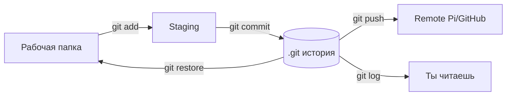
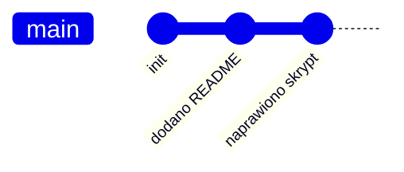

# ENGINEERING ROADMAP
## Том 3 · Лаборатория №1 — Git: основы для проектов

> **Машина времени для кода** · Миссия дня

---

## 📡 История

В **Лаборатории №0** ты настроил **SSH** — заходишь на Pi **одной командой**, файлы летают через **`scp`**. Но когда скрипт метеостанции (Tom 2) или конфиг сервера **ломается**, остаётся только: «**Было же нормально…**» Остался вопрос: как **сохранять версии**, **откатываться** и **делиться** проектом без копирования папок `projekt_kopia_kopia2`?

---

## 🚀 Миссия

**Создать первый Git-репозиторий** для домашнего проекта, научиться **commit**, **log** и **откат** — как инженер, а не «Ctrl+Z в блокноте».

---

## 🎯 Цель

- понять **репозиторий = история снимков** проекта;
- выполнить **`git init`**, **`add`**, **`commit`**, **`log`**, **`checkout`** (или `restore`);
- связать локальный репозиторий с **удалённым** на Pi или GitHub (по SSH из Лаб. №0).

**Результат:** папка проекта с `.git/`, минимум **3 commit** в истории, запись в dnevnik.

---

## ⏱ Время

60–80 мин (можно **2–3 дня** по 25–30 мин).

---

## 🧰 Что понадобится

- [ ] Рабочий **SSH** (Лаборатория №0) — для `git@github.com` или Pi
- [ ] Linux, macOS или **WSL** на Windows
- [ ] Git: `git --version` (если нет — `sudo apt install git`)
- [ ] Маленький проект: скрипт, конфиг Pi-hole, README — **что угодно своё**
- [ ] Имя и email для Git (можно учебные):

```bash
git config --global user.name "Twoje Imie"
git config --global user.email "twoj@email.local"
```

---

## 🤔 Как ты думаешь?

**Не читай ответ сразу.**

1. Зачем **сохранять старые версии**, если «и так работает»?
2. Папка `.git` — это **ещё одна копия** всех файлов?
3. **Commit** — это **backup на диск** или **подписанный снимок** с сообщением?

*(Запиши в dnevnik.)*

**Настоящее объяснение:** **Git** хранит **историю изменений**, а не только последний файл. **Commit** — **снимок** + **сообщение** «что и зачем». **Ветка** — параллельная линия экспериментов (глубже — позже). **Remote** — копия на Pi/GitHub для **бэкапа** и **совместной** работы.

---

## 💡 Аналогия

**Дневник инженера с фото:**

| В жизни | В Git |
|---------|-------|
| Страница «15 июля — собрал LED» | **Commit** с сообщением |
| Альбом всех страниц | **`git log`** |
| Вернуться к фото месяц назад | **`git checkout`** / **`restore`** |
| Копия альбома у друга | **Remote** (GitHub / Pi) |

### 😲 ВАУ!

**Linux**, **Android**, **Minecraft** (моды) — миллионы разработчиков используют Git каждый день. Одна ошибка — **откат за секунду**, не переписывание с нуля.

### 😄 Момент улыбки

Папка `projekt_FINAL` → `projekt_FINAL2` → `projekt_FINAL_ISTINNO` — Git **лечит** этот синдром одной командой `log`.

---

## 📷 Иллюстрация

📷 **[Для художника]**

**ID:**  
ILL-T3-L1-01

**Название:**  
Машина времени Git

**Тип иллюстрации:**  
Сюжетная сцена · метафора «лента commit-ов» · домашний стол

**Главная цель иллюстрации:**  
Показать Git как **историю снимков** проекта — лента commit-ов над столом, слева «сломанный» код, справа **зелёная галочка** после отката. Зритель понимает: каждый commit — **точка возврата**, не копия папки `projekt_kopia2`.

Что подросток должен почувствовать: **облегчение и контроль** — «я могу откатиться, ничего не потеряно навсегда».

---

**Описание сцены**

Домашний стол героя. На экране ноутбука — **терминал** с **вертикальной лентой** цветных блоков (имитация `git log --oneline`) — **без букв**, только цветные «коммиты».

**Над столом** в воздухе (стилизованная метафора) — **лента из 4–5 кадров-комикса**, соединённых стрелками назад:
1. Иконка датчика + плюс
2. Иконка жука + гаечный ключ
3. Иконка галочки + солнце
Кадры **без подписей** — только пиктограммы.

**Слева** на столе — лист с **красными** волнистыми линиями (сломанный код). **Справа** — тот же лист с **зелёной галочкой** (после `checkout`/`restore`).

На столе — тетрадь **янтарного** цвета (без букв), ручка. Фон — полка с Pi (размыто).

**Что делает герой:** смотрит на ленту коммитов, палец указывает на **средний** кадр — «вернуться сюда».

**Что НЕ должно появляться:** GitHub логотип, читаемые hash, папки `FINAL_FINAL`, взрослые, школа.

---

**Главный герой**

- **Возраст:** 13–14 лет (на 2–3 года старше героя Тома 1 — тот же персонаж, чуть выше, увереннее в позе)
- **Внешность:** узнаваемый герой серии Engineering Roadmap — короткие **тёмно-каштановые** волосы, лёгкая **чёлка**, светлая кожа, **веснушки** на носу (фирменная деталь серии)
- **Одежда:** **тёмно-серый** или **тёмно-синий** худи **без надписей**; на груди — круглый значок уровня **🟡/🟠** (градиент янтарь → оранжевый, **без букв**); **чёрные** джоггеры; носки; **не** школьная форма
- **Поза:** сидит за столом, левая рука на тетради, правый указательный палец к ленте коммитов
- **Выражение лица:** заинтересованное, лёгкая ухмылка «ага, вот оно»
- **Эмоция:** контроль над историей
- **Взгляд:** на ленту commit-ов над столом

---

**Дополнительные персонажи**

Нет.

---

**Окружение**

- **Тип:** домашняя комната-лаборатория
- **Детали:** ноутбук, тетрадь янтарная, листы «до/после», Pi на полке
- **Атмосфера:** творческая инженерная, вечер дома

---

**Композиция**

- **Формат:** 16:9 горизонтальный
- **План:** средний + элементы сверху (лента)
- **Передний план:** листы слева/справа (красный хаос / зелёная галочка)
- **Средний план:** герой, экран, лента коммитов дугой сверху
- **Линия взгляда:** сломанный лист → лента → галочка справа

---

**Освещение**

- **Тип:** тёплый настольный + свет экрана
- **Время:** вечер
- **Акцент:** янтарь тетради и оранжевые блоки коммитов (🟡/🟠)

---

**Цветовая палитра**

- **Основные:** `#E76F51` (оранжевый 🟠 Том 3), `#E9C46A` (янтарь 🟡), `#2D6A4F` (зелёный EduMost — преемственность серии)
- **Дополнительные:** `#457B9D` (сеть/вечер), `#6C757D` (железо Pi), `#F8F9FA` (светлый фон)
- **Настроение:** спокойное, **инженерное**, тёплое домашнее — **не** киберпанк

---

**Стиль**

Единый стиль **EduMost** · современная европейская подростковая образовательная книга.
Уровень визуальной культуры: **DK · Usborne · No Starch Press**.
Чистая **цифровая векторная** иллюстрация. Мягкие формы, аккуратные контуры 2–3 px.
Акценты Тома 3: **🟡/🟠** (системный инженер) — в палитре и значке героя, **не** кислотный неон.
**Без:** аниме, манги, Pixar, Disney, фотореализма, 3D-рендера, пластикового глянца, хакерского неона, «чёрного терминала с зелёным Matrix-текстом».

---

**Возрастная адаптация**

- **Возраст читателя:** 13–15 лет
- **Можно:** домашняя лаборатория, серверы, сеть, спокойная уверенность «я инженер»
- **Нельзя:** опасность 230V, открытые порты «на весь мир», хакерский неон, страх, кровь, оружие, читаемые пароли/ключи на экране, соцсети на телефоне

---

**Формат**

- **Файл:** SVG
- **Соотношение:** 16:9
- **Детализация:** высокая — читаемо в печати A5 и на Web
- **Цветовой режим:** RGB для Web; слои для возможной CMYK-печати

---

**Текст**

На изображении **текста быть НЕ должно**: ни букв, ни цифр, ни логотипов, ни водяных знаков, ни команд в терминале, ни подписей «NAS», «WireGuard», «Pi-hole» — всё узнаётся **иконками, цветом и формой**, не надписями.

---

**Негативный prompt**

водяные знаки · подписи · буквы · цифры · логотипы · бренды · читаемый текст на экранах · артефакты AI · лишние руки · лишние пальцы · взрослые люди · страшные лица · оружие · кровь · хоррор · агрессия · плохая анатомия · размытость · шум · низкое качество · аниме · манга · Pixar · Disney · фотореализм · 3D · неон · школьная форма · хакерский стиль · Matrix-зелень · Pi-hole логотип с текстом

---

**Связь с лабораторией**

Лаборатория №1 — **Git**: `init`, `commit`, `log`, откат. Иллюстрация — визуал аналогии «дневник инженера с фото»: каждый commit — страница, `log` — альбом.

```
  commit C ← commit B ← commit A ← (пусто)
     ↑
  git log — читаешь историю назад
```

---

## 📊 Mermaid





---

## 🔬 Эксперимент

**Правило:** минимум для зачёта — **№1, №2, №3**. Рекомендуемые — **№4, №5**.

---

### Эксперимент 1 — «Первый репозиторий»

**⏱** 15 мин

```bash
mkdir ~/projekt_tom3 && cd ~/projekt_tom3
git init
echo "# Projekt Tom 3" > README.md
git status
git add README.md
git commit -m "Pierwszy commit: README"
git log --oneline
```

| Команда | Что делает | Что изменится | Как проверить | Как отменить |
|---------|------------|---------------|---------------|--------------|
| `git init` | Создаёт **`.git/`** | Скрытая папка истории | `ls -la` видит `.git` | Удалить `.git` (**потеря истории!**) |
| `git add файл` | Готовит к **commit** | Файл в staging | `git status` — зелёный | `git restore --staged файл` |
| `git commit -m "..."` | **Снимок** + сообщение | Новая строка в log | `git log` | `git reset` (осторожно) |

**✅ Проверь себя:** `git log` показывает **один** commit?

---

### Эксперимент 2 — «Вторая версия и diff»

**⏱** 15 мин

```bash
echo "print('Hello Tom 3')" > main.py
git add main.py
git commit -m "Dodano main.py"
echo "# TODO: GPIO" >> README.md
git diff
git add README.md
git commit -m "Plan GPIO w README"
git log --oneline
```

| Команда | Что делает | Зачем |
|---------|------------|-------|
| `git diff` | Показывает **не сохранённые** изменения | Видишь **до** commit |
| `git log --oneline` | **Короткая** история | Быстро читать |

**✅ Проверь себя:** в log **минимум 3** commit?

---

### Эксперимент 3 — «Откат — машина времени»

**⏱** 15 мин

**Сломай** файл намеренно:

```bash
echo "BROKEN!!!" > main.py
cat main.py
git checkout -- main.py
# или: git restore main.py
cat main.py
```

| Команда | Что делает | Что изменится | Как проверить | Как отменить |
|---------|------------|---------------|---------------|--------------|
| `git restore main.py` | Вернуть файл из **последнего commit** | `main.py` как в commit | `cat` — снова `print(...)` | Снова изменить файл |

Посмотри **старый** commit:

```bash
git show HEAD~1:main.py
```

**✅ Проверь себя:** `main.py` **восстановлен** после «поломки»?

---

### Эксперимент 4 — «.gitignore — не коммить мусор»

**⏱** 10 мин

```bash
echo "*.log" > .gitignore
echo "secret.txt" > secret.txt
echo "debug.log" > debug.log
git status
git add .gitignore README.md main.py
git commit -m "Dodano .gitignore"
```

| Файл | Зачем |
|------|-------|
| `.gitignore` | Список **игнорируемых** имён |
| `*.log` | Логи **не** попадут в историю |
| `secret.txt` | Пароли **никогда** в Git |

**✅ Проверь себя:** `git status` **не** предлагает добавить `debug.log`?

---

### Эксперимент 5 — «Remote на Pi (bare repo)»

**⏱** 20 мин

**На Pi** (через `ssh pi`):

```bash
mkdir -p ~/git && cd ~/git
git init --bare projekt_tom3.git
```

**На ноутбуке:**

```bash
cd ~/projekt_tom3
git remote add pi pi:/home/pi/git/projekt_tom3.git
git push -u pi main
# если ветка master: git push -u pi master
```

| Команда | Что делает | Что изменится | Как проверить | Как отменить |
|---------|------------|---------------|---------------|--------------|
| `git init --bare` | «Голый» repo **без** рабочих файлов | Папка на Pi | `ssh pi ls ~/git` | — |
| `git push` | Отправляет **commit** на remote | Копия истории на Pi | `git log` на Pi в bare | — |

**Альтернатива:** аккаунт **GitHub** + SSH-ключ → `git remote add origin git@github.com:user/repo.git`

**✅ Проверь себя:** `git push` **без ошибки**?

---

## ⚠ Типичные ошибки

| Ошибка | Как исправить |
|--------|---------------|
| `Please tell me who you are` | `git config --global user.name` и `user.email` |
| Commit без `git add` | Сначала **add**, потом **commit** |
| Закоммитил **пароль** | Удалить из истории **сложно** — лучше **rotate** пароль; используй `.gitignore` |
| `failed to push` | Проверь SSH (Лаб. 0), путь remote, ветку `main`/`master` |
| `detached HEAD` | Не паникуй — вернись: `git checkout main` |

---

## 🧪 Проверь себя

- [ ] `git init` + **3 commit** в одном проекте
- [ ] `git diff` и **`git restore`** — понимаю
- [ ] `.gitignore` для логов/секретов
- [ ] **Remote** (Pi или GitHub) + успешный **`push`**
- [ ] Запись в **dnevnik**

---

## 📝 Запись в инженерный дневник

```
=== TOM3 LAB №1 — GIT ===
Data: ___
Co zrobiłem:
  - git init: TAK/NIE
  - 3+ commity: TAK/NIE
  - git restore test: TAK/NIE
  - .gitignore: TAK/NIE
  - git push remote: TAK/NIE
Co było trudne:
Następny pomysł:
```

---

## 🏆 Что теперь умеешь

- [ ] **Объяснить** commit, log, remote простыми словами
- [ ] **Вести** малый проект в Git **без** папок «копия2»
- [ ] **Откатить** файл после ошибки
- [ ] **Отправить** историю на Pi/GitHub по **SSH**

---

## ➡ Что дальше

**Следующий файл:** [`02_LAB_DOCKER.md`](02_LAB_DOCKER.md) — **Docker**: запуск программ в **контейнерах**, как **коробки** на Pi.

**Обязательно:**

- [ ] Репозиторий с **3+ commit**
- [ ] **Push** на remote

**Рекомендуется:**

- [ ] README с описанием проекта Tom 2/3
- [ ] Commit message **осмысленные** (не «fix», а «Naprawiono odczyt DHT22»)

### 🔮 Вопрос без ответа

Meteostacja нужна **Python 3.9**, а Pi-hole — **другой** набор библиотек. Как **не сломать** всё на одной SD-карте?

**Ответ — в Лаборатории №2 (Docker).**

---

*Сделай commit. Даже если «ещё не готово» — **история** уже спасёт тебя завтра.*
