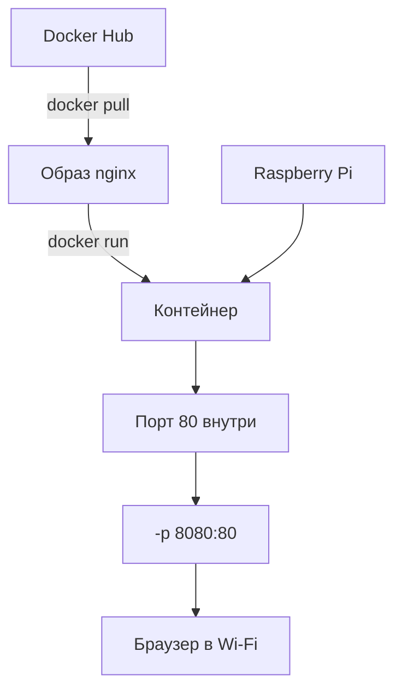
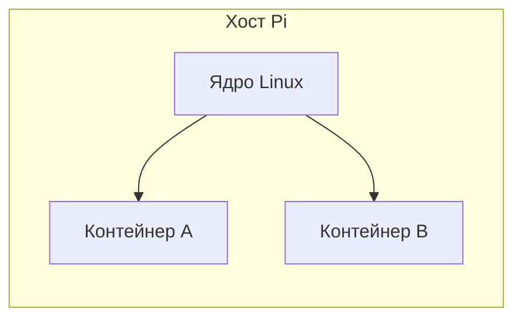

# ENGINEERING ROADMAP
## Том 3 · Лаборатория №2 — Docker: контейнеры на Pi и Linux

> **Коробки для программ** · Миссия дня

---

## 📡 История

В **Лаборатории №1** Git **хранит историю** кода — откат, push на Pi. Но на **одной SD-карте** Pi живут метеостанция (Tom 2), скрипты и будущие службы. Обновил Python — **Pi-hole перестал**. Остался вопрос: как **изолировать** программы, чтобы каждая жила в **своей коробке** и **не ломала** соседей?

---

## 🚀 Миссия

**Установить Docker** на Raspberry Pi (или Linux-сервер) и **запустить первые контейнеры** — nginx и простой сервис — понимая **образ**, **контейнер** и **порт**.

---

## 🎯 Цель

- понять **контейнер ≠ виртуальная машина** (легче и быстрее);
- выполнить **`docker run`**, **`ps`**, **`logs`**, **`stop`**, **`rm`**;
- пробросить **порт** и открыть сайт в браузере с другого устройства в Wi‑Fi.

**Результат:** работающий контейнер **nginx** (или `hello-world`), запись портов и команд в dnevnik.

---

## ⏱ Время

75–90 мин (можно **2 дня**; установка Docker на Pi — до 20 мин).

---

## 🧰 Что понадобится

- [ ] Raspberry Pi **4** (2 GB+) **или** Linux-сервер Tom 1
- [ ] **SSH** без пароля (Лаб. №0)
- [ ] **Git** — полезен для Dockerfile позже (Лаб. №1)
- [ ] Свободно **≥ 2 GB** на SD/диске: `df -h`
- [ ] Второе устройство в **той же Wi‑Fi** (браузер)
- [ ] Права **sudo** на Pi/сервере

---

## 🤔 Как ты думаешь?

**Не читай ответ сразу.**

1. **VirtualBox** (Tom 1) — целая «квартира» с OS. Docker — это **ещё одна** такая квартира?
2. Зачем **образ** (image), если можно просто `apt install`?
3. Порт **8080:80** — **два** порта или **перевод** «снаружи → внутрь»?

*(Запиши в dnevnik.)*

**Настоящее объяснение:** **Контейнер** — процесс в **изолированной** среде с **своими** библиотеками, но **общим ядром** Linux. **Образ** — **шаблон** (как ISO, но слоистый). **Docker** — программа, которая **скачивает**, **запускает** и **останавливает** контейнеры. На Pi это **экономит** нервы: Pi-hole, Home Assistant, nginx — **отдельные** коробки.

---

## 💡 Аналогия

**Food delivery коробки:**

| В жизни | В Docker |
|---------|----------|
| Стандартная коробка пиццы | **Образ** `nginx` |
| Одна доставка сегодня | **Контейнер** (живой процесс) |
| Наклейка «квартира 8080» | **Проброс порта** `-p 8080:80` |
| Склад коробок | **Docker Hub** / registry |

### 😲 ВАУ!

Один образ **nginx** скачали **миллиарды** раз — ты запускаешь **ту же** проверенную «коробку», что и Netflix в dev-среде (упрощённо).

### 😄 Момент улыбки

«Works on my machine» → **Docker**: «Works in my **container**» — и на Pi тоже.

---

## 📷 Иллюстрация

📷 **[Для художника]**

**ID:**  
ILL-T3-L2-01

**Название:**  
Контейнеры на Pi

**Тип иллюстрации:**  
Схематичная сцена · метафора «пристань с коробками» · вид сверху 3/4

**Главная цель иллюстрации:**  
Показать Docker: **одна Pi** — **много изолированных контейнеров** (прозрачные коробки), ноутбук стучится на порт снаружи. Зритель понимает: контейнер ≠ виртуальная машина; службы **не ломают** соседей.

Что подросток должен почувствовать: **порядок** — «одна Pi — много служб, без хаоса».

---

**Описание сцены**

Ракурс **3/4 сверху** на стол. В центре — **Raspberry Pi** как **деревянная пристань/пьедестал** (метафора). На Pi стоят **три прозрачные коробки-контейнера** с **цветными иконками** на боках (веб-сервер = волна, фильтр = щит, погода = облако+солнце) — **без слов**.

У каждой коробки — маленький **цветной кружок порта** (синий, зелёный, оранжевый) — **без цифр**.

Слева — **ноутбук** героя; от него **пунктирная Wi‑Fi-дуга** к **одной** коробке (первая) — «проброс порта».

Герой сидит сбоку, смотрит на Pi. На заднем плане — полка, вечер.

**Что НЕ должно появляться:** Docker whale logo с текстом, VirtualBox окна, цифры портов, кубернетес-кластер (слишком рано).

---

**Главный герой**

- **Возраст:** 13–14 лет (на 2–3 года старше героя Тома 1 — тот же персонаж, чуть выше, увереннее в позе)
- **Внешность:** узнаваемый герой серии Engineering Roadmap — короткие **тёмно-каштановые** волосы, лёгкая **чёлка**, светлая кожа, **веснушки** на носу (фирменная деталь серии)
- **Одежда:** **тёмно-серый** или **тёмно-синий** худи **без надписей**; на груди — круглый значок уровня **🟡/🟠** (градиент янтарь → оранжевый, **без букв**); **чёрные** джоггеры; носки; **не** школьная форма
- **Поза:** сидит слева от стола, наклонился к Pi (~30°)
- **Выражение лица:** довольное, «всё разложено по коробкам»
- **Эмоция:** порядок и изоляция
- **Взгляд:** на прозрачные контейнеры на Pi

---

**Дополнительные персонажи**

Нет.

---

**Окружение**

- **Тип:** домашний стол / мастерская
- **Детали:** Pi, 3 контейнера-коробки, ноутбук, Wi‑Fi дуга (стилизованные волны)
- **Атмосфера:** чистая, организованная

---

**Композиция**

- **Формат:** 16:9
- **План:** средний сверху 3/4
- **Центр:** Pi с коробками
- **Передний план:** одна коробка крупнее (nginx)
- **Линия:** ноутбук → Wi‑Fi → контейнер → Pi как основание

---

**Освещение**

- **Тип:** тёплый сверху + лёгкая подсветка изнутри контейнеров (разные мягкие цвета)
- **Время:** вечер

---

**Цветовая палитра**

- **Основные:** `#E76F51` (оранжевый 🟠 Том 3), `#E9C46A` (янтарь 🟡), `#2D6A4F` (зелёный EduMost — преемственность серии)
- **Дополнительные:** `#457B9D` (сеть/вечер), `#6C757D` (железо Pi), `#F8F9FA` (светлый фон)
- **Настроение:** спокойное, **инженерное**, тёплое домашнее — **не** киберпанк

---

**Стиль**

Единый стиль **EduMost** · современная европейская подростковая образовательная книга.
Уровень визуальной культуры: **DK · Usborne · No Starch Press**.
Чистая **цифровая векторная** иллюстрация. Мягкие формы, аккуратные контуры 2–3 px.
Акценты Тома 3: **🟡/🟠** (системный инженер) — в палитре и значке героя, **не** кислотный неон.
**Без:** аниме, манги, Pixar, Disney, фотореализма, 3D-рендера, пластикового глянца, хакерского неона, «чёрного терминала с зелёным Matrix-текстом».

---

**Возрастная адаптация**

- **Возраст читателя:** 13–15 лет
- **Можно:** домашняя лаборатория, серверы, сеть, спокойная уверенность «я инженер»
- **Нельзя:** опасность 230V, открытые порты «на весь мир», хакерский неон, страх, кровь, оружие, читаемые пароли/ключи на экране, соцсети на телефоне

---

**Формат**

- **Файл:** SVG
- **Соотношение:** 16:9
- **Детализация:** высокая — читаемо в печати A5 и на Web
- **Цветовой режим:** RGB для Web; слои для возможной CMYK-печати

---

**Текст**

На изображении **текста быть НЕ должно**: ни букв, ни цифр, ни логотипов, ни водяных знаков, ни команд в терминале, ни подписей «NAS», «WireGuard», «Pi-hole» — всё узнаётся **иконками, цветом и формой**, не надписями.

---

**Негативный prompt**

водяные знаки · подписи · буквы · цифры · логотипы · бренды · читаемый текст на экранах · артефакты AI · лишние руки · лишние пальцы · взрослые люди · страшные лица · оружие · кровь · хоррор · агрессия · плохая анатомия · размытость · шум · низкое качество · аниме · манга · Pixar · Disney · фотореализм · 3D · неон · школьная форма · хакерский стиль · Matrix-зелень · Pi-hole логотип с текстом

---

**Связь с лабораторией**

Лаборатория №2 — **Docker**: образ, контейнер, `-p 8080:80`. Метафора «food delivery коробки» — образ = коробка, контейнер = доставка сегодня.

```
  ┌─────────┐ ┌─────────┐ ┌─────────┐
  │ nginx   │ │ app     │ │ hello   │  ← контейнеры
  └────┬────┘ └────┬────┘ └────┬────┘
       └───────────┴───────────┘
              Pi (Linux ядро)
```

---

## 📊 Mermaid





---

## 🔬 Эксперимент

**Правило:** минимум для зачёта — **№1, №2, №3**. Рекомендуемые — **№4, №5**.

---

### Эксперимент 1 — «Установка Docker на Pi / Linux»

**⏱** 25 мин

**На Pi** (официальный скрипт — **только** с доверенного сайта; для Pi OS):

```bash
curl -fsSL https://get.docker.com -o get-docker.sh
sudo sh get-docker.sh
sudo usermod -aG docker $USER
newgrp docker
docker --version
```

| Шаг | Что делает | Как проверить |
|-----|------------|---------------|
| `get.docker.com` | Ставит **Docker Engine** | `docker --version` |
| `usermod -aG docker` | Запуск **без** sudo каждый раз | `docker ps` без sudo |

**Перелогинься** (`exit` + `ssh pi`), если `newgrp` не сработал.

**✅ Проверь себя:** `docker --version` показывает номер?

---

### Эксперимент 2 — «hello-world — первая коробка»

**⏱** 10 мин

```bash
docker run hello-world
docker images
docker ps -a
```

| Команда | Что делает | Что изменится | Как проверить | Как отменить |
|---------|------------|---------------|---------------|--------------|
| `docker run hello-world` | Скачивает образ и **запускает** | Контейнер в `ps -a` | Текст «Hello from Docker!» | `docker rm ID` |
| `docker images` | Список **образов** | Только просмотр | Видишь `hello-world` | — |
| `docker ps -a` | Все контейнеры | Только просмотр | Статус Exited | — |

**✅ Проверь себя:** сообщение **Hello from Docker!** на экране?

---

### Эксперимент 3 — «nginx в браузере»

**⏱** 20 мин

```bash
docker run -d --name moj-nginx -p 8080:80 nginx:alpine
docker ps
hostname -I
```

На **ноутбуке/телефоне** в той же Wi‑Fi: `http://192.168.x.x:8080` — страница **Welcome to nginx!**

| Флаг | Что делает | Зачем |
|------|------------|-------|
| `-d` | **Фон** (detached) | Терминал свободен |
| `--name moj-nginx` | Имя контейнера | Проще `stop`/`logs` |
| `-p 8080:80` | **Хост:контейнер** | 8080 снаружи → 80 внутри |

```bash
docker logs moj-nginx
docker stop moj-nginx
docker start moj-nginx
```

**✅ Проверь себя:** nginx **виден** в браузере по IP Pi?

---

### Эксперимент 4 — «Том и restart»

**⏱** 15 мин

Создай файл и **смонтируй** папку в контейнер:

```bash
mkdir -p ~/docker-www && echo "<h1>Tom 3 Docker</h1>" > ~/docker-www/index.html
docker rm -f moj-nginx
docker run -d --name moj-nginx -p 8080:80 -v ~/docker-www:/usr/share/nginx/html:ro nginx:alpine
```

Обнови страницу в браузере — свой заголовок.

| Флаг | Что делает |
|------|------------|
| `-v ~/docker-www:/usr/.../html:ro` | **Том**: папка Pi → внутрь nginx, **только чтение** |
| `docker rm -f` | **Удалить** контейнер (форс) |

**✅ Проверь себя:** текст **«Tom 3 Docker»** на странице?

---

### Эксперимент 5 — «docker compose — заготовка»

**⏱** 15 мин

```bash
mkdir -p ~/compose-test && cd ~/compose-test
nano docker-compose.yml
```

Содержимое:

```yaml
services:
  web:
    image: nginx:alpine
    ports:
      - "8081:80"
    volumes:
      - ./www:/usr/share/nginx/html:ro
```

```bash
mkdir www && echo "<p>Compose!</p>" > www/index.html
docker compose up -d
docker compose ps
```

Открой `http://IP:8081`. Остановка:

```bash
docker compose down
```

| Команда | Что делает | Зачем |
|---------|------------|-------|
| `docker compose up -d` | Запуск из **файла** | Несколько служб одной командой |
| `docker compose down` | **Остановить** и убрать | Чистый конец |

**✅ Проверь себя:** порт **8081** отвечает?

---

## ⚠ Типичные ошибки

| Ошибка | Как исправить |
|--------|---------------|
| `permission denied` | `sudo usermod -aG docker $USER` + перelogin |
| Порт занят | Другой порт: `-p 8082:80` |
| Страница не открывается | IP с Pi (`hostname -I`); та же **Wi‑Fi**; firewall |
| Pi **тормозит** | Меньше контейнеров; `nginx:alpine` легче |
| Контейнер сразу Exited | `docker logs имя` — читай **причину** |

---

## 🧪 Проверь себя

- [ ] Docker **установлен**, `docker ps` работает
- [ ] **hello-world** и **nginx** запускал
- [ ] Понимаю **`-p 8080:80`** и **`-v`**
- [ ] **docker compose up** хотя бы раз
- [ ] IP + порты в **dnevnik**

---

## 📝 Запись в инженерный дневник

```
=== TOM3 LAB №2 — DOCKER ===
Data: ___
Co zrobiłem:
  - Docker install: TAK/NIE
  - hello-world: TAK/NIE
  - nginx :8080: TAK/NIE
  - volume www: TAK/NIE
  - compose :8081: TAK/NIE
  - IP Pi: ___
Co było trudne:
Następny pomysł:
```

---

## 🏆 Что теперь умеешь

- [ ] **Объяснить** образ vs контейнер vs VM (Tom 1)
- [ ] **Запустить** и **остановить** контейнер с пробросом порта
- [ ] **Подключить** папку через **volume**
- [ ] **Начать** `docker-compose.yml` для домашних служб

---

## ➡ Что дальше

**Следующий файл:** [`03_LAB_NAS.md`](03_LAB_NAS.md) — **NAS**: общая **папка** для семьи (Samba/NFS).

**Обязательно:**

- [ ] nginx (или compose) **открывается** из браузера
- [ ] Контейнер **останавливается** (`stop` / `compose down`)

**Рекомендуется:**

- [ ] Закоммить `docker-compose.yml` в Git (Лаб. 1)
- [ ] `docker system df` — сколько места съели образы

### 🔮 Вопрос без ответа

Фото и фильмы **не в Git** — как дать **маме и папе** доступ с Windows **без** флешек?

**Ответ — в Лаборатории №3 (NAS).**

---

*Останови лишние контейнеры. Pi **дышит** легче — завтра добавишь новую «коробку».*
