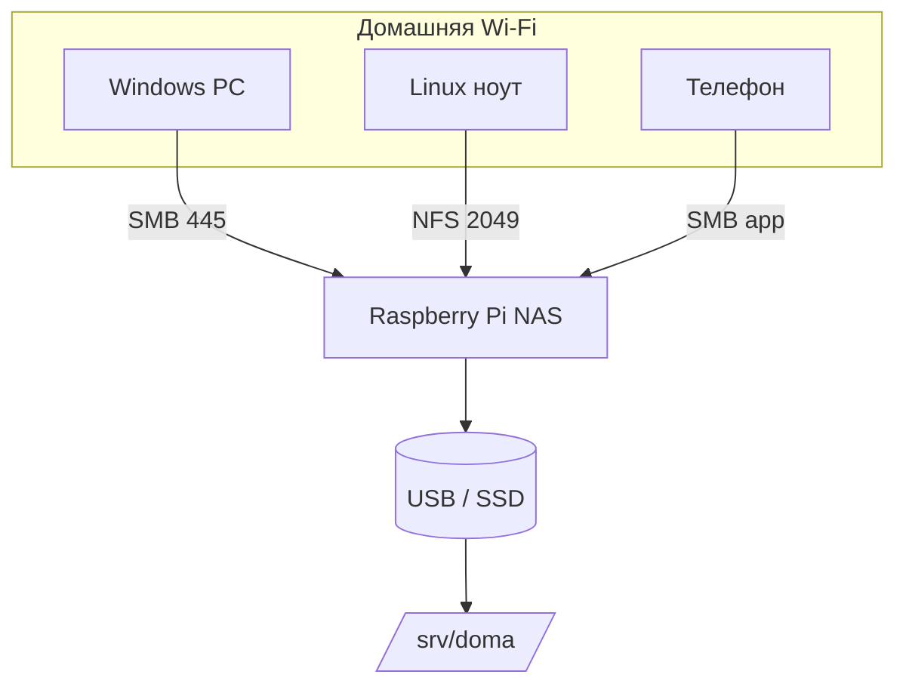
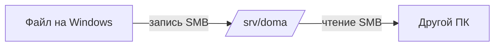

# ENGINEERING ROADMAP
## Том 3 · Лаборатория №3 — NAS: семейное хранилище файлов

> **Общий шкаф в цифровой квартире** · Миссия дня

---

## 📡 История

**Docker** (Лаб. №2) научил **изолировать** службы на Pi. **Git** (Лаб. №1) хранит **код**, но **не** фильмы, фото и архивы семьи — туда **флешки** и «скинь на диск». Остался вопрос: как сделать **домашний NAS** — папку на Pi или Linux-сервере, куда **Windows**, **телефон** и **ноутбук** заходят **по сети**, как в офисе?

Эта лаборатория — **концепт и первый Samba-share**; полная инфраструктура — **капstone** в Лаб. №9.

---

## 🚀 Миссия

**Спроектировать и поднять** простой **NAS**: общая папка **`/srv/doma`**, доступ по **Samba (SMB)** с Windows и **NFS** (опционально) с Linux — безопасно для домашней сети.

---

## 🎯 Цель

- понять **NAS = сетевой диск** (файлы по **SMB/NFS**, не HTTP);
- создать **структуру папок**, пользователя, **Samba-share**;
- подключить share с **Windows** («Сетевой диск») и проверить **запись/чтение**.

**Результат:** папка **`\\IP\pi-doma`** или **`Z:`** видна в Windows; тестовый файл **с двух** устройств; схема в dnevnik.

---

## ⏱ Время

80–100 мин (можно **2–3 дня** по 30 мин).

---

## 🧰 Что понадобится

- [ ] Raspberry Pi **или** Linux-сервер (Tom 1) с **SSH** (Лаб. №0)
- [ ] **USB-диск** или раздел SD **≥ 32 GB** свободно — `df -h`
- [ ] ПК с **Windows** **или** второй Linux в той же Wi‑Fi
- [ ] IP сервера в **dnevnik** (Tom 1, Лаб. №7)
- [ ] Согласование с **взрослым**: кто имеет право **удалять** файлы в «семейной» папке

---

## 🤔 Как ты думаешь?

**Не читай ответ сразу.**

1. **Google Drive** — NAS или **другое**?
2. Зачем **Samba**, если есть **`scp`**?
3. Папка **доступна всей** Wi‑Fi — это **безопасно**?

*(Запиши в dnevnik.)*

**Настоящее объяснение:** **NAS** (Network Attached Storage) — компьютер/служба, которая **раздаёт файлы по сети**. **Samba (SMB)** — язык, который **понимает Windows** («Сетевой диск»). **NFS** — чаще для **Linux**. Это **не** облако: данные **у тебя дома**, интернет **не обязателен** для доступа в LAN.

---

## 💡 Аналогия

**Общий шкаф в прихожей:**

| В жизни | В NAS |
|---------|-------|
| Полка «Семья» | Share **`doma`** |
| Ключ от квартиры | **Логин/пароль** Samba |
| Сосед не лезет — дверь подъезда | NAS **только** в **домашней** Wi‑Fi (обычно) |
| Подпись «не трогать» | Права **read-only** для гостей |

### 😲 ВАУ!

Synology и QNAP — **готовые NAS**; твой **Pi + Samba** — **мини-версия** того же принципа за **десятки** евро железа.

### 😄 Момент улыбки

«Где фото?» — «На **Z:**» звучит как хакер из фильма, но это просто **буква диска** Windows.

---

## 📷 Иллюстрация

:::illustration
ILL-T3-L3-01
:::

```
     [Windows Z:]
          │
    [Router Wi-Fi]
          │
    [Pi + USB] ── /srv/doma
          │
     [Telefon / Linux]
```

---

## 📊 Mermaid





---

## 🔬 Эксперимент

**Правило:** минимум для зачёта — **№1, №2, №3**. Рекомендуемые — **№4, №5**.

---

### Эксперимент 1 — «План и папки на сервере»

**⏱** 15 мин

**На Pi/сервере:**

```bash
sudo mkdir -p /srv/doma/{wspolne,backup,filmy}
sudo chown -R $USER:$USER /srv/doma
ls -la /srv/doma/
df -h /srv/doma
```

Нарисуй в dnevnik:

```
/srv/doma/wspolne  — фото, документы
/srv/doma/backup   — копии ноутбуков
/srv/doma/filmy    — большие файлы
```

| Команда | Что делает | Что изменится | Как проверить | Как отменить |
|---------|------------|---------------|---------------|--------------|
| `mkdir -p` | **Дерево** папок | Новые каталоги | `ls -la` | `rm -r` (**осторожно!**) |
| `chown` | **Владелец** файлов | Твой user может писать | `touch /srv/doma/wspolne/test` | — |

**✅ Проверь себя:** три подпапки **существуют**, места **хватает**?

---

### Эксперимент 2 — «Samba: установка и пользователь»

**⏱** 25 мин

```bash
sudo apt update
sudo apt install -y samba samba-common-bin
sudo smbpasswd -a $USER
sudo nano /etc/samba/smb.conf
```

**В конец** `smb.conf` добавь:

```ini
[doma]
   path = /srv/doma/wspolne
   browseable = yes
   read only = no
   guest ok = no
   valid users = pi
```

(Замени `pi` на **твоего** пользователя.)

```bash
sudo testparm
sudo systemctl restart smbd nmbd
sudo systemctl status smbd --no-pager
```

| Шаг | Что делает | Зачем |
|-----|------------|-------|
| `smbpasswd -a` | Пароль **Samba** (может ≠ Linux) | Windows **логинится** |
| `testparm` | **Проверка** конфига | Ловит опечатки |
| `[doma]` | Имя **share** в сети | Видно как `\\IP\doma` |

**✅ Проверь себя:** `testparm` **без** fatal error?

---

### Эксперимент 3 — «Подключить с Windows»

**⏱** 20 мин

1. **Win+R** → `\\192.168.x.x` → Enter  
2. Логин: пользователь Pi + **Samba-пароль**  
3. Правый клик на **`doma`** → **Подключить сетевой диск** → буква **Z:**  
4. Создай `hello_nas.txt` с ноутбука  
5. На Pi: `cat /srv/doma/wspolne/hello_nas.txt`

| Действие | Что изменится | Как проверить |
|----------|---------------|---------------|
| Сетевой диск Z: | Windows **пишет** на Pi | Файл виден в `cat` на Pi |
| Тот же файл с Pi | **Синхрон** через share | Открыть Z: снова |

**✅ Проверь себя:** файл **с Windows** читается **на Pi**?

---

### Эксперимент 4 — «NFS для Linux (опционально)»

**⏱** 20 мин

**Только если** есть второй Linux в LAN:

```bash
sudo apt install -y nfs-kernel-server
echo '/srv/doma/wspolne 192.168.0.0/24(rw,sync,no_subtree_check)' | sudo tee -a /etc/exports
sudo exportfs -ra
showmount -e localhost
```

На **Linux-клиенте**:

```bash
sudo mkdir -p /mnt/doma
sudo mount -t nfs 192.168.x.x:/srv/doma/wspolne /mnt/doma
ls /mnt/doma
```

| Протокол | Кто использует | Порт (типично) |
|----------|----------------|----------------|
| **SMB** | Windows, macOS | 445 |
| **NFS** | Linux, Proxmox | 2049 |

**✅ Проверь себя:** `ls /mnt/doma` показывает **hello_nas.txt**?

---

### Эксперимент 5 — «Права, квота, backup-мысль»

**⏱** 15 мин

```bash
sudo chmod 775 /srv/doma/wspolne
sudo chgrp users /srv/doma/wspolne
echo "backup $(date)" > /srv/doma/backup/readme.txt
du -sh /srv/doma/*
```

Запиши **правило семьи** в dnevnik:

- кто **удаляет**;
- **backup** раз в неделю (Tom 1, Лаб. №4 — идея `rsync`);
- **не** открывать Samba в **интернет** без VPN (Лаб. №5).

**Опционально — Docker Samba** (есно уже знаешь compose):

```yaml
# только идея — не обязательно
# image: dperson/samba — изучи README перед продом
```

**✅ Проверь себя:** `du -sh` показывает **размеры** папок?

---

## ⚠ Типичные ошибки

| Ошибка | Как исправить |
|--------|---------------|
| Windows не видит Pi | IP верный? **`smbd` active**? одна **подсеть** |
| `Access denied` | `smbpasswd -a user`; `valid users` в smb.conf |
| Медленная запись на Pi | USB 2.0 / слабая SD — **SSD/USB3** лучше |
| Удалили важное | **Backup** папка + права; Git **не** заменяет NAS |
| Открыли SMB в WAN | **Нельзя** без VPN — только **LAN** |

---

## 🧪 Проверь себя

- [ ] `/srv/doma` **структура** нарисована
- [ ] Samba **share `doma`** работает
- [ ] Windows **Z:** или `\\IP\doma` — **запись**
- [ ] Понимаю **SMB vs NFS**
- [ ] Правила семьи в **dnevnik**

---

## 📝 Запись в инженерный дневник

```
=== TOM3 LAB №3 — NAS ===
Data: ___
Co zrobiłem:
  - /srv/doma struktura: TAK/NIE
  - Samba share: TAK/NIE
  - Windows Z: TAK/NIE
  - NFS (opcja): TAK/NIE
  - IP serwera: ___
Co było trudne:
Następny pomysł:
```

---

## 🏆 Что теперь умеешь

- [ ] **Объяснить**, что такое NAS и **зачем** Samba
- [ ] **Создать** share и **подключить** с Windows
- [ ] **Спланировать** папки backup/общие/медиа
- [ ] **Выбрать** SMB или NFS под **устройство**

---

## ➡ Что дальше

**Следующий файл:** [`04_LAB_PIHOLE.md`](04_LAB_PIHOLE.md) — **Pi-hole**: **DNS-фильтр** рекламы для **всей** домашней сети.

**Обязательно:**

- [ ] Файл с Windows **виден** на сервере
- [ ] Samba **не** с guest ok в интернет

**Рекомендуется:**

- [ ] `rsync` в `backup/` с ноутбука (Tom 1)
- [ ] Закоммить **схему** папок в Git (без паролей!)

### 🔮 Вопрос без ответа

Реклама **везде** в браузере — можно ли **резать** её **для всего дома**, даже на **телевизоре**?

**Ответ — в Лаборатории №4 (Pi-hole).**

---

*Отключи share перед сном — или оставь: семейный **шкаф** теперь **цифровой**.*
