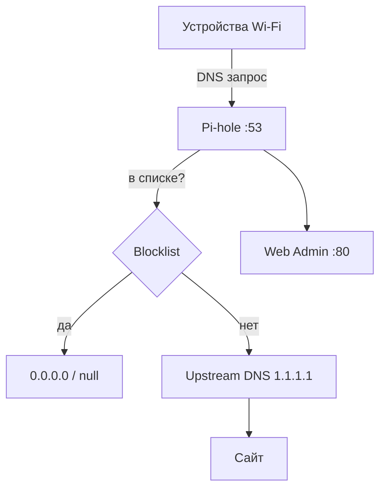
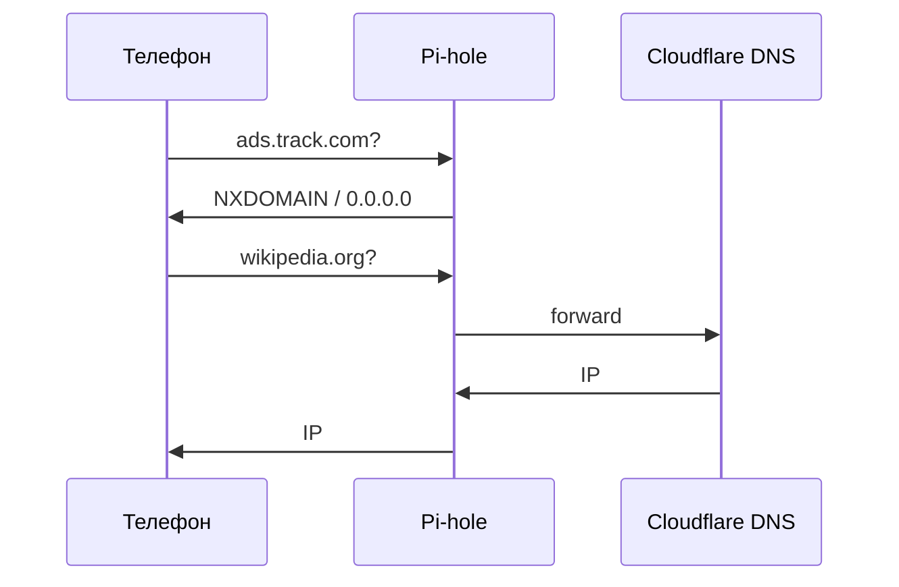

# ENGINEERING ROADMAP
## Том 3 · Лаборатория №4 — Pi-hole: блокировка рекламы в домашней сети

> **Шлагбаум на DNS-дороге** · Миссия дня

---

## 📡 История

**NAS** (Лаб. №3) раздаёт **файлы** по Samba — семья делится фото без флешек. Но каждый сайт **тянет десятки** рекламных доменов — телефон **тормозит**, телевизор **показывает** баннеры. В **Tom 1** (Лаб. №8) ты уже слышал про **DNS** — «телефонная книга» интернета. Остался вопрос: можно ли **на Pi** поставить **фильтр**, который **для всей Wi‑Fi** говорит рекламе **«маршрута нет»**?

---

## 🚀 Миссия

**Установить Pi-hole** (Docker или нативно) на Raspberry Pi, направить **DNS дома** на Pi и **увидеть** заблокированные запросы в **веб-панели**.

---

## 🎯 Цель

- понять **DNS → Pi-hole → блок-лист → 0.0.0.0** (или null);
- запустить Pi-hole с **веб-интерфейсом**;
- на **одном** устройстве (или роутере) прописать DNS = **IP Pi**;
- проверить **меньше рекламы** и **статистику** в Admin.

**Результат:** Pi-hole **online**, DNS указывает на Pi, в dashboard **растёт** счётчик «blocked»; запись в dnevnik.

---

## ⏱ Время

70–90 мин (можно **2 дня**; смена DNS на роутере — с **взрослым**).

---

## 🧰 Что понадобится

- [ ] Raspberry Pi **online** (Tom 2), **SSH** (Лаб. №0)
- [ ] **Docker** установлен (Лаб. №2) — рекомендуемый путь
- [ ] **Статический IP** для Pi на роутере (Tom 1, Лаб. №7) — **желательно**
- [ ] IP Pi в **dnevnik**
- [ ] Доступ к **настройкам роутера** (с взрослым) **или** ручная смена DNS на одном телефоне/ПК
- [ ] 30 мин без «сломать интернет» — **backup DNS** ниже

---

## 🤔 Как ты думаешь?

**Не читай ответ сразу.**

1. Браузер **блокирует** рекламу — Pi-hole **то же** или **другое**?
2. Если Pi **выключен**, интернет **пропадёт** при DNS=Pi?
3. **DNS** — это **сайты** или **имена** (`doubleclick.net`)?

*(Запиши в dnevnik.)*

**Настоящее объяснение:** **DNS** переводит **имя** → **IP**. **Pi-hole** — DNS-сервер + **чёрные списки**: рекламное имя → **«нет адреса»**. Работает для **всех** приложений, которые спрашивают DNS (не только Chrome). **Не** VPN и **не** антивирус — **фильтр имён**.

---

## 💡 Аналогия

**Охрана у входа в ЖК:**

| В жизни | В Pi-hole |
|---------|-----------|
| Список «курьеры — пускать» | **Whitelist** редко |
| «Рекламные раздачи — не пускать» | **Blocklist** |
| Консьерж проверяет паспорт | **DNS-запрос** |
| Гость без пропуска — разворот | **Blocked query** |

### 😲 ВАУ!

Домашний Pi-hole часто **блокирует 15–40%** всех DNS-запросов — ты **не замечал**, сколько «фона» тянет каждая страница.

### 😄 Момент улыбки

Родители: «Интернет **быстрее**?» — «Я **убрал** половину мусора на входе», — звучит как магия, но это **DNS**.

---

## 📷 Иллюстрация

📷 **ILL-T3-L4-01 · Pi-hole шлагбаум**  
**[Для художника]** Pi с логотипом Pi-hole; поток **маленьких машинок-запросов** (dns names); охранник Pi-hole **останавливает** машинки с надписью AD; зелёные машинки (youtube.com, wikipedia.org) проезжают; на экране dashboard «Blocked: 12 345»; подпись: «Фильтр на входе, не в каждом браузере».

```
  [Телефон] ──DNS──> [Pi-hole] ──OK──> [Интернет]
                         │
                         X  ads.example.com
```

---

## 📊 Mermaid





---

## 🔬 Эксперимент

**Правило:** минимум для зачёта — **№1, №2, №3**. Рекомендуемые — **№4, №5**.

**Важно:** запиши **старый DNS** роутера в dnevnik **до** изменений.

---

### Эксперимент 1 — «Pi-hole в Docker»

**⏱** 25 мин

**На Pi:**

```bash
mkdir -p ~/pihole/etc-pihole ~/pihole/etc-dnsmasq.d
cd ~/pihole
nano docker-compose.yml
```

```yaml
services:
  pihole:
    container_name: pihole
    image: pihole/pihole:latest
    ports:
      - "53:53/tcp"
      - "53:53/udp"
      - "8080:80"
    environment:
      TZ: Europe/Warsaw
      WEBPASSWORD: twoje_haslo_admin
    volumes:
      - './etc-pihole:/etc/pihole'
      - './etc-dnsmasq.d:/etc/dnsmasq.d'
    restart: unless-stopped
```

```bash
docker compose up -d
docker compose logs -f
# Ctrl+C когда Running
docker ps
```

| Параметр | Что делает | Зачем |
|----------|------------|-------|
| `53:53` | **DNS** порт | Устройства шлют сюда запросы |
| `8080:80` | **Админка** | `http://IP:8080/admin` |
| `WEBPASSWORD` | Пароль **GUI** | Запиши в dnevnik (не в Git!) |

**✅ Проверь себя:** `docker ps` — контейнер **Up**?

---

### Эксперимент 2 — «Локальный тест DNS»

**⏱** 15 мин

**На Pi** (или ноуте в LAN):

```bash
dig @192.168.x.x doubleclick.net +short
dig @192.168.x.x wikipedia.org +short
dig @192.168.x.x pi.hole +short
```

| Команда | Что делает | Ожидание |
|---------|------------|----------|
| `dig @IP имя` | Спросить **конкретный** DNS | Pi-hole отвечает |
| `doubleclick.net` | Типичный **рекламный** домен | **0.0.0.0** или пусто |
| `wikipedia.org` | Обычный сайт | **Реальный IP** |

Открой **`http://192.168.x.x:8080/admin`** — логин пароль из compose.

**✅ Проверь себя:** dashboard **открывается**, есть **Query Log**?

---

### Эксперимент 3 — «Направить одно устройство на Pi-hole»

**⏱** 20 мин

**Безопасный путь** — **один** телефон или ПК:

- **Android/iOS:** Wi‑Fi → настройки сети → **DNS вручную** → IP Pi  
- **Windows:** Свойства адаптера → IPv4 → DNS = IP Pi  
- **Запиши backup:** второй DNS = `1.1.1.1` (если поле есть)

Открой сайт с **тяжёлой** рекламой (новостной портал — с разрешения взрослого). Смотри **Query Log** в Pi-hole — **blocked** растёт.

| Действие | Что изменится | Как проверить |
|----------|---------------|---------------|
| DNS = Pi | Запросы через **Pi-hole** | Query Log **оживает** |
| Блокировка | Меньше **баннеров** | Dashboard **blocked %** |

**✅ Проверь себя:** в логе видны **запросы** с этого устройства?

---

### Эксперимент 4 — «DNS на роутере (с взрослым)»

**⏱** 20 мин

В **веб-интерface роутера** (Tom 1 карта Wi‑Fi):

1. Запиши **старый** DNS  
2. DHCP → Primary DNS = **IP Pi**  
3. Secondary = **`1.1.1.1`** (если Pi упал — интернет **жив**)  
4. Переподключи Wi‑Fi на телефоне  

**Статический IP** для Pi на роутере — чтобы DNS **не сломался** после reboot.

**✅ Проверь себя:** **два** устройства в Query Log **без** ручного DNS?

---

### Эксперимент 5 — «Whitelist и false positive»

**⏱** 15 мин

Если **сломался** нужный сайт:

1. Admin → **Query Log** → найди **красный** домен  
2. **Whitelist** → Add  
3. Обнови страницу  

Тест **блок-листа**:

```bash
curl -s http://192.168.x.x:8080/admin/api.php?summaryRaw | head
```

Запиши в dnevnik: **% blocked** сегодня, **один** сайт в whitelist (если был).

| Проблема | Решение |
|----------|---------|
| Сайт не грузится | Whitelist **одного** домена, не «выключить Pi-hole» |
| Слишком агрессивно | Меньше списков в Group Management |

**✅ Проверь себя:** понимаешь **whitelist vs выключить всё**?

---

## ⚠ Типичные ошибки

| Ошибка | Как исправить |
|--------|---------------|
| Интернет **мертв** после смены DNS | Pi **выключен** — secondary DNS; `docker ps` |
| Порт 53 занят | `sudo ss -ulnp \| grep 53` — отключи **systemd-resolved** или другой DNS |
| Реклама **в YouTube app** | Pi-hole **не** режет **встроенную** рекламу в приложениях полностью |
| Нет логов | Устройство **DoH** (DNS over HTTPS) — отключи «защиту» в браузере |
| Забыл пароль admin | `docker exec -it pihole pihole setpassword 'nowe'` |

---

## 🧪 Проверь себя

- [ ] Pi-hole **запущен** (Docker или native)
- [ ] `dig @Pi` **блокирует** тестовый рекламный домен
- [ ] Admin **dashboard** открывается
- [ ] **Одно** устройство или роутер → DNS Pi
- [ ] **Backup DNS** записан в dnevnik

---

## 📝 Запись в инженерный дневник

```
=== TOM3 LAB №4 — PI-HOLE ===
Data: ___
Co zrobiłem:
  - Docker pihole: TAK/NIE
  - dig test: TAK/NIE
  - DNS na urządzeniu/routerze: TAK/NIE
  - % blocked (dzisiaj): ___
  - Whitelist (jeśli był): ___
Co było trudne:
Następny pomysł:
```

---

## 🏆 Что теперь умеешь

- [ ] **Объяснить** DNS и роль Pi-hole в **LAN**
- [ ] **Запустить** Pi-hole в **Docker** с admin
- [ ] **Направить** DNS устройства или роутера
- [ ] **Читать** Query Log и **whitelist** ложные срабатывания

---

## ➡ Что дальше

**Следующий файл:** [`05_LAB_VPN.md`](05_LAB_VPN.md) — **VPN**: **безопасный туннель** домой из интернета.

**Обязательно:**

- [ ] Pi-hole **работает**, DNS **не** сломан насмерть
- [ ] Пароль admin **не** в Git

**Рекомендуется:**

- [ ] Static IP для Pi на роутере
- [ ] Связать с **NAS** (Лаб. 3) — один Pi, **несколько** служб в Docker

### 🔮 Вопрос без ответа

Ты **в кафе** — как **безопасно** зайти на **домашний NAS**, не открывая его **всему** интернету?

**Ответ — в Лаборатории №5 (VPN).**

---

*Pi-hole **считает** запросы. Завтра посмотри dashboard — цифры **удивят**.*
