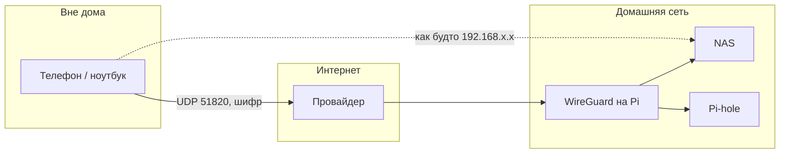

# ENGINEERING ROADMAP
## Том 3 · Лаборатория №5 — VPN

> **Безопасный туннель домой** · Миссия дня

---

## 📡 История

В **Лаборатории №4** ты поставил **Pi-hole** — домашний «фильтр» DNS. Теперь вся семья пользуется **твоим** сервером внутри Wi‑Fi. Но что, если ты **в школе** или у друга и хочешь **безопасно** зайти на NAS, проверить Pi-hole или позже — на умный дом? Открывать порты роутера «на весь интернет» — **опасно**. Нужен **туннель**, который знает только **ты** и **твой дом**.

---

## 🚀 Миссия

**Построить** понимание и **первый** рабочий VPN-туннель на **WireGuard**, чтобы с телефона или ноутбука **вне дома** попасть в домашнюю сеть **как будто ты дома**.

---

## 🎯 Цель

- **понять**, зачем VPN — это **не** «обход блокировок», а **инженерный** способ соединить две сети;
- **разобрать** идею WireGuard: ключи, интерфейс, «рукопожатие»;
- **запустить** WireGuard в Docker (навык из Лаб. №2) и **подключиться** с второго устройства.

**Результат:** файл конфигурации `wg0.conf`, работающий туннель, запись в `dnevnik.txt` + скрин `ping` до NAS **через VPN**.

---

## ⏱ Время

2–3 часа. Можно **3 дня** по 25–30 мин.

---

## 🧰 Что понадобится

- [ ] Linux-сервер / Raspberry Pi с **SSH** (Лаб. №0) — тот же хост, где NAS или Pi-hole
- [ ] **Docker** и **docker compose** (Лаб. №2)
- [ ] Роутер с доступом в интернет; **статический** локальный IP сервера (или DHCP reservation)
- [ ] Второе устройство: телефон (Android/iOS) или ноутбук **вне** домашней Wi‑Fi (мобильный интернет — идеально)
- [ ] Блокнот для **ключей** — **никому** не показывай
- [ ] (Опционально) NAS из Лаб. №3 — как «цель» внутри сети

---

## 🤔 Как ты думаешь?

**Не читай ответ сразу.**

1. Если пакет идёт «в интернет» **без шифрования**, кто на пути может его **прочитать**?
2. Почему «просто открыть порт 22 на роутере» — **плохая** идея для SSH?
3. VPN — это **кабель** через интернет или **невидимая труба** внутри интернета?

*(Запиши в dnevnik. Потом сверься.)*

**Настоящее объяснение:** **VPN** (Virtual Private Network) создаёт **зашифрованный канал** между твоим устройством и домашним сервером. Для остального мира трафик — **шум**. **WireGuard** — современный, простой протокол: пара **ключей** (публичный/приватный) + **разрешённые IP** = туннель. Ты **не** «учишь VPN» — ты **строишь** безопасный вход домой.

---

## 💡 Аналогия

| В жизни | В технике |
|---------|-----------|
| Подземный ход между двумя зданиями | **VPN-туннель** |
| Пропуск только с твоим отпечатком | **Криптографический ключ** |
| Охранник на входе проверяет список | **Firewall / AllowedIPs** |
| Обычная улица — все видят | **Открытый интернет** |

**WireGuard** — как **короткий** и **прочный** тоннель: мало настроек, быстрый, его любят инженеры **NASA**, **Cloudflare**, **Linux Foundation**.

### 😲 ВАУ!

WireGuard в ядре Linux **~4000 строк** кода — OpenVPN был **в десятки раз** больше. Простота = **меньше** дыр для ошибок.

### 😄 Момент улыбки

«Бесплатный VPN в рекламе» обещает анонимность, а на деле продаёт твои данные. **Свой** туннель домой — скучнее, зато **ты** владелец ключей. Скучный VPN — **хороший** VPN.

---

## 📷 Иллюстрация

:::illustration
ILL-T3-L5-01
:::

```
   [Школа / LTE]
        |
   ~~~~~ VPN ~~~~~   ← зашифровано
        |
   [Дом: Pi + NAS + Pi-hole]
```

---

## 📊 Mermaid



---

## 🔬 Эксперимент

**Правило:** минимум для зачёта — **№1, 2, 3, 5**. Эксперименты **4 и 6** — рекомендуемые.

**⚠ Безопасность:** приватные ключи — **секрет**. Не выкладывай в Git (Лаб. №1). Не коммить `wg0.conf` с ключами.

---

### Эксперимент 1 — «Карта: зачем туннель»

**⏱** 15 мин

Нарисуй в `dnevnik.txt` **два** пути:

1. **Плохой:** Интернет → открытый порт 22 → SSH (красным: «видят все»).
2. **Хороший:** Интернет → WireGuard → внутренняя сеть (зелёным: «только с ключом»).

| Действие | Что делает | Что изменится |
|----------|------------|---------------|
| Записать схему | Фиксируешь **решение** | Понимание **до** команд |

**Почему?** Инженер сначала **рисует**, потом **пишет конфиг**.

**✅ Проверь себя:** на схеме есть слова **шифрование**, **ключ**, **без открытого порта SSH**.

---

### Эксперимент 2 — «Пара ключей WireGuard»

**⏱** 20 мин

На сервере (по SSH):

```bash
mkdir -p ~/wireguard/config
cd ~/wireguard
docker run --rm -it \
  -v ~/wireguard/config:/config \
  linuxserver/wireguard:latest \
  bash -c "umask 077; wg genkey | tee server_private.key | wg pubkey > server_public.key"
ls -la config/
```

| Команда | Что делает | Почему так | Проверка | Отмена |
|---------|------------|------------|----------|--------|
| `wg genkey` | Создаёт **приватный** ключ | Без ключа нет туннеля | Файл `server_private.key` существует | Удали папку `~/wireguard` |
| `wg pubkey` | Из приватного — **публичный** | Публичный можно отдавать «клиенту» | `server_public.key` — одна строка | — |
| `umask 077` | Права только **владельцу** | Чтобы другие пользователи не читали ключ | `ls -l` показывает `-rw-------` | — |

Сгенерируй **клиентские** ключи так же (имена `client_private.key`, `client_public.key`).

**✅ Проверь себя:** **4** файла ключей; приватные **не** в чате и **не** в Git.

---

### Эксперимент 3 — «Docker Compose: поднять WireGuard»

**⏱** 30 мин

Создай `~/wireguard/docker-compose.yml`:

```yaml
services:
  wireguard:
    image: linuxserver/wireguard:latest
    container_name: wireguard
    cap_add:
      - NET_ADMIN
      - SYS_MODULE
    environment:
      - PUID=1000
      - PGID=1000
      - TZ=Europe/Warsaw
      - SERVERURL=auto
      - SERVERPORT=51820
      - PEERS=1
      - PEERDNS=auto
      - INTERNAL_SUBNET=10.8.0.0
    volumes:
      - ./config:/config
      - /lib/modules:/lib/modules
    ports:
      - "51820:51820/udp"
    sysctls:
      - net.ipv4.conf.all.src_valid_mark=1
    restart: unless-stopped
```

```bash
cd ~/wireguard
docker compose up -d
docker compose logs --tail 20
```

| `docker compose up -d` | Запускает контейнер в фоне | WireGuard слушает **UDP 51820** | `docker ps` видит `wireguard` | `docker compose down` |
| `NET_ADMIN` | Право создать сетевой интерфейс `wg0` | Без него туннель **не** поднимется | В логах нет `Operation not permitted` | — |

В `config/peer1/` появится **готовый** конфиг для телефона (`peer1.conf` или `wg0.conf`).

**✅ Проверь себя:** `docker ps` — статус **Up**; в логах нет **Error**.

---

### Эксперимент 4 — «Проброс порта на роутере»

**⏱** 20 мин

В веб-интерфейсе роутера (Лаб. №8 подробнее): **Port Forwarding** UDP **51820** → IP твоего сервера.

| Настройка | Что изменится | Как проверить | Как отменить |
|-----------|---------------|---------------|--------------|
| Forward UDP 51820 | WireGuard доступен **снаружи** | С LTE: клиент **подключается** | Удали правило на роутере |

**⚠** Открыт **только** WireGuard, **не** SSH и **не** веб-NAS.

**✅ Проверь себя:** записал **внешний** IP (сайт `ifconfig.me` **с дома**) в dnevnik — **без** паролей роутера.

---

### Эксперимент 5 — «Подключись с телефона»

**⏱** 25 мин

1. Установи **WireGuard** (официальное приложение).
2. Импортируй QR / файл из `peer1/`.
3. **Выключи Wi‑Fi** — включи мобильный интернет.
4. Включи туннель.

```bash
# На телефоне через Termux или с ноутбука после подключения:
ping -c 3 192.168.1.1
ping -c 3 <IP_NAS>
```

Подставь реальный IP NAS из Лаб. №3.

| `ping` к NAS | Пакеты идут **внутри** туннеля | RTT больше, чем дома — **нормально** | 0% packet loss |

**✅ Проверь себя:** **ping** до NAS **работает** только при **включённом** VPN.

---

### Эксперимент 6 — «Split tunnel vs full tunnel»

**⏱** 15 мин

Открой конфиг клиента. Найди строку `AllowedIPs`.

- `AllowedIPs = 10.8.0.0/24, 192.168.1.0/24` — в туннель только **дом** (split).
- `AllowedIPs = 0.0.0.0/0` — **весь** трафик через дом (full).

Измени, переподключись, открой сайт. Запиши разницу скорости.

**Почему?** Инженеры **выбирают** политику маршрута — не «всё подряд».

**✅ Проверь себя:** можешь **своими словами** объяснить split tunnel соседу по парте.

---

## ⚠ Типичные ошибки

| Проблема | Как исправить |
|----------|---------------|
| Клиент «подключается», но ping не идёт | Проверь `AllowedIPs`, IP NAS, firewall на сервере (`sudo ufw status`) |
| Не работает вне дома | Нет **UDP forward 51820**, сменился **внешний IP** провайдера |
| `Permission denied` при ключах | Права `chmod 600` на `.key`, не копируй ключи в мессенджер |
| Конфиг с ключами в Git | Добавь `*.key` и `*.conf` в `.gitignore` **до** коммита |
| Весь интернет стал медленным | Слишком широкие `AllowedIPs` — сузь до домашней подсети |

---

## 🧪 Проверь себя

- [ ] Могу объяснить **зачем** VPN, не путая с «рекламным VPN»
- [ ] WireGuard **запущен** в Docker
- [ ] Подключение с **LTE** успешно
- [ ] `ping` до NAS (или Pi-hole) **через туннель**
- [ ] Приватные ключи **не** в Git и **не** в скриншотах

---

## 📝 Запись в инженерный дневник

```
=== LAB №5 — VPN ===
Data: ___
Co zrobiłem:
  - schemat tunelu (dobry/zły): TAK/NIE
  - docker wireguard Up: TAK/NIE
  - port forward 51820 UDP: TAK/NIE
  - ping do NAS przez VPN: ___ ms
  - split vs full — co wybrałem: ___
Co było trudne:
Co zmieniłbym:
Następny pomysł:
```

---

## 🏆 Что теперь умеешь

- [ ] **Объяснить** разницу между открытым портом и VPN-туннелем
- [ ] **Сгенерировать** ключевую пару WireGuard
- [ ] **Запустить** WireGuard в Docker и **подключить** клиент
- [ ] **Выбрать** split/full tunnel по задаче
- [ ] **Проверить** туннель через `ping`, не «на глаз»

---

## ➡ Что дальше

**Следующий файл:** `06_LAB_HOME_ASSISTANT.md` — **Home Assistant**

**Перед переходом:**

- [ ] VPN с LTE **работает** — **обязательно**
- [ ] Ключи **в безопасности** — **обязательно**
- [ ] Запись в dnevnik — **обязательно**
- [ ] Эксперимент 6 (split tunnel) — **рекомендуется**

**Если обязательные галочки пустые — не открывай следующую лабораторию.**

### 🔮 Вопрос без ответа

Туннель есть — ты **достаёшь** файлы и DNS. А если нужно, чтобы **свет** включился **сам**, когда ты **ещё в туннеле** по пути домой?

**Ответ — в Лаборатории №6.**

---

*Закрой книгу. Выключи Wi‑Fi. Включи VPN. Ты **дома** — даже в школе.*
