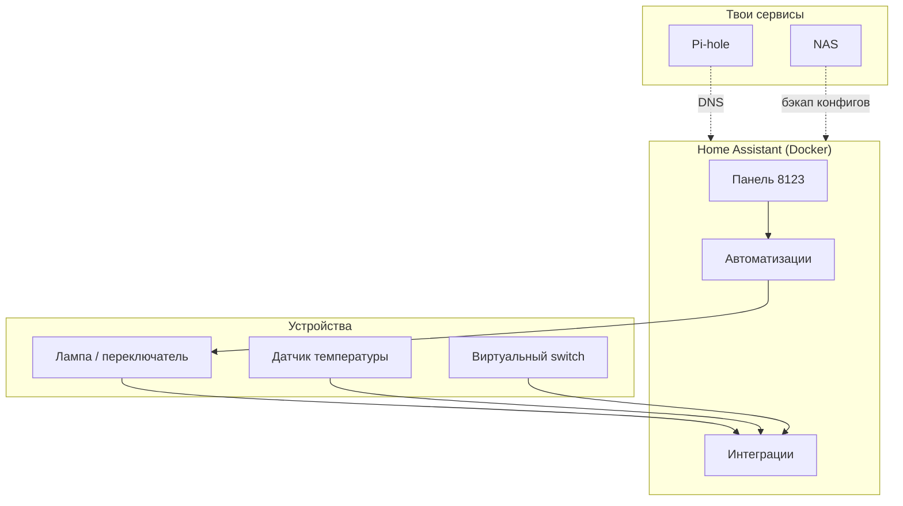

# ENGINEERING ROADMAP
## Том 3 · Лаборатория №6 — Home Assistant

> **Дом, который слушает** · Миссия дня

---

## 📡 История

Ты умеешь **SSH** в сервер, хранить файлы на **NAS**, фильтровать рекламу через **Pi-hole** и заходить домой по **VPN**. Серверы работают **24/7** — но пока они **молчат**: не знают, жарко ли в комнате, горит ли лампа, открыта ли дверь. В **Томе 2** ты уже зажигал **LED** с Raspberry Pi. Пора собрать **мозг** для всего дома — **Home Assistant**.

---

## 🚀 Миссия

**Запустить** Home Assistant в Docker, увидеть **панель** «умного дома» и подключить **первое** устройство (хотя бы **виртуальное**), чтобы дом **реагировал** на правило.

---

## 🎯 Цель

- **понять**, чем **умный дом** отличается от «приложения лампочки»;
- **развернуть** Home Assistant (HA) как **сервис** рядом с NAS и Pi-hole;
- **создать** автоматизацию: «если — то» (например, уведомление или переключатель).

**Результат:** HA открывается в браузере по `http://<IP>:8123`, есть **одна** рабочая автоматизация, скрин панели в dnevnik.

---

## ⏱ Время

2–4 часа. Можно **4 дня** по 30 мин.

---

## 🧰 Что понадобится

- [ ] Сервер с **Docker** (Лаб. №2) — тот же Pi/мини-ПК
- [ ] **SSH** (Лаб. №0)
- [ ] Браузер на ПК или телефоне в домашней Wi‑Fi
- [ ] (Опционально) Умная лампа / розетка **Tasmota**, **Shelly**, **IKEA** — если есть с разрешения родителей
- [ ] (Опционально) Датчик из Тома 2 (DHT22 + ESP32) — позже, в Лаб. №9
- [ ] Запись в `.gitignore` для `secrets.yaml` — привычка из Лаб. №1

---

## 🤔 Как ты думаешь?

**Не читай ответ сразу.**

1. Пять разных приложений для пяти ламп — это **умный дом** или **зоопарк**?
2. Почему **центр** (hub) лучше, чем каждый гаджет сам к интернету?
3. Что должно произойти, если **интернет пропал**, а свет надо выключить?

*(Запиши в dnevnik.)*

**Настоящее объяснение:** **Home Assistant** — **локальный** «мозг»: собирает состояния устройств, показывает **одну** панель, запускает **автоматизации** без облака (если ты так настроишь). Это **оркестратор** — как дирижёр: не играет сам, но **связывает** музыкантов.

---

## 💡 Аналогия

| В жизни | В умном доме |
|---------|--------------|
| Дирижёр оркестра | **Home Assistant** |
| Музыкант со своей партитурой | Умная лампа / датчик |
| «Если звучит барабан — гасим свет» | **Автоматизация** |
| Афиша концерта на входе | **Dashboard (Lovelace)** |

### 😲 ВАУ!

**Home Assistant** — проект с **сотнями тысяч** домов; ядро на **Python**, но тебе не нужно писать код — сначала **кубики** в UI. **NASA** не ставит HA в ракеты, зато **инженеры по зданиям** в Siemens и Bosch делают похожие **BMS** — системы управления зданием.

### 😄 Момент улыбки

Умная колонка говорит «я не поняла». Home Assistant **молчит** — зато **точно** выключает свет в 23:00, даже если ты забыл.

---

## 📷 Иллюстрация

:::illustration
ILL-T3-L6-01
:::

```
   [Лампа]──┐
   [Датчик]─┼──► [Home Assistant на Pi] ──► [Твой телефон]
   [Розетка]┘
```

---

## 📊 Mermaid



---

## 🔬 Эксперимент

**Правило:** зачёт — **№1–4**. №5–6 — углубление.

---

### Эксперимент 1 — «Почему локальный hub»

**⏱** 15 мин

Таблица в dnevnik — **3 колонки**: «Облачная лампа», «Локальный HA», «Что важно семье».

Заполни минимум **4 строки**: приватность, работа без интернета, одна панель, скорость реакции.

**Почему?** Инженер **сравнивает архитектуры**, не «ставит что модно».

**✅ Проверь себя:** есть хотя бы **один** минус облака без родительского пафоса — **факт**.

---

### Эксперимент 2 — «Docker: поднять Home Assistant»

**⏱** 30 мин

```bash
mkdir -p ~/homeassistant/config
cd ~/homeassistant
```

`docker-compose.yml`:

```yaml
services:
  homeassistant:
    container_name: homeassistant
    image: ghcr.io/home-assistant/home-assistant:stable
    volumes:
      - ./config:/config
      - /etc/localtime:/etc/localtime:ro
    restart: unless-stopped
    privileged: true
    network_mode: host
```

```bash
docker compose up -d
docker compose logs -f --tail 30
```

| Параметр | Что делает | Почему | Проверка | Отмена |
|----------|------------|--------|----------|--------|
| `network_mode: host` | HA видит **локальную** сеть устройств | Иначе mDNS/Bonjour может **не** найти лампы | Лог: `Home Assistant initialized` | `docker compose down` |
| `./config:/config` | Настройки **на диске** | Можно бэкапить на NAS | Папка `config` растёт | — |
| `privileged: true` | Доступ к железу хоста | Нужно для Bluetooth/USB (опционально) | Контейнер **Up** | Убери, если не нужно |

Открой `http://<IP_сервера>:8123`, пройди **мастер** (имя дома, пользователь, пароль).

**✅ Проверь себя:** панель **Overview** открывается; пароль **записан** в менеджере, не в dnevnik.

---

### Эксперимент 3 — «Первая сущность: Input Boolean»

**⏱** 20 мин

В HA: **Настройки → Устройства и службы → Вспомогательное → Создать → Переключатель (Toggle)**. Имя: `trening_mode`.

| Шаг | Что изменится | Проверка |
|-----|---------------|----------|
| Создать toggle | На панели появится **переключатель** | Клик — меняет состояние on/off |

**Почему?** Перед реальной лампой учишь **логику** на **безопасной** копии.

**✅ Проверь себя:** переключатель виден на **Overview**.

---

### Эксперимент 4 — «Автоматизация: если включили — уведомление»

**⏱** 25 мин

**Настройки → Автоматизации → Создать**

- **Триггер:** `trening_mode` → включился
- **Действие:** **Уведомление** Persistent Notification — текст: «Режим тренировки: не трогай сервер!»

Включи toggle — увидь **баннер** в HA.

| Автоматизация | Связывает **событие** и **действие** | Без кода | Сработала 1 раз при включении |

**✅ Проверь себя:** уведомление **появилось**; при выкл/вкл снова — **снова**.

---

### Эксперимент 5 — «Интеграция: Ping (NAS или Pi-hole)»

**⏱** 20 мин

`configuration.yaml` (через **Файловый редактор** add-on или nano по SSH):

```yaml
binary_sensor:
  - platform: ping
    host: 192.168.1.10
    name: "NAS online"
    scan_interval: 60
```

Перезапуск HA: **Настройки → Система → Перезапуск**. Добавь плитку на панель.

| `ping` binary_sensor | NAS **жив** — зелёный | Упал — красный | IP — твой NAS |

**Почему?** HA становится **пультом** всей инфраструктуры Tom 3.

**✅ Проверь себя:** плитка меняет состояние, если остановить NAS (только **с разрешения**).

---

### Эксперимент 6 — «Реальное устройство (если есть)»

**⏱** 30 мин

Если есть совместимая лампа: **Настройки → Добавить интеграцию** → Mi Home / Tasmota / Shelly (по инструкции производителя).

Автоматизация: если `trening_mode` on → свет **50%**.

**⚠** Только устройства **родителей**, не соседской Wi‑Fi.

**✅ Проверь себя:** свет **реагирует** или в dnevnik честно: «brak urządzenia — OK».

---

## ⚠ Типичные ошибки

| Проблема | Как исправить |
|----------|---------------|
| `:8123` не открывается | `docker ps`, firewall, верный IP |
| Устройства не находятся | `network_mode: host`, одна подсеть Wi‑Fi |
| Автоматизация не срабатывает | Проверь **режим** automation (вкл), **триггер** в **Инструментах разработчика → Состояния** |
| Сломал `configuration.yaml` | HA показывает ошибку — откати строку, **Проверить конфигурацию** |
| Пароль в скриншоте | Размыть; сменить пароль в **Профиль** |

---

## 🧪 Проверь себя

- [ ] HA в Docker **стабильно** перезапускается (`docker compose restart`)
- [ ] Есть **toggle** и **одна** автоматизация
- [ ] (Желательно) сенсор **ping** NAS/Pi-hole
- [ ] Понимаю разницу **устройство / сущность / автоматизация**
- [ ] `secrets.yaml` / пароли **не** в Git

---

## 📝 Запись в инженерный дневник

```
=== LAB №6 — HOME ASSISTANT ===
Data: ___
Co zrobiłem:
  - HA :8123 działa: TAK/NIE
  - użytkownik utworzony: TAK/NIE
  - toggle trening_mode: TAK/NIE
  - automatyzacja powiadomienia: TAK/NIE
  - ping NAS na panelu: TAK/NIE
Co było trudne:
Co zmieniłbym:
Następny pomysł:
```

---

## 🏆 Что теперь умеешь

- [ ] **Объяснить**, зачем **центральный** hub умного дома
- [ ] **Развернуть** Home Assistant в Docker
- [ ] **Создать** сущность и **автоматизацию** «если — то»
- [ ] **Мониторить** другой сервис (ping) с панели
- [ ] **Планировать** связку HA + NAS + Pi-hole

---

## ➡ Что дальше

**Следующий файл:** `07_LAB_DNS.md` — **DNS: глубокое погружение**

**Перед переходом:**

- [ ] HA **открывается** и автоматизация **работает** — **обязательно**
- [ ] Конфиг **бэкап** в папку NAS — **рекомендуется**
- [ ] Dnevnik — **обязательно**

**Если обязательные галочки пустые — не открывай следующую лабораторию.**

### 🔮 Вопрос без ответа

Pi-hole **перехватывает** имена. Но **кто** изначально говорит, что `google.com` — это **конкретные цифры**? И что будет, если **записать** в DNS **неправильный** адрес **намеренно**?

**Ответ — в Лаборатории №7.**

---

*Погаси свет кликом на панели. Дом впервые **слушает** тебя.*
