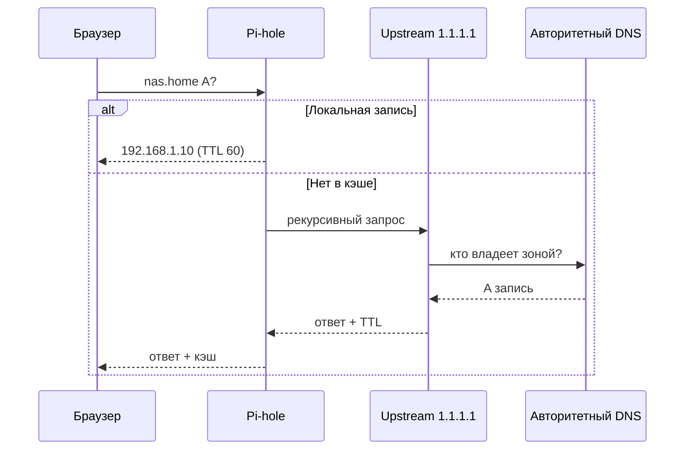

# ENGINEERING ROADMAP
## Том 3 · Лаборатория №7 — DNS: глубокое погружение

> **Имя → адрес → доверие** · Миссия дня

---

## 📡 История

В **Томе 1** (Лаб. №8) ты впервые увидел `nslookup` — **DNS как телефонная книга**. В **Лаборатории №4** Pi-hole стал **твоей** книгой: блокируешь рекламу, видишь запросы семьи. Но **телефонная книга** бывает **толстой**, с **разными типами записей**, **кэшем** и **цепочкой** «кто кого спрашивает». Сейчас ты разберёшь DNS **как системный инженер** — не только «что работает», но **почему** и **где ломается**.

---

## 🚀 Миссия

**Расследовать** полный путь DNS-запроса: от браузера до корневых серверов и обратно — и **управлять** записями на своём Pi-hole / локальном DNS.

---

## 🎯 Цель

- **понять** типы записей **A**, **AAAA**, **CNAME**, **PTR**, **TTL**;
- **проследить** рекурсию: stub → Pi-hole → upstream → авторитетный;
- **создать** локальную запись `nas.home` → IP твоего NAS и **проверить** с трёх устройств.

**Результат:** схема цепочки DNS в dnevnik, скрин `dig` + **локальное имя** открывается в браузере.

---

## ⏱ Время

2–3 часа. Можно **3 дня** по 25–30 мин.

---

## 🧰 Что понадобится

- [ ] **Pi-hole** (Лаб. №4) — или другой DNS на сервере
- [ ] **NAS** с известным IP (Лаб. №3)
- [ ] Linux/macOS терминал: `dig` или `nslookup`
- [ ] Два устройства в Wi‑Fi (телефон + ПК)
- [ ] Доступ к **Local DNS Records** в Pi-hole (веб `http://pi.hole/admin` или IP)

---

## 🤔 Как ты думаешь?

**Не читай ответ сразу.**

1. Зачем **кэш** DNS, если «интернет быстрый»?
2. Может ли **одно имя** указывать на **два** IP одновременно?
3. Pi-hole отвечает **мгновенно** на блокировку — он **всегда** спрашивает Google DNS?

*(Запиши в dnevnik.)*

**Настоящее объяснение:** **DNS** — распределённая база **имён → данные**. Твой клиент спрашивает **резолвер** (Pi-hole). Если ответа нет в **кэше**, Pi-hole идёт **выше** (upstream). **Авторитетный** сервер домена — **последняя** инстанция для зоны `example.com`. **TTL** говорит, сколько секунд ответ можно **хранить** без повторного вопроса.

---

## 💡 Аналогия

| В жизни | В DNS |
|---------|-------|
| Имя в классном журнале | **Доменное имя** |
| Номер школьного шкафчика | **IP-адрес** |
| Записка «Вася живёт у бабушки» → другой адрес | **CNAME** |
| Список «актуален 5 дней» | **TTL** |
| Одноклассник, который **всех** знает | **Pi-hole / резолвер** |

### 😲 ВАУ!

Корневые DNS-серверы (`.` root) — **13 логических** имён, **анкер** всего интернета. Один сбой **не** роняет сеть: система **распределена**, как **гены** в природе — нет одной точки.

### 😄 Момент улыбки

Опечатка `gogle.com` — не магия хакера, а **ты** забыл букву. DNS **честно** ответит: «такого имени нет» — или **мошенник** зарегистрировал похожее имя. Внимательность > антивирус.

---

## 📷 Иллюстрация

:::illustration
ILL-T3-L7-01
:::

```
  Браузер: "Кто такой nas.home?"
       ↓
  Pi-hole (кэш? локальная запись?)
       ↓
  Upstream → Корень → .com → сервер зоны
       ↓
  Ответ: A = 192.168.1.10
```

---

## 📊 Mermaid



---

## 🔬 Эксперимент

**Правило:** зачёт — **№1–5**. №6 — для любителей деталей.

---

### Эксперимент 1 — «dig: анатомия ответа»

**⏱** 20 мин

```bash
dig google.com +noall +answer
dig google.com A +short
dig google.com AAAA +short
```

| Часть `dig` | Что делает | Почему |
|-------------|------------|--------|
| `+answer` | Показать **ответ** | Видишь **A** и **TTL** |
| `A` / `AAAA` | IPv4 vs IPv6 | Два **семейства** адресов |
| `+short` | Только IP | Быстрая проверка |

Запиши **TTL** (секунды) для `google.com`.

**✅ Проверь себя:** в ответе есть строка `IN A` и число **TTL**.

---

### Эксперимент 2 — «Путь рекурсии»

**⏱** 25 мин

```bash
dig +trace google.com
```

Смотри **цепочку**: root → TLD (`.com`) → авторитетный.

| `+trace` | Итеративные шаги **как у резолвера** | Длинный вывод — **норма** | Первый hop — root |

**Почему?** Отличаешь **рекурсию** (Pi-hole делает за тебя) от **итерации** (ты видишь каждый шаг).

**✅ Проверь себя:** в логе есть `.` (root) и `.com`.

---

### Эксперимент 3 — «Pi-hole: кэш и Query Log»

**⏱** 20 мин

1. Открой **Pi-hole → Query Log**.
2. На телефоне открой сайт, которого **давно** не открывал.
3. Снова открой **тот же** сайт через 10 сек.

| Наблюдение | Первый раз | Второй раз |
|------------|------------|------------|
| Forwarded to upstream? | Часто **да** | Часто **нет** (кэш) |
| Время ответа | Выше | Ниже |

**✅ Проверь себя:** можешь показать родителю **две** строки в логе — «первый» и «повторный» запрос.

---

### Эксперимент 4 — «Локальная запись nas.home»

**⏱** 25 мин

Pi-hole: **Local DNS → DNS Records** (или `custom.list`):

```
192.168.1.10 nas.home
```

(Подставь IP NAS.)

```bash
dig @192.168.1.X nas.home +short
```

`@` — **явно** спросить Pi-hole (IP твоего Pi-hole).

| Локальная запись | Имя **без** интернета | Работает только в LAN/VPN | Отмена: удали строку |

На ПК открой `http://nas.home` (если NAS отдаёт HTTP).

**✅ Проверь себя:** `dig` возвращает **твой** IP; браузер **открывает** страницу или NAS UI.

---

### Эксперимент 5 — «CNAME: псевдоним»

**⏱** 20 мин

Добавь в Pi-hole:

```
192.168.1.10 nas.home
```

Создай **CNAME** (если UI поддерживает) или вторую запись:

```
192.168.1.10 pliki.home
```

```bash
dig pliki.home +short
ping -c 2 pliki.home
```

**Почему?** Одно железо — **много имён** (как прозвища в классе).

**✅ Проверь себя:** оба имени → **один** IP.

---

### Эксперимент 6 — «TTL эксперимент (мысленный)»

**⏱** 15 мин

Представь: ты сменил IP NAS с `.10` на `.20`, но TTL старый ответа был **86400** (сутки).

Ответь письменно в dnevnik:

1. Кто **ещё** будет ходить на `.10`?
2. Как **ускорить** переход (flush кэша Pi-hole: **Tools → Restart DNS**)?

**✅ Проверь себя:** написал **одно** действие инженера при смене IP.

---

## ⚠ Типичные ошибки

| Проблема | Как исправить |
|----------|---------------|
| `dig` не идёт на Pi-hole | Укажи `@IP`; проверь, что ПК использует Pi-hole как DNS (настройки Wi‑Fi) |
| `nas.home` не открывается | NAS не слушает HTTP; попробуй `ping` — DNS может работать, **сервис** — нет |
| Локальная запись не видна | Перезапуск DNS в Pi-hole; опечатка в домене |
| Путаешь A и CNAME | **CNAME** не заменяет **A** для корня зоны в интернете — локально проще **две A** |
| Слепо TTL=0 | Лишняя нагрузка на сеть — баланс **свежесть / скорость** |

---

## 🧪 Проверь себя

- [ ] Объясняю **A**, **AAAA**, **TTL** без шпаргалки
- [ ] Показал `dig +trace` **одному** вопросу
- [ ] Локальное имя **nas.home** (или своё) **резолвится**
- [ ] Вижу разницу **первый / повторный** запрос в Pi-hole
- [ ] Понимаю, зачем Pi-hole **лучше** «просто 8.8.8.8 в роутере»

---

## 📝 Запись в инженерный дневник

```
=== LAB №7 — DNS ===
Data: ___
Co zrobiłem:
  - dig google TTL: ___ s
  - dig +trace: root widziałem: TAK/NIE
  - lokalny nas.home → IP: ___
  - drugie imię pliki.home: TAK/NIE
  - co się dzieje przy starym TTL: (1 zdanie)
Co było trudne:
Co zmieniłbym:
Następny pomysł:
```

---

## 🏆 Что теперь умеешь

- [ ] **Читать** вывод `dig` как инженер
- [ ] **Прослеживать** цепочку DNS до авторитетного сервера
- [ ] **Настраивать** локальные имена для домашних сервисов
- [ ] **Объяснять** кэш и TTL на примере Pi-hole
- [ ] **Связывать** DNS с NAS, VPN и HA по **имени**, не только IP

---

## ➡ Что дальше

**Следующий файл:** `08_LAB_ROUTER.md` — **Роутер и карта сети**

**Перед переходом:**

- [ ] Локальное DNS-имя **работает** — **обязательно**
- [ ] `dig +trace` **выполнен** — **обязательно**
- [ ] Dnevnik — **обязательно**
- [ ] Эксперимент 6 — **рекомендуется**

**Если обязательные галочки пустые — не открывай следующую лабораторию.**

### 🔮 Вопрос без ответа

DNS знает **имена**. Но **кто** раздаёт IP **внутри** квартиры — и почему твой телефон **вчера** и **сегодня** может иметь **разные** последние цифры?

**Ответ — в Лаборатории №8.**

---

*Имя — это **указатель**. Ты научился **писать** свои указатели в доме.*
