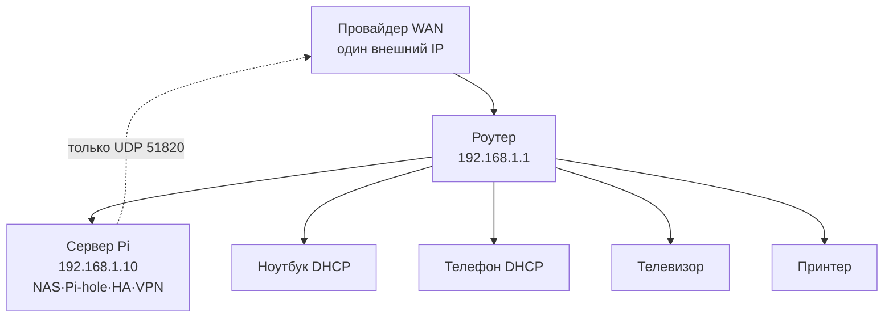

# ENGINEERING ROADMAP
## Том 3 · Лаборатория №8 — Роутер и карта домашней сети

> **Карта квартиры для пакетов** · Миссия дня

---

## 📡 История

Ты построил **сервисы**: NAS, Pi-hole, Home Assistant, VPN. Они живут на **IP-адресах** внутри квартиры. В **Лаборатории №7** ты дал им **имена**. Но **кто** вообще решает, что телефон — `192.168.1.23`, а сервер — `.10`? **Роутер** — это **диспетчерская** дома: Wi‑Fi, DHCP, NAT, иногда **firewall**. Без **карты сети** инженер **слеп**. Сегодня ты **нарисуешь** квартиру для пакетов.

---

## 🚀 Миссия

**Составить** полную карту домашней сети: устройства, IP, роли, порты — и **настроить** роутер так, чтобы серверы были **стабильны** (резервация DHCP + безопасный проброс только для WireGuard).

---

## 🎯 Цель

- **понять** роли роутера: **шлюз**, **DHCP**, **NAT**, **Wi‑Fi AP**;
- **инвентаризировать** все устройства в LAN;
- **закрепить** IP сервера и **проверить** маршрут «клиент → NAS».

**Результат:** схема сети в dnevnik (или draw.io), таблица **≥8 устройств**, DHCP reservation для Pi/сервера.

---

## ⏱ Время

2–3 часа. Можно **3 дня** по 30 мин.

---

## 🧰 Что понадобится

- [ ] Доступ к **веб-интерфейсу роутера** (логин/пароль — у родителей; **не** публикуй)
- [ ] Сервер с NAS / Pi-hole / HA / VPN (Лаб. №3–6)
- [ ] Телефон, ноутбук, всё, что в Wi‑Fi
- [ ] Терминал: `ip addr` / `ip route`, `ping`, `arp -a` или `ip neigh`
- [ ] Бумага или файл `~/network/map.md`

---

## 🤔 Как ты думаешь?

**Не читай ответ сразу.**

1. Почему IP телефона **меняется**, если не трогать настройки?
2. Зачем **NAT**, если все в одной квартире «и так видят друг друга»?
3. Роутер — это **одна коробка** или **несколько ролей** в одном корпусе?

*(Запиши в dnevnik.)*

**Настоящее объяснение:** **Роутер** соединяет **LAN** (дом) с **WAN** (провайдер). **DHCP** раздаёт адреса «на аренду» (**lease**). **NAT** подменяет внутренний IP на **внешний** при выходе в интернет — поэтому снаружи **не видно** каждую лампочку. **Port forwarding** — **целенаправленная** дырка (ты уже делал **51820** для VPN).

---

## 💡 Аналогия

| В жизни | В сети |
|---------|--------|
| Консьерж выдаёт номера квартир гостям | **DHCP** |
| Почтовый ящик дома с **одним** адресом на улице | **NAT** |
| План эвакуации на двери | **Карта сети** |
| Пропускная на ресепшене в офис | **Firewall** |

### 😲 ВАУ!

Домашний роутер за **30 €** выполняет работу, за которую в **дата-центре** Google стоят **маршрутизаторы** на миллионы — **те же идеи**, другой масштаб.

### 😄 Момент улыбки

«Перезагрузи роутер» лечит **половину** мира, потому что DHCP и Wi‑Fi **зависли** — не потому что роутер **обиделся**.

---

## 📷 Иллюстрация

:::illustration
ILL-T3-L8-01
:::

```
        [Интернет / WAN]
              |
         +----+----+
         | Роутер  |
         +----+----+
        /    |    \
   [ПК] [Pi] [Телефон]
```

---

## 📊 Mermaid



---

## 🔬 Эксперимент

**Правило:** зачёт — **№1–5**. №6 — для тех, кто хочет ** VLAN** в будущем.

---

### Эксперимент 1 — «Шлюз и маска»

**⏱** 15 мин

На сервере и на телефоне (через настройки Wi‑Fi → подробности):

```bash
# Linux
ip route show default
ip addr show wlan0
```

| Поле | Пример | Значение |
|------|--------|----------|
| IP | 192.168.1.10 | **Ты** в сети |
| Mask | /24 или 255.255.255.0 | Размер «квартала» |
| Gateway | 192.168.1.1 | **Роутер** — выход наружу |

**✅ Проверь себя:** gateway **одинаковый** на двух устройствах.

---

### Эксперимент 2 — «ARP / соседи»

**⏱** 20 мин

```bash
ping -c 1 192.168.1.1
ip neigh show
# или: arp -a
```

| ARP / neigh | IP → **MAC** (аппаратный адрес) | Кто **физически** в эфире |

Запиши MAC роутера и сервера.

**Почему?** IP может **меняться**, MAC — **паспорт** железа.

**✅ Проверь себя:** в таблице есть **192.168.1.1** и сервер.

---

### Эксперимент 3 — «Инвентаризация LAN»

**⏱** 30 мин

Составь таблицу в `~/network/map.md`:

| Имя | Тип | IP | MAC | Роль | DNS |
|-----|-----|-----|-----|------|-----|
| router | роутер | .1 | … | шлюз | — |
| pi-server | SBC | .10 | … | NAS, Pi-hole, HA, VPN | Pi-hole |
| … | … | … | … | … | … |

Минимум **8 строк** (можно «неизвестный IoT» — пометь **?**).

Скан (осторожно, только **своя** сеть):

```bash
# если установлен nmap с разрешения родителей:
nmap -sn 192.168.1.0/24
```

**✅ Проверь себя:** **8+** устройств; серверы **отмечены** зелёным в легенде.

---

### Эксперимент 4 — «DHCP reservation»

**⏱** 25 мин

В роутере: **DHCP → Static lease / Reservation** — привяжи MAC сервера к `192.168.1.10`.

Перезагрузи Pi:

```bash
sudo reboot
```

После reboot:

```bash
ip addr | grep 192.168
```

| Reservation | IP **не** «уплывёт» | NAS, DNS, VPN **стабильны** | Отмена: удали reservation |

**✅ Проверь себя:** после reboot IP **тот же**.

---

### Эксперимент 5 — «Проверка маршрута до NAS»

**⏱** 20 мин

С телефона (Wi‑Fi):

```bash
ping nas.home
# или ping 192.168.1.10
```

Traceroute в LAN (короткий):

```bash
traceroute 192.168.1.10
# или tracert на Windows
```

| Ожидание | 1 hop — роутер или **прямо** сервер | RTT < 5 ms |

**✅ Проверь себя:** NAS **отвечает**; в dnevnik — **скрин** таблицы map.

---

### Эксперимент 6 — «Аудит port forwarding»

**⏱** 20 мин

Зайди в **Port Forwarding** роутера. Запиши **все** правила.

| Правило | Нужно? | Действие |
|---------|--------|----------|
| UDP 51820 → Pi | **Да** (VPN) | Оставить |
| TCP 22 → Pi | **Риск** | **Удалить**, если есть VPN |
| TCP 80 NAS | **Риск** | **Не** открывать без причины |

**Почему?** Меньше дыр — **меньше** поверхность атаки.

**✅ Проверь себя:** лишних правил **нет** или **объяснил** зачем каждое.

---

## ⚠ Типичные ошибки

| Проблема | Как исправить |
|----------|---------------|
| Не зайти в роутер | IP шлюза из `ip route`; кабель LAN; другой браузер |
| Два DHCP (роутер + Pi) | Оставь **один** раздающий — конфликт **ломает** Wi‑Fi |
| IP сервера сменился | DHCP reservation по **MAC**, не по имени |
| «Устройство unknown» | Спроси родителей; не взламывай чужие сети |
| Открыл лишние порты | Закрой; проверь с LTE **снаружи** (только VPN должен отвечать) |

---

## 🧪 Проверь себя

- [ ] Карта сети **8+** устройств
- [ ] Сервер с **фиксированным** IP
- [ ] Понимаю **DHCP vs static**
- [ ] Знаю **свой** gateway и маску
- [ ] Port forwarding **проверен** — нет лишнего

---

## 📝 Запись в инженерный дневник

```
=== LAB №8 — ROUTER ===
Data: ___
Co zrobiłem:
  - gateway: ___
  - urządzeń w mapie: ___
  - DHCP reservation serwera: TAK/NIE
  - MAC routera: ___
  - port forward audit: usunąłem ___ reguł
Co było trudne:
Co zmieniłbym:
Następny pomysł:
```

---

## 🏆 Что теперь умеешь

- [ ] **Читать** `ip route` и настройки Wi‑Fi как карту
- [ ] **Инвентаризировать** LAN без «магии»
- [ ] **Стабилизировать** IP серверов через DHCP reservation
- [ ] **Оценивать** port forwarding с точки зрения **безопасности**
- [ ] **Связать** роутер с DNS, VPN и сервисами Tom 3

---

## ➡ Что дальше

**Следующий файл:** `09_LAB_INFRASTRUKTURA.md` — **большой проект: домашняя инфраструктура**

**Перед переходом:**

- [ ] Карта сети **готова** — **обязательно**
- [ ] IP сервера **закреплён** — **обязательно**
- [ ] Аудит портов **выполнен** — **обязательно**
- [ ] Dnevnik — **обязательно**

**Если обязательные галочки пустые — не открывай следующую лабораторию.**

### 🔮 Вопрос без ответа

Карта есть. Сервисы **разбросаны** по контейнерам. Как собрать **одну** систему, где NAS, Pi-hole и Home Assistant **помогают друг другу** — и **переживут** перезагрузку?

**Ответ — в финале Тома 3.**

---

*Роутер — скучный герой. Без него **никакой** NAS не найти.*
