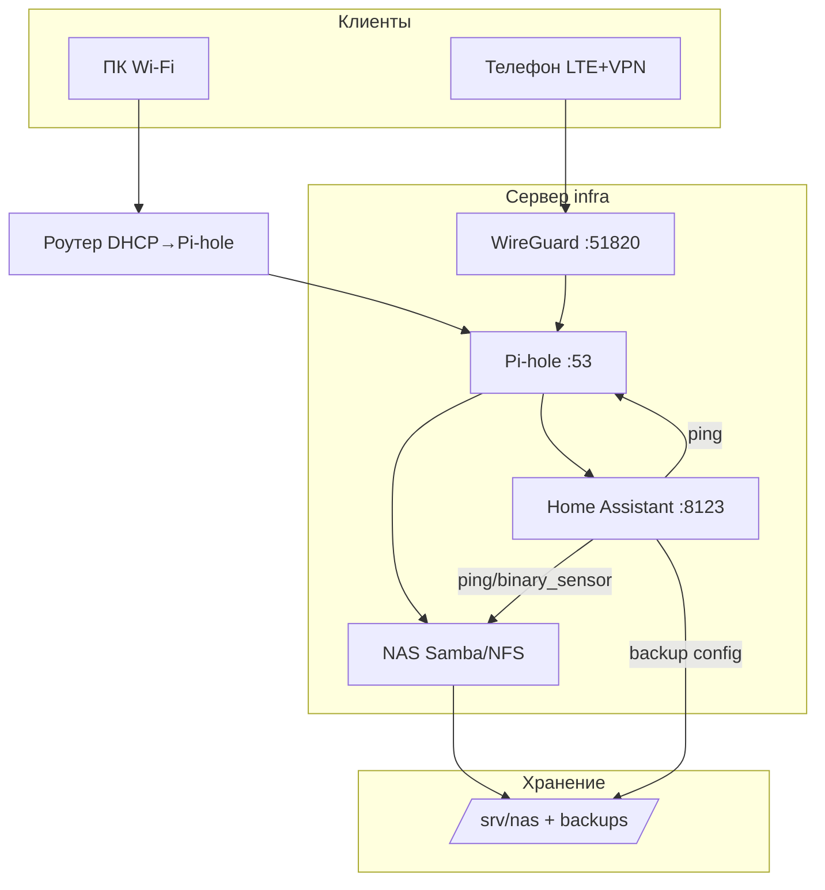

# ENGINEERING ROADMAP
## Том 3 · Лаборатория №9 — Домашняя инфраструктура

> **🟠 Проект уровня 3** · Миссия дня

---

## 📡 История

**Девять лабораторий** — цепочка инженера. **SSH** — ты управляешь машиной удалённо. **Git** — не боишься сломать конфиг. **Docker** — сервисы в коробках. **NAS** — память семьи. **Pi-hole** — чистый DNS. **VPN** — безопасный вход. **Home Assistant** — мозг дома. **DNS** и **роутер** — ты **видишь** карту. Пора **сшить** всё в **одну** инфраструктуру, которая **работает** после перезагрузки и **понятна** на одной схеме.

---

## 🚀 Миссия

**Собрать** единый стек домашней инфраструктуры: **NAS + Pi-hole + Home Assistant + WireGuard**, с **бэкапами**, **мониторингом** и **документацией** — как мини **дата-центр** в квартире.

---

## 🎯 Цель

- **объединить** сервисы в `docker compose` (или связанные стеки) с **правильным** порядком запуска;
- **настроить** Pi-hole как DNS для всей сети + **локальные имена** всех сервисов;
- **показать** статус инфраструктуры на **панели HA** и **проверить** доступ через **VPN** с LTE.

**Результат:** файл `~/infra/README.md` со схемой, рабочий стек, бэкап конфигов на NAS, скрин панели «Infrastructure» + запись **LAB №9** в dnevnik.

---

## ⏱ Время

4–8 часов. Можно **5–7 дней** по 45–60 мин. **Не спеши** — это **диплом** Тома 3.

---

## 🧰 Что понадобится

- [ ] Всё из Лаб. №0–8 (рабочие, не заглушки у **тебя** на столе)
- [ ] Raspberry Pi 4 **≥ 4 GB RAM** или мини-ПК (рекомендуется **отдельный** диск под NAS)
- [ ] Роутер: DHCP → DNS = IP Pi-hole; reservation для сервера
- [ ] NAS-монтирование: `//nas/share` или локальный диск `/srv/nas`
- [ ] VPN WireGuard **уже** работал (Лаб. №5)
- [ ] Home Assistant (Лаб. №6)
- [ ] Блокнот архитектора: `~/infra/`

---

## 🤔 Как ты думаешь?

**Не читай ответ сразу.**

1. Что **упадёт первым**, если просто «запустить всё сразу» после отключения света?
2. Где хранить **бэкап** HA — на том же диске, что и контейнер?
3. Как **одной** кнопкой понять «домашняя IT **здорова**»?

*(Запиши в dnevnik.)*

**Настоящее объяснение:** **Инфраструктура** — не список приложений, а **система**: зависимости, порядок старта, DNS-имена, мониторинг, бэкапы, **документация**. Инженер **проектирует** отказоустойчивость: не «никогда не падает», а «**быстро** поднимается и **данные** не теряются».

---

## 💡 Аналогия

| В жизни | Инфраструктура |
|---------|----------------|
| Школа: классы, столовая, медпункт | **Сервисы** NAS, DNS, HA, VPN |
| Расписание звонков | **Порядок запуска** |
| Дневник с правилами | **README + dnevnik** |
| Пожарная тревога | **Мониторинг / ping** |

### 😲 ВАУ!

**SpaceX** на старте использовала **один** физический сервер для **всего** — потом **вырастили**. Твоя квартира — **тот же путь**: сначала **один Pi**, потом **масштаб** по мере навыков.

### 😄 Момент улыбки

«Умный дом» без бэкапа — умный до первого `docker volume rm`. Ты делаешь **скучный** бэкап — и это **профессионально**.

---

## 📷 Иллюстрация

📷 **[Для художника]** `ILL-T3-L9-01` · Плакат «Домашний дата-центр»: в центре Raspberry Pi на стойке (игрушечная стойка); вокруг **четыре** модуля-плашки NAS · Pi-hole · Home Assistant · VPN; внизу — телефон с VPN и галочкой «Всё зелёное»; badge **🟠 Системный инженер**. Торжественно, но **домашне**. Подпись: *«Один дом — одна система»*.

```
┌─────────────────────────────────────┐
│     ДОМАШНЯЯ ИНФРАСТРУКТУРА v1.0    │
├─────────┬─────────┬─────────┬───────┤
│   NAS   │ Pi-hole │   HA    │  VPN  │
└────┬────┴────┬────┴────┬────┴───┬───┘
     └─────────┴─────────┴──────────┘
                    │
              [ Raspberry Pi ]
```

---

## 📊 Mermaid



---

## 🔬 Эксперимент

**Правило:** это **шаги проекта**. Зачёт — **все №1–6** (можно растянуть на неделю).

---

### Эксперимент 1 — «Архитектурный README»

**⏱** 45 мин

```bash
mkdir -p ~/infra/{docs,scripts,backups}
nano ~/infra/README.md
```

Заполни разделы:

1. **Схема** (Mermaid из этой лабы — скопируй и подправь IP).
2. **Таблица сервисов**: имя, DNS, порт, контейнер, том на диске.
3. **Зависимости**: Pi-hole **до** HA? NAS **независим**?
4. **Восстановление после сбоя** — 5 шагов.

| README | **Паспорт** системы | Без него через месяц **забудешь** | Родитель может прочитать |

**✅ Проверь себя:** в README **≥4** сервиса с портами.

---

### Эксперимент 2 — «Единый compose-стек (или связка)»

**⏱** 60 мин

Вариант **A** — один `~/infra/docker-compose.yml` с сервисами (упрощённо):

```yaml
services:
  pihole:
    image: pihole/pihole:latest
    container_name: pihole
    environment:
      TZ: Europe/Warsaw
      WEBPASSWORD: changeme
    volumes:
      - ./pihole/etc:/etc/pihole
      - ./pihole/dnsmasq:/etc/dnsmasq.d
    ports:
      - "53:53/tcp"
      - "53:53/udp"
      - "80:80/tcp"
    restart: unless-stopped

  wireguard:
    image: linuxserver/wireguard:latest
    container_name: wireguard
    cap_add: [NET_ADMIN, SYS_MODULE]
    environment:
      - PUID=1000
      - PGID=1000
      - TZ=Europe/Warsaw
      - SERVERPORT=51820
      - PEERS=1
    volumes:
      - ./wireguard:/config
    ports:
      - "51820:51820/udp"
    restart: unless-stopped
    depends_on:
      - pihole

  homeassistant:
    image: ghcr.io/home-assistant/home-assistant:stable
    container_name: homeassistant
    volumes:
      - ./homeassistant:/config
    network_mode: host
    privileged: true
    restart: unless-stopped
```

Вариант **B** — оставь **отдельные** папки из прошлых лаб, но создай `~/infra/scripts/start-all.sh`:

```bash
#!/bin/bash
set -e
cd ~/wireguard && docker compose up -d
cd ~/pihole && docker compose up -d   # если отдельно
cd ~/homeassistant && docker compose up -d
echo "Stack up."
```

```bash
chmod +x ~/infra/scripts/start-all.sh
~/infra/scripts/start-all.sh
docker ps --format "table {{.Names}}\t{{.Status}}"
```

| `depends_on` | Порядок **старта** | `restart: unless-stopped` | После reboot — **само** |
| `docker ps` | Все **Up** | — | — |

**✅ Проверь себя:** после `docker ps` **≥3** контейнера **Up**.

---

### Эксперимент 3 — «DNS-имена всей инфраструктуры»

**⏱** 40 мин

В Pi-hole **Local DNS**:

```
192.168.1.10 nas.home
192.168.1.10 pihole.home
192.168.1.10 ha.home
192.168.1.10 vpn.home
```

(Один IP — **нормально** для одного хоста; порты разные.)

Роутер: **DHCP DNS** = `192.168.1.10` (Pi-hole).

Проверка с телефона (Wi‑Fi **без** ручного DNS):

```bash
dig ha.home +short
dig nas.home +short
```

Открой `http://ha.home:8123`.

**✅ Проверь себя:** **4 имени** резолвятся; роутер раздаёт Pi-hole.

---

### Эксперимент 4 — «Панель Infrastructure в Home Assistant»

**⏱** 45 мин

1. Убедись, что **ping** сенсоры есть для NAS и Pi-hole (Лаб. №6).
2. Создай **Dashboard** «Infrastructure» с плитками:
   - Pi-hole **Queries today** (интеграция Pi-hole API — опционально)
   - NAS online (ping)
   - VPN peer connected (input_boolean «вручную» или шаблон)
3. **Автоматизация:** если NAS offline > 2 min → уведомление «Проверь NAS!»

| Панель | **Одним** взглядом здоровье | Инженер не гадает | Скрин в dnevnik |

**✅ Проверь себя:** панель открывается; **одна** автоматизация **тревоги** работает (симулируй stop NAS с разрешения).

---

### Эксперимент 5 — «Бэкап на NAS»

**⏱** 45 мин

`~/infra/scripts/backup.sh`:

```bash
#!/bin/bash
STAMP=$(date +%Y%m%d)
DEST=/srv/nas/backups/infra/$STAMP
mkdir -p "$DEST"
tar czf "$DEST/homeassistant.tar.gz" -C ~/homeassistant config 2>/dev/null || true
tar czf "$DEST/pihole.tar.gz" -C ~/infra/pihole etc dnsmasq.d 2>/dev/null || true
cp ~/infra/README.md "$DEST/"
echo "Backup → $DEST"
```

```bash
chmod +x ~/infra/scripts/backup.sh
~/infra/scripts/backup.sh
ls -la /srv/nas/backups/infra/
```

Добавь в **cron** (раз в неделю) или **systemd timer** — по желанию.

| Бэкап | Конфиги **не** в одном диске с риском | Восстановление **возможно** | Проверь распаковку `tar tzf` |

**✅ Проверь себя:** архив **существует**; README **внутри**.

---

### Эксперимент 6 — «Приёмка: перезагрузка + VPN»

**⏱** 60 мин

**Часть A — reboot сервера:**

```bash
sudo reboot
```

Подожди 3 мин. С ПК в Wi‑Fi:

- `ping nas.home`
- `http://ha.home:8123`
- Pi-hole admin открывается

**Часть B — LTE + VPN:**

1. Телефон: **VPN on**, Wi‑Fi **off**.
2. `ping nas.home` через туннель.
3. Открой HA — работает?

| Приёмка | Система **сама** поднялась | VPN = **удалённый** офис | Всё **зелёное** на панели |

**✅ Проверь себя:** чек-лист приёмки **все** пункты TAK; фото панели **без** паролей.

---

## ⚠ Типичные ошибки

| Проблема | Как исправить |
|----------|---------------|
| После reboot контейнеры не всплыли | `restart: unless-stopped`, `start-all.sh` в `@reboot` cron |
| DNS не раздаётся | Роутер DHCP DNS → Pi-hole; не два DHCP |
| HA не видит устройства | `network_mode: host` |
| Бэкап пустой | Проверь **пути** томов; `tar` с `-C` правильной папкой |
| VPN работает, имена нет | Pi-hole **должен** быть DNS и **внутри** VPN `AllowedIPs` |
| Всё на одном SD — износ | Вынеси NAS на USB-диск; бэкап **на другой** носитель |

---

## 🧪 Проверь себя

- [ ] `~/infra/README.md` — **полный** паспорт
- [ ] Стек **пережил** `sudo reboot`
- [ ] **4 DNS-имени** работают в LAN
- [ ] Панель **Infrastructure** в HA
- [ ] Бэкап на NAS **проверен**
- [ ] VPN + `nas.home` с **LTE**
- [ ] Port forward — **только** WireGuard (аудит Лаб. №8)

---

## 📝 Запись в инженерный дневник

```
=== LAB №9 — INFRASTRUKTURA (CAPSTONE) ===
Data: ___
Co zrobiłem:
  - README serwisów: TAK/NIE
  - docker stack po reboot: TAK/NIE
  - DNS nas/pihole/ha/vpn: TAK/NIE
  - panel Infrastructure: TAK/NIE
  - backup ścieżka: ___
  - VPN+LTE test: TAK/NIE
  - zdjęcie panelu (bez haseł): TAK/NIE
Co było trudne:
Co zmieniłbym (v2.0):
Następny pomysł (Tom 4):
```

---

## 🏆 Что теперь умеешь

- [ ] **Спроектировать** домашнюю инфраструктуру **целиком**
- [ ] **Документировать** систему для «себя через полгода»
- [ ] **Связать** NAS, DNS, HA и VPN в **одну** схему
- [ ] **Мониторить** здоровье сервисов с одной панели
- [ ] **Бэкапить** и **восстанавливать** конфиги
- [ ] **Завершить** уровень **🟠 Системный инженер**

---

## ➡ Что дальше

**🎉 Том 3 завершён.**

**Том 4** — **Робототехника** (`engineering-roadmap-tom-04`): физический мир встречает твои серверы.

**Перед Томом 4:**

- [ ] LAB №9 + фото — **обязательно**
- [ ] Бэкап **проверен** — **обязательно**
- [ ] README **актуален** — **обязательно**
- [ ] Родители **знают**, где выключить — **рекомендуется**

### 🔮 Вопрос без ответа

Инфраструктура **цифровая**. Робот **едет** физически. Как **камера на Raspberry Pi** заставит машину **сама** объехать препятствие?

**Ответ — в Томе 4:** Arduino, ультразвук и **автономный робот**.

---

*Выключи монитор. Pi **работает**. DNS **фильтрует**. NAS **хранит**. Ты — **системный инженер**.*
