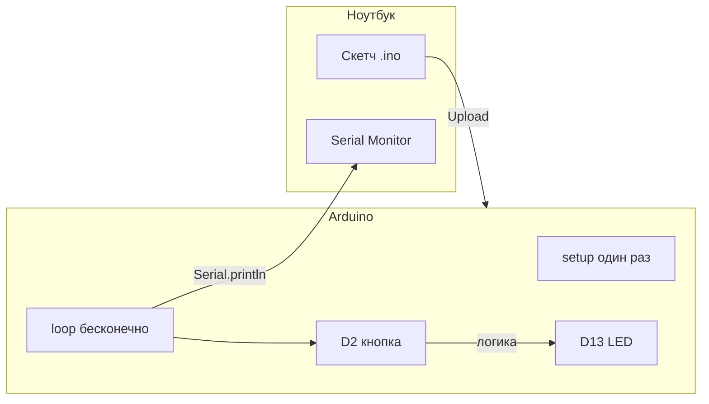

# ENGINEERING ROADMAP
## Том 4 · Лаборатория №0 — Arduino

> **Второй мозг для робота** · Миссия дня

---

## 📡 История

**Том 3** завершён: ты умеешь **SSH**, **Git**, **Docker**, **NAS**, **VPN** — сервер **думает** и **помнит**. **Том 2** дал **GPIO**, **датчики**, **моторы** на Raspberry Pi. Но Pi — **тяжёлый** «командир»: Linux грузится **секунды**, а роботу нужно реагировать за **миллисекунды**. Вопрос: **кто** будет **крутить колёса** и **читать датчики**, пока Pi **считает** камеру? Ответ — **микроконтроллер Arduino**: маленький компьютер **без** экрана, который **только** исполняет команды **мгновенно**.

---

## 🚀 Миссия

**Запрограммировать** Arduino Uno (или совместимую плату): **мигнуть** LED, **прочитать** кнопку и **увидеть** ответ в **Serial Monitor** — чтобы робот получил **первый** «рефлекс», не дожидаясь загрузки Linux.

---

## 🎯 Цель

- **понять**, зачем роботу **два мозга** (Pi = стратегия, Arduino = рефлексы);
- **установить** Arduino IDE и **залить** первый скетч;
- **связать** кнопку → LED → **Serial** (цепочка «вход → логика → выход»).

**Результат:** на столе **Arduino** с **мигающим** LED, в Serial Monitor — **текст** при нажатии кнопки, фото + запись в `dnevnik.txt`.

---

## ⏱ Время

60–90 мин (можно **2–3 дня** по 25–30 мин).

---

## 🧰 Что понадобится

- [ ] Плата **Arduino Uno** / **Nano** / **ESP32** в режиме Arduino *(см. Лаб. №8 Тома 2 — если есть ESP32)*
- [ ] USB-кабель **data** (не только зарядка!)
- [ ] Ноутбук: **Arduino IDE 2.x** ([arduino.cc](https://www.arduino.cc/en/software))
- [ ] Breadboard + провода (Том 2, Лаб. №3)
- [ ] LED + резистор **220 Ω** (Том 2, Лаб. №4)
- [ ] Кнопка + резистор **10 kΩ** pull-down *(или встроенный `INPUT_PULLUP`)*
- [ ] Навыки **Тома 1**: терминал, файлы · **Тома 2**: breadboard, GPIO-логика

---

## 🤔 Как ты думаешь?

**Не читай ответ сразу.**

1. Pi загружается **30–60 секунд**. Робот едет на **стену**. Кто должен **затормозить** — Linux или **чип на 16 МГц**?
2. Зачем LED **мигает**, если «настоящий» робот — это **моторы**?
3. Что такое **Serial** — это **интернет** или **проводной разговор** двух программ?

*(Запиши в dnevnik. Потом сверься.)*

**Настоящее объяснение:** Arduino — **микроконтроллер**: один чип **читает** пины, **выполняет** `loop()` **снова и снова** без операционной системы. **Serial (UART)** — **последовательный** канал по USB: Pi или ноутбук **видит** текст `Serial.println()`. LED — **самый дешёвый** способ **увидеть**, что код **жив**. Моторы придут позже; сначала — **доверие** к плате.

---

## 💡 Аналогия

**Футбольная команда:** **тренер** (Raspberry Pi) смотрит **видео** и **планирует** тактику. **Полузащитник** (Arduino) **бежит** и **отбивает** мяч **без** совещания. Тренер **медленнее**, но **умнее**; полузащитник **быстрее**, но **проще**.

| В жизни | В роботе |
|---------|----------|
| Рефлекс «отдёрнуть руку от горячего» | **Arduino** читает датчик и стопит мотор |
| Анализ «куда ехать дальше» | **Pi** + камера + Python |
| Крик с трибуны | **Serial** / команда по USB |
| Мигание фонарика «я здесь» | **LED** как индикатор |

### 😲 ВАУ!

**Arduino** вырос из проекта **Interaction Design Institute Ivrea** (Италия) — хотели **дёшево** учить **дизайнеров** электронике. Сегодня **NASA**, **CERN** и **тысячи** стартапов используют Arduino-подобные платы для **прототипов** — не для полётов на Марс, но для **проверки идеи за вечер**.

### 😄 Момент улыбки

Arduino **не знает** русский. Если `Serial.println("Привет")` — убедись, что **скорость** Serial **совпадает** (обычно **9600**), иначе увидишь **кашу** из символов — как **рация** на чужой частоте.

---

## 📷 Иллюстрация

📷 **[Для художника]** **ILL-T4-L0-01 · Первый скетч Arduino**

| | |
|--|--|
| **Главный объект** | Arduino Uno на breadboard, **красный** LED горит, палец на **кнопке** |
| **Ракурс** | 3/4 сверху — видны USB в ноутбук, экран **Arduino IDE** с `void setup()` |
| **Выделить** | Стрелка: кнопка → пин 2 → LED пин 13; **Serial Monitor** справа с текстом «Нажато!» |
| **Настроение** | «Маленький чип — **большая** власть» |
| **Подпись** | «Скетч залит · Робот **дышит**» |

```
  [Кнопка] ──► D2 (INPUT)
  LED ──► D13 (OUTPUT) ──► GND
  USB ──► [Ноутбук / Pi]  Serial 9600 baud
```

---

## 📊 Mermaid



---

## 🔬 Эксперимент

**Правило:** каждый шаг — **видимый** результат.  
**Минимум для зачёта:** **№1, №2, №3, №5**. **Рекомендуется:** все **6**.

---

### Эксперимент 1 — «Почему не только Pi» (на бумаге)

**⏱** 10 мин

В dnevnik нарисуй **две** схемы робота:

1. ❌ Только Pi → моторы + камера + Wi‑Fi + всё
2. ✅ Pi (камера, план) + Arduino (моторы, датчики) + **Serial** между ними

Таблица:

| Задача | Кто лучше | Почему |
|--------|-----------|--------|
| Реакция < 10 мс | Arduino | Нет загрузки ОС |
| Распознать лицо | Pi | Нужен Python/OpenCV |
| Мигнуть LED | Оба | Arduino **проще** для старта |

**✅ Проверь себя:** есть **два** мозга на второй схеме и **стрелка** связи.

---

### Эксперимент 2 — «Blink: плата жива»

**⏱** 15 мин

1. Подключи Arduino по USB.
2. Arduino IDE → **Tools → Board** → твоя плата → **Port** → `COMx` / `/dev/ttyUSB0`.
3. **File → Examples → 01.Basics → Blink** → **Upload** (→).

| Действие | Что делает | Что изменится | Проверка | Отмена |
|----------|------------|---------------|----------|--------|
| Upload | Компилирует и **заливает** | Встроенный LED **мигает** | `Done uploading` | Залей пустой скетч |
| Board/Port | Выбор цели | Без порта — **ошибка** | Порт виден в списке | — |

**✅ Проверь себя:** LED **мигает** без твоего кода в `loop` пока — это **пример** Blink.

---

### Эксперимент 3 — «Свой Blink на внешнем LED»

**⏱** 20 мин

**Обязательный для зачёта.**

Схема: LED (длинная ножка) → **D13** через **220 Ω** → GND.

```cpp
const int LED_PIN = 13;

void setup() {
  pinMode(LED_PIN, OUTPUT);
}

void loop() {
  digitalWrite(LED_PIN, HIGH);
  delay(500);
  digitalWrite(LED_PIN, LOW);
  delay(500);
}
```

| `pinMode(OUTPUT)` | Пин **источник** тока | LED **управляем** | Мультиметр ~3.3–5V |
| `delay(500)` | **Блокирует** loop на 500 мс | Частота **1 Гц** | Измени на 100 — быстрее |

**✅ Проверь себя:** **внешний** LED мигает; **встроенный** можно отключить другим пином.

---

### Эксперимент 4 — «Serial: разговор с чипом»

**⏱** 15 мин

```cpp
void setup() {
  Serial.begin(9600);
  Serial.println("Robot gotov. Zhdu komandy...");
}

void loop() {
  if (Serial.available()) {
    char c = Serial.read();
    Serial.print("Poluchil: ");
    Serial.println(c);
  }
}
```

**Tools → Serial Monitor** → скорость **9600**. Набери `w` + Enter.

| `Serial.begin(9600)` | **Скорость** «бод» | Должна **совпадать** с Monitor | Иначе кракозябры |
| `Serial.available()` | Есть **байты** в буфере | Печать при вводе | — |

**✅ Проверь себя:** Monitor **повторяет** символ.

---

### Эксперимент 5 — «Кнопка управляет LED + лог»

**⏱** 20 мин

**Обязательный для зачёта.**

Кнопка: один контакт **D2**, второй **GND**. `pinMode(2, INPUT_PULLUP)` — **внутренний** подтягивающий резистор.

```cpp
const int LED_PIN = 13;
const int BTN_PIN = 2;

void setup() {
  Serial.begin(9600);
  pinMode(LED_PIN, OUTPUT);
  pinMode(BTN_PIN, INPUT_PULLUP);
}

void loop() {
  int pressed = (digitalRead(BTN_PIN) == LOW);  // LOW = нажато
  digitalWrite(LED_PIN, pressed ? HIGH : LOW);
  if (pressed) {
    Serial.println("KNOPKA!");
  }
  delay(50);  // антидребезг
}
```

| INPUT_PULLUP | **HIGH** когда **не** нажато | Не нужен внешний 10k | Нажатие = LOW |
| `delay(50)` | Фильтр **дребезга** | Меньше ложных срабатываний | Убери — увидишь «шум» |

**✅ Проверь себя:** LED **горит** только при нажатии; Serial пишет **одну** строку на нажатие (примерно).

---

### Эксперимент 6 — «Паспорт платы»

**⏱** 10 мин

**Рекомендуется.** В dnevnik:

- Модель платы: ___
- Порт: ___
- Частота мигания LED: ___ мс
- Фото **сверху** с подписанными D2, D13, GND

**✅ Проверь себя:** паспорт **заполнен** — пригодится в Лаб. №7.

---

## ⚠ Типичные ошибки

| Проблема | Как исправить |
|----------|---------------|
| `Port grayed out` | Другой USB-кабель; драйвер CH340/CP2102; Linux: `groups` → `dialout` |
| LED **не** горит | Полярность; резистор; пин **OUTPUT** |
| Serial **каша** | Скорость Monitor ≠ `9600` |
| Upload **failed** | Нажата Reset в момент заливки; выбрана **чужая** Board |
| Кнопка **случайно** срабатывает | `INPUT_PULLUP` + `delay(50)` или конденсатор 100 нФ |

---

## 🧪 Проверь себя

- [ ] Arduino IDE **видит** плату и порт
- [ ] **Blink** и **свой** скетч заливаются
- [ ] Serial Monitor **читает** и **пишет**
- [ ] Кнопка → LED + **лог** работают
- [ ] Понимаю: **зачем** Arduino рядом с Pi
- [ ] Фото схемы в dnevnik

---

## 📝 Запись в инженерный дневник

```
=== TOM4 LAB №0 — ARDUINO ===
Дата: ___
Что сделал:
  - Плата / порт: ___
  - Blink (встроенный LED): ДА/НЕТ
  - Внешний LED D13: ДА/НЕТ
  - Serial 9600: ДА/НЕТ
  - Кнопка D2 → LED + лог: ДА/НЕТ
  - Фото: ДА/НЕТ
Зачем два мозга (Pi + Arduino) — своими словами:
Что было сложно:
Что изменил бы:
Следующая идея:
```

---

## 🏆 Что теперь умеешь

- [ ] **Объяснить**, зачем роботу **микроконтроллер** отдельно от Pi
- [ ] **Установить** IDE, выбрать плату и **залить** скетч
- [ ] **Настроить** `pinMode`, `digitalWrite`, `digitalRead`
- [ ] **Вести** диалог через **Serial Monitor**
- [ ] **Собрать** цепочку вход → логика → выход на breadboard

---

## ➡ Что дальше

**Следующий файл:** `01_LAB_SERVO.md` — **сервопривод**: угол **в градусах**, не просто «вкл/выкл».

**Перед переходом:**

- [ ] **Blink + кнопка + Serial** — **обязательно**
- [ ] Паспорт платы в dnevnik — **обязательно**
- [ ] Фото breadboard — **рекомендуется**
- [ ] Эксперимент «два мозга» на бумаге — **рекомендуется**

**Если обязательные галочки пустые — не открывай следующую лабораторию.**

### 🔮 Вопрос без ответа

LED **вкл/выкл** — это **два** состояния. А **сустав робота** должен встать под **37 градусов**. Как **сказать** мотору **угол**, а не «крутись»?

**Ответ — в Лаборатории №1.**

---

*Отключи USB. LED погас. Но теперь ты знаешь: **чип слушает** — и это начало робота.*
