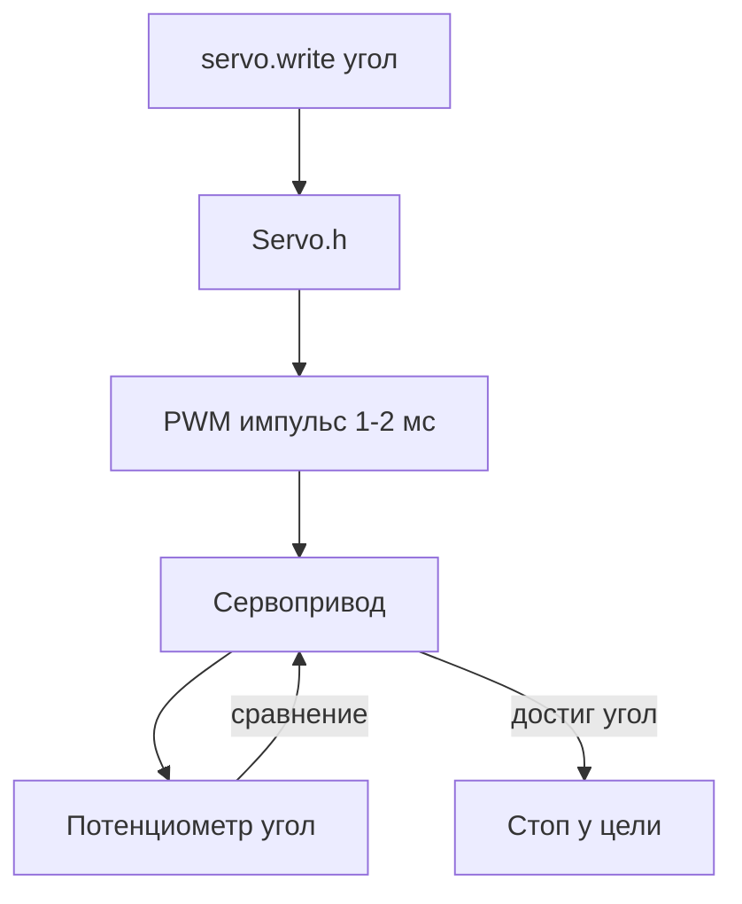

# ENGINEERING ROADMAP
## Том 4 · Лаборатория №1 — Сервоприводы

> **Угол, а не просто «крути»** · Миссия дня

---

## 📡 История

В **Лаборатории №0** Arduino **мигал** LED и **слушал** кнопку — цифровой мир **0** и **1**. Но **сустав** манипулятора или **руль** робота должен встать в **конкретный угол**: 0°, 45°, 90°. Обычный DC-мотор (Том 2, Лаб. №7) **крутится**, пока не скажешь «стоп» — он **не знает**, где находится. Сегодня — **сервопривод**: мотор с **обратной связью**, который **помнит** положение.

---

## 🚀 Миссия

**Подключить** сервопривод SG90 (или аналог) к Arduino и **повернуть** его на **заданные углы** — от 0° до 180° — по команде с Serial и кнопки.

---

## 🎯 Цель

- **понять**, чем **серво** отличается от DC-мотора + H-мост;
- **использовать** библиотеку `Servo.h` и сигнал **PWM**;
- **собрать** мини-«руку»: три угла по расписанию + **ручное** управление.

**Результат:** серво **плавно** переходит между углами, в Serial — текущий угол, фото + dnevnik.

---

## ⏱ Время

75–90 мин (можно **3 дня** по 25–30 мин).

---

## 🧰 Что понадобится

- [ ] Arduino из **Лаб. №0** (рабочий Serial, breadboard)
- [ ] Сервопривод **SG90** (или MG90S, FS90 — стандарт 3-pin)
- [ ] Breadboard, провода **male-male**
- [ ] **Внешнее** питание **5V 2A** для серво *(USB иногда **недостаточен** для нескольких серво!)*
- [ ] Кнопка (опционально) — D2, как в Лаб. №0
- [ ] **Общий GND** Arduino и блока 5V

---

## 🤔 Как ты думаешь?

**Не читай ответ сразу.**

1. DC-мотор крутится **бесконечно**. Как **узнать**, что рука дошла до **90°**?
2. Провод серво — **один** сигнальный. Как **угол** передаётся **одним** проводом?
3. Почему **питать** серво **только** от USB Arduino — иногда **плохая** идея?

*(Запиши в dnevnik.)*

**Настоящее объяснение:** внутри серво — **потенциометр** (датчик угла) и схема сравнения: «хочу 90° — сейчас 40° — крутить **вперёд**». Сигнал — **PWM**: импульс **~1–2 мс** каждые **20 мс**; **длина** импульса кодирует угол. Библиотека `Servo` **считает** за тебя. Ток серво при **рывке** до **500 mA** — USB даёт **~500 mA** на **всё** — Arduino может **сброситься**.

---

## 💡 Аналогия

**Автобус с кондуктором:** DC-мотор — автобус **без остановок** («ехай, пока не крикну»). Серво — **маршрут с остановками**: кондуктор знает «остановка **№3** = 90°» и **сам** тормозит в нужной точке.

| В жизни | В серво |
|---------|---------|
| «Повернись на 90°» | `servo.write(90)` |
| Смотрю на циферблат | Потенциометр внутри |
| Длинный сигнал рукой | Длинный PWM-импульс |
| Отдельный блок питания | **5V 2A**, общий GND |

### 😲 ВАУ!

Первые **сервосистемы** на самолётах WWII были **гидравлические** и **тяжёлые**. SG90 стоит **меньше** чашки кофе — а принцип **обратной связи** тот же, что у **роботов Boston Dynamics** (только там **сотни** сервоприводов и **другие** моторы).

### 😄 Момент улыбки

Серво при старте **дёргается** и **жужжит** — это не поломка, он **ищет** нулевую точку. Как кот, который **крутится** перед лечь на подушку.

---

## 📷 Иллюстрация

:::illustration
ILL-T4-L1-01
:::

```
  Servo:  Коричневый → GND
          Красный    → 5V (блок питания)
          Оранжевый  → D9 (сигнал PWM)
  Arduino GND ──────── GND блока 5V  (ОБЯЗАТЕЛЬНО!)
```

---

## 📊 Mermaid



---

## 🔬 Эксперимент

**Минимум для зачёта:** **№1, №2, №3, №4**. **Рекомендуется:** все **6**.

---

### Эксперимент 1 — «DC vs Servo» (таблица)

**⏱** 10 мин

| | DC-мотор + L298N | Сервопривод |
|--|------------------|-------------|
| Знает угол? | Нет | **Да** |
| Сигнал | IN1/IN2, направление | **Один** PWM |
| Типичное применение | Колёса | **Руль, сустав, камера** |
| Питание | Отдельная батарея | **5V**, осторожно с USB |

**✅ Проверь себя:** **3** отличия записаны **своими** словами.

---

### Эксперимент 2 — «Первый поворот: 0 → 90 → 180»

**⏱** 20 мин

**Обязательный.**

Подключи серво: сигнал → **D9**, **5V** и **GND** — по схеме выше (**общий GND**!).

```cpp
#include <Servo.h>

Servo myServo;
const int SERVO_PIN = 9;

void setup() {
  Serial.begin(9600);
  myServo.attach(SERVO_PIN);
  Serial.println("Servo: 0 -> 90 -> 180");
}

void loop() {
  for (int angle = 0; angle <= 180; angle += 90) {
    myServo.write(angle);
    Serial.print("Ugol: ");
    Serial.println(angle);
    delay(1000);
  }
  delay(2000);
}
```

| `attach(9)` | Пин **выдаёт** PWM | Серво **оживает** | `detach()` — отключить |
| `write(90)` | Цель **90°** | Рычаг **едет** ~1 с | Не мгновенно! |

**✅ Проверь себя:** **три** положения видны **глазом** и в Serial.

---

### Эксперимент 3 — «Плавный ход (map + цикл)»

**⏱** 15 мин

```cpp
void sweep(int from, int to) {
  if (from < to) {
    for (int a = from; a <= to; a++) {
      myServo.write(a);
      delay(15);
    }
  } else {
    for (int a = from; a >= to; a--) {
      myServo.write(a);
      delay(15);
    }
  }
}

void loop() {
  sweep(0, 180);
  delay(500);
  sweep(180, 0);
  delay(500);
}
```

| Малый `delay(15)` | **Плавность** | Меньше рывок | Больше время |
| `map(x, 0, 1023, 0, 180)` | Потенциометр → угол | Для Эксп. 5 | — |

**✅ Проверь себя:** рычаг **едет плавно**, не **прыгает**.

---

### Эксперимент 4 — «Serial-команды: угол с клавиатуры»

**⏱** 20 мин

**Обязательный для зачёта.**

```cpp
void loop() {
  if (Serial.available()) {
    int angle = Serial.parseInt();
    if (angle >= 0 && angle <= 180) {
      myServo.write(angle);
      Serial.print("OK: ");
      Serial.println(angle);
    } else {
      Serial.println("Oshibka: 0-180");
    }
    while (Serial.available()) Serial.read();  // очистка
  }
}
```

В Serial Monitor введи `45` Enter, потом `135`.

| `parseInt()` | Читает **число** | `OK: 45` | Мусор → 0 |
| Ограничение 0–180 | **Защита** механики | SG90 **не** любит >180° | — |

**✅ Проверь себя:** **два** угла по команде **без** перезаливки скетча.

---

### Эксперимент 5 — «Кнопка: три позиции»

**⏱** 15 мин

Кнопка D2: каждое нажатие → следующий угол из `{0, 90, 180}`.

```cpp
int positions[] = {0, 90, 180};
int idx = 0;
const int BTN = 2;

void setup() {
  // ... servo + Serial ...
  pinMode(BTN, INPUT_PULLUP);
}

void loop() {
  if (digitalRead(BTN) == LOW) {
    delay(200);  // дребезг
    myServo.write(positions[idx]);
    idx = (idx + 1) % 3;
    while (digitalRead(BTN) == LOW);  // ждём отпускания
  }
}
```

**✅ Проверь себя:** **цикл** 0→90→180→0 по кнопке.

---

### Эксперимент 6 — «Журнал питания»

**⏱** 10 мин

**Рекомендуется.** Запиши: питал от **USB** или **блока 5V**? Был ли **сброс** Arduino при рывке? Фото **трёх** углов.

**✅ Проверь себя:** **5 правил**: общий GND, не перегружать USB, не блокировать рычаг рукой при движении, провода **не** натянуты, `detach()` при долгом простое — **опционально**.

---

## ⚠ Типичные ошибки

| Проблема | Как исправить |
|----------|---------------|
| Серво **дрожит** на месте | Слабое питание → **блок 5V 2A**; общий GND |
| Arduino **перезагружается** | Серво от **5V пина** платы при рывке — **внешний** БП |
| Угол **не** тот | Механический **стоп** на рычаге; калибровка `write(0)` |
| **Жужжит** и не двигается | Рычаг **зажат** — не держи пальцами |
| `attach` на **любом** пине | На Uno **только** D9, D10, D11 (аппаратный таймер) |

---

## 🧪 Проверь себя

- [ ] Серво **0 / 90 / 180** — работают
- [ ] **Плавный** sweep или близко к нему
- [ ] Serial **задаёт** угол
- [ ] **Общий GND** Arduino и питания серво
- [ ] Понимаю **PWM** как «длина импульса = угол»
- [ ] Фото в dnevnik

---

## 📝 Запись в инженерный дневник

```
=== TOM4 LAB №1 — SERVO ===
Дата: ___
Что сделал:
  - Модель серво: ___
  - Питание: USB / блок 5V
  - 0-90-180 цикл: ДА/НЕТ
  - Serial угол: ДА/НЕТ
  - Кнопка 3 позиции: ДА/НЕТ
  - Фото: ДА/НЕТ
Чем серво отличается от DC-мотора:
Что было сложно:
Следующая идея:
```

---

## 🏆 Что теперь умеешь

- [ ] **Объяснить** обратную связь в сервоприводе
- [ ] **Подключить** SG90 **безопасно** (питание + GND)
- [ ] **Управлять** углом через `Servo.h`
- [ ] **Плавно** менять положение в коде
- [ ] **Принимать** угол по **Serial**

---

## ➡ Что дальше

**Следующий файл:** `02_LAB_ULTRAZVUK.md` — робот **измеряет расстояние**, не **на глаз**.

**Перед переходом:**

- [ ] **0/90/180 + Serial** — **обязательно**
- [ ] Общий GND — **обязательно**
- [ ] Таблица DC vs Servo — **рекомендуется**
- [ ] Кнопка 3 позиции — **рекомендуется**

### 🔮 Вопрос без ответа

Серво **видит** угол **сустава**. А как робот **узнает**, что до **стены** осталось **15 см**, **не касаясь** её?

**Ответ — в Лаборатории №2.**

---

*Серво замер на 90°. Робот впервые **знает**, где его «рука» — в мире **чисел**, не догадок.*
