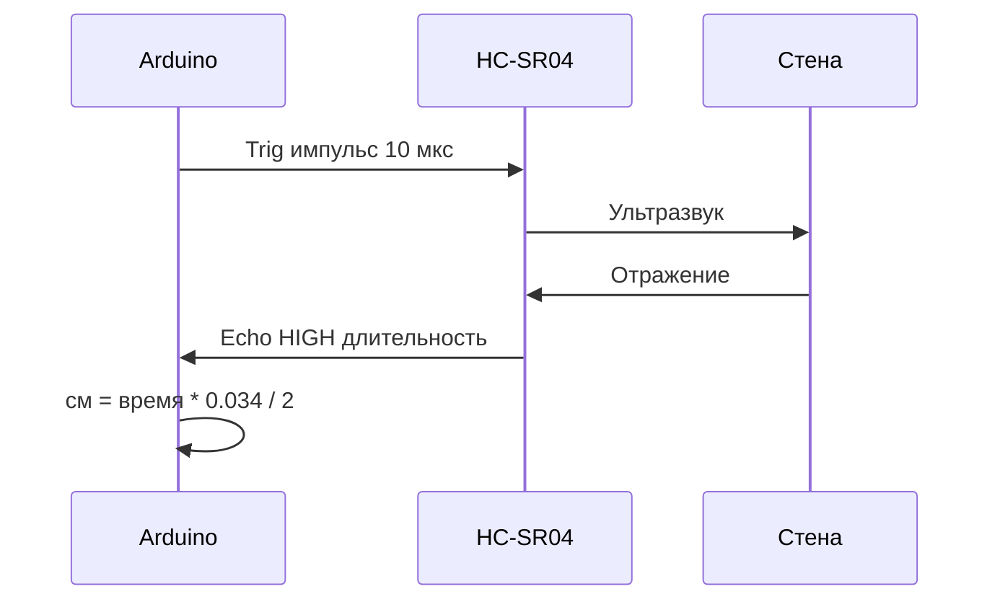

# ENGINEERING ROADMAP
## Том 4 · Лаборатория №2 — Ультразвуковой датчик

> **Робот «видит» расстояние** · Миссия дня

---

## 📡 История

**Лаб. №0** — Arduino **слушает** кнопку. **Лаб. №1** — серво **знает угол**. Но робот на колёсах **не чувствует** стену, пока **не ударится**. В **Томе 2** ты уже работал с **датчиками** (температура, свет). Сегодня — **HC-SR04**: «глаза» на **расстояние** — как **эхолокатор** летучей мыши, только **дешевле**.

---

## 🚀 Миссия

**Подключить** ультразвуковой датчик HC-SR04 к Arduino, **измерить** расстояние в **сантиметрах** и **остановить** «воображаемое движение**, если до препятствия **меньше 20 см**.

---

## 🎯 Цель

- **понять**, как **время полёта** звука превращается в **расстояние**;
- **написать** функцию `readDistanceCm()` с **таймаутом**;
- **связать** датчик с **LED/Servo**: «близко — тревога».

**Результат:** Serial выводит **стабильные** см, при приближении ладони LED **мигает**, запись + фото в dnevnik.

---

## ⏱ Время

75–90 мин (можно **3 дня** по 25–30 мин).

---

## 🧰 Что понадобится

- [ ] Arduino + breadboard (**Лаб. №0**)
- [ ] **HC-SR04** (4 пина: VCC, Trig, Echo, GND)
- [ ] Провода, LED + 220 Ω (индикатор)
- [ ] Линейка или рулетка — **калибровка**
- [ ] (Опционально) Серво из **Лаб. №1** — «отвернуться» от стены

---

## 🤔 Как ты думаешь?

**Не читай ответ сразу.**

1. Звук в воздухе ~**343 м/с**. Зачем датчику **два** «глаза» (Trig и Echo)?
2. Если поставить датчик **вплотную** к стене — покажет **0 см** или **ошибку**? Почему?
3. Почему в коде нужен **`delayMicroseconds`**, а не обычный `delay`?

*(Запиши в dnevnik.)*

**Настоящее объяснение:** Arduino на **Trig** шлёт **короткий** импульс → датчик **излучает** ультразвук → волна **отражается** → **Echo** ловит ответ. Время **туда-обратно** × скорость звука / 2 = **расстояние**. Минимум HC-SR04 ~**2 см**, максимум ~**400 см** (шум, угол, материал влияют). `pulseIn(ECHO, HIGH)` **меряет** длительность импульса на Echo **в микросекундах**.

---

## 💡 Аналогия

**Крик в горах:** кричишь «Эй!» — слышишь **эхо** через время. Чем **дальше** скала — тем **дольше** пауза. HC-SR04 **кричит** слишком высоко (40 кГц) — ты **не слышишь**, Arduino **слышит**.

| В жизни | HC-SR04 |
|---------|---------|
| Эхо в ущелье | Отражённый ультразвук |
| Секундомер | `pulseIn` |
| «Слишком близко — стой!» | `if (dist < 20)` |
| Слепая зона | < 2 см — **не верим** |

### 😲 ВАУ!

**Подводные лодки** и **медицинский УЗИ** — тот же принцип **эхолокации**, только частота и мощность **другие**. Твой HC-SR04 за **~2€** — **мини-сонар** как у **Bosch** в парктронике автомобиля.

### 😄 Момент улыбки

Датчик **боится** пушистый плед и **любит** твёрдую коробку. Мягкая стена для него — как **говорить** в подушку: эхо **глухое**.

---

## 📷 Иллюстрация

:::illustration
ILL-T4-L2-01
:::

```
  HC-SR04:  VCC → 5V   GND → GND
            Trig → D7   Echo → D8
  LED D13 — индикатор «близко»
```

---

## 📊 Mermaid



---

## 🔬 Эксперимент

**Минимум для зачёта:** **№1, №2, №3, №5**. **Рекомендуется:** все **6**.

---

### Эксперимент 1 — «Формула на бумаге»

**⏱** 10 мин

Запиши: `расстояние_см = время_мкс / 58` *(приближение для 20°C)*.

Проверь: если эхо **580 мкс** → **10 см** туда-обратно = **5 см**? *(Нет! 580/58 = 10 см **в одну** сторону — формула уже учитывает /2 в константе 58.)*

| Время мкс | Твой расчёт см | Линейка |
|-----------|----------------|---------|
| 232 | | ~4 см |
| 1160 | | ~20 см |

**✅ Проверь себя:** **2 строки** таблицы заполнены после реального теста (Эксп. 2).

---

### Эксперимент 2 — «Сырой pulseIn»

**⏱** 20 мин

**Обязательный.**

```cpp
const int TRIG = 7;
const int ECHO = 8;

void setup() {
  Serial.begin(9600);
  pinMode(TRIG, OUTPUT);
  pinMode(ECHO, INPUT);
}

float readDistanceCm() {
  digitalWrite(TRIG, LOW);
  delayMicroseconds(2);
  digitalWrite(TRIG, HIGH);
  delayMicroseconds(10);
  digitalWrite(TRIG, LOW);
  long duration = pulseIn(ECHO, HIGH, 30000);  // таймаут 30 мс
  if (duration == 0) return -1;
  return duration / 58.0;
}

void loop() {
  float d = readDistanceCm();
  Serial.print("Dist: ");
  Serial.print(d);
  Serial.println(" cm");
  delay(200);
}
```

| `pulseIn(..., 30000)` | **Таймаут** | Нет эха → 0 → -1 | Не зависает |
| `delay(200)` | ~5 измерений/с | Стабильнее чтение | — |

Поставь коробку на **10, 20, 50 см** — сравни с линейкой.

**✅ Проверь себя:** ошибка **< 2 см** на 20 см (типично).

---

### Эксперимент 3 — «Скользящее среднее»

**⏱** 15 мин

```cpp
float smoothDistance(int n = 5) {
  float sum = 0;
  int ok = 0;
  for (int i = 0; i < n; i++) {
    float d = readDistanceCm();
    if (d > 0) { sum += d; ok++; }
    delay(20);
  }
  return ok ? sum / ok : -1;
}
```

| Усреднение | Меньше **прыжков** цифр | Чуть **медленнее** | Для автопилота — **нужно** |

**✅ Проверь себя:** цифры **не прыгают** на ±10 см без причины.

---

### Эксперимент 4 — «Серво отворачивается» (если есть серво)

**⏱** 15 мин

```cpp
#include <Servo.h>
Servo head;
// setup: head.attach(9);

void loop() {
  float d = smoothDistance();
  if (d > 0 && d < 20) {
    head.write(160);  // «от стены»
  } else {
    head.write(90);
  }
  delay(100);
}
```

**✅ Проверь себя:** при ладони **< 20 см** рычаг **отклоняется**.

---

### Эксперимент 5 — «Светофор расстояния»

**⏱** 20 мин

**Обязательный для зачёта.**

```cpp
const int LED = 13;

void loop() {
  float d = smoothDistance();
  if (d < 0) {
    digitalWrite(LED, LOW);
  } else if (d < 15) {
    digitalWrite(LED, HIGH);   // красный «стоп»
  } else if (d < 40) {
    // мигание «осторожно»
    digitalWrite(LED, millis() % 400 < 200);
  } else {
    digitalWrite(LED, LOW);    // «чисто»
  }
  delay(50);
}
```

| Зона | Поведение | Зачем |
|------|-----------|-------|
| < 15 см | LED постоянно | **Стоп** |
| 15–40 | Мигание | **Сбрось скорость** |
| > 40 | Погас | **Ехать можно** |

**✅ Проверь себя:** **три зоны** работают с ладонью.

---

### Эксперимент 6 — «Карта слепых зон»

**⏱** 15 мин

**Рекомендуется.** Обойди датчик: **ткань**, **стекло**, **угол 45°** к стене. Запиши, где **врёт**.

**✅ Проверь себя:** **3 материала** протестированы.

---

## ⚠ Типичные ошибки

| Проблема | Как исправить |
|----------|---------------|
| Всегда **0** или **-1** | Trig/Echo **перепутаны**; нет **5V** |
| Скачет **случайно** | Усреднение; **таймаут** `pulseIn`; убрать **вибрацию** |
| **38 см** на пустоте | Нет эха — таймаут; закрой **угол** обзора |
| Показывает **2 см** в упор | **Мёртвая зона** — отодвинь на 3+ см |
| Echo на **5V**, Arduino **3.3V** | Nano 33 BLE — **делитель** на Echo |

---

## 🧪 Проверь себя

- [ ] `readDistanceCm()` с **таймаутом**
- [ ] Калибровка **10 и 20 см** — близко к линейке
- [ ] **Светофор** или серво-реакция на **< 20 см**
- [ ] Понимаю **Trig/Echo** и формулу
- [ ] Слепые зоны **записаны**

---

## 📝 Запись в инженерный дневник

```
=== TOM4 LAB №2 — ULTRAZVUK ===
Дата: ___
Калибровка (линейка vs датчик):
  10 см: ___ / ___
  20 см: ___ / ___
  50 см: ___ / ___
Светофор LED: ДА/НЕТ
Серво отворот: ДА/НЕТ / нет серво
Слепые зоны (материалы):
Что было сложно:
Следующая идея:
```

---

## 🏆 Что теперь умеешь

- [ ] **Объяснить** эхолокацию HC-SR04
- [ ] **Измерять** расстояние в **см** с таймаутом
- [ ] **Фильтровать** шум (усреднение)
- [ ] **Принимать решение** по порогу расстояния
- [ ] **Знать** ограничения датчика (2 см, угол, материал)

---

## ➡ Что дальше

**Следующий файл:** `03_LAB_ROBOT.md` — **собрать** шасси: моторы + драйвер + датчик = **робот на колёсах**.

**Перед переходом:**

- [ ] **readDistance + светофор** — **обязательно**
- [ ] Калибровка 20 см — **обязательно**
- [ ] Усреднение — **рекомендуется**
- [ ] Карта слепых зон — **рекомендуется**

### 🔮 Вопрос без ответа

Датчик **видит вперёд**. А **колёса** — кто **крутит** их **вперёд и назад** под командой Arduino, **не сжигая** пины платы?

**Ответ — в Лаборатории №3** (и напоминание из Тома 2: **H-мост**).

---

*Убери ладонь. Датчик пишет «80 cm». Робот **впервые** знает пространство **до** удара.*
