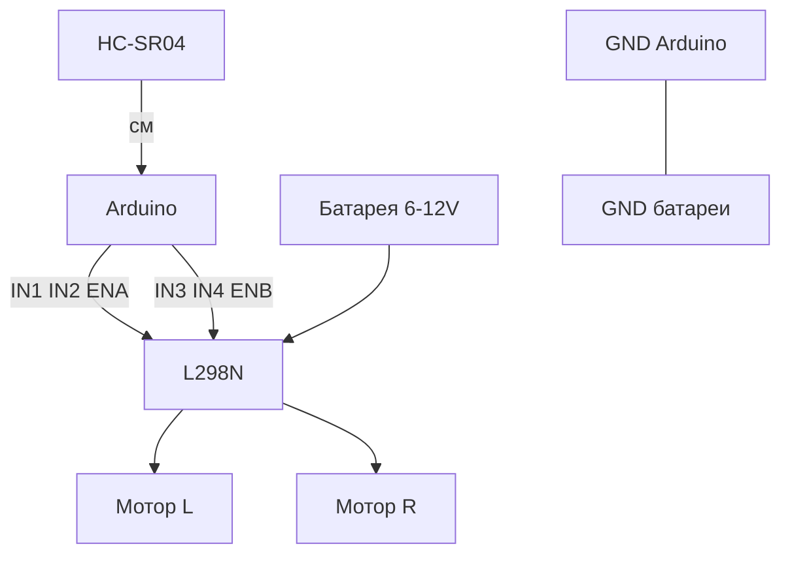

# ENGINEERING ROADMAP
## Том 4 · Лаборатория №3 — Сборка робота

> **От деталей — к машине** · Миссия дня

---

## 📡 История

Arduino **жив** (№0), серво **знает угол** (№1), ультразвук **меряет метры** (№2). В **Томе 2, Лаб. №7** ты уже крутил **DC-мотор** через **L298N** с Raspberry Pi. Сегодня **тот же принцип**, но **мозг** — **Arduino**: собираешь **шасси** с **двумя** колёсами, **драйвером** моторов и **HC-SR04** спереди — **первый** робот, который **едет** и **чувствует** препятствие.

---

## 🚀 Миссия

**Собрать** робота на колёсах: **Arduino + L298N + 2 мотора + батарея + ультразвук**, прошить **управление** (вперёд / стоп / назад) и **автостоп** при расстоянии **< 15 см**.

---

## 🎯 Цель

- **повторить** правило **Pi/Arduino командует — батарея кормит** (сила тока);
- **собрать** механику шасси (набор «2WD robot chassis» или DIY);
- **объединить** код моторов + датчика в **один** скетч `robot_v1.ino`.

**Результат:** робот **едет** по полу, **останавливается** перед коробкой, **фото/видео** 10 с + схема в dnevnik.

---

## ⏱ Время

2–3 часа. Можно **4–5 дней** по 30–40 мин. **Не торопись** с пайкой.

---

## 🧰 Что понадобится

- [ ] Arduino Uno/Nano (**Лаб. №0**)
- [ ] Шасси **2WD** (2 мотора + 2 колёса + крепёж) — набор или 3D-печать *(Том 5 — позже)*
- [ ] **L298N** dual H-bridge (Том 2, Лаб. №7)
- [ ] Батарея **7.4V 2S Li-ion** или **6V 4×AA** + **общий GND** с Arduino
- [ ] **HC-SR04** (Лаб. №2)
- [ ] Провода, стяжки, **двусторонний скотч** / винты
- [ ] (Опционально) **Макетный нож**, **термоклей** — только с правилами безопасности

**⚠** Li-ion — **только** с BMS или готовым pack; **не** коротить; зарядка **под присмотром** по инструкции набора.

---

## 🤔 Как ты думаешь?

**Не читай ответ сразу.**

1. Зачем **два** мотора, если ехать можно **одним** «вперёд»?
2. Где **логично** поставить HC-SR04 — **высоко** или **низко**? Что не увидит низкий?
3. Робот **не едет**, но Arduino **жив** (LED мигает). **Три** причины без паники?

*(Запиши в dnevnik.)*

**Настоящее объяснение:** два мотора дают **поворот** (один быстрее / задний ход одного). L298N **усиливает** слабые сигналы Arduino до **сотен mA**. Датчик **спереди** — «бампер без касания». Раздельное питание: **логика 5V** (USB или BEC), **моторы 6–12V** от батареи, **GND общий** — иначе «случайные» направления.

---

## 💡 Аналогия

**Тележка в супермаркете:** ты **толкаешь** (Arduino) — но **вес** продуктов (моторы) **не** на твоих пальцах, а на **колёсах** и **раме** (L298N + батарея). **Ультразвук** — как **знак** «осторожно, ступенька» **до** удара.

| В жизни | Робот |
|---------|-------|
| Руль + газ | IN1/IN2/ENA |
| Аккумулятор дрели | Батарея шасси |
| Парктроник | HC-SR04 |
| Красный знак СТОП | `motorsStop()` |

### 😲 ВАУ!

**NASA Mars Rover** — тысячи деталей, но **та же** идея: **сенсоры** → **компьютер** → **приводы**. Твой **2WD** за вечер — **мини-Mars Rover** в коридоре.

### 😄 Момент улыбки

Робот **едет задом** — не «стесняется», просто **IN1/IN2** перепутаны. Инженер **не спорит** с колёсами — **меняет** провода или код.

---

## 📷 Иллюстрация

📷 **[Для художника]**

**ID:**  
ILL-T4-L3-01

**Название:**  
Первый робот на полу

**Тип иллюстрации:**  
Сюжетная сцена · низкий ракурс с пола · «собрал · прошил · остановил до удара»

**Главная цель иллюстрации:**  
Показать **первое 2WD-шасси** в **движении** к **картонной преграде**: **HC-SR04** «глазами» вперёд, **Arduino + L298N** сверху, **~15 см** до стены — **стоп** моторов (иконка ⏹ **без** букв). Зритель понимает: робот **живой**, но **безопасный**.

Что подросток должен почувствовать: **драйв + ответственность** — гордость «он **едет**», уважение к **лимиту** расстояния.

---

**Описание сцены**

**Пол комнаты-мастерской** (светлый ламинат / линолеум). **Низкий ракурс** (~15 см от пола) — как **POV** «рядом с роботом». **2WD шасси** (чёрные колёса, **без** брендов) **едет вправо** к **картонной коробке** (стена). На шасси:
- **HC-SR04** спереди на **маленьком** кронштейне
- **Arduino Uno** + **L298N** (зелёная/синяя плата) — провода **аккуратно**
- **Батарея** (LiPo или battery pack, **без** маркировки) сзади

**Красная** полупрозрачная **зона** «опасно близко» (**< 15 cm** — **без цифр**, только **красный** градиент-клин между роботом и коробкой). Над зоной — **иконка STOP** (квадрат ⏹, **без** слова). **Колёса** — **заморожены** / **без** motion blur — моторы **остановлены**.

**На заднем плане** (размыто) — **герой** 15–16 лет **на коленях**, **ноутбук** на полу, USB к Arduino; значок **🔴**, очки на лбу. **Рука** удерживает **Emergency stop**-кнопку (красная, **без** надписи).

**Что НЕ должно появляться:** удар о коробку, искры, Pi (ещё не на шасси), камера, читаемые «15 cm», оружие, гоночный трек.

---

**Главный герой**

- **Возраст:** 15–16 лет (тот же персонаж)
- **Внешность:** каштановые волосы, веснушки
- **Одежда:** тёмно-серый худи **🔴**, джоггеры (на полу **удобно**)
- **Поза:** **на коленях** за роботом, одна рука на **стоп-кнопке**
- **Выражение лица:** напряжённое **ожидание**, потом **облегчение**
- **Эмоция:** драйв + **безопасность**
- **Взгляд:** на **датчик** и коробку, **не** в камеру

---

**Дополнительные персонажи**

Нет.

---

**Окружение**

- **Тип:** пол мастерской, **домашний** тест-полигон
- **Детали:** шасси, L298N, Arduino, HC-SR04, коробка, ноутбук на полу
- **Атмосфера:** **аккуратный** хаос инженера — провода **стянуты**

---

**Композиция**

- **Формат:** 16:9
- **Ракурс:** **низко с пола**, робот **крупно** слева, коробка справа
- **Передний план:** колёса, красная зона, HC-SR04
- **Средний план:** шасси, STOP-иконка
- **Задний план:** герой, ноутбук — blur
- **Линия взгляда:** датчик → красная зона → коробка → стоп
- **Правило третей:** робот — **левая** 2/3, коробка — **правая** треть

---

**Освещение**

- **Тип:** верхний **рассеянный** + тёплый от лампы комнаты
- **Характер:** красная зона — **мягкий** `#E63946` градиент, **не** тревожный
- **Тени:** робот отбрасывает **короткую** тень на пол

---

**Цветовая палитра**

- **Основные:** `#E63946` (🔴 зона + стоп), `#212529` (шасси/колёса), `#2D6A4F` (L298N)
- **Дополнительные:** `#6C757D`, `#D4A574` (коробка), `#457B9D`
- **Настроение:** **энергичное**, но **контролируемое**

---

**Стиль**

EduMost · вектор · **🔴** Том 4 · **без** Pixar/аниме/3D/неона.

---

**Возрастная адаптация**

- **Возраст читателя:** 15–17 лет
- **Можно:** шасси, ультразвук, emergency stop
- **Нельзя:** столкновение, пожар, LiPo в огне, гонки

---

**Формат**

SVG · 16:9 · высокая детализация

---

**Текст**

**Без текста** — расстояние — **красная зона**, стоп — **иконка ⏹**.

---

**Негативный prompt**

водяные знаки · подписи · буквы · цифры · столкновение · искры · Pi на шасси · камера · логотипы · артефакты AI · взрослые · оружие · аниме · Pixar · фотореализм · 3D · неон

---

**Связь с лабораторией**

Лаборатория №3 — **2WD + L298N + HC-SR04**, `dist < 15` → **stop**. Иллюстрация — **первый робот на полу**, ещё **без** Pi и камеры.

```
        [HC-SR04]
             │
    ┌────────┴────────┐
    │ Arduino │ L298N │
    └────┬──────┬─────┘
      M1 │      │ M2
    ═════╧══════╧═════  ← пол
         [Батарея]
```

---

## 📊 Mermaid



---

## 🔬 Эксперимент

**Минимум для зачёта:** **№1, №2, №3, №5**. **Рекомендуется:** все **6**.

---

### Эксперимент 1 — «Паспорт шасси» (без моторов)

**⏱** 20 мин

Собери **механику** (рама + колёса + крепёж). Подпиши в dnevnik:

| Поле | Значение |
|------|----------|
| Напряжение моторов | ___ V |
| Ток (из даташита) | ___ mA |
| Масса | ___ г |
| Высота датчика | ___ см |

**Почему?** Инженер **документирует** железо **до** кода.

**✅ Проверь себя:** колёса **крутятся рукой** без заеданий.

---

### Эксперимент 2 — «Проводка L298N»

**⏱** 25 мин

**Батарея отключена.**

| L298N | Arduino / мотор |
|-------|-----------------|
| IN1, IN2, ENA | D5, D6, D9 |
| IN3, IN4, ENB | D10, D11, D3 |
| OUT1/2 | Мотор **левый** |
| OUT3/4 | Мотор **правый** |
| GND | **GND Arduino** |
| +12V / VS | **+ батареи** *(пока не подключай − к VS)* |

**Общий GND** — **обязателен**.

**✅ Проверь себя:** **нет** провода Arduino D5 → мотор **напрямую**.

---

### Эксперимент 3 — «Моторы без пола»

**⏱** 15 мин

**Обязательный.** Робот **поднят** (колёса в воздухе!). Подключи батарею.

```cpp
const int IN1=5, IN2=6, ENA=9;
const int IN3=10, IN4=11, ENB=3;

void motorPinSetup() {
  pinMode(IN1, OUTPUT); pinMode(IN2, OUTPUT); pinMode(ENA, OUTPUT);
  pinMode(IN3, OUTPUT); pinMode(IN4, OUTPUT); pinMode(ENB, OUTPUT);
}

void forward() {
  digitalWrite(IN1, HIGH); digitalWrite(IN2, LOW); digitalWrite(ENA, HIGH);
  digitalWrite(IN3, HIGH); digitalWrite(IN4, LOW); digitalWrite(ENB, HIGH);
}

void stopMotors() {
  digitalWrite(ENA, LOW); digitalWrite(ENB, LOW);
  digitalWrite(IN1, LOW); digitalWrite(IN2, LOW);
  digitalWrite(IN3, LOW); digitalWrite(IN4, LOW);
}

void setup() { motorPinSetup(); }
void loop() {
  forward(); delay(2000);
  stopMotors(); delay(2000);
}
```

| `stopMotors()` | **Первый** друг робота | После **каждого** теста | — |
| Колёса в воздухе | **Безопасность** | Не уехал со стола | — |

**✅ Проверь себя:** **2 с** вперёд → **стоп** → оба колеса **тишина**.

---

### Эксперимент 4 — «Назад и поворот»

**⏱** 15 мин

```cpp
void backward() {
  digitalWrite(IN1, LOW); digitalWrite(IN2, HIGH); digitalWrite(ENA, HIGH);
  digitalWrite(IN3, LOW); digitalWrite(IN4, HIGH); digitalWrite(ENB, HIGH);
}

void turnRight() {
  digitalWrite(IN1, LOW); digitalWrite(IN2, HIGH); digitalWrite(ENA, HIGH);
  digitalWrite(IN3, HIGH); digitalWrite(IN4, LOW); digitalWrite(ENB, HIGH);
}
```

Тест по **1 с** каждый. Если «назад» — это вперёд, **поменяй** пару проводов **одного** мотора.

**✅ Проверь себя:** **три** режима различимы **навису**.

---

### Эксперимент 5 — «Робот v1: едет + ультразвук»

**⏱** 30 мин

**Обязательный для зачёта.** Склей код **Лаб. №2** + моторы:

```cpp
// + TRIG=7, ECHO=8, readDistanceCm(), smoothDistance()
const int STOP_CM = 15;

void loop() {
  float d = smoothDistance();
  if (d > 0 && d < STOP_CM) {
    stopMotors();
    Serial.println("STOP!");
  } else {
    forward();
  }
  delay(50);
}
```

**На полу:** робот едет к коробке, **останавливается** ~15 см.

| STOP_CM | Порог | Подбери 12–25 | Зависит от скорости |
| `delay(50)` | Частота решений | 20 раз/с | — |

**✅ Проверь себя:** **видео** или серия фото «едет → стоп».

---

### Эксперимент 6 — «Кнопка аварийного стопа»

**⏱** 15 мин

**Рекомендуется.** Кнопка D2 `INPUT_PULLUP` → **мгновенный** `stopMotors()` в `loop` **первой** строкой.

**✅ Проверь себя:** стоп **быстрее**, чем убрать батарею.

---

## ⚠ Типичные ошибки

| Проблема | Как исправить |
|----------|---------------|
| Едет **криво** | Разная скорость моторов — PWM `analogWrite(ENA, 180)` подстройка |
| **Не** едет | VS батареи, ENABLE, **общий GND** |
| Arduino **ресет** при старте | Моторы от **5V пина** — **отдельная** батарея |
| **Не** тормозит у стены | Датчик **высоко** — не видит низкое; уменьши STOP_CM |
| Искры L298N | **Стоп**, проверь **короткое** на OUT |

---

## 🧪 Проверь себя

- [ ] Шасси **механически** собрано
- [ ] L298N + **общий GND**
- [ ] forward / backward / stop — **работают**
- [ ] **Автостоп** < 15 см на полу
- [ ] Аварийная кнопка или привычка **снимать** батарею
- [ ] Схема + фото в dnevnik

---

## 📝 Запись в инженерный дневник

```
=== TOM4 LAB №3 — ROBOT BUILD ===
Дата: ___
Шасси: набор / DIY
Батарея (V): ___
Пины моторов: L IN1/2/ENA ___  R IN3/4/ENB ___
Датчик Trig/Echo: ___ / ___
Автостоп на ___ см: ДА/НЕТ
Видео/фото: ДА/НЕТ
Что было сложно:
Следующая идея:
```

---

## 🏆 Что теперь умеешь

- [ ] **Собрать** 2WD шасси с **безопасным** питанием
- [ ] **Подключить** L298N к Arduino **по правилам Тома 2**
- [ ] **Объединить** датчик и моторы в **одну** программу
- [ ] **Калибровать** порог остановки
- [ ] **Документировать** железо как **паспорт** устройства

---

## ➡ Что дальше

**Следующий файл:** `04_LAB_KAMERA.md` — робот получит **глаза** уровня **картинки**, не только **сантиметров**.

**Перед переходом:**

- [ ] **Автостоп на полу** — **обязательно**
- [ ] stopMotors() **привычка** — **обязательно**
- [ ] Паспорт шасси — **обязательно**
- [ ] Поворот / назад — **рекомендуется**
- [ ] Аварийный стоп — **рекомендуется**

### 🔮 Вопрос без ответа

Ультразвук **не видит** чёрную тонкую ножку стула. А **камера** — видит **всё**, что попало в кадр. Как **подключить** «глаз» к **Raspberry Pi**, не перегружая **Arduino**?

**Ответ — в Лаборатории №4.**

---

*Сними батарею. Робот спит. Но он **уже ездил** — это больше, чем код на экране.*
