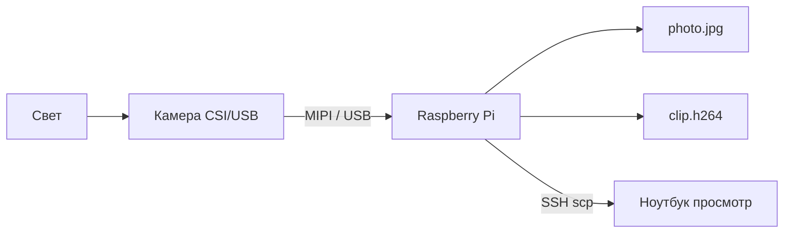

# ENGINEERING ROADMAP
## Том 4 · Лаборатория №4 — Камера

> **Робот получает глаза** · Миссия дня

---

## 📡 История

Твой **2WD** (Лаб. №3) **ездит** и **чувствует** расстояние **ультразвуком** — одно число впереди. Но **стул**, **линия** на полу, **красный куб** — ультразвук **не различает**. В **Томе 1–3** ты освоил **Linux**, **SSH**, **Python** на **Raspberry Pi**. Пора дать Pi **камеру**: не чтобы «смотреть мемы», а чтобы робот **видел картинку** — сырьё для **зрения** в следующих лабораториях.

---

## 🚀 Миссия

**Подключить** камеру к Raspberry Pi (CSI **или** USB), **снять** первый кадр и **записать** короткое видео **из терминала** — без Arduino, только **Pi как глаз**.

---

## 🎯 Цель

- **понять**, чем **CSI** и **USB** камеры отличаются для робота;
- **включить** камеру в **Raspberry Pi OS** / `libcamera`;
- **сохранить** `photo.jpg` и `clip.h264` (или mp4) в папку проекта.

**Результат:** на Pi лежат **фото** и **видео** с меткой времени, превью открывается на ноутбуке (SCP/NAS), запись в dnevnik.

---

## ⏱ Время

60–90 мин (можно **2–3 дня** по 25–30 мин).

---

## 🧰 Что понадобится

- [ ] **Raspberry Pi 4** (рекомендуется **2 GB+**) — Том 2 №0, Том 3 SSH
- [ ] Камера **Pi Camera Module** (CSI лента) **или** **USB веб-камера**
- [ ] microSD с актуальной **Raspberry Pi OS**
- [ ] Ноутбук: SSH (`ssh pi@...` — Том 1/3)
- [ ] Хорошее **освещение** стола — робот **слепнет** в темноте
- [ ] Папка `~/robot_vision/` на Pi

---

## 🤔 Как ты думаешь?

**Не читай ответ сразу.**

1. Зачем **камера на Pi**, если Arduino **уже** управляет моторами?
2. Камера выдаёт **миллионы** чисел (пиксели). Зачем сначала **просто сохранить файл**, не «распознавать»?
3. Почему **разрешение** 640×480 иногда **лучше** для робота, чем 4K?

*(Запиши в dnevnik.)*

**Настоящее объяснение:** Pi **мощнее** для обработки **изображений** (Python, OpenCV — дальше). Arduino **не потянет** видео 30 FPS. Камера → **файл кадра** — первый шаг **конвейера**: свет → матрица → байты → диск → *(потом)* алгоритм. Низкое разрешение = **меньше** данных = **быстрее** реакция на колёсах.

---

## 💡 Аналогия

**Глаза и мозг:** **сетчатка** (камера) только **передаёт** сигнал. **Понимание** «это стул» — в **коре** (Pi + код). Сегодня тренируешь **сетчатку** — проверяешь, что **картинка доходит** до «мозга».

| В жизни | Робот |
|---------|-------|
| Фото на телефон | `still.jpg` |
| Запись Stories | `video.h264` |
| Снять очки — всё размыто | Плохой свет / фокус |
| Одна камера на лбу | Крепление на шасси *(позже)* |

### 😲 ВАУ!

**Tesla Autopilot** использует **8** камер — не лидар один. Идея та же: **несколько** «глаз» + **софт**. Твоя **одна** камера за **10€** — **учебный** Autopilot.

### 😄 Момент улыбки

Камера **смотрит** на потолок — робот «думает», что мир **белый и пустой**. Инженер **сначала** проверяет **куда смотрит** глаз, потом **учит** думать.

---

## 📷 Иллюстрация

📷 **[Для художника]**

**ID:**  
ILL-T4-L4-01

**Название:**  
Глаз на Pi

**Тип иллюстрации:**  
Сюжетная сцена · стол мастерской · «мир стал данными»

**Главная цель иллюстрации:**  
Показать **Raspberry Pi 4** с **CSI-камерой** на **штативе**: **синяя** лента CSI (правило «синяя сторона к Ethernet»), на экране — **терминал** + **превью кадра** (объект на столе). Зритель понимает: **первый still** — **зрение** робота **началось**.

Что подросток должен почувствовать: **тихое «ВАУ»** — «мир на столе стал **файлом**»; спокойная уверенность, не sci-fi хоррор.

---

**Описание сцены**

**Стол мастерской**, ракурс **сбоку** (~45°). **Pi 4** на **чёрных** стойках; от разъёма CSI — **плоский шлейф** ( **синяя** сторона **к Ethernet** — **выделить** тонкой **светящейся** линией-подсказкой, **без** слов). Шлейф к **модулю камеры** на **мини-штативе** (~10 см), объектив **на стол** — снимает **цветной куб** / **игрушку** ( **без** брендов).

**Ноутбук** или **монитор Pi** (HDMI): **половина** экрана — **тёмный терминал** (цветные полосы, **без** `libcamera-still` буквами); **половина** — **превью фото** (куб **чёткий**, рамка кадра).

**Герой** 15–16 лет **сидит** слева, **рука** на клавиатуре; значок **🔴**, худи тёмно-серый. **Взгляд** на **превью** и камеру.

На столе — **янтарная тетрадь** (схема CSI — линии, **без слов**).

**Что НЕ должно появляться:** Arduino на шасси, OpenCV-маски, читаемые команды, логотипы Raspberry Pi Foundation крупно, 230V, selfie-культура.

---

**Главный герой**

- **Возраст:** 15–16 лет (тот же персонаж серии)
- **Внешность:** каштановые волосы, веснушки
- **Одежда:** худи **🔴**, джоггеры, очки на лбу
- **Поза:** сидит, корпус к Pi (~20°)
- **Выражение:** **мягкое** удивление, улыбка «получилось»
- **Эмоция:** «кадр сохранён — зрение **началось**»
- **Взгляд:** превью + камера, **не** в камеру

---

**Дополнительные персонажи**

Нет.

---

**Окружение**

- **Тип:** стол, Pi + CSI + штатив
- **Детали:** куб-объект, тетрадь, кабель HDMI/USB
- **Атмосфера:** **чистая** opto-лаборатория дома

---

**Композиция**

- **Формат:** 16:9
- **Ракурс:** **сбоку** — Pi, шлейф, камера, экран
- **Передний план:** **синий** шлейф CSI (акцент)
- **Средний план:** камера, объект, Pi
- **Задний план:** герой, превью на экране
- **Линия взгляда:** объект → камера → шлейф → Pi → превью
- **Правило третей:** камера — **правая** треть, Pi — **центр**

---

**Освещение**

- **Тип:** тёплый настольный + **холодный** от экрана
- **Характер:** объект **ровно** освещён для «кадра»; шлейф — **лёгкий** синий акцент `#457B9D`
- **Тени:** мягкие

---

**Цветовая палитра**

- **Основные:** `#457B9D` (CSI/экран), `#E63946` (🔴), `#2D6A4F` (Pi PCB)
- **Дополнительные:** `#F4A261` (куб-объект), `#6C757D`, `#F8F9FA`
- **Настроение:** **спокойное**, «данные из света»

---

**Стиль**

EduMost · вектор · **🔴** Том 4 · без Pixar/аниме/3D.

---

**Возрастная адаптация**

- **Возраст читателя:** 15–17 лет
- **Можно:** CSI, libcamera, still
- **Нельзя:** читаемый терминал, surveillance-тревога

---

**Формат**

SVG · 16:9 · высокая детализация

---

**Текст**

**Без текста** — команды и `photo.jpg` **не** показывать буквами.

---

**Негативный prompt**

водяные знаки · подписи · буквы · libcamera · логотипы · артефакты AI · взрослые · оружие · OpenCV · шасси · аниме · Pixar · фотореализм · 3D · неон

---

**Связь с лабораторией**

Лаборатория №4 — **CSI-камера**, `libcamera-still`, **photo.jpg**. Иллюстрация — цепочка «объект → оптика → матрица → Pi → файл».

```
  [Объект на столе] → [Оптика] → [Матрица] → [Pi] → photo.jpg
```

---

## 📊 Mermaid



---

## 🔬 Эксперимент

**Минимум для зачёта:** **№1, №2, №3, №4**. **Рекомендуется:** все **6**.

---

### Эксперимент 1 — «Какая камера у тебя»

**⏱** 10 мин

Заполни в dnevnik:

| Тип | CSI / USB |
|-----|-----------|
| Разрешение (из коробки) | |
| Крепление на робота (идея) | |
| Питание | от Pi / от USB хаба |

**Почему?** USB **проще**, CSI **быстрее** и **ниже** задержка на Pi.

**✅ Проверь себя:** тип камеры **определён**.

---

### Эксперимент 2 — «Включить камеру в системе»

**⏱** 15 мин

**Обязательный.**

SSH на Pi:

```bash
mkdir -p ~/robot_vision
cd ~/robot_vision
libcamera-hello --list-cameras
```

| Команда | Что делает | Почему | Проверка | Отмена |
|---------|------------|--------|----------|--------|
| `libcamera-hello --list-cameras` | Список **датчиков** | Камера **видна** ядру | Номер 0 | — |
| `raspi-config` → Interface → Camera | Вкл. CSI *(старые образы)* | Без этого **нет** устройства | Перезагрузка | Выключить |

Если **USB**:

```bash
lsusb
v4l2-ctl --list-devices
```

**✅ Проверь себя:** камера **0** в списке или `/dev/video0` существует.

---

### Эксперимент 3 — «Первый кадр still»

**⏱** 15 мин

```bash
cd ~/robot_vision
libcamera-still -o first.jpg --width 640 --height 480 --nopreview
ls -lh first.jpg
```

Скопируй на ноутбук (Том 3, SSH):

```bash
scp pi@<IP>:~/robot_vision/first.jpg .
```

| `--width 640` | Меньше файл | Быстрее для робота | Увеличь для деталей |
| `first.jpg` | **Доказательство** | Открывается просмотрщиком | `rm` |

**✅ Проверь себя:** фото **чёткое**, не **чёрное** (свет!).

---

### Эксперимент 4 — «Видео 5 секунд»

**⏱** 15 мин

**Обязательный для зачёта.**

```bash
libcamera-vid -o five_sec.h264 -t 5000 --width 640 --height 480
```

`-t 5000` = **5 секунд** в миллисекундах.

Конвертация *(если установлен ffmpeg)*:

```bash
sudo apt install -y ffmpeg
ffmpeg -framerate 30 -i five_sec.h264 -c copy five_sec.mp4
```

**✅ Проверь себя:** файл **> 0 байт**, видео **играет**.

---

### Эксперимент 5 — «Таймлапс: 10 кадров»

**⏱** 20 мин

```bash
for i in $(seq 1 10); do
  libcamera-still -o frame_$i.jpg --width 320 --height 240 --immediate
  sleep 1
done
```

| 320×240 | **Быстрый** поток | Для трекинга линии — хватит | — |
| Серия кадров | Мини-**анимация** | Потом OpenCV | — |

**✅ Проверь себя:** **10** файлов `frame_*.jpg`.

---

### Эксперимент 6 — «Крепление на шасси (макет)»

**⏱** 15 мин

**Рекомендуется.** Картон + стяжки: закрепи камеру на **роботе** из Лаб. №3 **без** движения — только **угол** «смотрит вперёд». Фото **POV** робота.

**✅ Проверь себя:** в кадре виден **пол** и **горизонт** стола.

---

## ⚠ Типичные ошибки

| Проблема | Как исправить |
|----------|---------------|
| `No cameras available` | Лента CSI **вставлена** до щелчка; `raspi-config`; другой шлейф |
| **Чёрный** кадр | Крышка объектива; **свет**; экспозиция `--shutter` |
| USB **не** в списке | Порт **USB 2.0**; хаб с питанием; `sudo apt update` |
| Видео **0 байт** | `-t` в **мс**; место на SD `df -h` |
| Размыто | Фиксировать камеру; **автофокус** USB — подождать 2 с |

---

## 🧪 Проверь себя

- [ ] Камера **определяется** системой
- [ ] `first.jpg` **не чёрный**
- [ ] Видео **5 с** записано
- [ ] Файлы в `~/robot_vision/`
- [ ] Понимаю: Pi **глаз**, Arduino **ноги** (пока раздельно)
- [ ] (Желательно) макет крепления на шасси

---

## 📝 Запись в инженерный дневник

```
=== TOM4 LAB №4 — KAMERA ===
Дата: ___
Камера: CSI / USB, модель: ___
Pi IP: ___
first.jpg: ДА/НЕТ, размер: ___
five_sec видео: ДА/НЕТ
10 кадров таймлапс: ДА/НЕТ
Крепление на роботе (макет): ДА/НЕТ
Что было сложно:
Следующая идея:
```

---

## 🏆 Что теперь умеешь

- [ ] **Выбрать** CSI vs USB для задачи робота
- [ ] **Включить** камеру на Pi и **проверить** `libcamera`
- [ ] **Снимать** фото и **видео** из терминала
- [ ] **Передавать** кадры на ноутбук по **SCP**
- [ ] **Планировать** крепление «глаза» на шасси

---

## ➡ Что дальше

**Следующий файл:** `05_LAB_COMPUTER_VISION.md` — что значит **«видеть»** для программы: пиксели, цвет, линии.

**Перед переходом:**

- [ ] **first.jpg + видео** — **обязательно**
- [ ] Камера в системе — **обязательно**
- [ ] dnevnik — **обязательно**
- [ ] Таймлапс — **рекомендуется**
- [ ] Макет крепления — **рекомендуется**

### 🔮 Вопрос без ответа

Файл JPG — это **миллионы** чисел. Как программа **найдёт** на фото **чёрную линию** на **белом** полу, не **глазами**?

**Ответ — в Лаборатории №5.**

---

*Закрой превью. Кадр на диске. Робот **увидел** мир — пока **без понимания**, но это уже **зрение**.*
