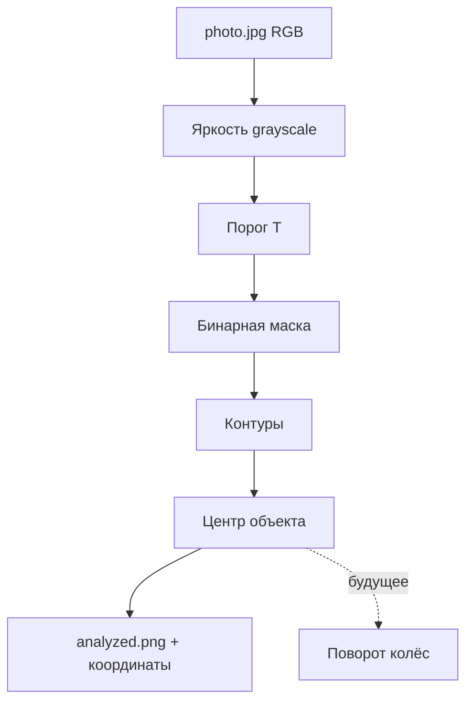

# ENGINEERING ROADMAP
## Том 4 · Лаборатория №5 — Computer Vision

> **От пикселей — к смыслу** · Миссия дня

---

## 📡 История

**Лаб. №4** — камера Pi **сохраняет** кадры. Файл на диске — это **не** картинка для человека внутри компьютера, а **таблица чисел**: каждый пиксель — **яркость** и **цвет**. **Computer Vision (CV)** — наука и инженерия **извлечения решений** из этих чисел: где **линия**, где **лицо**, где **препятствие**. Сегодня — **мышление** CV на Python **без** тяжёлой магии: numpy, цвет, порог, контуры.

---

## 🚀 Миссия

**Написать** Python-скрипт, который **читает** `first.jpg` (Лаб. №4), **находит** самый **тёмный** регион, **рисует** рамку и **сохраняет** `analyzed.png` — первый **анализ** кадра, не просто съёмка.

---

## 🎯 Цель

- **понять** кадр как **массив** `height × width × 3` (RGB);
- **применить** порог (threshold) и **найти** контуры;
- **связать** CV с **роботом**: «центр чёрной линии → куда поворачивать».

**Результат:** папка `~/robot_vision/` с скриптом `analyze.py`, исходник и `analyzed.png`, график яркости в dnevnik.

---

## ⏱ Время

90–120 мин (можно **3–4 дня** по 30 мин).

---

## 🧰 Что понадобится

- [ ] Raspberry Pi с **SSH** и камерой (**Лаб. №4**)
- [ ] `first.jpg` или новый кадр с **контрастным** объектом (чёрная лента на белом листе)
- [ ] Python 3 (есть на Pi)
- [ ] Пакеты: `python3-pip`, `python3-numpy`, `python3-pillow` *(минимум)*; позже — OpenCV (Лаб. №6)
- [ ] Ноутбук для просмотра `analyzed.png` (scp)

---

## 🤔 Как ты думаешь?

**Не читай ответ сразу.**

1. Пиксель `(100, 50)` — это **одно** число или **три**? Почему?
2. Как **одной** формулой отделить «тёмное» от «светлого» без ИИ?
3. Робот следует **чёрной линии**. Зачем знать **центр** линии на кадре, а не **весь** кадр?

*(Запиши в dnevnik.)*

**Настоящее объяснение:** цветной пиксель = **R, G, B** (0–255). **Яркость** ≈ `(R+G+B)/3` или веса `0.299R+0.587G+0.114B`. **Порог**: если яркость < **T** → «чёрный» (1), иначе 0. **Контур** — граница связной области «единиц». **Центр масс** контура → «куда ехать». ИИ — **позже**; сначала **геометрия**.

---

## 💡 Аналогия

**Где Вальдо:** глаза **сканируют** толпу (пиксели), мозг **отбрасывает** фон (порог), **находит** полоски рубашки (контуры), **указывает** пальцем (центр). CV — **механический** Вальдо для робота.

| В жизни | CV |
|---------|-----|
| «Слишком тёмно — включи свет» | Порог яркости |
| Обводишь карандашом объект | Контур |
| Центр тарелки | Центроид |
| Следишь глазами за линией дороги | Line following |

### 😲 ВАУ!

**Intel RealSense**, **Apple Face ID**, **склады Amazon** — внутри **цепочка** как у тебя: кадр → фильтр → геометрия → решение. **Нейросеть** — лишь **один** блок в длинной цепи.

### 😄 Момент улыбки

Порог **128** идеален… пока **не** включилась лампа сбоку — половина «чёрного» стала «серым». CV **любит** стабильный свет — как **ты** любишь стабильный Wi‑Fi.

---

## 📷 Иллюстрация

📷 **[Для художника]** **ILL-T4-L5-01 · Пиксели под лупой**

| | |
|--|--|
| **Главный объект** | Экран: слева **фото** ленты, справа **чёрно-белая маска** и **зелёная** рамка |
| **Ракурс** | Через плечо — код Python на полэкрана |
| **Выделить** | Увеличенный квадрат 8×8 пикселей с числами RGB |
| **Настроение** | Детектив **раскрыл** картинку |
| **Подпись** | «Не картинка — **таблица чисел**» |

---

## 📊 Mermaid



---

## 🔬 Эксперимент

**Минимум для зачёта:** **№1, №2, №3, №5**. **Рекомендуется:** все **6**.

---

### Эксперимент 1 — «Кадр = числа»

**⏱** 15 мин

```bash
cd ~/robot_vision
sudo apt install -y python3-pip python3-numpy python3-pillow
pip3 install --user numpy pillow
```

```python
# pixels.py
from PIL import Image
import numpy as np

img = Image.open("first.jpg").convert("RGB")
arr = np.array(img)
print("Shape:", arr.shape)  # высота, ширина, 3
h, w, _ = arr.shape
print("Center pixel RGB:", arr[h//2, w//2])
print("Min/Max R:", arr[:,:,0].min(), arr[:,:,0].max())
```

| `shape` | **Размер** массива | `(480, 640, 3)` типично | — |
| Центр | Один пиксель **образец** | Меняй координаты | — |

**✅ Проверь себя:** `Shape` **напечатан**, три канала **3**.

---

### Эксперимент 2 — «Grayscale и гистограмма»

**⏱** 20 мин

**Обязательный.**

```python
# gray.py
from PIL import Image
import numpy as np

img = np.array(Image.open("first.jpg").convert("RGB"))
gray = (0.299*img[:,:,0] + 0.587*img[:,:,1] + 0.114*img[:,:,2]).astype(np.uint8)
Image.fromarray(gray).save("gray.png")

hist, bins = np.histogram(gray, bins=256, range=(0,255))
# Топ-5 самых частых яркостей
top = hist.argsort()[-5:][::-1]
print("Top brightness values:", top)
```

**✅ Проверь себя:** `gray.png` **существует**, похож на **ч/б** фото.

---

### Эксперимент 3 — «Порог вручную»

**⏱** 20 мин

Положи на стол **чёрную** изоленту на **белом** листе. Новый кадр:

```bash
libcamera-still -o tape.jpg --width 640 --height 480
```

```python
# threshold.py
import numpy as np
from PIL import Image

gray = np.array(Image.open("tape.jpg").convert("L"))
T = 100  # подбери 80-120
mask = (gray < T).astype(np.uint8) * 255
Image.fromarray(mask).save("mask.png")
print("Dark pixels:", (gray < T).sum())
```

| Параметр T | **Компромисс** | Низкий T — меньше «чёрного» | Смотри mask.png |
| Подбор T | **Инженерная** настройка | Запиши лучший T в dnevnik | — |

**✅ Проверь себя:** лента на `mask.png` **белая** (или чёрная — главное **отделена**).

---

### Эксперимент 4 — «Центр тёмной полосы (без OpenCV)»

**⏱** 25 мин

```python
# center_simple.py
import numpy as np
from PIL import Image, ImageDraw

gray = np.array(Image.open("tape.jpg").convert("L"))
T = 100
dark = gray < T
if dark.any():
    ys, xs = np.where(dark)
    cx, cy = int(xs.mean()), int(ys.mean())
    print("Center dark region:", cx, cy)
    img = Image.open("tape.jpg")
    draw = ImageDraw.Draw(img)
    r = 15
    draw.ellipse((cx-r, cy-r, cx+r, cy+r), outline="lime", width=3)
    draw.line((cx, 0, cx, gray.shape[0]), fill="red", width=1)
    img.save("analyzed.png")
else:
    print("No dark region — change T or relight")
```

| cx | **Горизонталь** центра | Левее центра кадра → робот **влево** | — |
| Вертикальная линия | **Ошибка** от центра кадра | `err = cx - width/2` | — |

**✅ Проверь себя:** `analyzed.png` с **кругом** и линией.

---

### Эксперимент 5 — «Ошибка для руля робота»

**⏱** 15 мин

**Обязательный для зачёта.**

```python
width = gray.shape[1]
err = cx - width // 2
print("Steering error pixels:", err)
# Псевдокод для Arduino (позже):
# if err < -30: turn_left()
# elif err > 30: turn_right()
# else: forward()
```

Запиши в dnevnik **таблицу**: сдвинь лист **влево/вправо**, снимай `tape.jpg`, смотри **знак** `err`.

| err < 0 | Линия **левее** центра | Робот должен **влево** | — |
| err > 0 | Линия **правее** | **Вправо** | — |

**✅ Проверь себя:** **3** положения листа → **3** разных знака err.

---

### Эксперимент 6 — «Скорость: разрешение»

**⏱** 15 мин

**Рекомендуется.** Замерь время обработки:

```bash
time python3 center_simple.py
```

Повтори с `libcamera-still --width 320 --height 240`. Сравни.

**✅ Проверь себя:** 320×240 **быстрее** — записал **цифры**.

---

## ⚠ Типичные ошибки

| Проблема | Как исправить |
|----------|---------------|
| `No module named PIL` | `sudo apt install python3-pillow` |
| mask **вся** белая/чёрная | Подбери **T**; **свет**; контрастный объект |
| Центр **не** на ленте | Тени считаются «тёмными» — **ровный** свет |
| cx **прыгает** | Усредни **5** кадров; ROI — только **нижняя** половина кадра |
| Медленно на Pi | Меньше разрешение; ROI; потом OpenCV оптимизации |

---

## 🧪 Проверь себя

- [ ] Понимаю **RGB** и **яркость**
- [ ] `mask.png` отделяет объект
- [ ] `analyzed.png` с **центром**
- [ ] **err** для руля — **3** теста
- [ ] Скрипты в `~/robot_vision/`
- [ ] Записан лучший **T**

---

## 📝 Запись в инженерный дневник

```
=== TOM4 LAB №5 — COMPUTER VISION ===
Дата: ___
Shape first.jpg: ___
Порог T: ___
Center (cx, cy): ___
Steering err (3 теста): ___ / ___ / ___
Время обработки 640 vs 320: ___ / ___
Что было сложно:
Следующая идея:
```

---

## 🏆 Что теперь умеешь

- [ ] **Читать** кадр как **numpy-массив**
- [ ] **Переводить** в grayscale и **порог**
- [ ] **Находить** центр региона **без нейросети**
- [ ] **Связывать** положение линии с **ошибкой руля**
- [ ] **Оценивать** скорость vs разрешение

---

## ➡ Что дальше

**Следующий файл:** `06_LAB_OPENCV.md` — **OpenCV**: контуры, `cv2` и **живое** видео с камеры.

**Перед переходом:**

- [ ] **analyzed.png + err** — **обязательно**
- [ ] mask с подобранным T — **обязательно**
- [ ] pixels.py shape — **обязательно**
- [ ] Замер скорости — **рекомендуется**

### 🔮 Вопрос без ответа

Свой код на numpy **работает**, но **длинный**. В индустрии говорят **OpenCV** — одна строка `findContours`. Чем **библиотека** лучше **самописного** порога на **роботе в движении**?

**Ответ — в Лаборатории №6.**

---

*Закрой analyzed.png. Ты **раскусил** картинку на числа — робот на шаг ближе к **пониманию** дороги.*
