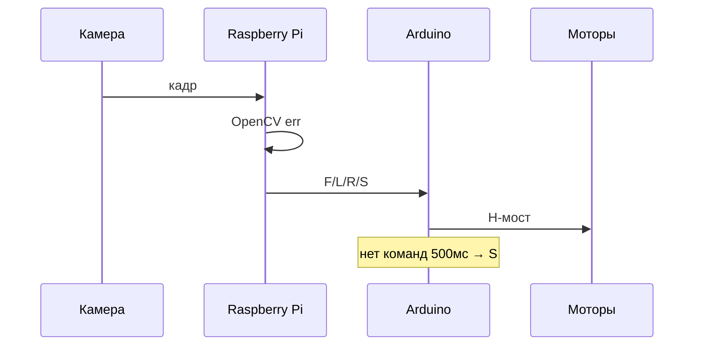

# ENGINEERING ROADMAP
## Том 4 · Лаборатория №7 — Raspberry Pi + Робот

> **Два мозга — один организм** · Миссия дня

---

## 📡 История

**Arduino** (Лаб. №0–3) **водит** моторы и читает **HC-SR04**. **Raspberry Pi** (Лаб. №4–6) **видит** линию и считает **ошибку руля**. Пока это **два** проекта на **одном** столе. Настоящие роботы — **распределённая** система: **стратег** (Pi) и **исполнитель** (Arduino). Связь — **UART Serial** (USB или GPIO). Сегодня — **протокол** команд и **первый** совместный цикл: Pi говорит `F`, `L`, `R`, `S` — Arduino **исполняет**.

---

## 🚀 Миссия

**Соединить** Pi и Arduino по USB-Serial, **договориться** о протоколе **однобуквенных** команд и **закрыть петлю**: OpenCV на Pi **шлёт** поворот — робот **едет** по линии **5 секунд** (тест на столе/полу).

---

## 🎯 Цель

- **прошить** Arduino скетч `motor_serial_slave.ino` (слушает Serial);
- **написать** на Pi `brain.py` — читает кадр, считает err, шлёт команды;
- **проверить** задержку и **стоп** по таймауту / кнопке.

**Результат:** видео или серия фото «робот **следует** ленте с **Pi на борту**», схема проводов + протокол в dnevnik.

---

## ⏱ Время

2–4 часа. Можно **5 дней** по 40 мин. **Механика** + **софт** + **отладка**.

---

## 🧰 Что понадобится

- [ ] Робот **2WD** из **Лаб. №3** (Arduino + L298N + моторы)
- [ ] Raspberry Pi с камерой (**Лаб. №4–6**)
- [ ] USB **A-B** (Uno) или **micro-USB** (Nano) **Arduino ↔ Pi** *(питание Arduino — решить: от Pi USB или отдельно)*
- [ ] **Общий GND** Pi и Arduino **обязательно**, если раздельное питание
- [ ] Чёрная **лента** на полу или белый стол
- [ ] (Опционально) Power bank **5V** для Pi на шасси

**⚠** Два USB-устройства с одного Pi — следи за **током**; лучше **powered hub** или Arduino от **отдельного** 5V.

---

## 🤔 Как ты думаешь?

**Не читай ответ сразу.**

1. Почему **однобуквенные** команды `F L R S` лучше, чем JSON `{"cmd":"forward"}` на **9600 baud**?
2. Pi **занят** кадром 200 мс. Arduino **ждёт** без команд. Что должен делать мотор — **крутиться** или **стоп**?
3. Зачем **watchdog** (таймер «если нет команд 500 мс → стоп»)?

*(Запиши в dnevnik.)*

**Настоящее объяснение:** короткий протокол = **меньше байт** = **быстрее** и **проще** отладка в Serial Monitor. **По умолчанию стоп** — безопасность: Pi завис → робот **не** уезжает в стену. **Watchdog** на Arduino: `lastCmdTime` — если Pi **молчит** > 500 мс → `stopMotors()`. Pi — **master**, Arduino — **slave** (исполнитель).

---

## 💡 Аналогия

**Пилот и штурман:** штурман (Pi) смотрит **карту** (камера): «держи **левее**!» Пилот (Arduino) **крутит** руль **сразу**, не перезагружая мозг. Разговор по **рации** — короткие слова, не **статьи**.

| В жизни | Система |
|---------|---------|
| «Стоп!» по рации | `S` |
| Потеря связи → стоять | Watchdog |
| Общая земля корабля | **Общий GND** |
| Два генератора | Раздельное питание Pi и моторов |

### 😲 ВАУ!

**Boston Dynamics Spot**: **несколько** компьютеров — низкий уровень **1000 Hz**, высокий **планирует** траекторию. Твой Pi+Arduino — **учебная** версия **той же архитектуры**.

### 😄 Момент улыбки

Перепутал `L` и `R` в коде — робот **обнимает** линию **издалека**, уезжая в **кювет**. Протокол **в dnevnik** — чтобы **не гадать** ночью.

---

## 📷 Иллюстрация

📷 **[Для художника]**

**ID:**  
ILL-T4-L7-01

**Название:**  
Два мозга, один робот

**Тип иллюстрации:**  
Сюжетная сцена · профиль шасси · «Pi думает · Arduino делает»

**Главная цель иллюстрации:**  
Показать **архитектуру двух мозгов**: **Pi 4** сверху с **камерой**, **Arduino** снизу/сбоку, **USB** между ними; **стрелки потока** ( **без** букв): камера → Pi → USB → Arduino → **L298N** → моторы. На **полу** — **чёрная линия** (mtape). Зритель понимает: **стратегия** и **рефлекс** **разделены**, но **связаны**.

Что подросток должен почувствовать: **командная** уверенность — «я **дирижёр** двух чипов»; порядок, не хаос проводов.

---

**Описание сцены**

**Ракурс сбоку** (profile), **средний** план. **2WD шасси** **стоит** на **белом** полу с **чёрной** линией ( **широкая** полоса ~3 см).

**Верхний ярус:** **Raspberry Pi 4** + **CSI-камера** «смотрит** **вниз-вперёд** на линию. **Корпус** Pi — зелёная PCB, **без** логотипов.

**Нижний ярус:** **Arduino Uno** + **L298N**, провода к **моторам** ( **аккуратно** ).

**USB-кабель** от Pi к Arduino — **выделен** ( **оранжево-янтарное** свечение канала Serial, **не** неон): **полупрозрачные стрелки** вдоль кабеля: `L` / `R` / `S` как **цветные** иконки (**без букв** — **стрелки** влево/вправо/стоп).

**На фоне** — **герой** 15–16 лет **на коленях**, **ноутбук** с **двумя** окнами терминала (Pi + Serial) — **цветные полосы**, **без** текста. Значок **🔴**.

**Watchdog:** маленькая **красная** иконка «таймер» у Arduino (**без** «STOP» слова) — намёк **watchdog**.

**Что НЕ должно появляться:** один чип «всё делает», Wi‑Fi облако, читаемый `brain.py`, путаница GND.

---

**Главный герой**

- **Возраст:** 15–16 лет (тот же персонаж)
- **Внешность:** каштановые волосы, веснушки
- **Одежда:** худи **🔴**, джоггеры
- **Поза:** **на коленях** у робота, **руки** на ноутбуке
- **Выражение:** сосредоточенное, **командирское** спокойствие
- **Эмоция:** **команда** и **исполнение**
- **Взгляд:** USB-кабель и **стрелки** потока, **не** в камеру

---

**Дополнительные персонажи**

Нет.

---

**Окружение**

- **Тип:** пол мастерской, line track
- **Детали:** шасси, Pi, Arduino, USB, L298N, mtape line
- **Атмосфера:** **интеграционный** milestone

---

**Композиция**

- **Формат:** 16:9
- **Ракурс:** **сбоку** — оба «мозга» **читаемы** по **ярусам**
- **Передний план:** USB + стрелки потока
- **Средний план:** Pi, Arduino, камера
- **Задний план:** герой, ноутбук
- **Линия взгляда:** камера → Pi → USB → Arduino → моторы → линия на полу
- **Правило третей:** робот — **центр**, USB — **пересечение** третей

---

**Освещение**

- **Тип:** верхний рассеянный + **мягкое** свечение USB-канала
- **Характер:** янтарь `#E9C46A` на «Serial»; **не** киберпанк
- **Тени:** короткие под шасси

---

**Цветовая палитра**

- **Основные:** `#E63946` (🔴), `#E9C46A` (Serial/USB), `#2D6A4F` (Pi/Arduino)
- **Дополнительные:** `#212529` (линия), `#6C757D`, `#F8F9FA`
- **Настроение:** **системное**, уверенное

---

**Стиль**

EduMost · вектор · **🔴** Том 4 · без Pixar/аниме/3D.

---

**Возрастная адаптация**

- **Возраст читателя:** 15–17 лет
- **Можно:** dual-brain, USB Serial, watchdog намёк
- **Нельзя:** читаемый протокол, облако, один MCU

---

**Формат**

SVG · 16:9 · высокая детализация

---

**Текст**

**Без текста** — команды `L/R/S` только **иконками** стрелок.

---

**Негативный prompt**

водяные знаки · подписи · буквы · brain.py · артефакты AI · один мозг · Wi‑Fi облако · взрослые · оружие · аниме · Pixar · фотореализм · 3D · неон · хаос проводов

---

**Связь с лабораторией**

Лаборатория №7 — **Pi brain.py → USB Serial → Arduino → L298N**, watchdog. Иллюстрация — аналогия «тренер + полузащитник» в **железе**.

```
  [Камера] → Pi brain.py → USB Serial → Arduino → L298N → Моторы
                ↑                              ↑
           OpenCV err                    watchdog STOP
```

---

## 📊 Mermaid



---

## 🔬 Эксперимент

**Минимум для зачёта:** **№1, №2, №3, №5**. **Рекомендуется:** все **6**.

---

### Эксперимент 1 — «Протокол на бумаге»

**⏱** 15 мин

Запиши **таблицу команд** (договор **не менять** без версии):

| Байт | Действие | Длительность |
|------|----------|--------------|
| `F` | Вперёд | До следующей команды |
| `L` | Поворот влево (медленно) | До следующей |
| `R` | Поворот вправо | До следующей |
| `S` | Стоп все моторы | — |

Скорость Serial: **115200** *(быстрее 9600 для Pi)*.

**✅ Проверь себя:** таблица **в dnevnik**, версия `proto v1`.

---

### Эксперимент 2 — «Arduino slave»

**⏱** 25 мин

**Обязательный.**

```cpp
// motor_serial_slave.ino
const int IN1=5, IN2=6, ENA=9, IN3=10, IN4=11, ENB=3;
unsigned long lastCmd = 0;
const unsigned long WATCHDOG_MS = 500;

void motorSetup() {
  pinMode(IN1, OUTPUT); pinMode(IN2, OUTPUT); pinMode(ENA, OUTPUT);
  pinMode(IN3, OUTPUT); pinMode(IN4, OUTPUT); pinMode(ENB, OUTPUT);
  stopMotors();
}

void forward() {
  digitalWrite(IN1, HIGH); digitalWrite(IN2, LOW); digitalWrite(ENA, HIGH);
  digitalWrite(IN3, HIGH); digitalWrite(IN4, LOW); digitalWrite(ENB, HIGH);
}
void turnLeft() {
  digitalWrite(IN1, LOW); digitalWrite(IN2, HIGH); digitalWrite(ENA, HIGH);
  digitalWrite(IN3, HIGH); digitalWrite(IN4, LOW); digitalWrite(ENB, LOW);
}
void turnRight() {
  digitalWrite(IN1, HIGH); digitalWrite(IN2, LOW); digitalWrite(ENA, LOW);
  digitalWrite(IN3, LOW); digitalWrite(IN4, HIGH); digitalWrite(ENB, HIGH);
}
void stopMotors() {
  digitalWrite(ENA, LOW); digitalWrite(ENB, LOW);
  digitalWrite(IN1, LOW); digitalWrite(IN2, LOW);
  digitalWrite(IN3, LOW); digitalWrite(IN4, LOW);
}

void exec(char c) {
  lastCmd = millis();
  switch (c) {
    case 'F': forward(); break;
    case 'L': turnLeft(); break;
    case 'R': turnRight(); break;
    case 'S': stopMotors(); break;
  }
}

void setup() {
  Serial.begin(115200);
  motorSetup();
}

void loop() {
  while (Serial.available()) {
    char c = Serial.read();
    exec(c);
  }
  if (millis() - lastCmd > WATCHDOG_MS) {
    stopMotors();
  }
}
```

Проверь **вручную** из Serial Monitor Pi/ПК: `F`, `S`, `L`, `R`.

**✅ Проверь себя:** **watchdog** стопит через **0.5 с** без команд.

---

### Эксперимент 3 — «Pi находит порт Arduino»

**⏱** 15 мин

На Pi:

```bash
ls /dev/ttyACM* /dev/ttyUSB* 2>/dev/null
# типично /dev/ttyACM0 для Uno
sudo usermod -aG dialout $USER  # перелогинься если нужно
pip3 install --user pyserial
```

```python
# serial_test.py
import serial
ser = serial.Serial("/dev/ttyACM0", 115200, timeout=1)
for cmd in b"FFFS":
    ser.write(cmd)
    ser.flush()
    import time; time.sleep(0.3)
ser.write(b"S")
ser.close()
```

| `/dev/ttyACM0` | Порт Arduino | `dmesg | tail` если пусто | Права dialout |
| 115200 | **Одинаково** на Pi и Arduino | Иначе мусор | — |

**✅ Проверь себя:** моторы **реагируют** от Python.

---

### Эксперимент 4 — «brain.py: один кадр → одна команда»

**⏱** 30 мин

```python
# brain.py (упрощённо)
import cv2
import serial
import time

PORT = "/dev/ttyACM0"
THRESH = 100
ERR_THRESH = 40

ser = serial.Serial(PORT, 115200, timeout=0.1)

def steer_from_frame(path):
    img = cv2.imread(path)
    h, w = img.shape[:2]
    roi = img[h//2:, :]
    gray = cv2.cvtColor(roi, cv2.COLOR_BGR2GRAY)
    blur = cv2.GaussianBlur(gray, (5, 5), 0)
    _, mask = cv2.threshold(blur, THRESH, 255, cv2.THRESH_BINARY_INV)
    contours, _ = cv2.findContours(mask, cv2.RETR_EXTERNAL, cv2.CHAIN_APPROX_SIMPLE)
    if not contours:
        return b"S"
    c = max(contours, key=cv2.contourArea)
    M = cv2.moments(c)
    if M["m00"] == 0:
        return b"S"
    cx = int(M["m10"] / M["m00"])
    err = cx - w // 2
    if err < -ERR_THRESH:
        return b"L"
    if err > ERR_THRESH:
        return b"R"
    return b"F"

# тест на tape.jpg
ser.write(steer_from_frame("tape.jpg"))
time.sleep(0.2)
ser.write(b"S")
ser.close()
```

**✅ Проверь себя:** для **трёх** положений ленты команда **разная**.

---

### Эксперимент 5 — «Закрытая петля 5 секунд»

**⏱** 40 мин

**Обязательный для зачёта.**

```python
# brain_loop.py — снимай кадры timelapse или USB
import cv2, serial, time, subprocess, os

ser = serial.Serial("/dev/ttyACM0", 115200)
t_end = time.time() + 5
while time.time() < t_end:
    subprocess.run(["libcamera-still", "-o", "live.jpg", "--width", "320",
                    "--height", "240", "--immediate", "--nopreview"], check=False)
    cmd = steer_from_frame("live.jpg")
    ser.write(cmd)
    time.sleep(0.15)
ser.write(b"S")
ser.close()
```

**На полу:** лента, робот **ползёт** 5 с, **стоп**.

| `sleep(0.15)` | ~6–7 решений/с | Баланс FPS и моторов | Уменьши если дергается |
| `S` в конце | **Явный** стоп | Не полагайся только на watchdog | — |

**✅ Проверь себя:** робот **двигается** по линии **хотя бы** 2 с в правильном направлении.

---

### Эксперимент 6 — «Лог команд»

**⏱** 15 мин

**Рекомендуется.** Пиши в файл `commands.log` каждую команду + err. График **err** по времени — от руки или matplotlib.

**✅ Проверь себя:** лог **≥ 20** строк.

---

## ⚠ Типичные ошибки

| Проблема | Как исправить |
|----------|---------------|
| Нет `/dev/ttyACM0` | Кабель **data**; другой порт; `dmesg` |
| Моторы **не** слушают Pi | Скорость **115200** обе стороны; **GND** общий |
| Робот **рвёт** | PWM медленнее; `ERR_THRESH` больше; `F` реже |
| Pi **тормозит** | 320×240; пропуск кадров; только ROI |
| Уезжает **без** Pi | Watchdog **выключен**? — включи **500 мс** |

---

## 🧪 Проверь себя

- [ ] Протокол **v1** записан
- [ ] Arduino slave + **watchdog**
- [ ] Pi **шлёт** F/L/R/S
- [ ] **5 с** тест на линии
- [ ] **Общий GND** / питание **продумано**
- [ ] Лог команд **или** видео

---

## 📝 Запись в инженерный дневник

```
=== TOM4 LAB №7 — RASPBERRY + ROBOT ===
Дата: ___
Порт Serial: ___
Скорость: 115200
Протокол v1: ДА/НЕТ
Watchdog 500мс: ДА/НЕТ
5с тест по линии: ДА/НЕТ
Видео/лог: ДА/НЕТ
Что было сложно:
Следующая идея:
```

---

## 🏆 Что теперь умеешь

- [ ] **Спроектировать** протокол master–slave
- [ ] **Прошить** исполнитель на Arduino с **watchdog**
- [ ] **Управлять** роботом с Pi через **pyserial**
- [ ] **Замкнуть** петлю: камера → решение → мотор
- [ ] **Думать** о безопасности при **потере связи**

---

## ➡ Что дальше

**Следующий файл:** `08_LAB_AVTOMATIZACJA.md` — **автоматизация**: состояния, сценарии, не **хаос** команд.

**Перед переходом:**

- [ ] **Петля 5 с** — **обязательно**
- [ ] Watchdog — **обязательно**
- [ ] Протокол v1 — **обязательно**
- [ ] Лог — **рекомендуется**
- [ ] Видео — **рекомендуется**

### 🔮 Вопрос без ответа

Сейчас Pi **шлёт** `L` `L` `F` **хаотично**. Как сделать **сценарий**: «ищу линию → слежу → потерял → ищу снова» — как **машина состояний**, а не **спагетти** в `while`?

**Ответ — в Лаборатории №8.**

---

*Отправь `S`. Моторы замолкли. Два мозга **договорились** — робот **живой системой**, не двумя коробками.*
