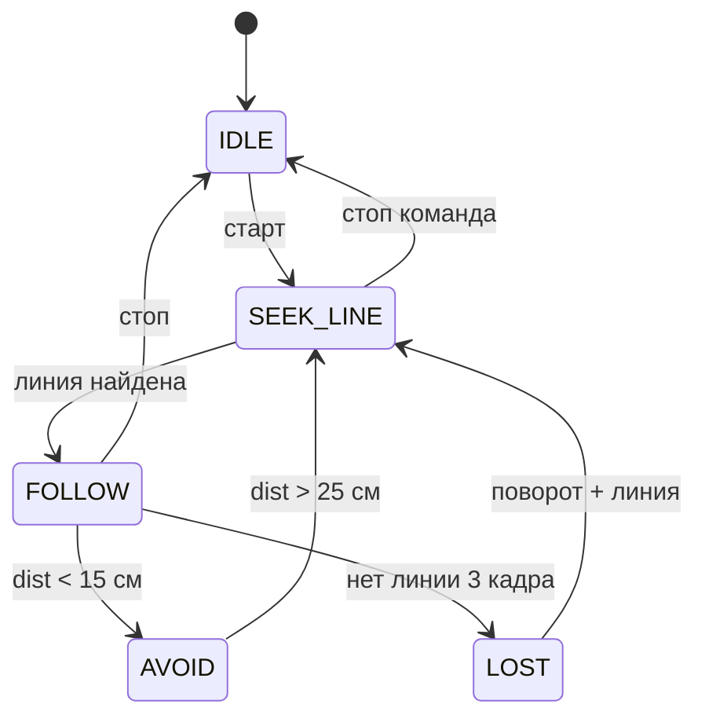

# ENGINEERING ROADMAP
## Том 4 · Лаборатория №8 — Автоматизация

> **Робот по правилам, не по хаосу** · Миссия дня

---

## 📡 История

В **Лаб. №7** Pi и Arduino **разговаривают** — робот **едет** по линии **несколько** секунд. Но `while` с кучей `if` **ломается**: потерял линию — **уехал**; препятствие спереди — **не** тормозит; Pi **завис** — только watchdog спасает. В **Томе 3** ты строил **автоматизации** Home Assistant («если — то»). Сегодня — **машина состояний** и **сценарии** для робота: **явные** режимы, **переходы**, **лог** — инженерная **автоматизация** поведения.

---

## 🚀 Миссия

**Переписать** «мозг» робота как **автомат** с состояниями `IDLE`, `SEEK_LINE`, `FOLLOW`, `AVOID`, `LOST` и **правилами перехода** — плюс **параллельная** проверка ультразвука на Arduino (если HC-SR04 на шасси).

---

## 🎯 Цель

- **нарисовать** диаграмму состояний (Mermaid + на бумаге);
- **реализовать** `state_machine.py` на Pi с **логом** переходов;
- **добавить** на Arduino **приоритет** `S` при `dist < 15` см **поверх** команд Pi.

**Результат:** робот **ищет** линию, **следует**, **останавливается** у стены, **восстанавливается** после потери; файл `run.log` + dnevnik.

---

## ⏱ Время

2–3 часа. Можно **4 дня** по 35 мин.

---

## 🧰 Что понадобится

- [ ] Робот **Pi + Arduino** (**Лаб. №7**)
- [ ] HC-SR04 на Arduino (**Лаб. №2–3**)
- [ ] Линия на полу + **коробка** «стена»
- [ ] `~/robot_vision/` со скриптами OpenCV
- [ ] (Опционально) **tmux** / **systemd** из Тома 3 — запуск сценария как **службы**

---

## 🤔 Как ты думаешь?

**Не читай ответ сразу.**

1. Чем **состояние** `FOLLOW` отличается от команды `F`?
2. Сколько **раз** подряд «нет линии» → переход в `LOST`? Почему **не** с первого кадра?
3. Кто **важнее**: Pi говорит `F` или Arduino видит **10 см** до стены?

*(Запиши в dnevnik.)*

**Настоящее объяснение:** **Состояние** — режим **поведения** (набор правил). **Команда** — **мгновенное** действие. **Гистерезис** (3 кадра без линии) — от **шума** камеры. **Приоритет безопасности** на Arduino: **ультразвук** может **перебить** `F` → `S` **локально** — Pi **не успел** — это **правильно**.

---

## 💡 Аналогия

**Светофор + режимы дороги:** не каждый водитель **угадывает** — есть **режимы** (жилой район / трасса / ремонт). Робот: **SEEK** = «ищу разметку», **FOLLOW** = «еду по полосе», **AVOID** = «красный свет у стены».

| В жизни | Робот |
|---------|-------|
| Режим «парковка» | `SEEK_LINE` |
| Автопилот по полосе | `FOLLOW` |
| AEB автомобиля | `AVOID` |
| Потерял GPS | `LOST` |

### 😲 ВАУ!

**Промышленные** роботы на заводах работают на **конечных автоматах** десятилетиями — **предсказуемость** важнее «умности». **SpaceX** посадка — **сотни** состояний с **жёсткими** переходами.

### 😄 Момент улыбки

Робот в `LOST` **крутится** на месте как **чайник** — это не баг, если ты **записал** в лог `LOST enter`. Без лога — **магия**; с логом — **инженерия**.

---

## 📷 Иллюстрация

📷 **[Для художника]**

**ID:**  
ILL-T4-L8-01

**Название:**  
Машина состояний

**Тип иллюстрации:**  
Infographic-сцена · вид сверху · «не if-спагетти — режимы»

**Главная цель иллюстрации:**  
Показать **state machine** как **карту метро** **над** роботом на полу: **5 кругов-состояний** (IDLE, SEEK, FOLLOW, AVOID, LOST — **без** читаемых слов: **цветные** иконки внутри — ⏸ 🔍 ➡ ⚠ ❓) и **стрелки** переходов. **AVOID** от ультразвука — **красная**, **толще** остальных. Робот **внизу** в режиме **FOLLOW** ( **зелёная** подсветка под шасси ). Зритель понимает: **режимы**, не бесконечный `if`.

Что подросток должен почувствовать: **порядок и контроль** — «я **архитектор** поведения»; спокойная уверенность.

---

**Описание сцены**

**Вид сверху** (~60° от потолка) на **пол** мастерской. **Центр верхней половины** — **стилизованный плакат** / **голограмма** ( **полупрозрачная**, **не** sci-fi неон):

**5 узлов-кругов** ( **метро-карта** ):
- **Серый** — IDLE ( ⏸ )
- **Синий** — SEEK ( 🔍 )
- **Зелёный** — FOLLOW ( ➡ на линии )
- **Красный** — AVOID ( ⚠ + волны сонара ) — **крупнее** и **соединён** **толстой** красной стрелкой от **HC-SR04** на роботе
- **Жёлтый** — LOST ( ❓ )

**Стрелки** между узлами — **тонкие** серые/цветные; **AVOID** — **`#E63946`**, **3×** толще.

**Нижняя половина** — **робот** (2WD, Pi, Arduino, камера) **на чёрной линии**; под шасси — **мягкая** зелёная аura «FOLLOW». **Препятствие** — **картон** слева ( **не** в AVOID пока — **намёк** ).

**Герой** 15–16 лет **стоит** у **стены**, **рука** указывает на **плакат** ( **схема** ); худи **🔴**, **янтарная тетрадь** в **левой** руке ( **без** текста — **нарисованные** круги).

**Что НЕ должно появляться:** читаемые `stateDiagram`, UML logo, спагетти-код на экране, столкновение.

---

**Главный герой**

- **Возраст:** 15–16 лет (тот же персонаж)
- **Внешность:** каштановые волосы, веснушки
- **Одежда:** худи **🔴**, джоггеры
- **Поза:** **стоит**, **рука** к схеме ( **учитель себе** )
- **Выражение:** **уверенное**, спокойное
- **Эмоция:** порядок, **контроль**
- **Взгляд:** на **AVOID**-стрелку и робота, **не** в камеру

---

**Дополнительные персонажи**

Нет.

---

**Окружение**

- **Тип:** пол, line track, **воздушная** схема сверху
- **Детали:** mtape, робот, картон, тетрадь
- **Атмосфера:** **архитектурная** ясность

---

**Композиция**

- **Формат:** 16:9
- **Ракурс:** **сверху** — схема **над** роботом «как метро»
- **Передний план:** робот, зелёная aura FOLLOW
- **Средний план:** узлы state machine
- **Задний план:** герой у стены
- **Линия взгляда:** AVOID (красный) → ультразвук → робот → FOLLOW
- **Правило третей:** схема — **верхние** 2/3, робот — **нижняя** треть

---

**Освещение**

- **Тип:** ровный **верхний** (как лампа комнаты)
- **Характер:** схема — **полупрозрачная**; AVOID — **красный** акцент
- **Тени:** робот — **короткая** овальная тень

---

**Цветовая палитра**

- **Основные:** `#E63946` (AVOID + 🔴), `#52B788` (FOLLOW), `#457B9D` (SEEK)
- **Дополнительные:** `#F4D35E` (LOST), `#6C757D` (IDLE), `#F8F9FA`
- **Настроение:** **структурированное**, ясное

---

**Стиль**

EduMost · вектор · **🔴** Тома 4 · без Pixar/аниме/3D/неона.

---

**Возрастная адаптация**

- **Возраст читателя:** 15–17 лет
- **Можно:** state machine, 5 режимов, AVOID emphasis
- **Нельзя:** читаемые имена состояний, UML logo

---

**Формат**

SVG · 16:9 · высокая детализация

---

**Текст**

**Без текста** — состояния **иконками**, не словами IDLE/FOLLOW.

---

**Негативный prompt**

водяные знаки · подписи · буквы · IDLE · FOLLOW · UML · артефакты AI · if-спагетти код · взрослые · оружие · аниме · Pixar · фотореализм · 3D · неон

---

**Связь с лабораторией**

Лаборатория №8 — **state machine** (IDLE → SEEK → FOLLOW → AVOID / LOST). Иллюстрация — «**не if-спагетти — режимы**» перед capstone.

---

## 📊 Mermaid



---

## 🔬 Эксперимент

**Минимум для зачёта:** **№1, №2, №3, №5**. **Рекомендуется:** все **6**.

---

### Эксперимент 1 — «Диаграмма на бумаге»

**⏱** 15 мин

Нарисуй **5 состояний** и **подписи** условий перехода. Сверь с Mermaid выше — **добавь своё** `ERROR` если Pi не видит камеру.

**✅ Проверь себя:** **все** переходы подписаны **условием**.

---

### Эксперимент 2 — «Arduino: ультразвук босс»

**⏱** 25 мин

**Обязательный.** Дополни `motor_serial_slave.ino`:

```cpp
// в loop(), ПЕРЕД чтением Serial:
float d = smoothDistance();  // из Лаб. №2
if (d > 0 && d < 15) {
  stopMotors();
  // игнор F/L/R пока близко — или только F блокируй
  return;
}
// далее чтение Serial и watchdog как раньше
```

| Локальный AVOID | **Быстрее** Pi | **10–20 мс** цикл Arduino | Pi всё ещё шлёт F — **мотор стоит** |

**✅ Проверь себя:** ладонь **< 15 см** — стоп **без** Python.

---

### Эксперимент 3 — «state_machine.py»

**⏱** 35 мин

```python
# state_machine.py
import enum, time, logging

logging.basicConfig(filename="run.log", level=logging.INFO,
                    format="%(asctime)s %(message)s")

class State(enum.Enum):
    IDLE = 0
    SEEK_LINE = 1
    FOLLOW = 2
    LOST = 3
    AVOID = 4  # Pi-side если нет датчика на Arduino

class RobotBrain:
    def __init__(self):
        self.state = State.IDLE
        self.lost_count = 0

    def transition(self, new_state, reason):
        logging.info(f"{self.state.name} -> {new_state.name}: {reason}")
        self.state = new_state

    def update(self, sees_line, err, dist_cm=None):
        if self.state == State.IDLE:
            return b"S"
        if dist_cm is not None and 0 < dist_cm < 15:
            self.transition(State.AVOID, "ultrasonic")
            return b"S"
        if self.state == State.AVOID and (dist_cm is None or dist_cm > 25):
            self.transition(State.SEEK_LINE, "clear")

        if self.state in (State.SEEK_LINE, State.LOST):
            if sees_line:
                self.lost_count = 0
                self.transition(State.FOLLOW, "line")
            else:
                return b"L"  # ищем поворотом

        if self.state == State.FOLLOW:
            if not sees_line:
                self.lost_count += 1
                if self.lost_count >= 3:
                    self.transition(State.LOST, "no line")
                    return b"L"
            else:
                self.lost_count = 0
                return steer_from_err(err)  # F/L/R из Лаб. №7

        if self.state == State.LOST:
            return b"L"

        return b"S"
```

**✅ Проверь себя:** `run.log` пишет **переходы**.

---

### Эксперимент 4 — «Сценарий 30 секунд»

**⏱** 25 мин

```python
brain = RobotBrain()
brain.transition(State.SEEK_LINE, "user start")
# цикл 30 с: снимок, sees_line, err, dist (опционально с Arduino обратно)
# ser.write(brain.update(...))
```

Запусти на **полосе** с **коробкой** впереди.

**✅ Проверь себя:** в логе есть **FOLLOW** и хотя бы один **AVOID** или **LOST**.

---

### Эксперимент 5 — «Кнопка старт/стоп сценария»

**⏱** 20 мин

**Обязательный для зачёта.**

GPIO Pi **или** команда в терминале: `start` → `SEEK_LINE`, `stop` → `IDLE` + `S` на Arduino.

```bash
# в отдельном терминале
echo stop > ~/robot_vision/cmd.txt
```

`brain` читает `cmd.txt` каждый цикл.

**✅ Проверь себя:** **stop** **мгновенно** останавливает сценарий.

---

### Эксперимент 6 — «tmux-служба» (опционально)

**⏱** 20 мин

**Рекомендуется.** Из Тома 3:

```bash
tmux new -s robot
cd ~/robot_vision && python3 scenario_30s.py
# Ctrl+B D — отсоединиться
```

**✅ Проверь себя:** сценарий **живёт** в tmux, лог **растёт**.

---

## ⚠ Типичные ошибки

| Проблема | Как исправить |
|----------|---------------|
| Застрял в `LOST` | Уменьши `lost_count` порог; улучши свет |
| **Никогда** FOLLOW | Порог OpenCV; **SEEK** крутит **медленно** |
| AVOID **дёргается** | Гистерезис 15 см **вход**, 25 см **выход** |
| Лог **пустой** | Путь `run.log`; права записи |
| Два «мозга» спорят | **Arduino** — **стоп** у стены **всегда** побеждает |

---

## 🧪 Проверь себя

- [ ] Диаграмма состояний **на бумаге**
- [ ] `state_machine.py` + **run.log**
- [ ] Arduino **локальный** стоп < 15 см
- [ ] Сценарий **30 с** с переходами
- [ ] **start/stop** работает
- [ ] Понимаю разницу **состояние** vs **команда**

---

## 📝 Запись в инженерный дневник

```
=== TOM4 LAB №8 — AVTOMATIZACJA ===
Дата: ___
Состояния (список): ___
Переходы в run.log: FOLLOW / LOST / AVOID — ДА/НЕТ
Arduino ultrasonic boss: ДА/НЕТ
30с сценарий: ДА/НЕТ
start/stop: ДА/НЕТ
Что было сложно:
Следующая идея:
```

---

## 🏆 Что теперь умеешь

- [ ] **Рисовать** и **реализовать** машину состояний
- [ ] **Логировать** переходы для **отладки**
- [ ] **Разделять** безопасность (Arduino) и **стратегию** (Pi)
- [ ] **Запускать** сценарий **контролируемо** (start/stop)
- [ ] **Связывать** идеи **умного дома** (Том 3) с **роботом**

---

## ➡ Что дальше

**Следующий файл:** `09_LAB_AVTONOMNY_ROBOT.md` — **CAPSTONE**: первый **автономный** робот, собирающий **весь** Том 4.

**Перед переходом:**

- [ ] **state_machine + log** — **обязательно**
- [ ] Ultrasonic boss — **обязательно**
- [ ] 30 с сценарий — **обязательно**
- [ ] start/stop — **обязательно**
- [ ] tmux — **рекомендуется**

### 🔮 Вопрос без ответа

Восемь лабораторий — **кирпичики**. Что если **объединить** всё в **один** проект с **документацией**, **видео-демо** и **чек-листом** как у **настоящего** инженера перед **защитой**?

**Ответ — в Лаборатории №9.**

---

*Открой run.log. Робот **объясняет** себе, где он — это уже **не игрушка**, а **система**.*
