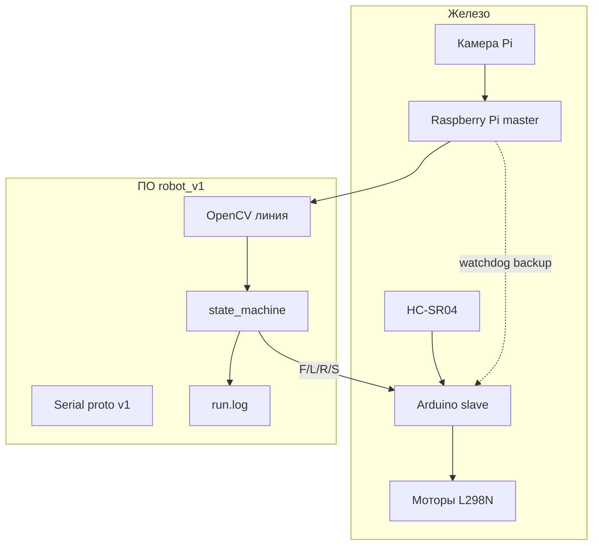

# ENGINEERING ROADMAP
## Том 4 · Лаборатория №9 — Первый автономный робот

> **🔴 Проект уровня 4** · Миссия дня

---

## 📡 История

**Девять лабораторий** — путь **Создателя роботов**. **№0** Arduino — **рефлексы**. **№1** серво — **углы**. **№2** ультразвук — **расстояние**. **№3** шасси — **машина**. **№4** камера — **глаз**. **№5** CV — **пиксели → смысл**. **№6** OpenCV — **скорость**. **№7** Pi+Arduino — **два мозга**. **№8** автомат — **режимы**. Сегодня **не** новая деталь — **сшивание** всего в **первого автономного робота**: сам **едет**, **следует** линии, **обходит** препятствие, **останавливается** по команде, **объясняет** себя в логе.

---

## 🚀 Миссия

**Собрать и продемонстрировать** автономного робота **v1.0**: трассa «старт → линия → препятствие → объезд/стоп → финиш», **документация** `~/robot_v1/README.md`, **видео 60–90 с**, запись **CAPSTONE** в dnevnik.

---

## 🎯 Цель

- **интегрировать** железо и код **всех** лабораторий в **один** репозиторий папок;
- **пройти** трассу **автономно** ≥ **2 цикла** без ручного **подталкивания**;
- **оформить** проект как **портфолио**: схема, BOM, протокол, **уроки**.

**Результат:** папка `~/robot_v1/` с `README.md`, `firmware/`, `brain/`, `logs/`, `media/demo.mp4` (или серия фото), **запись LAB №9** — **диплом** 🔴 Тома 4.

---

## ⏱ Время

6–12 часов. Можно **7–10 дней** по 45–60 мин. **Это главный проект тома** — не обгоняй механику ради кода.

---

## 🧰 Что понадобится

- [ ] **Всё** из Лаб. №0–8 (рабочее на столе, не заглушки)
- [ ] Raspberry Pi 4 + камера + **power bank** (рекомендуется)
- [ ] Arduino + L298N + 2WD + HC-SR04
- [ ] **Чёрная** изолента / линия **3–5 м** на полу
- [ ] **2–3** картонные препятствия
- [ ] Ноутбук: SSH, scp, (опционально) монтаж видео
- [ ] Навыки **Тома 1–3**: Linux, Python, SSH, Git *(опционально)*, tmux

---

## 🤔 Как ты думаешь?

**Не читай ответ сразу.**

1. Что значит **«автономный»** — без **любого** человека или без **пульта в руках**?
2. Какой **один** сенсор ты **уберёшь** первым, если робот **ненадёжен** — и **почему**?
3. Как **доказать** жюри (или себе), что это **не** случайность — **один** удачный заезд?

*(Запиши в dnevnik до сборки.)*

**Настоящее объяснение:** **автономность** здесь = робот **сам** переключает режимы по **датчикам** и **правилам** (Лаб. №8), человек только **старт/стоп** и **страховка**. **Надёжность** = **повторяемость** (2+ успешных цикла) + **лог** + **видео**. Документация — чтобы **через месяц** ты **воспроизвёл** сборку без памяти «как тогда провода крутили».

---

## 💡 Аналогия

**Экзамен по вождению:** инспектор **не** крутит руль — ты **сам** по разметке, **тормозишь** у пешехода, **возвращаешься** в полосу. CAPSTONE — **экзамен** робота: разметка = линия, пешеход = коробка, инспектор = **камера** + **ты с stop**.

| Экзамен | CAPSTONE |
|---------|----------|
| Маршрут | Трасса на полу |
| Оценка | 2+ чистых цикла |
| Документы | README + видео |
| Допуск | Все Лаб. 0–8 ✓ |

### 😲 ВАУ!

**DARPA Grand Challenge** 2004: большинство роботов **не доехали** — победитель **проехал** пустыню **автономно**. Твоя кухня **меньше**, но **архитектура** (сенсоры → план → привод) — **та же дисциплина**, с которой начинались **беспилотники**.

### 😄 Момент улыбки

Робот **празднует** финиш, врезавшись в коробку «победы». **Финиш** — это состояние `IDLE` + `S`, не **фейерверк** из моторов.

---

## 📷 Иллюстрация

:::illustration
ILL-T4-L9-01
:::

```
  ~/robot_v1/
  ├── README.md      ← паспорт проекта
  ├── firmware/      ← Arduino .ino
  ├── brain/         ← Pi Python + state machine
  ├── logs/          ← run.log
  └── media/         ← demo.mp4
```

---

## 📊 Mermaid



---

## 🔬 Эксперимент

**CAPSTONE = все эксперименты обязательны.** Рекомендуется **в порядке** №1→6.

---

### Эксперимент 1 — «Паспорт проекта README»

**⏱** 45 мин

```bash
mkdir -p ~/robot_v1/{firmware,brain,logs,media,docs}
cd ~/robot_v1
```

`README.md` **обязательные** разделы:

1. **Миссия** (1 абзац)
2. **BOM** — таблица деталей (плата, моторы, батарея…)
3. **Схема** проводки (ASCII или фото)
4. **Протокол Serial v1** (из Лаб. №7)
5. **Диаграмма состояний** (из Лаб. №8)
6. **Как запустить** (команды copy-paste)
7. **Как остановить** (аварийно)
8. **Результаты** — 2 цикла: дата, ДА/НЕТ

| README | **Заменяет** «память» | Через месяц **воспроизведёшь** | Git push — опционально |

**✅ Проверь себя:** **8 разделов** заполнены, не пустые шаблоны.

---

### Эксперимент 2 — «Сборка железа v1»

**⏱** 60 мин

Чек-лист механики:

- [ ] Камера **смотрит вперёд-вниз** (видна линия в ROI)
- [ ] HC-SR04 **по центру**, высота **5–15 см**
- [ ] Pi **закреплён**, провода **не** в колёса
- [ ] **Общий GND** Pi, Arduino, батарея моторов
- [ ] Аварийный **стоп**: кнопка Arduino **или** `echo stop`
- [ ] Батареи **заряжены**, моторы **тест** колёса в воздухе

Скопируй прошивки:

```bash
cp ~/robot_vision/../motor_serial_slave.ino ~/robot_v1/firmware/ 2>/dev/null || true
# актуальная версия с ultrasonic boss — Лаб. №8
```

**✅ Проверь себя:** фото **4 сторон** робота в `media/`.

---

### Эксперимент 3 — «ПО: один сценарий scenario.py»

**⏱** 60 мин

`~/robot_v1/brain/scenario.py`:

- импорт **state machine** (Лаб. №8)
- функции **кадр** (`libcamera-still` 320×240)
- **OpenCV** контур линии (Лаб. №6)
- **pyserial** proto v1 (Лаб. №7)
- лог в `~/robot_v1/logs/run.log`
- **макс. время** автономии 90 с → принудительный `IDLE`

```python
MAX_RUN_SEC = 90
# в начале цикла:
if time.time() - t0 > MAX_RUN_SEC:
    ser.write(b"S")
    brain.transition(State.IDLE, "timeout")
    break
```

| Таймаут 90 с | **Страховка** | Робот **не** уезжает в соседнюю квартиру | Настрой под комнату |

**✅ Проверь себя:** `python3 scenario.py` **стартует** без traceback.

---

### Эксперимент 4 — «Трасса и правила»

**⏱** 30 мин

Нарисуй трассу на полу:

```
  [СТАРТ] ----чёрная линия---- [КОРОБКА] ---- линия ---- [ФИНИШ зона]
```

Правила **v1.0**:

| Событие | Поведение |
|---------|-----------|
| Старт | `SEEK_LINE` → `FOLLOW` |
| Коробка < 20 см | `AVOID` → стоп → `SEEK_LINE` |
| Потеря линии 3 кадра | `LOST` → поворот |
| Финиш: линия + 5 с без коробки | `IDLE` |

**✅ Проверь себя:** схема трассы в `docs/track.png` или фото **сверху**.

---

### Эксперимент 5 — «Два автономных цикла»

**⏱** 60–90 мин

**Главный экзамен.**

**Цикл** = от `start` до `IDLE` на финише **или** по таймауту без **застревания** > 30 с на месте.

| Цикл | Дата/время | Успех ДА/НЕТ | Заметка |
|------|------------|--------------|---------|
| 1 | | | |
| 2 | | | |

Запись видео:

```bash
# телефон / libcamera-vid 60 с с Pi
libcamera-vid -o ~/robot_v1/media/demo.h264 -t 60000 --width 640 --height 480
```

**✅ Проверь себя:** **2** галочки успеха **или** честный отчёт «цикл 2 — нет, причина: ___» + план фикса.

---

### Эксперимент 6 — «Ретроспектива инженера»

**⏱** 30 мин

В dnevnik и `README.md` раздел **Lessons learned**:

1. Что **самое** ненадёжное железо?
2. Что **самый** полезный сенсор?
3. Что бы сделал в **v2.0**?
4. Одна **шутка**, которая случилась (момент улыбки CAPSTONE)

**✅ Проверь себя:** **4 пункта** — **честно**, не «всё идеально».

---

## ⚠ Типичные ошибки

| Проблема | Как исправить |
|----------|---------------|
| Робот **сразу** LOST | Свет, ROI, высота камеры, контраст линии |
| **Врезается** в коробку | Ultrasonic boss; порог 15→20 см; медленнее `F` |
| **Уезжает** с линии на повороте | Медленнее; `ERR_THRESH`; узкая трасса → шире линию |
| Pi **отваливается** USB | Powered hub; короткий кабель; power bank |
| «Один** успех** из десяти» | Не CAPSTONE — **калибруй** T, механику, **лог** |
| README **пустой** | Проект **незакончен** по Конституции |

---

## 🧪 Проверь себя

- [ ] `~/robot_v1/README.md` — **8 разделов**
- [ ] Железо **закреплено**, GND **общий**, стоп **работает**
- [ ] `scenario.py` + логи
- [ ] Трасса **задокументирована**
- [ ] **≥ 2** успешных цикла **или** план v1.1 с **диагностикой**
- [ ] Видео/фото демо
- [ ] Ретроспектива **4 пункта**
- [ ] Все Лаб. **0–8** навыки **использованы** (чек ниже)

**Чек интеграции навыков:**

- [ ] Arduino Serial (**№0**)
- [ ] Серво *(опционально на шасси)* (**№1**)
- [ ] Ультразвук (**№2**)
- [ ] Шасси + L298N (**№3**)
- [ ] Камера Pi (**№4**)
- [ ] Пиксели / err (**№5**)
- [ ] OpenCV (**№6**)
- [ ] Pi↔Arduino (**№7**)
- [ ] State machine (**№8**)

---

## 📝 Запись в инженерный дневник

```
=== TOM4 LAB №9 — CAPSTONE AUTONOMNY ROBOT ===
Дата начала: ___  Дата финиша: ___
Версия проекта: v1.0
README 8 разделов: ДА/НЕТ
Цикл 1 успех: ДА/НЕТ  Заметка: ___
Цикл 2 успех: ДА/НЕТ  Заметка: ___
demo видео: ДА/НЕТ
Lessons learned (кратко):
  1. ___
  2. ___
  3. v2.0: ___
  4. смешной момент: ___
Статус 🔴 Создатель роботов: ЗАСЛУЖЕН / В ПРОЦЕССЕ
```

---

## 🏆 Что теперь умеешь

- [ ] **Собрать** автономную **систему** из модулей
- [ ] **Документировать** робота как **инженерный** продукт
- [ ] **Отлаживать** по **логам** и **повторяемости**
- [ ] **Балансировать** Pi (зрение) и Arduino (рефлексы)
- [ ] **Планировать** v2.0 на основе **фактов**, не фантазий
- [ ] **Говорить** «я построил **первого автономного робота**» — **честно**, с видео

---

## ➡ Что дальше

**Следующий том:** **Tom 5 · Инженер будущего** (`engineering-roadmap-tom-05`) — **🟣 Архитектор технологий**: 3D-печать, CAD, дроны, ИИ.

**Перед переходом в Том 5:**

- [ ] README + **2 цикла** (или v1.1 план) — **обязательно**
- [ ] Видео демо — **обязательно**
- [ ] CAPSTONE запись в dnevnik — **обязательно**
- [ ] Бэкап `~/robot_v1/` на NAS (Том 3) — **рекомендуется**
- [ ] Git-репозиторий `robot_v1` — **рекомендуется**

**Если обязательные галочки пустые — Том 4 **не закрыт**.**

### 🔮 Вопрос без ответа

Робот **едет по линии** на **полу**. А если **задача** — **доставить** деталь **в воздухе** или **напечатать** корпус **самому**? Что из **Тома 5** станет **следующим** органом твоей лаборатории?

**Ответ — в Томе 5.**

---

*Поставь робота на FINISH. Выключи питание. Сними видео с экрана — **v1.0** в истории. Ты **🔴 Создатель роботов**.*
