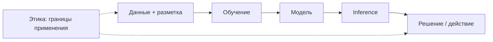
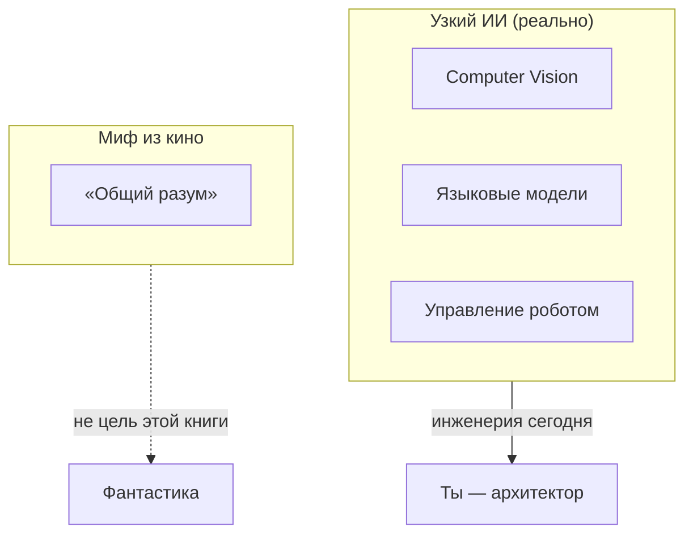

# ENGINEERING ROADMAP
## Том 5 · Лаборатория №0 — Искусственный интеллект

> **🟣 Архитектор технологий** · Миссия дня

---

## 📡 История

**Четыре тома** позади: ты умеешь **думать как компьютер** (Том 1), **соединять провода и датчики** (Том 2), **держать инфраструктуру живой** (Том 3), **строить роботов с глазами** (Том 4). Автономный робот из Лаборатории №9 Тома 4 уже **видит** мир — но **не понимает** его словами. Следующий уровень — **ИИ**: не «магия из облака», а **инженерная система**, которую можно **разобрать**, **проверить** и **ограничить**. Сегодня — первый шаг **Архитектора технологий**: понять, **что такое ИИ на самом деле** и **где проходит этическая граница**.

---

## 🚀 Миссия

**Построить** первую «карту ИИ» в dnevnik: от данных и модели до решения — и **сформулировать** три правила ответственного инженера.

---

## 🎯 Цель

- **понять** цепочку «данные → обучение → модель → вывод» без мистики;
- **отличить** узкий ИИ (распознавание, генерация текста) от «разумного робота из кино»;
- **сделать** простой эксперимент классификации и **записать** этический чек-лист.

**Результат:** файл `~/Moja_Laboratoria/T5/ai_map.md`, скрин или вывод первого «Hello ML», блок **LAB №0** в dnevnik с **тремя правилами этики ИИ**.

---

## ⏱ Время

90–120 минут (можно **3 дня** по 30–40 мин).

---

## 🧰 Что понадобится

- [ ] Ноутбук (Windows / Mac / Linux) — **≥ 8 GB RAM** (16 GB лучше)
- [ ] Python **3.10+** (`python3 --version`)
- [ ] Интернет **только** для установки пакетов (эксперименты работают **офлайн** после установки)
- [ ] Завершённые Тома 1–4 (или хотя бы Том 1 + базовый Python из проектов)
- [ ] Папка `~/Moja_Laboratoria/T5/`
- [ ] dnevnik.txt

---

## 🤔 Как ты думаешь?

**Не читай ответ сразу.**

1. Если модель **никогда не видела** кошку в снегу — может ли она **уверенно** сказать «это кошка»?
2. Кто **ответственнее**: программист, который написал код, или **компания**, которая **решила** выпустить продукт?
3. Можно ли «**объективный** ИИ», если **данные** для обучения собирали **люди** с предубеждениями?

*(Запиши ответы в dnevnik. Потом сверься.)*

**Настоящее объяснение:** ИИ — это **статистическая машина**, обученная на **примерах**. Она **не «знает»** мир — она **находит закономерности** в данных. Ошибки и **предвзятость** приходят **из данных и задачи**, не из «злого робота». Инженер **отвечает** за то, **где** модель применяется, **какие** данные ей доверяют и **что** будет, если она ошибётся.

---

## 💡 Аналогия

**ИИ** = **ученик**, которому показали **10 000** размеченных фото яблок и груш. Он **не** понимает вкус — он **узнаёт паттерны**. Спроси про **банан** — будет **угадывать** с вероятностью.

| В жизни | В ИИ |
|---------|------|
| Учебник с задачами | **Датасет** |
| Повторение до экзамена | **Обучение (training)** |
| Экзамен | **Inference (вывод)** |
| Шпаргалка на экзамене | **Подглядывание в train** — **запрещено** |
| Справедливость оценки | **Этика и аудит данных** |

### 😲 ВАУ!

Первый **нейронный** прототип, распознавший **цифры** на чеках, уже в **1950-х** — за **70 лет** до ChatGPT. «Новость» — **масштаб** данных и **мощность** железа, не **внезапное сознание**.

### 😄 Момент улыбки

ИИ **не** «думает, что ты глупый». Он **вообще не думает** — он **считает вероятности**. Как калькулятор **не обижается**, если ты нажал «=» дважды.

---

## 📷 Иллюстрация

📷 **[Для художника]**

**ID:**  
ILL-T5-L0-01

**Название:**  
Карта искусственного интеллекта

**Тип иллюстрации:**  
Сюжетная сцена · домашняя лаборатория · концептуальная диаграмма «данные → модель → решение»

**Главная цель иллюстрации:**  
Показать первый шаг **Архитектора технологий** в Томе 5: ИИ — не магия из облака, а **инженерная цепочка**, которую можно разобрать, проверить и ограничить. Зритель должен увидеть три звена — **данные**, **модель**, **решение** — и понять: ответственность инженера начинается **до** запуска inference.

Что читатель должен почувствовать: **спокойную ясность**, «я вижу механизм», уважение к этике. Не хайп, не страх перед «разумным роботом», не тёмный sci-fi.

---

**Описание сцены**

Вечер в **домашней мастерской** юного инженера (комната эволюционировала с Тома 1 — больше техники, аккуратнее кабели, **не** NASA-лаборатория). За **деревянным столом** сидит главный герой серии Engineering Roadmap в **самой зрелой** итерации (17–18 лет).

**Слева на столе** — **стопка карточек-образцов** для обучения: на каждой **стилизованное фото** — кошка или **не-кошка** (узнаваемые силуэты животных, **без** читаемых подписей «кошка/не кошка» — только **зелёная** галочка или **красный** крестик как пиктограммы разметки). Карточки слегка **разложены веером**, видно **≥ 6** штук.

**В центре стола** — **прозрачный блок-контейнер** «Модель» (стеклянный/акриловый куб или голографический стиль **EduMost**, **не** киберпанк): внутри **простая схема узлов** — 4–5 кругов, соединённых линиями (нейросеть **упрощённо**, как учебная диаграмма). Блок **светится** мягким фиолетовым изнутри.

**Справа** — **ноутбук** с экраном inference: **крупный** круговой индикатор уверенности (**87%** — **без цифр на иллюстрации**, только **заполненная** дуга ~87% и **силуэт кошки** как результат классификации). Рядом — **второй** маленький экран или планшет с **mnist-подобными** цифрами 8×8 (пиксельная сетка, **без** букв).

На **полке** за героем — **мини-робот** из Тома 4 (узнаваемый: **корпус на колёсах**, **камера** спереди, **красный** акцент Тома 4) — **повёрнут** к экрану, как будто «смотрит» на результат CV. Рядом — **тетрадь** янтарного цвета (без надписей) и **стопка** томов серии (цветные корешки: зелёный, синий, оранжевый, красный — **без** текста).

**Фиолетовый badge** 🟣 «Архитектор технологий» — **в углу** композиции или **на стене** как плакетка уровня.

**Что делает герой:** **левая рука** держит карточку с кошкой, **правая** — на клавиатуре или указывает на блок «Модель». Поза **собранная**, **инженерная** — он **объясняет себе** цепочку, не играет.

**Что НЕ должно появляться:** ChatGPT-логотип, облако с «ИИ-лицом», злой робот, терминатор, кровь, оружие, родители/учитель, школьный класс, читаемый код на экране, хоррор-неон, AGI из кино как «главный герой сцены».

---

**Главный герой**

- **Возраст:** 17–18 лет (**самая зрелая** версия героя серии)  
- **Внешность:** узнаваемый герой Engineering Roadmap — **тёмно-каштановые** волосы чуть длиннее, чем в Томе 1, **лёгкая чёлка**, светлая кожа, **веснушки** на носу (фирменная деталь серии), **чуть** более взрослые пропорции лица  
- **Одежда:** **графитовый** или **тёмно-фиолетовый** худи без надписей, **тёмные** джинсы; опционально **наушники** на шее — **не** геймерские с RGB  
- **Поза:** сидит за столом, корпус слегка повёрнут к центральному блоку «Модель» (~20°)  
- **Выражение лица:** сосредоточенное, **спокойная** уверенность «я понимаю систему»  
- **Эмоция:** инженерное любопытство + ответственность  
- **Взгляд:** на прозрачный блок «Модель» или на стопку карточек — **не** в камеру  

---

**Дополнительные персонажи**

Нет живых персонажей. **Мини-робот** Тома 4 — **объект**, не персонаж с лицом.

---

**Окружение**

- **Тип:** домашняя комната-мастерская / инженерный уголок (эволюция с Томов 1–4)  
- **Стены:** светло-серые или тёплый беж; **один** фиолетовый акцент (плакетка 🟣)  
- **Мебель:** стол с кабель-каналом, стеллаж с проектами, стул  
- **Детали:** ноутбук, карточки датасета, прозрачный блок-модель, робот на полке, тетрадь, кабели **аккуратно**  
- **Атмосфера:** **лаборатория будущего** в быту — чистая, **не** sci-fi хоррор, **не** стерильный корпоративный open-space  

---

**Композиция**

- **Формат кадра:** 16:9, горизонтальный  
- **План:** средний (герой по пояс + стол с тремя зонами)  
- **Передний план:** стопка карточек слева (данные)  
- **Средний план:** герой + прозрачный блок «Модель» по центру  
- **Задний план:** экран inference справа, полка с роботом — мягкий blur  
- **Линия взгляда читателя:** 1) карточки → 2) модель → 3) экран с результатом → 4) робот на полке (связь с Томом 4)  
- **Правило третей:** герой на левой трети, модель в центре, экран на правой трети  

---

**Освещение**

- **Тип:** смешанный — тёплый настольный + **мягкий** фиолетовый от блока «Модель» + холодный от экранов  
- **Время суток:** вечер  
- **Характер:** тёплый на лице и руках; блок «Модель» — **мягкое** внутреннее свечение `#C77DFF`, **не** неон  
- **Тени:** мягкие, без драматического контраста  

---

**Цветовая палитра**

- **Основные:** `#7B2CBF` (фиолетовый Том 5), `#5A189A` (глубокий фиолетовый), `#F8F9FA` (светлый фон)  
- **Дополнительные:** `#2D6A4F` (зелёный EduMost — callback к пути), `#E63946` (акцент Тома 4 на роботе), `#F4A261` (янтарь тетради), `#457B9D` (экран)  
- **Настроение:** зрелое, спокойное, **фиолетовый** как цвет уровня 5 — **не** кислотный  

---

**Стиль**

Единый стиль **EduMost** · современная европейская образовательная книга для подростков.  
Уровень визуальной культуры: **DK · Usborne · No Starch Press**.  
Чистая **цифровая векторная** иллюстрация. Мягкие формы, аккуратные контуры 2–3 px.  
**Без:** аниме, манги, Pixar, Disney, фотореализма, 3D-рендера, киберпанк-неона, «злого ИИ».

---

**Возрастная адаптация**

- **Возраст читателя:** 15–18 лет  
- **Можно:** концептуальная ML-схема, этический подтекст, зрелый герой, робот-проект  
- **Нельзя:** хоррор ИИ, deepfake-ужасы, оружие, surveillance dystopia, взрослые «надзиратели», кровь, сексуализированные образы  

---

**Формат**

- **Файл:** SVG  
- **Соотношение:** 16:9  
- **Детализация:** высокая — читаемо в печати A5 и на Web  
- **Цветовой режим:** RGB для Web; слои для возможной CMYK-печати  

---

**Текст**

На изображении **текста быть НЕ должно**: ни букв, ни цифр (включая «87%»), ни логотипов sklearn/Python, ни водяных знаков. Карточки, экраны и badge узнаются **пиктограммами и цветом**, не надписями. Подпись *«Данные → Модель → Решение»* — **только** в подписи под иллюстрацией в книге, **не** на artwork.

---

**Негативный prompt**

водяные знаки · подписи · логотипы · бренды · ChatGPT · OpenAI · терминатор · злой ИИ · AGI с лицом · артефакты AI · лишние руки · лишние пальцы · взрослые люди · страшные лица · оружие · кровь · хоррор · киберпанк · агрессия · плохая анатомия · размытость · шум · низкое качество · аниме · манга · Pixar · Disney · фотореализм · 3D · неон · школьный класс · форменная одежда · облако-сервер как «бог»

---

**Связь с лабораторией**

Лаборатория №0 Тома 5 — **вход в ИИ**: герой строит первую «карту» `ai_map.md`, запускает `hello_ml.py` и формулирует **три правила этики**. Иллюстрация фиксирует цепочку, которую он запишет в dnevnik: **данные → обучение → модель → inference → ответственность**.

```
  [Фото] ──► [Обучение] ──► [Модель .pkl] ──► «Кошка: 87%»
     ▲              │
     └── этика: кто разметил? ──┘
```

---

## 📊 Mermaid





---

## 🔬 Эксперимент

**Правило:** минимум **№1, №2, №3 и №5**. Без них лаборатория **не засчитана**.

---

### Эксперимент 1 — «Паспорт Python для ИИ»

**⏱** 15 мин

```bash
mkdir -p ~/Moja_Laboratoria/T5
python3 --version
python3 -m venv ~/Moja_Laboratoria/T5/venv
source ~/Moja_Laboratoria/T5/venv/bin/activate   # Windows: venv\Scripts\activate
pip install scikit-learn numpy
python3 -c "import sklearn; print('sklearn OK', sklearn.__version__)"
```

| Действие | Что делает | Как проверить | Как отменить |
|----------|------------|---------------|--------------|
| `python3 -m venv` | Изолированное окружение | Появилась папка `venv/` | `rm -rf venv` |
| `pip install scikit-learn` | Библиотека ML | Импорт без ошибки | Удалить venv |

**Почему?** ИИ-проекты **ломают** системный Python — venv = **отдельная мастерская**, как Docker в Томе 3.

**✅ Проверь себя:** команда `import sklearn` **без** ошибки?

---

### Эксперимент 2 — «Первая модель: цифры MNIST-lite»

**⏱** 25 мин

Создай `~/Moja_Laboratoria/T5/hello_ml.py`:

```python
from sklearn.datasets import load_digits
from sklearn.model_selection import train_test_split
from sklearn.ensemble import RandomForestClassifier
from sklearn.metrics import accuracy_score

X, y = load_digits(return_X_y=True)
X_train, X_test, y_train, y_test = train_test_split(X, y, test_size=0.2, random_state=42)
clf = RandomForestClassifier(n_estimators=50, random_state=42)
clf.fit(X_train, y_train)
pred = clf.predict(X_test)
print("Accuracy:", round(accuracy_score(y_test, pred) * 100, 1), "%")
print("Пример предсказания:", pred[0], "реальность:", y_test.iloc[0] if hasattr(y_test, 'iloc') else y_test[0])
```

```bash
source ~/Moja_Laboratoria/T5/venv/bin/activate
python3 ~/Moja_Laboratoria/T5/hello_ml.py
```

| Шаг | Что происходит | Проверка |
|-----|----------------|----------|
| `load_digits` | 1797 маленьких изображений 8×8 | Скрипт стартует |
| `fit` | Модель **учится** на train | Нет ошибок |
| `predict` | Угадывает на test | Accuracy **> 90%** |

**✅ Проверь себя:** accuracy **напечатана**; ты **объяснишь** другу: «модель **не видела** test при обучении».

---

### Эксперимент 3 — «Карта ai_map.md»

**⏱** 20 мин

```bash
nano ~/Moja_Laboratoria/T5/ai_map.md
```

Заполни разделы:

1. **Вход:** какие данные (цифры 8×8).
2. **Модель:** RandomForest, 50 деревьев.
3. **Выход:** класс 0–9 + accuracy.
4. **Риск:** где такая модель **нельзя** применять (медицина, суды, найм без проверки).
5. **Этика:** три правила (см. Эксп. 5).

**✅ Проверь себя:** файл **≥ 15 строк**, есть слово **«ответственность»**.

---

### Эксперимент 4 — «Сломанные данные = сломанный ИИ»

**⏱** 20 мин *(рекомендуется)*

Добавь в `hello_ml.py` **перемешивание меток** на 30% train:

```python
import numpy as np
y_bad = y_train.copy()
n = int(0.3 * len(y_bad))
idx = np.random.choice(len(y_bad), n, replace=False)
y_bad[idx] = np.random.randint(0, 10, n)
clf_bad = RandomForestClassifier(n_estimators=50, random_state=42)
clf_bad.fit(X_train, y_bad)
print("Accuracy с плохими метками:", round(accuracy_score(y_test, clf_bad.predict(X_test)) * 100, 1), "%")
```

| Гипотеза | Ожидание | Проверка |
|----------|----------|----------|
| 30% **ложных** меток | Accuracy **падает** | Сравни с Эксп. 2 |

**✅ Проверь себя:** записал в dnevnik: «**мусор на входе** → мусор на выходе».

---

### Эксперимент 5 — «Три правила этики ИИ инженера»

**⏱** 15 мин

Напиши в dnevnik **свои** (можно опираться на идеи):

1. **Прозрачность:** я **знаю**, на каких данных училась модель.
2. **Граница:** я **не** применяю ИИ там, где ошибка **вредит** людям без **человека в контуре**.
3. **Согласие:** чужие фото/голос **не** кладу в датасет без **разрешения**.

Обсуди **один** реальный кейс: deepfake, автоматический отказ в кредите, распознавание лиц на улице.

**✅ Проверь себя:** **3 правила** + **1 кейс** с твоей позицией «можно / нельзя / только с…».

---

### Эксперимент 6 — «ИИ в твоём стеке из 4 томов»

**⏱** 15 мин *(рекомендуется)*

Нарисуй на бумаге или в ai_map.md **связку**:

- Камера робота (Том 4) → **модель CV** → команда мотору (Том 2).
- Логи сервера (Том 3) → **анomaly detection** → алерт в Home Assistant.
- Терминал (Том 1) → **скрипт** запускает inference **локально**.

**✅ Проверь себя:** **≥ 2** связи с **прошлыми** томами названы.

---

## ⚠ Типичные ошибки

| Ошибка | Как исправить |
|--------|---------------|
| «ИИ = ChatGPT, остальное не важно» | Раздели **чат** и **инженерный pipeline** (данные → модель) |
| Учить на **test** данных | Test **только** для финальной проверки |
| «Модель права, потому что 99%» | Смотри **кому** вредит **1%** |
| Игнорировать **bias** в данных | Спроси: **кто** не попал в датасет? |
| Сливать **личные** данные в облако | Следующая лаба — **локальный** ИИ |
| `pip install` **без** venv | Всегда **venv** для ML-проектов |

---

## 🧪 Проверь себя

- [ ] venv создан, sklearn **работает**
- [ ] `hello_ml.py` выдал accuracy **> 90%**
- [ ] `ai_map.md` **заполнен**
- [ ] **3 правила этики** в dnevnik
- [ ] Можешь **объяснить**, чем **узкий ИИ** отличается от AGI из фильма
- [ ] Назвал **≥ 1** риск применения модели **вне** задачи «цифры»

---

## 📝 Запись в инженерный дневник

```
=== LAB №0 (TOM 5) ===
Data: ___
Co zrobiłem:
  - venv + sklearn: TAK/NIE
  - hello_ml accuracy: ___%
  - ai_map.md: TAK/NIE
  - 3 zasady etyki AI: TAK/NIE
Co było trudne:
Gdzie AI może zrobić krzywdę (1 przykład):
Następny krok:
```

---

## 🏆 Что теперь умеешь

- [ ] Объяснить цепочку **данные → обучение → inference**
- [ ] Запустить **первую** модель классификации **своими руками**
- [ ] Сформулировать **этические границы** применения ИИ
- [ ] Связать ИИ с **роботами и инфраструктурой** из прошлых томов
- [ ] **Не** путать маркeting «ИИ» с **инженерной** системой

---

## ➡ Что дальше

**Следующий файл:** `01_LAB_LOKALNY_II.md` — **Лаборатория №1:** локальные модели без отправки данных в облако.

**Перед переходом:**

- [ ] hello_ml + ai_map — **обязательно**
- [ ] 3 правила этики — **обязательно**
- [ ] LAB №0 в dnevnik — **обязательно**
- [ ] Эксп. 4 и 6 — **рекомендуется**

**Если обязательные галочки пустые — не открывай Лабораторию №1.**

### 🔮 Вопрос без ответа

Твоя модель **цифр** работает на ноутбуке. А **языковая** модель — **гигабайты** весов. Можно ли **ChatGPT-уровень** держать **дома**, как Pi-hole — **без** интернета и **без** слива промптов?

**Ответ — в Лаборатории №1.**

---

*Закрой вкладку с hype-статьями про ИИ. Открой терминал — первая модель уже ждёт.*
