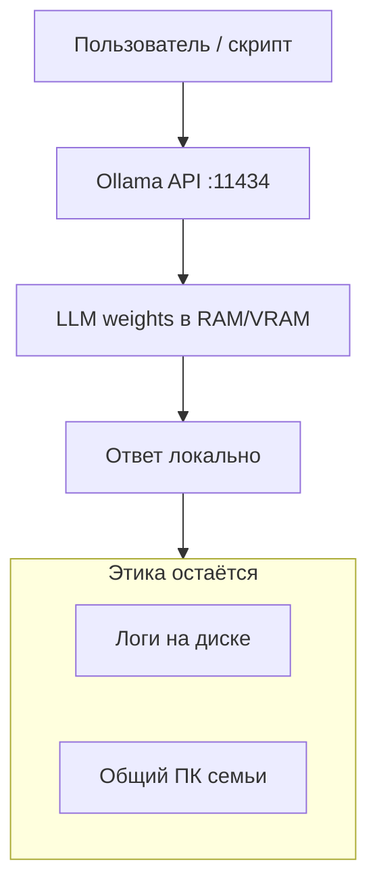
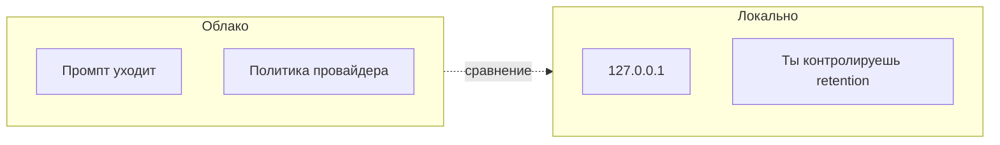

# ENGINEERING ROADMAP
## Том 5 · Лаборатория №1 — Локальные ИИ-модели

> **🟣 Архитектор технологий** · Миссия дня

---

## 📡 История

В **Лаборатории №0** ты увидел: ИИ — это **модель + данные**, а не «оракул из облака». Но каждый запрос в **чужой API** — это **твои слова на чужом сервере**, **логи**, **политика компании**, **интернет**. Системный инженер из Тома 3 уже держит **Pi-hole и VPN дома** — логичный следующий шаг: **ИИ на своём железе**, как **NAS для мыслей**. Сегодня — **локальный inference**: модель **живёт у тебя**, промпт **не уезжает** без твоего решения.

---

## 🚀 Миссия

**Запустить** локальную языковую модель через **Ollama** (или аналог) и **сравнить** приватность, скорость и качество с облачным чатом.

---

## 🎯 Цель

- **понять** RAM/VRAM как **лимит** размера модели;
- **установить** и **запустить** одну small/medium LLM **локально**;
- **написать** скрипт или curl-запрос к **localhost API** и **зафиксировать** политику данных.

**Результат:** работающий `ollama run …` (или llama.cpp), файл `~/Moja_Laboratoria/T5/local_ai_policy.md`, замер времени ответа vs облако (если есть доступ).

---

## ⏱ Время

2–3 часа (можно **4 дня** по 30–45 мин: установка · модель · API · политика).

---

## 🧰 Что понадобится

- [ ] ПК: **≥ 16 GB RAM** (8 GB — только tiny-модели)
- [ ] **≥ 10 GB** свободного SSD под веса модели
- [ ] Linux / macOS / Windows (WSL2 на Windows)
- [ ] Завершённая Лаб. №0 (`venv`, ai_map.md)
- [ ] Опционально: GPU NVIDIA с **≥ 6 GB VRAM**
- [ ] dnevnik.txt

---

## 🤔 Как ты думаешь?

**Не читай ответ сразу.**

1. Почему **больше RAM** часто важнее **больше CPU** для LLM?
2. Если модель **локальная**, значит ли это, что данные **100% приватны**?
3. Зачем инженеру **API на localhost**, если можно просто **чат в терминале**?

*(Запиши в dnevnik.)*

**Настоящее объяснение:** LLM при inference **держит веса в памяти** и **считает матрицы** — это **пропускная способность RAM/VRAM**, не «ГГц ради ГГц». Локально = **нет отправки промпта в облако**, но **логи на диске**, **бэкапы**, **общий ПК** — риски остаются. API на `127.0.0.1` — **кирпич** для робота, Home Assistant и скриптов из Томов 1–3.

---

## 💡 Аналогия

**Локальная LLM** = **личная библиотека** дома. **Облачный чат** = **спросил у библиотекаря** — быстро, но **он слышал вопрос** и **может записать** в журнал.

| В жизни | Локальный ИИ |
|---------|----------------|
| Книжная полка | SSD с весами `.gguf` |
| Комната для чтения | RAM / VRAM |
| Шёпот на ухо | Промпт **не покинул** LAN |
| Этика | Не читать **чужие** дневники в модель |

### 😲 ВАУ!

Модель **Llama 3 8B** в сжатии **Q4** ~ **5 GB** — меньше, чем **одна** современная игра. Твой ноутбук **уже** тянет «мини-GPT» — вопрос **инженерной настройки**, не магии дата-центра.

### 😄 Момент улыбки

Локальная модель **не** знает, что ты в **пижаме**. Облако **теоретически тоже не знает** — но **технически может** залогировать «пижама + код + пароль от Wi‑Fi в одном промпте». **Не смешивай.**

---

## 📷 Иллюстрация

:::illustration
ILL-T5-L1-01
:::

```
  [Ты] ──► localhost:11434 ──► [Модель на SSD]
              │
              ╳  интернет не обязателен
```

---

## 📊 Mermaid





---

## 🔬 Эксперимент

**Правило:** минимум **№1, №2, №3, №4**. №5–6 — для зачёта «архитектор».

---

### Эксперимент 1 — «Установка Ollama»

**⏱** 20 мин

**Linux:**

```bash
curl -fsSL https://ollama.com/install.sh | sh
ollama --version
```

**macOS:** скачай с https://ollama.com/download или `brew install ollama`.

**Windows:** установщик + при необходимости **WSL2** для скриптов.

| Команда | Что делает | Проверка | Отмена |
|---------|------------|----------|--------|
| `install.sh` | Демон + CLI | `ollama --version` | удалить пакет |
| `ollama serve` | Обычно **systemd**/фон | `curl localhost:11434` | stop service |

**✅ Проверь себя:** `ollama --version` **печатает** номер?

---

### Эксперимент 2 — «Первая модель: llama3.2:3b или аналог»

**⏱** 30–45 мин (зависит от скачивания)

```bash
ollama pull llama3.2:3b
ollama run llama3.2:3b "Объясни, что такое GPIO, в трёх предложениях для инженера."
```

| Параметр | Зачем | Проверка |
|----------|-------|----------|
| `3b` | **3B** параметров — влезает в 8–16 GB | Ответ **без** облака |
| `pull` | Скачивает веса **один раз** | `~/.ollama/models` растёт |

**Отключи Wi‑Fi** (опционально) и **повтори** вопрос — ответ **должен** прийти, если модель уже скачана.

**✅ Проверь себя:** ответ **упомянул** GPIO или «пин»; **офлайн-тест** пройден (если делал).

---

### Эксперимент 3 — «API на localhost»

**⏱** 20 мин

```bash
curl http://127.0.0.1:11434/api/generate -d '{
  "model": "llama3.2:3b",
  "prompt": "Напиши однострочный bash: список файлов в папке.",
  "stream": false
}'
```

Сохрани `~/Moja_Laboratoria/T5/ask_local.py`:

```python
import json, urllib.request
payload = {"model": "llama3.2:3b", "prompt": "Что такое docker compose в одном предложении?", "stream": False}
req = urllib.request.Request("http://127.0.0.1:11434/api/generate", data=json.dumps(payload).encode(), method="POST")
with urllib.request.urlopen(req, timeout=120) as r:
    print(json.load(r)["response"])
```

| `127.0.0.1` | **Только** этот ПК | Не открывай порт в LAN без VPN |
| `stream: false` | Цельный JSON | Удобно для скриптов |

**✅ Проверь себя:** Python-скрипт **напечатал** ответ?

---

### Эксперимент 4 — «local_ai_policy.md»

**⏱** 25 мин

```bash
nano ~/Moja_Laboratoria/T5/local_ai_policy.md
```

Разделы:

1. **Какие модели** установлены + размер на диске.
2. **Что можно** класть в промпт (свой код, учебные задачи).
3. **Что нельзя** (пароли, чужие переписки, медданные).
4. **Retention:** удалять ли логи Ollama / историю чата.
5. **Сравнение с облаком:** одна таблица «локально vs API».

**Этика:** локальный ИИ **не снимает** ответственность — ты **сам** провайдер.

**✅ Проверь себя:** **≥ 5** разделов; есть **«нельзя»** с **≥ 3** примерами.

---

### Эксперимент 5 — «Замер RAM и latency»

**⏱** 20 мин *(рекомендуется)*

```bash
# Терминал 1
ollama run llama3.2:3b

# Терминал 2 (Linux)
free -h
time curl -s http://127.0.0.1:11434/api/generate -d '{"model":"llama3.2:3b","prompt":"Hi","stream":false}' > /dev/null
```

Запиши в dnevnik: **RAM до/после**, **секунды** на короткий промпт.

**✅ Проверь себя:** таблица **заполнена**; вывод «больше модель → **больше RAM**, **медленнее**».

---

### Эксперимент 6 — «Локальный ИИ + Home Assistant (мост)»

**⏱** 30 мин *(рекомендуется, если Том 3 пройден)*

Идея: **shell_command** в HA вызывает `ask_local.py` с вопросом «краткий статус» — **без** облака.

```yaml
# configuration.yaml — фрагмент
shell_command:
  ask_local_ai: 'python3 /home/pi/Moja_Laboratoria/T5/ask_local.py'
```

**Этика:** не выводи **ответ модели** в публичный Telegram без **фильтра**.

**✅ Проверь себя:** **схема** связи нарисована в dnevnik (HA → script → Ollama).

---

## ⚠ Типичные ошибки

| Ошибка | Как исправить |
|--------|---------------|
| Тянуть **70B** на **8 GB RAM** | Начни с **3B–8B** Q4 |
| Считать «локально = можно **всё** в промпт» | Политика **как для облака** |
| Открыть `:11434` в **интернет** | Только **127.0.0.1** или VPN |
| Путать **Ollama** и **обучение** | Здесь только **inference** |
| Игнорировать **галлюцинации** | LLM **придумывает** — проверяй факты |
| Сливать **API-ключи** в промпт «для контекста» | **Никогда** |

---

## 🧪 Проверь себя

- [ ] Ollama **установлен**, модель **скачана**
- [ ] `ollama run` и **curl API** работают
- [ ] `ask_local.py` **выполнен**
- [ ] `local_ai_policy.md` **готов**
- [ ] Понимаешь **trade-off**: приватность vs качество vs RAM
- [ ] **Офлайн-тест** (если возможен) — **пройден**

---

## 📝 Запись в инженерный дневник

```
=== LAB №1 (TOM 5) ===
Data: ___
Model: ___
RAM użyte (szac.): ___ GB
Czas odpowiedzi (curl): ___ s
local_ai_policy.md: TAK/NIE
Co NIE wolno wpisywać w prompt (3):
Następny krok:
```

---

## 🏆 Что теперь умеешь

- [ ] **Установить** и **запустить** локальную LLM
- [ ] Вызвать модель через **HTTP API** из скрипта
- [ ] **Оценить** железо под размер модели
- [ ] Написать **политику данных** для локального ИИ
- [ ] **Связать** локальный ИИ с **инфраструктурой** (концептуально или через HA)

---

## ➡ Что дальше

**Следующий файл:** `02_LAB_DRONY.md` — **Лаборатория №2:** дрон как летающая мехатронная платформа.

**Перед переходом:**

- [ ] Ollama + одна модель — **обязательно**
- [ ] local_ai_policy.md — **обязательно**
- [ ] LAB №1 в dnevnik — **обязательно**
- [ ] Эксп. 5–6 — **рекомендуется**

### 🔮 Вопрос без ответа

Локальная модель **умеет текст**. Дрон **летает в 3D**. Кто **свяжет** «облети препятствие» с **моторами ESC** — и **можно ли** доверить это **без** человека в петле?

**Ответ — в Лаборатории №2.**

---

*Выключи Wi‑Fi на минуту. Спроси модель ещё раз — если ответила, ты уже **хостишь** свой кусок будущего.*
