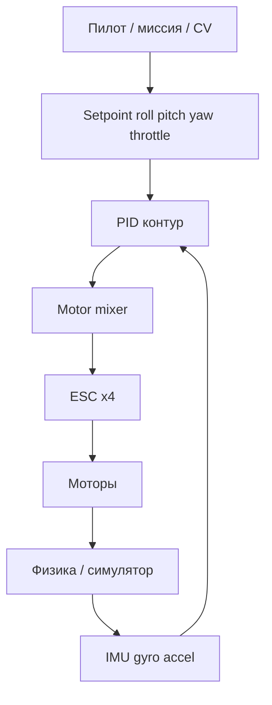
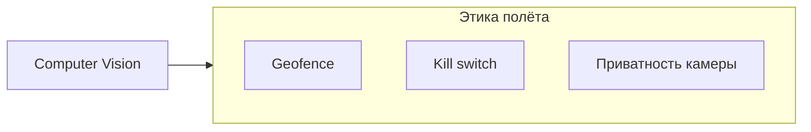

# ENGINEERING ROADMAP
## Том 5 · Лаборатория №2 — Дроны

> **🟣 Архитектор технологий** · Миссия дня

---

## 📡 История

**Локальный ИИ** (Лаб. №1) живёт на столе. **Робот** из Тома 4 — на **полу**. Дрон — **тот же** микроконтроллер, **IMU**, **моторы** и **CV**, но **ось Z** больше не теория из Minecraft. Это **мехатроника + законы физики + регуляторика + право**: ошибка в коде = **не segfault**, а **падение**. Сегодня — **инженерный** взгляд на БПЛА: от **пропеллера** до **этики** автonomous flight над людьми.

---

## 🚀 Миссия

**Разобрать** архитектуру квадрокоптера, **смоделировать** контур стабилизации (симулятор или расчёт) и **составить** чек-лист безопасного полёта.

---

## 🎯 Цель

- **понять** связку **ESC → мотор → пропеллер → тяга/момент**;
- **увидеть** роль **IMU + PID** (связь с servo/мотором из Тома 2);
- **сделать** минимум **5** экспериментов: от thrust math до миссии в симуляторе.

**Результат:** `~/Moja_Laboratoria/T5/drone_notes.md` + скрин/лог симуляции **или** фото **разобранного** учебного кадра + **план полёта** с зонами «можно / нельзя».

---

## ⏱ Время

3–4 часа (можно **5 дней** по 40 мин). **Без** обязательного покупки дрона — симулятор **засчитывается**.

---

## 🧰 Что понадобится

- [ ] ПК **≥ 8 GB RAM**
- [ ] Один из путей: **симулятор** (Webots / Gazebo / Betaflight на столе **без** пропов) **или** учебный мини-дрон **< 250 g** с **клеткой** пропов
- [ ] Знания GPIO/PWM из Тома 2 (servo, моторы)
- [ ] Опционально: Raspberry Pi + камера (Том 4)
- [ ] **Открытое** поле **или** симулятор — **не** квартира для первого мотора
- [ ] dnevnik.txt

---

## 🤔 Как ты думаешь?

**Не читай ответ сразу.**

1. Почему квадрокоптер **не** летает, если **крутить все моторы одинаково** при **наклоне**?
2. Кто **стабилизирует** дрон — **пилот** или **контур PID** на **400 Hz**?
3. Дрон с **локальной CV** «видит» человека. **Этично** ли включить **автопреследование** без **согласия**?

*(Запиши в dnevnik.)*

**Настоящее объяснение:** Полёт — **управление моментами** (крен, тангаж, рыскание) + **общая тяга**. IMU даёт **измерение**, PID — **коррекцию**, ESC — **мощность на мотор**. Пилот задаёт **желаемое**, контур **удерживает**. ИИ/CV **не отменяет** ответственность: **ROE** (rules of engagement) для дрона = **геозоны**, **kill switch**, **запрет** над толпой без сертификации.

---

## 💡 Аналогия

**Квадрокоптер** = **стул на одной ножке**, которую **четверо** тянут вертолётными нитями. Наклоняешь **одну** нить сильнее — стул **наклоняется**. **PID** — **рефлекс**, не «размышление».

| В жизни | Дрон |
|---------|------|
| Руль + баланс | **Roll / Pitch / Yaw** |
| Педали газа | **Throttle** |
| Вестибулярный аппарат | **IMU (gyro/accel)** |
| Рефлекс «не упасть» | **PID loop** |
| ПДД | **NOTAM, высота, GDPR камеры** |

### 😲 ВАУ!

Пропеллер **10"** на **11 000 RPM** — кончик **> 300 km/h**. «Маленький» дрон **режет** кожу быстрее, чем кажется по фото в Instagram.

### 😄 Момент улыбки

«ИИ-пилот» без **геофence** — это **умный** способ **быстро** познакомиться с **соседским** адвокатом.

---

## 📷 Иллюстрация

📷 **[Для художника]**

**ID:**  
ILL-T5-L2-01

**Название:**  
Четыре мотора — один баланс

**Тип иллюстрации:**  
Техническая схема + сюжетный фон · квадрокоптер сверху-сбоку · учебный cutaway

**Главная цель иллюстрации:**  
Объяснить **архитектуру БПЛА** без формул: четыре мотора с **разным** направлением вращения (CW/CCW), центральный **flight controller**, оси **Roll/Pitch/Yaw**, связь с **симулятором** на мониторе. Зритель должен понять: полёт — **баланс моментов**, не «включил все моторы — полетел».

Что читатель должен почувствовать: **уважение к физике**, «ошибка в коде = падение», инженерную дисциплину — **не** экшен-дрон из рекламы.

---

**Описание сцены**

**Передний план — квадрокоптер** в ракурсе **сверху-сбоку** (isometric ~30°): видны **4 луча** рамы, на концах — **4 мотора** с пропеллерами.

**Моторы:**  
- **M1, M3** — стрелки вращения **против часовой** (CCW) — **синие** дуги  
- **M2, M4** — стрелки **по часовой** (CW) — **оранжевые** дуги  
(подписи M1–M4 — **только** в книге, **не** на artwork — различие **цветом** стрелок)

**Центр рамы:** **FC** (flight controller) — зелёная плата в **прозрачном** корпусе, рядом **IMU** как маленький чип. **Стрелки осей** X (вперёд, красная), Y (вправо, зелёная), Z (вверх, синяя) — **трёхцветная** система координат **без** букв XYZ на осях (только **цвет**).

**Три иконки** рядом с дроном (или **дуги** вокруг): **Roll** (крен — наклон влево-вправо), **Pitch** (тангаж — нос вверх/вниз), **Yaw** (рыскание — поворот вокруг Z) — **пиктограммы** самолётика/стрелок, **без** слов Roll/Pitch/Yaw на рисунке.

**Задний план:** **монитор** с **симулятором** полёта (стилизованный ландшафт, **мини-дрон** в небе, UI-полосы **без** текста). Герой (17–18 лет) **силуэт** или **полубоком** у стола с **геймпадом**/клавиатурой — настраивает PID в симе.

**Badge** 🟣 в углу. **Опционально:** **защитная клетка** на пропах (безопасность).

**Что НЕ должно появляться:** военный дрон с ракетами, полёт над толпой, кровь, травмы, реальный бренд DJI логотипом, ночной город-погоня.

---

**Главный герой**

- **Возраст:** 17–18 лет  
- **Внешность:** узнаваемый герой — каштановые волосы, веснушки  
- **Одежда:** тёмный худи, **защитные** очки **на лбу** (опционально)  
- **Поза:** наклонился к монитору симулятора или **держит** дрон **на столе** (без пропов в движении!)  
- **Взгляд:** на дрон / экран — **не** в камеру  

---

**Дополнительные персонажи**

Нет.

---

**Окружение**

- **Тип:** домашний стол + **открытая** зона за окном **или** только симулятор (безопасный путь лабы)  
- **Детали:** монитор, учебный кадр дрона, **клетка** пропов, multimeter опционально  
- **Атмосфера:** **инженерный** разбор, не FPV-рейсинг  

---

**Композиция**

- **Формат:** 16:9  
- **План:** крупный дрон **60%** кадра, монитор и герой — фон  
- **Фокус:** 4 мотора + стрелки CW/CCW + центр FC  
- **Линия взгляда:** моторы по кругу → FC → оси → симулятор  

---

**Освещение**

- **Тип:** нейтральный дневной + лёгкий **экранный** отблеск  
- **Акцент:** стрелки вращения **яркие**, пропеллеры **статичны** (безопасность)  

---

**Цветовая палитра**

- **Основные:** `#7B2CBF` (badge), `#457B9D` (CCW), `#F4A261` (CW), `#2D6A4F` (FC)  
- **Оси:** красный / зелёный / синий (стандарт RGB осей)  
- **Настроение:** техническое, ясное  

---

**Стиль**

**EduMost** · чистый вектор · учебный cutaway как в **DK Eyewitness** · **без** фотореализма.

---

**Возрастная адаптация**

- **Возраст читателя:** 15–18 лет  
- **Можно:** CW/CCW, PID-контекст, симулятор  
- **Нельзя:** опасный полёт в квартире, оружие, surveillance-дрон над людьми  

---

**Формат**

SVG · 16:9 · высокая детализация · RGB + CMYK-слои

---

**Текст**

**Без текста** на artwork: ни Roll/Pitch/Yaw, ни CW/CCW, ни FC. Подпись *«Четыре мотора — один баланс»* — под рисунком.

---

**Негативный prompt**

водяные знаки · подписи · логотипы DJI · военное оружие · кровь · травмы · вращающиеся опасные пропы без клетки · толпа внизу · артефакты AI · аниме · Pixar · 3D · фотореализм · неон

---

**Связь с лабораторией**

Лаборатория №2 — thrust math, PID, симулятор, `drone_notes.md`, **чек-лист безопасности** и **этика** CV над людьми. Иллюстрация — **визуальный якорь** контура стабилизации и **разных** направлений вращения моторов.

```
    M2(CW)    M1(CCW)
        ╲  ╱
         ╳      ← FC + IMU
        ╱  ╲
    M3(CCW)   M4(CW)
```

---

## 📊 Mermaid





---

## 🔬 Эксперимент

**Правило:** минимум **№1, №2, №3, №5**. Реальный дрон — **только** с взрослым и **законом** места; симулятор — **полный** зачёт.

---

### Эксперимент 1 — «Анатомия кадра в drone_notes.md»

**⏱** 30 мин

```bash
mkdir -p ~/Moja_Laboratoria/T5/drone
nano ~/Moja_Laboratoria/T5/drone_notes.md
```

Таблица компонентов:

| Компонент | Функция | Аналог из Тома 2/4 |
|-----------|---------|---------------------|
| FC | Прошивка стабилизации | Arduino / ESP32 |
| ESC | PWM → сила мотора | Драйвер мотора |
| IMU | Углы и ускорение | MPU6050 |
| Prop | Тяга | — |
| GPS | Позиция (опц.) | — |
| Camera | CV миссия | Pi cam |

**✅ Проверь себя:** **≥ 6** строк; **CW/CCW** схема **нарисована**.

---

### Эксперимент 2 — «Thrust и вес: полёт возможен?»

**⏱** 25 мин

Формула-ориентир: ** thrust-to-weight > 2 ** для agile quad (упрощённо).

Пример расчёта в notes:

```
Масса рамы + батарея + электроника = 620 g
4 мотора, max thrust каждого = 280 g
Σ max = 1120 g → T/W = 1120/620 ≈ 1.8  (на грани для учебника — лучше > 2)
```

| T/W | Смысл | Проверка |
|-----|-------|----------|
| < 1 | **Не взлетит** | Математика |
| 1.5–2 | Учебный полёт | Запись в notes |
| > 2 | Манёвры | — |

**✅ Проверь себя:** **один** численный пример **с твоими** или **типовыми** цифрами.

---

### Эксперимент 3 — «PID на бумаге (или в Python)»

**⏱** 30 мин

Упрощённый **1D** roll:

```python
# ~/Moja_Laboratoria/T5/drone/pid_demo.py
kp, ki, kd = 1.2, 0.0, 0.05
target, angle, integral, prev = 0.0, 15.0, 0.0, 15.0  # старт: наклон 15°
for _ in range(200):
    error = target - angle
    integral += error
    derivative = error - prev
    u = kp*error + ki*integral + kd*derivative
    angle += u * 0.02  # «физика» заглушка
    prev = error
print("Конечный угол:", round(angle, 2))
```

```bash
python3 ~/Moja_Laboratoria/T5/drone/pid_demo.py
```

Меняй `kp` → **осцилляции**; `kd` → **демпфирование**.

| P | быстрая реакция | overshoot |
| I | убирает смещение | windup |
| D | гасит качку | шум |

**✅ Проверь себя:** **3** прогона с разным `kp` **записаны** в dnevnik.

---

### Эксперимент 4 — «Симулятор: первая миссия»

**⏱** 45 мин *(рекомендуется)*

Варианты:

- **Webots** sample «Drone» / «Mavic»
- **Gazebo** + ArduPilot SITL (если уже ставил)
- **Betaflight Configurator** + **USB** кадр **без пропов** — моторы **не** крутить без клетки

Задача: **взлёт → hover 10 s → посадка** в симе **или** проверить, что **ARM** заблокирован без калибровки IMU.

**✅ Проверь себя:** скрин **с высотой/логом** или фото **Safe setup (no props)**.

---

### Эксперимент 5 — «Чек-лист безопасности и этики»

**⏱** 20 мин

В `drone_notes.md` раздел **Preflight**:

- [ ] Пропы **сняты** при настройке на столе
- [ ] Батарея **не** вздутая, **LiPo bag** дома
- [ ] Geofence / **max высота** (местное право)
- [ ] **Нет** людей в радиусе **≥ 30 m** (учебник — уточни локально)
- [ ] Камера: **не** снимать **окна соседей**
- [ ] **Kill switch** на пульте / в софте
- [ ] Автономия + CV: **человек подтверждает** смену режима

**Этика ИИ:** CV «следить за человеком» = **биометрия/наблюдение** — **default: OFF**.

**✅ Проверь себя:** **≥ 7** пунктов; **≥ 2** про **приватность/закон**.

---

### Эксперимент 6 — «Мост к локальному ИИ»

**⏱** 25 мин *(рекомендуется)*

Сценарий на бумаге: камера → **локальная** модель (Лаб. №1) → «объект: дерево, слева» → **не** автоповорот, а **подсказка пилоту**.

**✅ Проверь себя:** диаграмма **human-in-the-loop** нарисована.

---

## ⚠ Типичные ошибки

| Ошибка | Как исправить |
|--------|---------------|
| Крутить моторы **с пропами** на столе | **Снять** пропы |
| LiPo **разряд < 3.3 V/cell** | **Land** + balance charge |
| «CV = автопилот» | Сначала **стабилизация**, потом **миссия** |
| Полёт **над толпой** | **Запрещено** без лицензии |
| Слив **видео** в облако без согласия | Локальная запись + **политика** |
| Игнор **ветра** | Запас T/W + **режим GPS** |

---

## 🧪 Проверь себя

- [ ] drone_notes.md с **анатомией** и **T/W**
- [ ] pid_demo.py **запускался**
- [ ] Симулятор **или** безопасная настройка кадра
- [ ] Preflight **≥ 7** пунктов
- [ ] Связь с **Томом 2/4** **объяснена**
- [ ] **Этика** CV на дроне — **1 абзац** в dnevnik

---

## 📝 Запись в инженерный дневник

```
=== LAB №2 (TOM 5) ===
Data: ___
Symulator / kadr: ___
T/W (przykład): ___
PID: co robiło Kp za duże:
Preflight TAK/NIE:
Etuka kamery (1 zdanie):
Następny krok:
```

---

## 🏆 Что теперь умеешь

- [ ] **Читать** схему квадрокоптера как **мехатронную** систему
- [ ] **Считать** thrust-to-weight **до** покупки деталей
- [ ] **Объяснить** роль PID **без** магии
- [ ] **Составить** preflight с **этикой** камер и автonomii
- [ ] **Связать** дрон с **CV и локальным ИИ**

---

## ➡ Что дальше

**Следующий файл:** `03_LAB_3D_PECHAT.md` — **Лаборатория №3:** от CAD-файла к **физической** детали на столе.

**Перед переходом:**

- [ ] drone_notes + PID demo — **обязательно**
- [ ] Preflight — **обязательно**
- [ ] LAB №2 — **обязательно**
- [ ] Сим / безопасный кадр — **рекомендуется**

### 🔮 Вопрос без ответа

Сломалась **крепёжная** деталь дрона — **ждать** посылку 2 недели **или** **напечатать** за ночь? Какой **материал** выдержит **вибрацию** и **удар**?

**Ответ — в Лаборатории №3.**

---

*Пропы — в коробке. Сначала **понимание**, потом **мотор**.*
